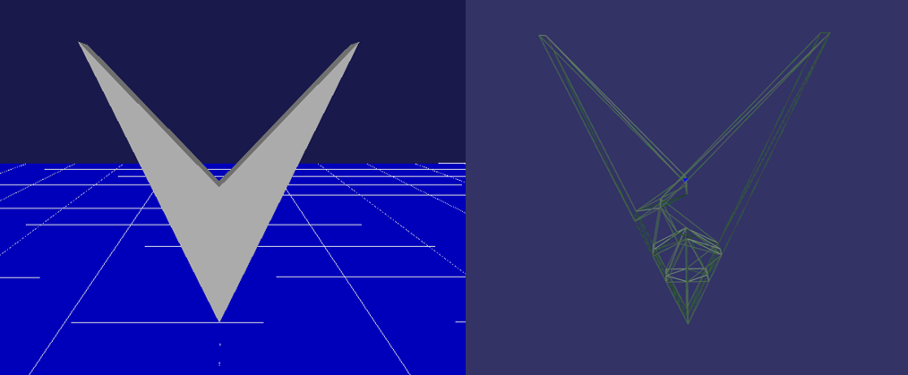

Additional parameters for body model
=======================================

When user uses AGXDynamics plugin, user can use following additional parameters for his body model.

.. contents::
   :local:
   :depth: 2

How to write
----------------

.. code-block:: txt

  links:
    -
      name: Arm
      jointCompliance: 1e-8
      jointSpookDamping: 0.0333
      jointMotor: true
      jointMotorCompliance: 1e-8
      jointMotorSpookDamping: 0.0333
      jointMotorForceRange: [ -1000, 1000 ]
      jointRangeCompliance: 1e-8
      jointRangeSpookDamping: 0.0333
      jointRangeForceRange: [ -1000, 1000 ]
      jointLock: true
      jointLockCompliance: 1e-8
      jointLockSpookDamping: 0.0333
      jointLockForceRange: [ -1000, 1000 ]
      convexDecomposition: true
      AMOR: true
      autoSleep: true

  collisionDetection:
    excludeTreeDepth: 3
    excludeLinks: [ ]
    excludeLinksDynamic: [ ]
    excludeLinkGroups:
      -
        name: groupA
        links: [ linkA, linkB, linkC, ... ]
      -
        name: groupB
        links: [ linkZ, linkY, linkX, ... ]
    excludeSelfCollisionLinks: [ linkP ]
    enableAGXWireContact: true
    excludeLinksWireContact: [ linkQ, linkR, ... ]

.. _agx_autosleep:

Explanation of parameters
-----------------------------

link
~~~~~~~~~

.. list-table::
  :widths: 10,9,4,4,75
  :header-rows: 1

  * - Parameter
    - Default value
    - unit
    - data type
    - explanation
  * - jointCompliance
    - 1e-8
    - m/N or rad/Nm
    - double
    - compliance of joint. If value is large joint will be dislocation.
  * - jointSpookDamping
    - 0.0333
    - s
    - double
    - spook damping of joint
  * - jointMotor
    - false
    - -\
    - bool
    - activation of joint motor. It is automatically enabled when ActuationMode is JOINT_TORQUE or JOINT_VELOCITY.
  * - jointMotorCompliance
    - 1e-8
    - m/N or rad/Nm
    - double
    - compliance of joint motor. It is used for speed control. If the value is reduced, it will output a large force/torque to reach the target speed. If it is enlarged, it becomes impossible to resist external force (gravity and contact force) and it will not reach the target speed.
  * - jointMotorSpookDamping
    - 0.0333
    - s
    - double
    - spook damping of joint motor
  * - jointMotorForceRange
    - [ double_min, double_max ]
    - N or Nm
    - Vec2
    - Maximum/Minimum force/torque of joint motor
  * - jointRangeCompliance
    - 1e-8
    - m/N or rad/Nm
    - double
    - compliance for limitation of joint position/angle. If the value is reduced, it will output a large force/torque to fit the limit position/angle. If it is enlarged, it may come out of the limit angle due to external force (gravity or contact force).
  * - jointRangeSpookDamping
    - 0.0333
    - s
    - double
    - spook damping of limitation of joint position/angle
  * - jointRangeForceRange
    - [ double_min, double_max ]
    - N or Nm
    - Vec2
    - Maximum/Minimum force/torque of joint for limitation
  * - jointLock
    - false
    - -\
    - bool
    - activation of lock joint. It is used for position control. It is automatically enabled when ActuationMode is JOINT_ANGLE.
  * - jointLockCompliance
    - 1e-8
    - m/N or rad/Nm
    - double
    - compliance for lock joint. If the value is reduced, it will output a large force/torque to reach the target position/angle. If it is enlarged, it becomes impossible to resist external force (gravity and contact force) and it will not reach the target position/angle.
  * - jointLockSpookDamping
    - 0.0333
    - s
    - double
    - spook damping of lock joint
  * - jointLockForceRange
    - [ double_min, double_max ]
    - N or Nm
    - Vec2
    - Maximum/Minimum force/toque for lock joint
  * - convexDecomposition
    - false
    - -\
    - bool
    - activation/deactivation of convex decomposition by true/false
  * - AMOR
    - false
    - -\
    - bool
    - Merge the relatively resting rigid bodies together and reduce the amount of solver calculation. Specify true or false. Also required to set AMOR of :doc:`agx-simulator-item`.
  * - autoSleep
    - false
    - -\
    - bool
    - activation/disactivation of auto sleep by true/false. It provides the function of removing non-moving solid from the solver, then reduce the calculation amount.property of :doc:`agx-simulator-item` needs to be changed to true.

Settings of collision detection
~~~~~~~~~~~~~~~~~~~~~~~~~~~~~~~~~~~~

.. list-table::
  :widths: 15,7,4,6,75
  :header-rows: 1

  * - Parameter
    - Default value
    - unit
    - data type
    - explanation
  * - excludeLinksDynamic
    - \-
    - \-
    - string list
    - disable collision of selected link
  * - | excludeLinkGroups:
      | -
      |   name
      |   links
    - \-
    - \-
    - |
      |
      | string
      | string list
    - | disable collisions between the links registered in group
      |
      | name of group
      | name of link
  * - excludeSelfCollisionLinks
    - \-
    - \-
    - string list
    - disable self-collision of selected link and body.
  * - excludeLinksWireCollision
    - \-
    - \-
    - string list
    - disable collision between selected link and AGXWire.

Convex Decomposition(divide concave to convexes)
-------------------------------------------------------------

AGX Dynamics has a function to divide tri-mesh into convex object.
Set true in convexDecomposition for link paramaeter, convex decomposition (from tri-mesh) is activated.
It will contribute to improve the perormance of collision detection.

.. note::
  Complex object/shape may be failed.

.. note::
  It may cause different behavior when collides, because the contact point(s) is(are) different between tri-mesh and convex decomposite object.

Samples are available in below directory.

* Project file: chorenoid/sample/AGXDynamics/agxConvexDecomposition.cnoid
* Body file: chorenoid/sample/AGXDynamics/vmark.body

If you run a sample, convex decomposition is activated and the object is divided into some convex objects.

