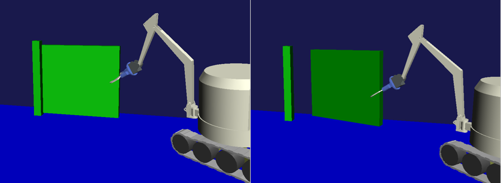
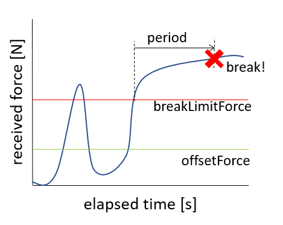
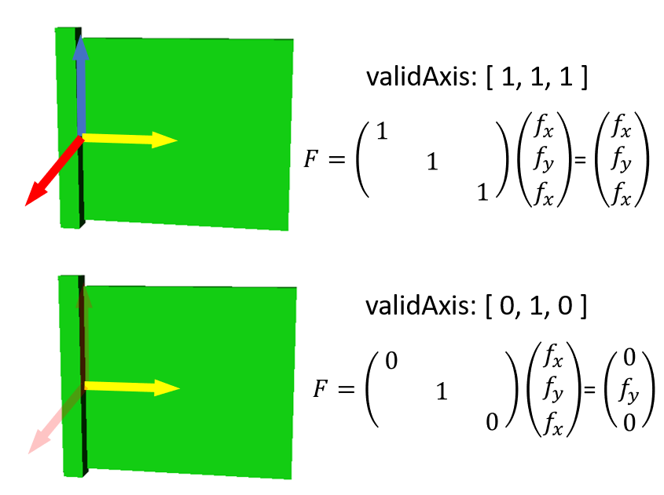

AGXBreakableJoint
===========================

| AGXBrekableJoint is a joint using AGX Dynamics, and when a certain condition is satisfied the joint will be broken(invalidated).
| Hinge, Prismatic, LockJoint of AGX Dynamics are used for implementation.

.. _agx_breaking_door:

.. contents::
   :local:
   :depth: 2

Sample
------------

This section explains how to use samples. The sample project is below.
Operate the robot DoubleArm and grasping and pulling the door.
You will see that the hinge joint will be broken and the door comes off.

* project file: chorenoid/sample/AGXDynamics/agxBreakableJoint.cnoid
* body file: chorenoid/sample/AGXDynamics/agxBreakableJoint.body

Breaking condition
---------------------

As explained at the beginning, AGXBreakableJoint triggers destruction if certain conditions are met.
These conditions are two types, specified by the breakType parameter.

* **Receive force more than specified force continuously during specified time (breakType: force)**

* **Receive impulse more than specified threshold (breakType: impulse)**

.. image:: images/breakable_joint_breaklimitimpulse.png
   :scale: 70%

breakType is used properly depending on how to receive force.
For example, in a scene ( :ref:`agx_breaking_door` ) that removing a hinged door, breakType: force is suitable.
On the other hand, breakType: impulse is suitable for drilling scene.
Because it is difficult to receive force more than the specified force continuously.
The drill add the force periodically.

How to write
--------------

Write and use AGXBreakableJoint as follows.

.. code-block:: yaml

  links:
    -
      name: Door
      parent: PillarL
      jointType: free
      elements:
        -
          type: AGXBreakableJointDevice
          link1Name: PillarL
          link2Name: Door
          jointType: revolute
          jointRange: [ 0, 180 ]
          position: [ 0, 0, 0 ]
          jointAxis: [ 0, 0, 1 ]
          jointCompliance: 1e-6
          breakType: force
          period: 3.0                 # More than 3sec,
          breakLimitForce: 3000       # receive more than 3000N force continuously
          validAxis: [0, 1, 0]        # on Y axis direction will break the joint

1. Set the link you want to connect with AGXBreakableJoint to **linkName**
2. Set joint type to **jointType**
3. Set joint position and axis to **position** and **jointAxis**
4. Set break type to **breakType**
  * breakType: force, required to set **breakLimitForce** and **period** additionally
  * breakType: impulse, required to set **breakLimitImpulse** additionally
5. If necessary, set compliance, spook damping to **jointCompliance** and **jointSpookDamping**
6. If necessary, set **validAxis** . validAxis can specify which axis of the joint to use for calculating breakLimit.
   For example, in the figure below, by setting validAxis to [0, 1, 0], it means that the forces applied in the XZ axis direction are not considered.

Parameter description
--------------------------

The parameters are described below.

.. tabularcolumns:: |p{3.5cm}|p{11.5cm}|
.. list-table::
  :widths: 20,9,4,4,75
  :header-rows: 1

  * - parameter
    - default value
    - unit
    - data type
    - explanation
  * - type: AGXBreakableJointDevice
    - \-
    - \-
    - string
    - declaration of using AGXBreakableJoint
  * - link1Name
    - \-
    - \-
    - string
    - name of the link1
  * - link2Name
    - \-
    - \-
    - string
    - name of the link2
  * - jointType
    - \-
    - \-
    - string
    - joint type: revolute, prismatic, fixed
  * - position
    - [ 0, 0, 0]
    - m
    - Vec3
    - joint position at the link1 coordinate
  * - jointAxis
    - [ 0, 0, 1]
    - \-
    - Unit Vec3
    - axis of the joint at the link1 coordinate
  * - jointRange
    - [ -inf, inf ]
    - m or deg
    - Vec2
    - range of the joint motion
  * - jointCompliance
    - 1e-8
    - m/N or rad/Nm
    - double
    - compliance of the joint
  * - jointSpookDamping
    - 0.33
    - s
    - double
    - spook damping of the joint
  * - breakType
    - force
    - \-
    - string
    - break type: force、impulse
  * - breakLimitForce
    - double_max
    - N
    - double
    - force threshold of joint broken
  * - period
    - 0
    - s
    - double
    - time threshold of joint broken
  * - breakLimitImpulse
    - double_max
    - Ns
    - double
    - impulse threshold of joint broken
  * - offsetForce
    - 0
    - N
    - double
    - offset force
