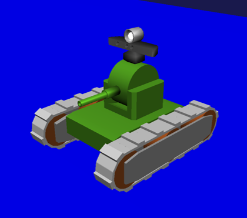
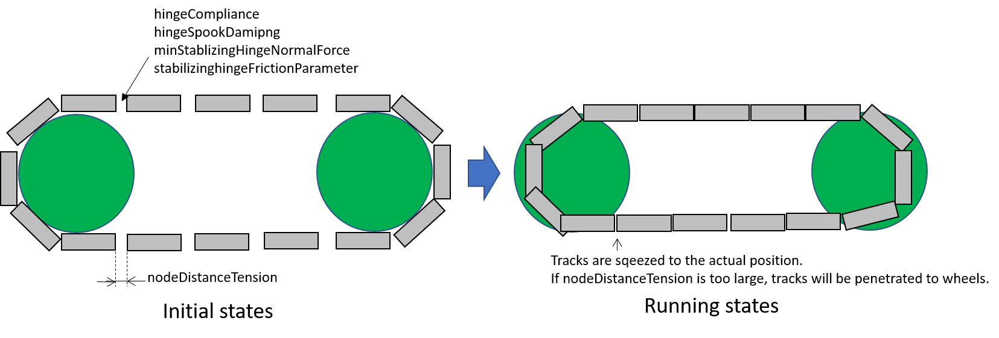
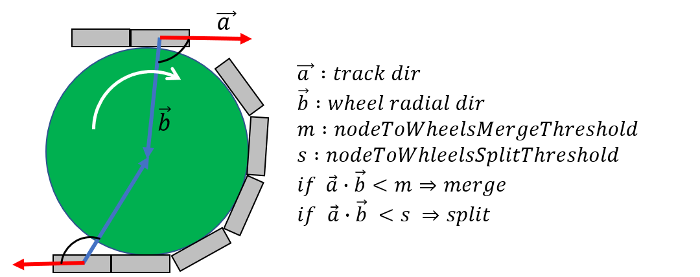
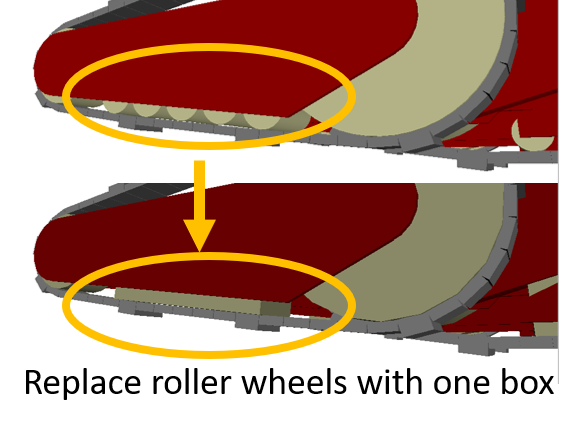

AGX Vehicle Continuous Track (AGX crawler)
==========================================

AGXVehicleContinuousTrack is a crawler model using AGX Dynamics.
agxVehicle modulus is used for implementation.

.. contents::
   :local:
   :depth: 1

About AGXVehicleContinuousTrack
--------------------------------

* **Automatic tie of crawler belt**

  When simulation run, crawler belt is automatically tied around wheel.
  User does not need to provide geometric information, but just need to set wheel and some parameters.

* **Hard to come off a crawler belt from wheel**

  To avoid departing a belt from wheel, wheel and belt is merged (constrained) internally.

* **Optimization for better performance**

  Crawler belt is presented by connecting plate nodes by hinges.
  Contacting points are created when crawler belt contact a floor as each node is rigid body.
  Using these contacting points, AGX Dynamics calculate the reaction force for crawler belt not to penetrate in a floor.
  More contact points causes the heavy load of calculation and may result into worse simulation performance.
  AGXVehicleContinuousTrack provides the function of temporary merge of some nodes to reduce contact points.

Sample
------------

Below is the explanation how to use AGXVehicleContinuous Track by using samples.
Please find sample projects in below directories.

* the scene of tank and Labo : chorenoid/Share/project/TankJoystickAGX.cnoid
* the simple scene of tank and floor : chorenoid/Share/project/TankJoystickAGX_Floor.cnoid

User can find models using in sample projectsin below directly.

* chorenoid/Share/project/tank_agx.body

| Once load sample project on Choreonoid and run the simulation by AGXSimulator, a crawler belt is set around the wheel of tank.
| If user uses PS4 controller, the tank can be operated by left stick, if does not, by [E] [D] [S] [F] key.

How to write
------------

Link composition of sample model is as below.

.. code-block:: yaml

  links:
    -
      name: CHASSIS
    -
      name: TURRET_Y
    -
      name: TURRET_P
    -
      name: TRACK_L      # left crawler (with guides on inner and outer side of track)
    -
      name: WHEEL_L0     # left front wheel (with motor)
    -
      name: WHEEL_L1     # left center wheel (free rotation)
    -
      name: WHEEL_L2     # left rear wheel (free rotation)
    -
      name: TRACK_R      # right crawler (with guides on inner and outer side of track)
    -
      name: WHEEL_R0     # right front wheel (with motor)
    -
      name: WHEEL_R1     # right center wheel (free rotation)
    -
      name: WHEEL_R2     # right rear wheel (free rotation)

| The tracks other than TRACK_L and TRACK_R, please follow the Choreonoid way of description.
| TRACK_L is wrote as below. Both of inner/outer guides and AGXVehicleContinuousTracks are wrote.

.. code-block:: yaml

  -
    name: TRACK_L
    parent: CHASSIS
    translation: [ 0, 0.16, -0.026 ]
    jointType: fixed
    centerOfMass: [ 0, 0, 0 ]
    mass: 1.0
    inertia: [
      0.02, 0,    0,
      0,    0.02, 0,
      0,    0,    0.02 ]
    elements:
      -
        type: AGXVehicleContinuousTrackDevice
        name: TRACK_L
        sprocketNames: [ WHEEL_L0 ]
        rollerNames: [ WHEEL_L1 ]
        idlerNames: [ WHEEL_L2 ]
        upAxis: [ 0, 0, 1 ]
        numberOfNodes: 42
        nodeThickness: 0.01
        nodeWidth:  0.09
        nodeThickerThickness: 0.02
        useThickerNodeEvery: 3
        material: TankTracks
        nodeDistanceTension: 2.0e-4
        stabilizingHingeFrictionParameter: 1e-6
        minStabilizingHingeNormalForce: 100
        hingeCompliance: 9.0e-10
        hingeSpookDamping: 0.01
        nodesToWheelsMergeThreshold: -0.01
        nodesToWheelsSplitThreshold: -0.009
        #enableMerge: false
        #numNodesPerMergeSegment: 3
        #contactReduction: 3
        #enableLockToReachMergeCondition: true
        #lockToReachMergeConditionCompliance: 0.1
        #lockToReachMergeConditionSpookDamping: 0.01
        #maxAngleMergeCondition: 1.0e-5
      -
        # abbr

1. AGXVehicleContinuousTrack is added on link elements as AGXVehicleContinuousTrackDevice. AGXVehicleContinuousTrackDevice can be added on arbitrary link.
#. Set driving wheel as sprocketNames
#. Set constrained wheel with a crawler belt as idlerNames.
#. Set non-constrained wheel as rollerNames, if necessary.
#. Set vertical unit vector against the moving direction of crawler as upAxis.
#. Set number of nodes(numNodes), width(nodeWidth), and thickness(nodeThickness) of a crawler belt.
#. Set thicker thickness of node(nodeThickerThickness) and set every how many nodes it is allocated, if necessary.
#. Set material. Please refer :ref:`agx_continous_track_material` .
#. Set parameters of crawler belt tie referring to :ref:`agx_continous_track_stabilize` .

.. image:: images/continuous-track-detail.png
   :scale: 70%

Explanation of parameters
-------------------------------
.. tabularcolumns:: |p{3.5cm}|p{11.5cm}|

MUST
~~~~

.. list-table::
  :widths: 20,8,4,4,75
  :header-rows: 1

  * - parameter
    - default value
    - unit
    - data type
    - explanation
  * - type: AGXVehicleContinuousTrackDevice
    - \-
    - \-
    - string
    - declaration of using AGXVehicleContinuousTrack
  * - sprocketNames
    - \-
    - \-
    - string list
    - driving wheel. Belt and wheel are merged and they are not uncoupled.
  * - rollerNames
    - \-
    - \-
    - string list
    - Guide wheel that does not have constraint. It they are some wheels on the model they need to be wrote as [ WHEEL_L1, WHEEL_L3, WHEEL_L4 ].
  * - idlerNames
    - \-
    - \-
    - string list
    - Wheel with constraint. Belt and wheel are merged and they are not uncoupled. If there are some wheels they need to be wrote as  [ WHEEL_L2, WHEEL_L7, WHEEL_L8 ].
  * - upAxis
    - [ 0, 0, 1]
    - Unit Vector
    - Vec3d
    - upward vector of model (against moving direction of crawler)
  * - numberOfNodes
    - 50
    - piece
    - unsigned int
    - number of nodes
  * - nodeThickness
    - 0.075
    - m
    - double
    - thickness of node
  * - nodeWidth
    - 0.6
    - m
    - double
    - width of node (normally equal to the height of wheel)
  * - nodeThickerThickness
    - 0.09
    - m
    - double
    - thickness of thicker node
  * - useThickerNodeEvery
    - 0
    - every ** piece(s)
    - unsigned int
    - how to deploy thicker node by every * nodes. if not not use, set zero.
  * - material
    - \-
    - \-
    - string
    - material of crawler belt

Probably MUST
~~~~~~~~~~~~~~~~
.. list-table::
  :widths: 20,8,4,4,75
  :header-rows: 1

  * - parameter
    - default value
    - unit
    - data type
    - explanation
  * - nodeDistanceTension
    - 5.0e-3
    - m
    - double
    - distance of initial node, which is parameter to adjust the tention between nodes
  * - stabilizingHingeFrictionParameter
    - 1e-6
    - \-
    - double
    - internal friction coefficient. larger it set, harder to rotate the hinge.
  * - minStabilizingHingeNormalForce
    - 100.0
    - N
    - double
    - | minimum normal force to calculate internal friction of hinge to connect nodes, which helps to stabilize the motion.
      | Setting larger value for tention between hinges will prevent crawler belt high and sympathetic vibration by internal friction.
      | It may happen that the normal force is too small or even negative value, please use minimum value in such case.
  * - hingeCompliance
    - 1.0e-10
    - rad/Nm
    - double
    - compliance of hinge that connects nodes
  * - hingeSpookDamping
    - 0.0333
    - s
    - double
    - spookdamping of hinge that connects nodes
  * - nodesToWheelsMergeThreshold
    - -0.1
    - \-
    - double
    - threshold to merge the node with wheel
  * - nodesToWheelsSplitThreshold
    - -0.05
    - \-
    - double
    - threshold to unmerge the node from wheel

Merging multiple nodes (that helps to improve the performance)
~~~~~~~~~~~~~~~~~~~~~~~~~~~~~~~~~~~~~~~~~~~~~~~~~~~~~~~~~~~~~~~~

.. list-table::
  :widths: 20,8,4,4,75
  :header-rows: 1

  * - parameter
    - default value
    - unit
    - data type
    - explanation
  * - enableMerge
    - false
    - \-
    - bool
    - on/off for node merge function
  * - numNodesPerMergeSegment
    - 0
    - \-
    - unsigned int
    - number of nodes to be merged
  * - contactReduction
    - 3
    - \-
    - 0 - 3
    - the level of contact reduction from zero(no reduction) to 3(maximum level)
  * - enableLockToReachMergeCondition
    - false
    - \-
    - bool
    - to lock hinge for node to be merged
  * - lockToReachMergeConditionCompliance
    - 1.0e-11
    - \-
    - double
    - compliance when hinge is locked
  * - lockToReachMergeConditionSpookDamping
    - 0.001
    - s
    - double
    - damping when hinge is locked
  * - maxAngleMergeCondition
    - 1.0e-5
    - rad
    - double
    - threshold angle to judge whether node is merged or not. In case threshold angle is larger than hinge angle, node is merged.

Hints to set parameters
------------------------

.. _agx_continous_track_material:

Setting for crawler material
~~~~~~~~~~~~~~~~~~~~~~~~~~~~~~

| Actual crawler or tire case, the frictions on moving direction and crossing direction are different.
| To simulate the same phenomenon, user need to set the friction separately.
| AGX Dynamics normally uses box model or cone model for friction calculation, so it does not provide the function to set the friction paramaeter separately between the direction.
| So please use following way to set the friction.
| Also refer :doc:`agx-material` .

.. code-block:: yaml

  materials:
    -
      name: Ground
      roughness: 0.5
      viscosity: 0.0
    -
      name: TankTracks         # material of crawler belt
      youngsModulus: 1e10
      roughness: 1.0
      viscosity: 0.3
    -
      name: TankWheel          # material of wheel
      youngsModulus: 1e10
      roughness: 0.0
      viscosity: 0.0

  contactMaterials:
    -
      materials: [ Ground, TankTracks]         # contact material between ground and crawler belt
      youngsModulus: 1e10
      friction: 0.7
      secondaryfriction: 0.5
      restitution: 0.0
      surfaceViscosity: 1e-7
      secondarySurfaceViscosity: 1e-5
      primaryDirection: [ 1, 0, 0 ]
      frictionModel: [ orientedBox, direct ]
      referenceBodyName: Tank
      referenceLinkName: CHASSIS
    -
      materials: [ TankWheel, TankTracks ]     # contact material between wheel and crawler belt
      youngsModulus: 1e10
      friction: 0.0
      restitution: 0.0

1. Define the material of crawler belt and wheel in material file
2. Set youngModulus(Young's modulus), roughness(roughness), and viscosity(viscosity) for the materials of crawler belt and wheel. The parameters here are to be used when ContactMaterial is not set.

  * youngModulus needs to be set larger not to cause the penetration of crawler belt into wheel as the force of winding around is very large.
  * Set certain roughness and viscosity of crawler belt.
  * Wheel basically contact only crawler belt. To stabilize the simulation set zero for roughness and viscosity.
  * Crawler belt, sprocket, and idler wheel are constrained and won't slip even roughness is set to zero.

3. ContactMaterial between ground and crawler belt should be set in material file as it should contact in the simulation.

  * youngsModulus needs to be set larger.
  * friction and secondaryFriction are set as per material.
  * Set surfaceViscosity and secondarySurfaceViscosity for crawler belt not to slip.
  * Set primaryDirection as moving direction.
  * Set frictionModel: [ orientedBox, direct ] as friction model.
  * Set body name to attach to crawler belt in referenceBodyName.
  * Set link name of body attached to crawler belt in referenceLinkName. It is set for main chassis or link with large mass.
4. Define ContactMaterial of wheel and crawler belt.

  * youngsModulus needs to be set larger.
  * Set zero for friction(friction coefficient) and restitution(restitution).

5. Lastly set material to the link of body file.

  * Set crawler belt material to the material of AGXVehicleContinuousTrackDevice.
  * Set wheel material to link wheel.

.. note::
  | orientedBox is the friction model that can handle contact parameter between moving direction and crossing direction separately.
  | direct solver should help to improve the accuracy of friction calculation.
  | referenceBodyName and referenceLinkName are activated when orientedBox is used.
  | Assume normal force that is used for friction force calculation from referenceLink, solver calculate friction force as -mu * Fn < Fp < mu * Fn.
  | mu is friction force, Fn is estimated normal force, Fp is friction force.
  | The avove process provides enough friction force in the simulation.

.. note::
  Material set the friction model as the orientedBox cannot be used in other model.
  Because orientedBox has referenceBodyName and referenceLinkName as parameter, then if set this material to other model, it can't find referenceBody and referenceLink, thus the function is not activated.

.. _agx_continous_track_stabilize:

Stabilization of crawler belt
~~~~~~~~~~~~~~~~~~~~~~~~~~~~~~

1. Fix the time step of simulation.
   Because some parameters like compliance or damping are to be flactuated according to length of time step.
   Please see below.

  .. code-block:: txt

    dt = 0.005 (200Hz)

2. Set OFF of node merge function, which reduce the parameters to be tuned.

  .. code-block:: txt

    enableMerge: false
    enableLockToReachMergeCondition: false

3. As the result the parameters to be considered are as below.
   Firstly comment out of allof the setting below and check the motion of crawler. (the below parameters are default value.)

  .. code-block:: txt

    #nodeDistanceTension: 5.03-3
    #stabilizingHingeFrictionParameter: 1.5
    #minStabilizingHingeNormalForce: 100
    #hingeCompliance: 1.03-10
    #hingeSpookDamping: 0.0333
    #nodesToWheelsMergeThreshold: -0.1
    #nodesToWheelsSplitThreshold: -0.05

4. Crawler belt moves hard and looks like hard wire. Then reduce the friction coefficient because the rfiction of hige is too large.

  .. code-block:: txt

    nodeDistanceTension: 0.0                  # Set zero to the distance of initial node(then tention is zero), which helps to tune easier.
    stabilizingHingeFrictionParameter: 1e-6   # Set friction coefficient small. If less than 1e-1, tune by index, and set as the crawler does not look like hard wire.

5. Crawler belt seems to have a bit loose if set above.
   To tighten flexure, tune the tension.
   Tension can be set by setting distance of initial node (nodeDistanceTension).
   If the value of nodeDistanceTension is large, the tention will be large as hinge tries to connect nodes by stronger force.
   If tension is too large the belt is goint to penetrate into wheel. (see below picture)
   The belt starts to vibrate because of too strong tention.
   Then set nodeDistanceTension smaller not to vibrate.
   In case the value is 5.0E-4, the belt penetrates into wheel, and in case 5.0E-5 the crawler belt looks loose.
   Tune as below.

  .. code-block:: txt

    nodeDistanceTension: 2.0e-4

6. Throughout above processes the crawler could move smooth back and forth.
   However the vibration may happen if user tries to pivot turn or spin turn, the crawler belt may start to vibrate.
   Compliance and damping of the hinge needs to be tune to avoid the vibration.
   Tune comliance by index, then find the value not to vibrate.
   In below case, vibration happens when 1.0e-10, then not when 1.0e-9.

  .. code-block:: txt

    hingeCompliance: 9.0e-10
    hingeSpookDamping: 0.01

7. If the crawler belts get crossed or the belt penetrates into wheel when moving, set smaller value for minStabilizingHingeNormalForce.
   If vibrate or not stable, set the larger value.

  .. code-block:: txt

    minStabilizingHingeNormalForce: 100

8. Lastly set below.
   It the belt set wrongly on the wheel, tune nodesToWheelsMergeThreshold and nodesToWheelsSplitThreshold.
   These threshold values decide the timing of merge and unmerge between crawler belt and wheel, which is inner product between crawler belt moving direction and the direction to center of wheel (see below).
   If this value is nearly zero, they are merged or unmerged when the two vectors cross vertically.
   Actual crawler case wheel has gear and it drives belt.
   This value can be caluculated as the angle to pull the belt out from the wheel or the angle that the belt departs from the gear.

  .. code-block:: txt

    nodesToWheelsMergeThreshold: -0.1    # Merge when the angle of two vetor is larger than 1.67rad(95.7deg)
    nodesToWheelsSplitThreshold: -0.05   # Unmerge when the angle of two vector is larger than 1.62rad(92.7deg)

Performance Tuning
---------------------------

If the performance of simulation is not good or not stable, please see below setting.

Simplify the model
~~~~~~~~~~~~~~~~~

| The crawler belf by AGXVehicleContinuousTrack is consist of some nodes connected by hinge joints.
| This means that the crawler belt has more bodies and more joints, which will result in increasing the calculation quantity.
| The performance may be improved if simplify the model referring below.

Improving the speed of simulation

* Reduce the number of nodes
* Reduce of number of robot link
* Not to use roller wheel if you use some roller wheels in the simulation

  * Replace to boxes (primitives) (see below)
  * Set the friction and restitution zero
  * Remove hinge joint between chassis and wheel and change to "fixed".
  

Inprove the stability

* Make thicker thickness of node

  * If the node thickness is not thick enough, it becomes easy to penetrate into the ground, and cause instability for contact responces.

*Under construction* Merging nodes
--------------------------------------

..
  # ノードのマージに関するパラメータ(値はデフォルト)を下記に示します。
  <pre>
  enableMerge: false
  numNodesPerMergeSegment: 3
  contactReduction: 1
  enableLockToReachMergeCondition: false
  lockToReachMergeConditionCompliance: 1.0E-11
  lockToReachMergeConditionSpookDamping: 0.05
  maxAngleMergeCondition: 1.0E-5
  </pre>
  # まずは機能を有効化し、パラメータはデフォルト(コメントアウト)のままで様子をみます。
  <pre>
  enableMerge: true
  #numNodesPerMergeSegment: 3
  #contactReduction: 1
  enableLockToReachMergeCondition: true
  #lockToReachMergeConditionCompliance: 1.0E-11
  #lockToReachMergeConditionSpookDamping: 0.05
  #maxAngleMergeCondition: 1.0E-5
  </pre>

Specification
---------------

* The crawlers are automatically generated when the simulation started. The crawlers are not visualized when the body file loaded into Choreonoid.
* AGXVehicleContinuousTrack is automatically set self collision settings as below table

  * This is because the crawler belt and the wheel must be collide
  * Setting collision off between the crawlers and the robot who have the crawlers for performance

  .. list-table::
     :widths: 15,15,15
     :header-rows: 1
     :stub-columns: 1

     * -
       - Wheels
       - Crawaler belt
     * - Wheels
       - \-
       - Collision on
     * - Other links of the robot
       - Depend on user settings
       - Collision off
