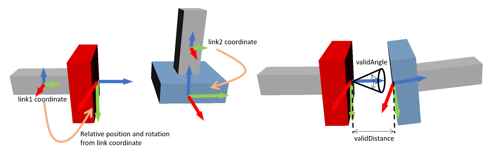

AGXMagneticJoint
===========================

| AGX Magnetic Joint is a joint that behaves like a magnet using AGX Dynamics.
| For implementation lock joint of AGX Dynamics is used.

.. image:: images/magnetic_joint.png

.. contents::
   :local:
   :depth: 2

Sample
------------

The sample is below.
When loading the sample project with Choreonoid and running the simulation, you can see the blue object stick together with the red object automatically (see above figure).

* project file: chorenoid/sample/AGXDynamics/agxMagneticJoint.cnoid
* body file:    chorenoid/sample/AGXDynamics/agxMagneticJoint.body

How to write
---------------

AGX Magnetic Joint can be described and used as follows.

.. code-block:: yaml

  links:
    -
      name: Plug
      elements:
        -
          type: AGXMagneticJointDevice
          link1Name: Socket
          link2Name: Plug
          position1: [ 0, 0.25, 0 ]
          position2: [ 0, 0, -0.05 ]
          connectAxis1: [ 0, 1, 0 ]
          connectAxis2: [ 0, 0, 1 ]
          jointCompliance: 1e-6
          jointSpookDamping: 1.0
          validDistance: 1.0
          validAngle: 20

#. Set the link you want to connect with AGXMagneticJoint to **linkName**

#. Set which part of the link you want to connect to **position** and **connectionAxis**

#. Set how much force and speed to connect to **jointCompliacne** and **jointSpookDamping**

#. Set the distance and angle at which the connection is valid to **validDistance** and **validAngle**

poistion is the relative position from the link coordinate and connectAxis is the connection direction of the joint.
For example, if you set connectAxis in different directions as shown on the left in the figure below, the connection is made so that each connectAxis matches.

Explanation of parameters
-----------------------------
The parameters are described below.

.. tabularcolumns:: |p{3.5cm}|p{11.5cm}|
.. list-table::
  :widths: 20,9,4,4,75
  :header-rows: 1

  * - parameter
    - default value
    - unit
    - default value
    - explanation
  * - type: AGXMagneticJointDevice
    - \-
    - \-
    - string
    - declaration of using AGXMagneticJoint
  * - link1Name
    - \-
    - \-
    - string
    - name of the link1
  * - link2Name
    - \-
    - \-
    - string
    - name of the link2
  * - position1
    - [0, 0, 0]
    - \-
    - Vec3
    - position of the joint relative from the link1 coordinate
  * - position2
    - [0, 0, 0]
    - \-
    - Vec3
    - position of the joint relative from the link2 coordinate
  * - connectAxis1
    - [0, 0, 1]
    - \-
    - Unit Vec3
    - direction of the joint relative from the link1 coordinate
  * - connectAxis2
    - [0, 0, 1]
    - \-
    - Unit Vec3
    - direction of the joint relative from the link2 coordinate
  * - jointCompliance
    - 1e-8
    - m/N
    - double
    - compliance of the joint
  * - jointSpookDamping
    - 0.33
    - s
    - double
    - spook damping of the joint
  * - validDistance
    - 0
    - m
    - double
    - distance threshold when the magnetic joint effective
  * - validAngle
    - 0
    - degree
    - double
    - angle threshold when the magnetic joint effective
