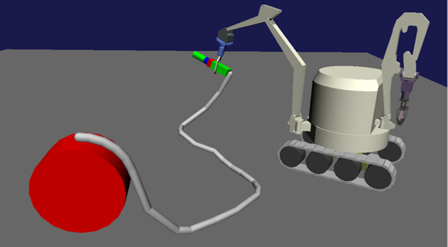

AGXWire
===========================

AGXWire is a wire model using AGX Dynamics.
The agxWire module of AGX Dynamics is used for implementation.

.. contents::
   :local:
   :depth: 1

.. _agx_wire_feature:

Features of AGXWire
--------------------------------

* **Hard to be torn**

  Even if the wire is pulled with a strong force it is hard to be torn. For example, it is useful for hanging a container with a crane wire.

* **Good performance for long length**

  | A general physics engine expresses cables and wires by connecting rigid bodies with a shape such as a capsule and a cylinder with joints.
  | Therefore, as the number of rigid bodies increases, the amount of computation increases, and finally the calculation is not completed within real time.
  | In this model, the number of elements can be automatically increased / decreased during the simulation.
  | This can be reduce computation amount of the simulation.

.. note::
  | AGXWire emphasizes speed. The stability of collision response is not high.
  | It does not correspond to a tough scene such as a robot stepping on wires or sandwiching wires with a door.
  | In such a situation wire may oscillate and in the worst case the simulation may stop.

Sample
------------

You can check samples to how to use AGXWire. The samples are below.　
When loading the sample projects with Choreonoid and running the simulation with AGXSimulator, the wire will be displayed.

* Winch, Wire, Wire link
   * Project file: chorenoid/sample/AGXDynamics/agxWireSample.cnoid
   * Body file: chorenoid/sample/AGXDynamics/agxWireSample.body
* Fire hose
   * Project file: chorenoid/sample/AGXDynamics/FireHose.cnoid
   * Body file: chorenoid/sample/AGXDynamics/FireHose.body

How to write
------------

Link composition of sample model is as below.

.. code-block:: yaml

  links:
    -
      name: Drum
      parent: Root
      translation: [ -1.0, 0.0, -3.0 ]
      jointType: fixed
      elements:
        -
          type: Shape
          geometry: { type: Cylinder, radius: 0.25, height: 0.2 }
          appearance: { material: { diffuseColor: [ 1.0, 0, 0 ] }}
        -
          type: AGXWireDevice
          radius: 0.02
          resolutionPerUnitLength: 5
          collision: true
          selfCollision: true
          materialName: Wire
          #wireYoungsModulusStretch: 6E10
          #wireSpookDampingStretch: 0.075
          #wireYoungsModulusBend: 6E10
          #wireSpookDampingBend: 0.075
          Winch:
              linkName: Drum
              position: [ 0.0, 0.0, 0.27 ]
              normal: [1.0 , 0.0, 0.0 ]
              pulledInLength: 50
              haulForceRange: [ -50, 50 ]
          Nodes:
            -
              type: free
              linkName: Root
              position: [ -0.27, 0.0, 0.27]
            -
              type: free
              linkName: Root
              position: [ 0.27, 0.0, 0.27]
            -
              type: link
              linkName: Sphere
              position: [ 0.0, 0.0, 0.1]
    -
      name: Sphere
      parent: Root
      translation: [ 1.0, 0.0, 0.0 ]
      jointType: free
      mass: 1.0
      elements:
        -
          type: Shape
          geometry: { type: Sphere, radius: 0.1 }
          appearance: { material: { diffuseColor: [ 0.0, 1.0, 0 ] }}
        -
          type: AGXWireDevice
          radius: 0.04
          resolutionPerUnitLength: 5
          collision: true
          selfCollision: true
          materialName: Wire
          Nodes:
            -
              type: link
              linkName: Sphere
              position: [ 0.0, 0.0, -0.1]
            -
              type: fixed
              linkName: Box
              position: [ 0.0, 0.0, 0.1 ]
    -
      name: Box
      parent: Sphere
      translation: [ 0.0, 0.0, -2.0 ]
      jointType: free
      mass: 5
      elements:
        -
          type: Shape
          geometry: { type: Box, size: [ 0.2, 0.2, 0.2] }
          appearance: { material: { diffuseColor: [ 0.0, 1.0, 0 ] }}

1. Add AGXWireDevice to the elements part of arbitrary link
2. Set parameters of the wire

  * Set the radius of the wire to the parameter **radius**
  * Set the resolution of the wire to the parameter **resolutionPerUnitLength**
  * Set enable or disable collision between wires, links and other environments to **collsion**
  * Set enable or disable self collision between the wire and the links which has the wire to **selfCollision**
  * Set the material of the wire to **materialName**. Check the reference :doc:`agx-material`.
  * It is recommend to use the material file. Though, you can set parameters such as wireYoungsModulusStretch directly into the body file.
3. In order to pull out the wire from the winch, set the following

  * Set the link name, which to be used as a winch, to **linkName**. You can specify any link.
  * Set the pulled out position of the wire to **position** relative from the link coordinate of the link
  * Set the pulled out direction of the wire to **normal**  relative from the link coordinate of the link
  * Set the length of the wire which stock into the winch to **pulledInLength**
  * Set the required force to pull out the wire from the winch or put in to **haulForceRange**
4. Next, use the Node hash to route the wire in space
  1. Wires can be routed in three ways. The way of routing is specified as **type**:

    * type: free     Route the wire to the specified position. Not fixed.
    * type: fixed    Fix the wire at the specified position
    * type: link     Connect another wire to the wire using a link
  2. Set the **linkName** in which coordinate system to route the wire

    * When the link exist in which name is the linkName: Link coordinate
    * When the linkName is empty or not exist link: World coordinate
  3. Set the routing position to **position**

.. image:: images/wire-detail.png
   :scale: 70%

Explanation of parameters
--------------------------
The parameters are described below.

Wire

.. tabularcolumns:: |p{3.5cm}|p{11.5cm}|
.. list-table::
  :widths: 20,9,4,4,75
  :header-rows: 1

  * - parameter
    - default value
    - uinit
    - data type
    - explanation
  * - type: AGXWireDevice
    - \-
    - \-
    - string
    - declaration of using AGXWire
  * - radius
    - 0.02
    - m
    - double
    - radius of the wire
  * - resolutionPerUnitLength
    - \-
    - m
    - double
    - minimum resolution of the wire
  * - collision
    - \-
    - \-
    - bool
    - set enable/disable collision between the wire and other objects
  * - selfCollision
    - \-
    - \-
    - bool
    - set enable/disalbe self-collision between the wire and the body which has the wire
  * - materialName
    - \-
    - \-
    - string
    - name of the material
  * - wireYoungsModulusStretch
    - 6e10
    - N/m
    - double
    - young's modulus in the stretch direction
  * - wireDampingStretch
    - 0.075
    - s
    - double
    - spook damping in the stretch direction
  * - wireYoungsModulusBend
    - 6e10
    - N/m
    - double
    - young's modulus in the bending direction
  * - wireDampingBend
    - 0.075
    - s
    - double
    - spook damping in the bending direction

Winch

.. list-table::
  :widths: 20,9,4,4,75
  :header-rows: 1

  * - parameter
    - default value
    - uinit
    - data type
    - explanation
  * - linkName
    - \-
    - \-
    - string
    - link name which to be a winch
  * - position
    -
    - \-
    - Vec3
    - pulled out position of the wire
  * - normal
    -
    - \-
    - Vec3
    - pulled out direction of the wire
  * - pulledInLength
    -
    - m
    - double
    - length of the wire which store into the winch
  * - haulForceRange
    -
    - N
    - Vec2
    - force required to pull out the wire from or put in the wire to the winch

Node

.. list-table::
  :widths: 20,9,4,4,75
  :header-rows: 1

  * - parameter
    - default value
    - uinit
    - data type
    - explanation
  * - type
    - \-
    - \-
    - string
    - type of routing the wire: set free, fixed, link
  * - linkName
    - \-
    - \-
    - string
    - link name in which coordinate system to route the wire
  * - position
    -
    - \-
    - Vec3
    - position where locate or fix the wire

Collision settings of the wire
-------------------------------------

.. image:: images/wire-collision.png
   :scale: 100%

| As explained in :ref:`agx_wire_feature`, agxWire does not correspond to the case such as the robot stepping on wires.
| However, it is difficult to operate the robot avoiding such a case.
| Here are some countermeasures.

Disable collision with the specified link with the wire
~~~~~~~~~~~~~~~~~~~~~~~~~~~~~~~~~~~~~~~~~~~~~~~~~~~~~~~~~~~~

As shown in the above left figure, disable collision between the wire and the specified link.
This can be done by setting excludeLinksWireCollision of the collision setting of :doc:`agx-body`.

.. code-block:: yaml

  collisionDetection:
    excludeLinksWireCollision: [ linkQ, linkR, ... ]

Attach a wire guard to the link to avoid collision with the wire
~~~~~~~~~~~~~~~~~~~~~~~~~~~~~~~~~~~~~~~~~~~~~~~~~~~~~~~~~~~~~~~~~~~~~~~~~~~~~~~

Another way is to attach a guard to the link which you want to avoid collision with the wire as shown in the above right figure.
This can be realized by describing it in the body file as follows.
Add a guard link to the body file.
However, since it will cause collision with other links and self collision as it is, set excludeLinksDynamic and disable collision between links.
Then the guard link will collide with the wire only.

.. code-block:: yaml

    -
      name: WIRE_GUARD_L
      parent: TFRAME
      jointType: fixed
      translation: [ -0.02, -0.595, 0.600 ]
      material: default
      elements: &WireGuard
        -
          type: Collision
          elements:
          -
            type: Shape
            geometry: { type: Box, size: [ 2.1, 1.5, 0.5 ] }

  collisionDetection:
    excludeLinksDynamic: [ WIRE_GUARD_L, WIRE_GUARD_R ]

Specification
-------------------

* Please note that wire material parameters are overridden in the order of **material description < direct description** .
