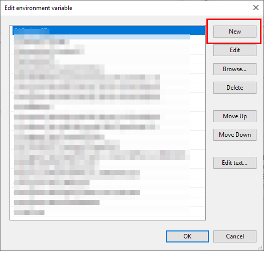

Installing AGX Dynamics (Windows)
=================================

.. contents::
   :local:
   :depth: 1

Installation
------------

| We will explain the installation process for the Windows version of AGX Dynamics.
| Download the file for **x64**, **VS2015** or **VS2017** from the AGX Dynamics download site, and execute.
| The installer will launch, so follow the displayed instructions.
| By default, it will be installed in the c:Program FilesAlgoryxAgX-<version> directory. <version> will be replaced with the version number of the file you downloaded.
| Next, copy the AGX license file (agx.lic) to the installation directory c:Program FilesAlgoryxAgX-<version> so that you can run AGX Dynamics.

Running test
------------

Execute the AGX Dynamics sample to check AGX Dynamics is running correctly. Open the command prompt and execute the following sequence of commands:

.. code-block:: txt

   cd c:\Program Files\Algoryx\AgX-<version>
   setup_env.bat
   cd bin\x64
   tutorial_trackedVehicle.exe
   
.. _install-agx-windows-setenv:

Environment variable settings
-----------------------------

The environment variable settings will be displayed as explained in the :ref:`Environment variable settings <build-windows-setenv>` section. Find PATH among the system environment settings and double-click it. A dialog box will open for editing.

Click the **New** button, and a new field will be added, so enter c:\Program Files\Algoryx\AgX-<version>\bin\x64.

