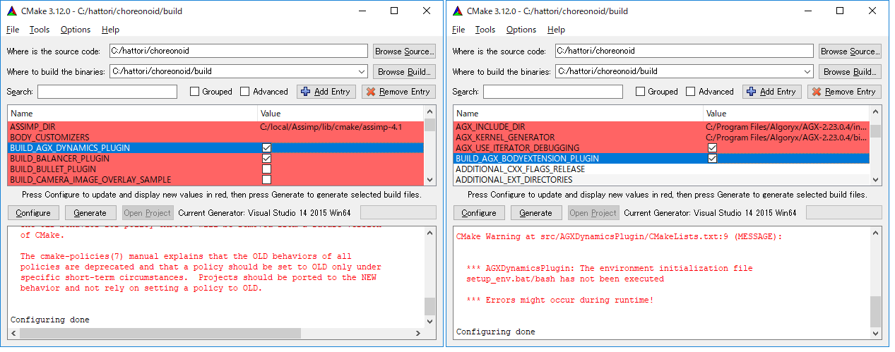

Building and installing the AGX Dynamics plugin (Windows)
---------------------------------------------------------

| The AGX Dynamics plugin is included in the Choreonoid source code.
| Set the following CMake options to ON before building Choreonoid in order to be able to carry out the build.

* **BUILD_AGX_DYNAMICS_PLUGIN**      : AGXDynamicsPlugin - the AGX Dynamics simulation plugin
* **BUILD_AGX_BODYEXTENSION_PLUGIN** : AGXBodyExtensionPlugin - plugin for dedicated models (such as wire, etc.)

| Below, we will explain the installation process in detail.
| Launch CMake.

| Check the box for **BUILD_AGX_DYNAMICS_PLUGIN** and click **Configure**. The AGX library will be automatically detected.
| If it is not detected, set **AGX_DIR** to the installation location directory.
| Check the box for **BUILD_AGX_BODYEXTENSION_PLUGIN** and click **Configure** again.

As shown in the screenshot, the message “*** Errors might occur during runtime!” Is displayed, but if you have set the  :ref:`install-agx-windows-setenv`, you can ignore this.

.. note::

   Since AGXBodyExtensionPlugin is dependent on AGXDynamicsPlugin, it will not be displayed by ccmake unless BUILD_AGX_DYNAMICS_PLUGIN is ON. 
   Set BUILD_AGX_DYNAMICS_PLUGIN to **ON** and click **Configure**.

Click **Generate** to create the solution file. Then, build and install in the same way as in the section on  :ref:`build-windows-visualstudio` .
