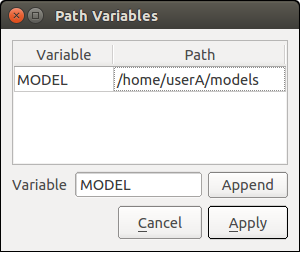

Environment Settings
====================

Overview
--------

Choreonoid is designed to save the following setting items to the environment configuration file as user-specific setting items and take over the previous settings when it starts.

* Whether the window is maximized
* Window size
* Current directory in a file load and save dialog
* Whether to enable the saving/loading of the layout of project files (see :ref:`basics_layout_save` )

On the other hand, the state of the item, toolbar, and view is not saved as environment settings. If you want to take over the current state, you must save it to the project file and load it the next time you use it.

Environment Configuration File
------------------------------

An environment configuration file is created for each OS user account. The file is located in ".config/Choreonoid/Choreonoid.conf" under the home directory on a Unix OS. Therefore, you can clear or copy environment settings by deleting or copying this file. Since settings are written to the file in YAML text format, you can also try to solve a problem by directly editing the file if any problem occurs in environment settings.

.. _basics_project_pathset:

Project Path Variable
--------------------

The "project path variable", which is one of the environment setting items, is a mechanism to load related files in a portable way when a project is loaded. This function enables you to load a project from an environment different from one where the project file is saved, even as for a project consisting of various files stored in different directories.

Generally, a project consists of not only the project file but also other files. For example, in the :ref:`basics_project_sr1walk` , two models, robot and floor, were loaded as items of the BodyItem type from the model files "SR1.yaml" and "floor.wrl", respectively. The project file only records the paths to the model files, and they must also be ready to be loaded when the project file is loaded.

However, directories that store model files may vary depending on the environment. For example, user A may store model files in /home/userA/models and user B may store them in /home/userB/robots. In this case, if the project file saved in the environment of user A is configured to reference directories under /home/userA/models, model loading fails because model files are not stored in such directories in the environment of user B.

Therefore, Choreonoid records references from a project file to external files under the following rules:

1. If an external file is in the same directory as the project file or its subdirectory, Choreonoid records it as a path relative to the directory of the project file.
2. If 1 is not applicable, and if a directory registered as "path variable" is included in the path to the external file, Choreonoid replaces the part corresponding to the directory with the variable name and records the path.
3. If 2 is not also applicable, Choreonoid records the external file as the absolute path from the root directory.

First, if a set of files constituting the project is stored in the same directory as the project file, rule 1 allows you to load the files without any problem even in a different environment by copying the directory as is.

However, since there may be cases in which various projects need to share model files or you want to use them independently of Choreonoid projects, it is common to store model files in different directories from the project file. In such a case, you can utilize the "path set" mechanism, which is rule 2.

The path set is a function to register directories by putting labels. You can register as many directories as you like. For example, in the above case of user A and user B, register directories beforehand in the following way.

.. tabularcolumns:: |p{2.0cm}|p{2.0cm}|p{4.0cm}|

.. list-table::
 :widths: 24,25,50
 :header-rows: 1

 * - User
   - Variable Name 
   - Directory
 * - User A
   - MODEL
   - /home/userA/models
 * - User B
   - MODEL
   - /home/userB/robots

If you register directories beforehand in this way and "SR1.yaml", for example, is stored in either of the above directories, the path is written to the project file in the form of "${MODEL}/SR1.yaml", where the variable name is used. Then, at load time, the ${MODEL} part is expanded to the registered actual directory, which enables loading from either of the user A and user B environments.

In Choreonoid, the "PROGRAM_TOP" variable, which indicate the top directory of the Choreonoid installation destination, and the "SHARE" variable, which indicates the share directory, are registered by default. Therefore, simply placing files in the installation destination or directories under the share directory is enough to make the project file that uses the files portable.

If you want to define a path variable other than them, configure settings in the following dialog, which is displayed by selecting the main menu "File" - "Project File Options" - "Path Variable Settings".

First, enter the added variable name in the text box labeled "Variable" on the left of the "Add" button. The variable name "MODEL" is entered in this example. Then, click the "Add" button to add the variable to the variable list in the upper part. This makes the "path" field editable. Enter the actual directory in the field. This example assumes user A, and "/home/userA/models" is entered.

When you finish editing, click the "Apply" button to record the contents of the edit as environment settings.
