Projects and Items
======================

.. contents::
   :local:
   :depth: 1

.. _basics_about_project:

What is a Project?
------------------

On Choreonoid, you can perform diversified activities such as simulation of a robot and motion choreography. A "Project" is a set of data required for a certain activity that are bundled and sorted out so that they can be used on Choreonoid. First you have to create a "Project" before you make an activity using Choreonoid. The status of the created project can be stored in a file as a "Project File" so that it can be retrieved when necessary.

What is a Project Item?
------------------------

Of all the data constituting a Project on Choreonoid, those subject to user's explicit operations are called a "Project Item" (also called as an "Item" as abbreviation). A Project normally consists of multiple Items. Diversified types of Items are defined depending on the data to be handled and you have to select and use the types of the constituting Items ( :ref:`basics_itemclass` ) depending on the purpose of the project. You can also add your unique Item Class by developing a plug-in.

In case a Project consists of multiple Items, it is necessary to define the relationship among those Items. It is possible on Choreonoid to define the relationship in a tree structure that can be freely edited by user. This tree is called :ref:`basics_item_tree` .

Loading of a Project
----------------------

Load a Project" by selecting "File" ‐ "Load project" from Main Menu on the top of Main Window. Then a dialogue for "Load Choreonoid project file" is prompted.

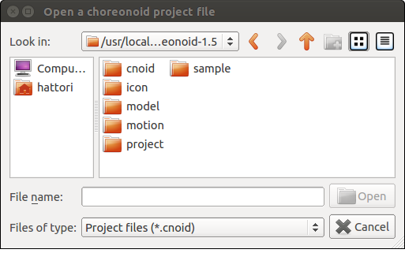

You can select the project file to be loaded. Note that a project file normally has an extension "cnoid".

n case Choreonoid was started up from command line, you can also load a project using :doc:`launch` as explained in the section of :ref:`basis_launch_projectfile` .

Sample Projects
--------------------

Choreonoid has some sample projects as default. These samples are stored in "project" directory under "share" directory of Choreonoid. (See :doc:`../install/directories`  for the place of share directory.)

Here is an overview description of some samples. Load any sample that may interest you.

.. tabularcolumns:: |p{4.5cm}|p{10.5cm}|

.. list-table::
 :widths: 30,70
 :header-rows: 1

 * - Project File
   - Description
 * - FallingBoxes.cnoid
   - Simulation to drop four boxes
 * - SR1Walk.cnoid
   - Simulation of walking of a sample biped robot model "SR1"
 * - SR1WalkHighGain.cnoid
   - Simulation of SR1 robot using "High Gain Mode" of AISTSimulatorItem
 * - SR1Walk2D.cnoid
   - Simulation of SR1 robot using "2D mode" of AISTSimultorItem
 * - SR1Liftup.cnoid
   - Simulation of SR1 grasping and lifting a box
 * - SR1WalkinHouse.cnoid
   - Simulation of SR1 robot walking in the house and lifting a video tape placed on a table
 * - PA10Pickup.cnoid
   - Simulation of Mitsubishi Heavy Industries' manipulator "PA10" grasping and moving a box
 * - SampleCrawler.coid
   - Simulation of driving a mobile robot using crawler mechanism
 * - SampleCrawlerJoystick.coid
   - Simulation of operating a mobile robot with a joy stick using crawler mechanism It is operable by pulling down the stick when a USB joy stick is connected (verified on F310 game-pad provided by LOGICOOL).
 * - TankJoystick.coid
   - Simulation of operating with joy stick a combat vehicle-type mobile robot. It is configured so that the robot explores with a light in a dark plant. In addition to the move operations, it is possible to change the direction of the turret (light) and turn on/off the light.
 * - GR001Sample.cnoid
   - Simulation of choreographing HIP Japan's biped robot kit "GR001" It is possible to operate the robot using the key frame data "SampleMotion1". By building and installing GRobot plug-in in advance, it is also possible to operate the production type of GR001.
 * - RIC30Sample.cnoid
   - 株式会社アールティ製の二足歩行ロボットきっと"RIC30"の動作振り付けサンプル。内容はGR001と同様です
 * - ClosedLinkSample.cnoid
   - Simulation sample of modelling of a closed loop mechanism
 * - ConveyorSample.cnoid
   - Simulation sample of conveyor belt mechanism

To use the samples including robot control, it is necessary to turn ON "BUILD_SIMPLE_CONTROLLER_PLUGIN" and "BUILD_SIMPLE_CONTROLLER_SAMPLE" (both are turned on by default) when building Choreonoid.  Some other samples than the above-mentioned are added when an optional plug-in is enabled.

.. _basics_project_sr1walk:

Example of SR1Walk Project
-----------------------

Here, we are going to load "SR1Walk" project from the samples to see how the actual project looks like. First, load "SR1Walk.cnoid", which is the project file of this sample. Then, the project is loaded and a robot as illustrated below is displayed:

.. image:: images/SR1Walk_scene.png

This robot is "SR1" robot, which is one of the sample models. SR1Walk project is used to simulate biped walking of SR1 robot.

The simulation starts when "Start simulation" button on "Simluation bar" is pressed as shown in the following image:

.. image:: images/SimulationBar_StartButton.png

When the button is pressed, the robot starts walking. In this simulation, the physical model of the robot is loaded and PD-controlled according to the biped walking pattern. The result is calculated using dynamics calculation and presented in animation.

Project Component Items
------------------------

Items that constitute a project can be checked in "Item Tree View" area allocated by default on the left top of Main Window. For SR1Walk project, Item View Tree is displayed like below:

.. image:: images/ItemTreeView.png

In this way, each of the items displayed in Item Tree View corresponds to each Item.

The overview of each Item is as follows:

.. tabularcolumns:: |p{3.5cm}|p{3.5cm}|p{7.5cm}|

.. list-table::
 :widths: 20,20,60
 :header-rows: 1

 * - Name
   - Item Class
   - Description
 * - World
   - WorldItem
   - It supports one virtual world in the simulation. See  :ref:`model_collision_and_worlditem` .
 * - SR1
   - BodyItem
   - Item that supports the robot model "SR1" It contains data including the shape of SR1 model, joint structures, physical parameters and the current status. See :doc:`../handling-models/bodymodel` for detail of BodyItem class.
 * - SR1WalkController
   - SimpleControllerItem
   - Item that supports the control programme (controller) to PD-control based on the biped walk pattern. The control routine associated with this Item is executed during the simulation to control the robot.
 * - ASITSimulator-SR1
   - BodyMotionItem
   - Item that stores motion trajectory of SR1 model It is generated as a simulation result when the simulation is run.
 * - Floor
   - BodyItem
   - Floor model
 * - AISTSimulator
   - AISTSimulatorItem
   - Simluation engine developed by AIST The simulation result is calculated using the dynamics calculation routine associated with this Item.

.. _basics_itemclass:

Item Class
--------------

The type of an Item is called "Item Class" or "Type" of Item. The items that constitute a project normally consist of multiple Item Classes.

Item Class supports C++ class in Choreonoid and all Items are implemented inheriting the "Item" type as base. For example, the Item Classes included in SR1Walk project have the following inheritance relationship.

.. image:: images/item-inheritance.png

A function that was designed for an Item Class is also available in an inheriting Item Class. Many of the basic functions that handle an Item are designed for a certain type of Item and they all are available for all Items.

On the other hand, some functions are meant for a specific Item Class. For example, the functions meant for a robot or an environment model are to be used for "BodyItem" type Items corresponding to the model data. 

In that way, a function meant for a specific Item Class can be used also for an inheriting Item Class. To make use of the simulation function, for example, a "SmilatorItem" type Item that abstracts the simulation engine is required. Actually, however, "AISTSimulatorItem", which inherits the other one, is used for SR1Walk project. Since the simulation function can also be executed by any other Item that inherits SimulatorItem type Item, it is possible to change the calculation method for simulation by introducing such an Item Class.

.. note:: For example, if "ODE Plug-in" and "Bullet Plug-in" are built, additional SimulatorItem type Items like "ODESimulatorItem" type and "BulletSimulatorItem" type Items are loaded for SR1Walk project, too.  In this case, by selecting these Items and pressing Start Simulation button, a simulation leveraging these engines can be performed. (For how to build these plug-ins, see :doc:`../install/options` .）

As explained above, by defining a generic function for an upper Item Class and defining a special function for a lower Item Class for that purpose, you can realise a mechanism that enables standardising the interfaces as much as possible and supporting individual functions at the same time.

.. _basics_item_tree:

Item Trees
--------------

Items are allocated in a tree structure as follows in SR1Walk project:

| + World
|   + SR1
|     + SR1WalkController
|       + AISTSimulator-SR1
|   + Floor
|   + AISTSimulator

This tree structure enables to define the relationship among Items. In SR1Walk project, the following relations is expressed in concrete.

First, as sub-Items (sub-nodes in Item Tree), the robot and the floor models "SR1" and "Floor" are allocated. It means that both SR1 and Floor are objects existing in the virtual world of World Item. In this way, for example, the interference between SR1 and Floor is calculated. (See :ref:`model_collision_and_worlditem` for detail)

A simulation engine "AISTSimulator" is also allocated as a sub-Item of World. This means that the virtual world to be simulated by AISTSimulator is World.

The relationship between World Items is not significant in case there exists only one virtual world like in this project. In case, however, there are multiple WorldItem type Items, it is necessary to define which model or simulator is associated with which World Item. Conversely, this mechanism makes Choreonoid possible to handle multiple virtual worlds.

Next, "SR1WalkController" is assigned as a sub-Item of SR1. It means that the target of this controller is SR1. Even if multiple robots and controllers exist, this mechanism makes it possible to associate the robots with the controllers.

As for AISTSimulator-SR1", which supports the robot's motion trajectory data, is allocated as a sub-Item of SR1WlakController.  It demonstrates the relationship between the following two facts: One of the facts is that this motion trajectory represents the motion of SR1 model. The motion trajectory Item is not a direct child Item of SR1, but it is associated like this as it is its descendant. To demonstrate this relationship only, it is OK to define it as a direct child Item of SR1. However, to demonstrate that this motion trajectory is a result of the control by SR1WalkController as a second relationship, this Item is allocated in this way.

In this way, it is possible to represent different relationships among Items by the tree structure.  The positioning of Items in the tree is configurable any time by user and each function of Choreonoid extracts the relationship from the current tree status according to each rule. With the use of the unified and dynamic interfaces based on these Items and their tree structure, it is possible to handle complex projects and functions in a simple and flexible manner.

.. _basics_itemtree_management:

Management of Item Tree
--------------------

.. _basics_selection_and_check:

Selection and Check
~~~~~~~~~~~~~~

Items can be "selected" and "checked" in Item Tree View. For example, there are three Items as below:

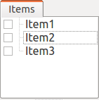

In this state, all items are normal. If you click on "Items2" with mouse, the area of Items becomes as follows:

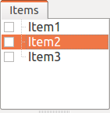

This state is called "Selected" state of Item.

The selected state can be unselected by selecting another Item or pressing ESC. It is also possible to select more than one Item at the same time by clicking on Items with Shift key or Ctrl key kept pressed. Remember this operation because it will be often required to select more than Item. In addition, by pressing "Ctrl + A" (Ctrl and A at the same time), all Items are selected.

Beside the selected state, there is "Checked" state of Item. This state is shown with a box on the left of Item. If this box is clicked, it is checked as shown below:

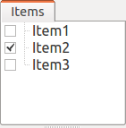

By clicking the checked box again, it is unchecked.

As shown below, it is also possible to select and check an Item at the same time.

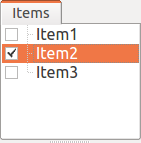

Selected state and Checked state are used to explicitly specify which Item is subject to an operation when there are multiple Items can be subject to the operation. Though it may be misleading, each of the states is independently switchable and which state is referred to when performing an operation is not according to a strict rule but dependent on each operation. Therefore, it is necessary to remember which state (Selected or Checked) is used for each operation, but a broad rule is as follows:

* Selected state
 * Basic operation on Item Tree
 * Temporary operation
 * Selection in case multiple Items are racing as a candidate
* Checked state
 * Switching between permanent On/Off state
 * An operation where multiple candidates can be the target at the same time

In this way, you can decide which state to use.

As an example use of Selected state, when many SimulatorItem class Items exist, which Items to be used for simulation is decided based on Selected state of Items when Start Simulation button is pressed.

As an example use of Checked state, whether a model is displayed on Scene View or not is switchable depending on Checked state. In the example of SR1Walk, Robot and Floor models are loaded as Items, but only Robot model is displayed by default. Now check "Floor" Item, which is Floor model. Then, a blue floor model will be displayed in Scene View. Conversely, if you uncheck "SR1" Item, the robot on Scene View will disappear. ( This operation is described in :doc:`sceneview` in detail.)

Create New
~~~~~~~~

To create a new Item, select "File" and "New Item" Here, when you select the Item Class that you want to create newly, a dialogue to decide the name is prompted. Enter a name (the default name can be used, too) and press "Create". (For some Item Classes, there may be other configuration items than the name.) Then, an Item is generated and displayed in Item Tree View.

Note that if one of the existing Items is selected in Item Tree View, the new Item is assigned as a sub-Item of the Item.

.. _basics_item_load:

Loading
~~~~~~~~

Some Items can be generated by loading from a file  like Robot model. In this case, select the type of the file by selecting "File" - "Load" When a dialogue to load a file, select the file to load. When the file is successfully loaded, an Item that corresponds to the file is generated. Like the case of creating new, if an existing Item is selected, the Item will be loaded as a sub-Item of the Item.

For an Item loaded from a file, it can be reloaded by selecting the Item in Item Tree View and pressing "Ctrl + R". It is convenient when you want to reflect any file that was updated externally on Choreonoid. For example, while a model file is being edited externally, you can utilise this operation to check the edit result on Choreonoid.

Change Name
~~~~~~~~~~~

By double-clicking an Item in Item Tree View, the text of Item Name can be edited. Enter a new name to change the Item Name.

Cut, Copy and Paste
~~~~~~~~~~~~~~~~~~~

By right-clicking your mouse on an Item in Item Tree View,

* Cut
* Copy (single)
* Copy (sub-tree)
* Paste

operation items are shown the context menu. Using them, you can copy and paste.

As for copying an Item having sub-Items, its behaviour is different between "single" and "sub-tree". In case of "single", only the Item is copied. In case of "sub-tree", all the child Items (descendant Items) of the Item are copied together.

As for paste, the target is pasted as a sub-Item of the Selected Item. So, it is possible to change the allocation of Items using cut and paste.

.. _basics_item_move:

Move
~~~~

By dragging an Item in Item Tree View, you can move the position of the Item.

When, for example, there are three Items from Item1 to Item3 as in the figure below:

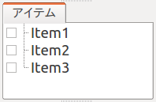

If you drag Item3 with the mouse to the overlapped position of Item1, a rectangle that surrounds Item1 shows up like shown in the left of the figure below. When you finish dragging it in this state, Item3 is moved to the position of a sub-Item of Item1 as shown in the figure in the right.

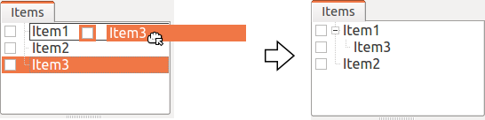

Or, when you drag Item3 to a position between Item1 and Item2, a line that connects Item1 and Item2 appears. When you finish dragging it in this state, Item3 is moved so that it is inserted between Item1 and Item2 as shown in the figure in the right.

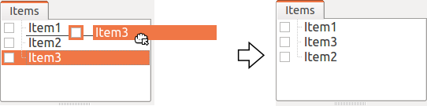

In the example below, Item3 as an sub-Item of Item1 is dragged to a position below where nothing exists. In this case, Item3 is moved so that it lines up with Root of the tree as illustrated in the right.

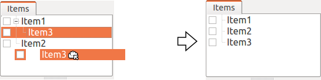

In this way, by dragging an Item in Item Tree View, you can freely allocate Items.

Save
~~~~

Data of some Items can be saved in a file. Such Items can be stored in a data file by selecting the Item first and executing "File" from Main Menu and "Save Selected item as". In this way, it is possible in most cases to load the saved file again to Choreonoid following the above-mentioned process stated in :ref:`basics_item_load`. Thus, it is also possible to use data in other projects on Choreonoid. Data saved can be used in an external programme, too.

For a concrete example, let us save "AISTSimulator-SR1" Item, which is generated after the simulation with SR1Walk sample. This Item is a BodyMotionItem type Item and contains the motion trajectory data of the robot, which data can be saved as a file. First, when you select this Item and run "Save Selected Item as", the following dialogue is prompted.

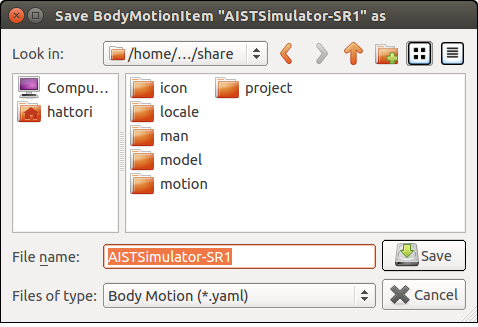

In this dialogue, you can specify where to save the file and the file name. In addition, there is a combo-box called "Files of type". Some Items can be saved in more than one file type. In that case, select the file type you desire in this combo-box.

Here, we choose to save in yaml format. Then, the file is saved as "AISTSimulator-SR1.yaml". This file can be loaded again by following "file" from Main Menu - "Load" - "Body Motion".

Besides, there is a menu "Export" as for file saving. "Export" is not different from normal saving in terms of saving in a file, saving in a file format not standard in Choreonoid is classified as "Export".  In case the file format you want to save in exists in "Export", it is possible to save the file in the desired format by running "File"Q from Main Menu and "Export Selected Item".

.. _basics_composite_item:

Complex Items
-------------

Data of some Items are contained as a sub-Item thereof. These items are called "Composite Items".

As an example of Item Class for Complex Item, there is BodyMotionItem type. It is an Item that contains the motion trajectory data of the robot, which was generated as "AISTSimulator-SR1" when running a simulation with SR1Walk sample, too. This Item actually consists of the following: (The texts in the parentheses represent the Item Class of each Item)

| + BodyMotionItem
|   + Joint (MultiValueSeqItem)
|   + Cartesian (MultiSE3SeqItem)
|   + Devices (MultiDeviceStateSeqItem)

Here, "Joint" is an Item containing the trajectory data of the joint angle, "Cartesian" contains the trajectory data of the link position and posture and "Devices" contains the input/output data of the devices. In addition, Data item containing  :ref:`legged_model_zmp`  trajectory, etc., if required.

These Items can be generated and used as stand-alone, but they constitute part of data of the Complex Item. These Items are called "sub-Items" of a Complex Item. An Item that has become a sub-Item cannot be separated from the Complex Item itself. 

So, when you want to move, read and save an Item in Item Tree, these operations should be done to the Complex Item itself. Then, the sub-Items are processed together with the Complex Item itself.

The merits of introducing a Complex Item are as follows:

* A more complex Item Class can be defined by combining the existing Item Classes.
* A function available to a sub-Item is also available to (part of the data of) the Complex Item.

Taking advantage of these merits, a new Item Class can be introduced more efficiently. In other words, developers will have less parts to newly implement and users will have to remember less new operations.

.. _basics_item_property:

Properties of Item
--------------------

An Item has some attributes accessible from :ref:`basics_mainwindow_item_property_view` .These attributes are called "Properties". Selecting one of the Items on Item Tree View, the list of the properties of the Item is displayed. For example, if you select "AISTSimulator" in SR1Walk sample, the list of the properties of AISTSimulator in Item Property View as illustrated below.

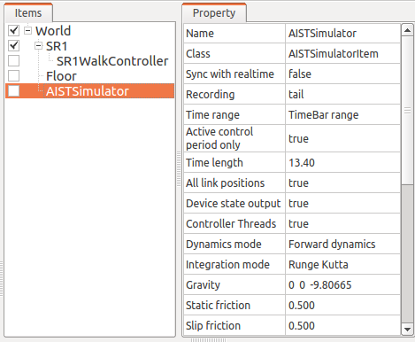

Some properties are only editable while others are user-configurable.For example, the second property in the above figure "Class" represents the Item Class of this Item, which is AISTSimulatorItem type. However, Item Classes cannot be changed after generation of the Item. On the other hand, the other properties are configurable by double-clicking on the property value (on the right column) in Property View.

For example, this Item has a property called "Gravitational acceleration", shows the three elements of the gravitational acceleration vectors. By double-clicking on this value, you can enter a value from keyboard as illustrated below.

Enter, for example, "0 0 0". It means that we set the gravity of the virtual world to zero gravity. If you do a simulation again in this status, the robot moves as if it were floating but attached to the floor.

In this example, we entered three elements because they are vectors, but how we configure values is different depending on the type of the property. For example, in case of turning On/Off the mode, a combo-box to select a Boolean value from true / false as shown in the following image. 

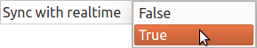

If the property requires to select more than two alternatives, then it shows a combo-box listing all alternatives.

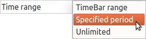

For a normal value (scalar value), you can use a spin box (a box for value entry having buttons to increment or decrement the value).

As for properties, it is an advantage that they can be operated for any Item Class via a unified interface called Property View. However, you have to be careful that all information of an Item are not necessarily viewed or edited as properties. Regarding motion trajectory data, for example, it is difficult to handle the trajectory itself as a property. So it is handled via another interface like Graph View.

As we mentioned in :ref:`basics_itemclass` ,Items have class inheritance relationships. As for properties, any property that is defined in the upper class is also valid in the lower class. Since the properties like "Name" and "Class" are defined for Item Class level, they are valid to all Items. Some properties related to the simulation of AISTSimulator Item are the properties defined for the upper SimulatorItem type and they are common to all Items that inherit SimulatorItem type.

.. _basics_project_save:

Save a Project
------------------

The current Item Tree status on Choreonoid and the data and the properties of each Item can be collectively saved as a project file. To do this, select "File" from Main Menu ‐ "Save Project As". Then, "Save Choreonoid Project File" dialogue pops up. There you can specify the directory and the file name to save the project file. A project file usually has an extension "cnoid".

.. note:: A project file does not store only the status of Items but also the status of most of Views and Tool Bars. When you load a project file, you can start working with the project again at almost the same point of status as the previous time.

If the current project was loaded from a project file, it can be overwrite saved by selecting "File" from Main Menu and "Save Project". This operation can be executed by pressing "Save Project" button in File Bar as shown in the following image.

.. note:: Choreonoid is still under development and may sometimes be frozen. So, we recommend you to press this button frequently while you are creating a project.

If you try to overwrite save when there is no original project file, the same operation as "Save As" is performed.

 project file is saved in the format of YAML. YAML is a format that describes structured information in a simple and highly-readable text file format. Though we skip a detailed explanation here, the employment of YAML format makes it possible to view and check a project file as a text file and edit it in the text editor relatively easily.

Note that all data of a project are not always stored in a project file but part of them are saved in a file and the other data take reference to that file in some cases. For example, Robot and Floor models in SR1Walk project are saved separately in :doc:`../handling-models/modelfile/index` and their file names only are described in the project file. Please be noted that it is necessary to manage the data stored in a separate file in order to record the total project.

.. _basics_layout_save:

Save Layout
----------------

Show/Hide of Tool Bars and Views and their layout can be saved in a project file, too. When you load a project file containing the layout information as saved, the saved layout is restored.

This is not performed by default. You can select "File" - "Project File Option" - "Layout" and check it to make it happen. Therefore, you should check this option in case the layout of Tool Bars and Views is important when you proceed with the project activities. Once you check this option, the setting is saved in :doc:`config` and it will be valid again when you start Choreonoid again.
