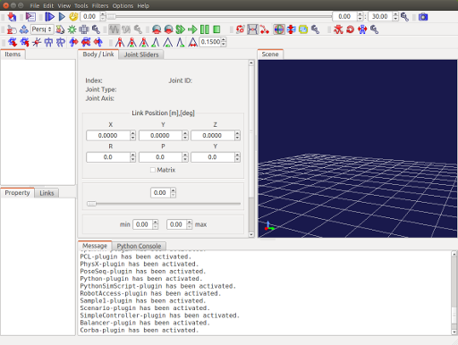

How to Start Up
===============

.. contents::
   :local:
   :depth: 1

Start Up from Command Line
---------------------------

In case of starting up Choreonoid with command line operations from a general terminal on an OS like Linux, enter the command "choreonoid", which is the execution file of Choreonoid. (Similar operations are provided also on Windows by using a system tool called "command product".)

This command is located in "bin" directory of the installation destination. If there is a path established, simply enter ::

 choreonoid

then, the system starts up.

Or in case Choreonoid is built from the source code, the execution file is generated in "bin" directory under the build directory. It is also possible to run that execution file directly. For example, in case of building directly under the source directory, start up Choreonoid through the operation as follows: ::

 cd [source directory]
 bin/choreonoid

When it starts up, the Main Window of Choreonoid that looks like as follows is displayed.

Start up from File Manager
----------------------------

The operations as above using command lines are not so normal on an OS like Windows. In that case, you can also execute Choreonoid from a file manager software product like Windows Explorer. Open the folder to install Choreonoid in the file manager and start up like double-clicking the execution file ("choreonoid" in case of Linux and "choreonoid.exe" in case of Windows) contained in bin directory

Start up from Application Menu
----------------------------------

In case of installing Choreonoid using the installer on Windows, Choreonoid is added as an item in Start menu. You can start Choreonoid from Start menu. Even if you use any other OS than Windows or you don't use the installer on Windows, you have only to register the above-mentioned Choreonoid execution file in the menu.

.. _basis_launch_projectfile:

Specifying Project File using Command Line Argument
---------------------------------------------------

It is also possible to read "Project" explained in : doc:`item` when Choreonoid starts up. To do this, specify "Project file" in the command line argument when starting up Choreonoid. For example, in case of reading the project file "project1.cnoid" located in the current directory: ::

 choreonoid project1.cnoid

You can specify it in this way. If you are familiar with command line operations, it is possible to read project files effectively in this way.

If the files with the extension "cnoid" are associated with the execution file "choreonoid" using the file association function of the OS, it is possible to start Choreonoid in the project file just by double-clicking it. Such association is actually provided when installing in case of using Windows installer.
