Screen Structure
================

In Choreonoid, different tools like "Bar" and "View" are allocated on the "Main Window" and you can freely configure the layout. This section describes how to configure and operate the screen.

.. contents::
   :local:
   :depth: 1

Main Window
-----------

The structure of "Main Window" to be displayed when Choreonoid is started looks like as follows:

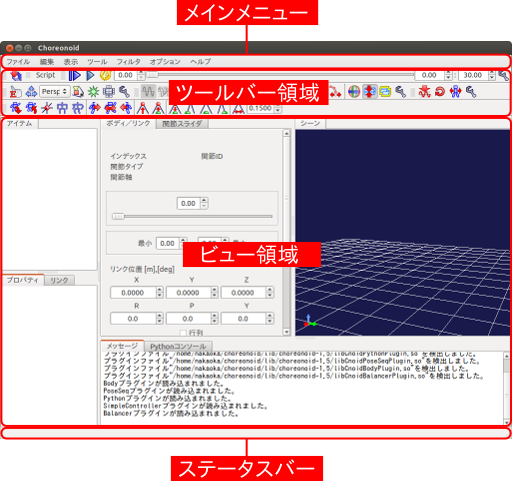

Basic operations like changes of the position and the size and minimizing and maximising of Main Window are operable according to the style of the window system of the OS.

The different components of "Main Window" are described in the subsequent sections.

Main Menu
---------

Different operations and configurations are accessible from Main Menu in a menu style. The menu items are grouped by category like "File", "Edit", "Tools", "Filter", "Options" and "Help". Note that, in Unity desktop environments like Mac OS X and Ubuntu, Main Menu is not displayed in Main Window but on the bar on the top of the desktop screen according to the style of the system.

Tool Bar
----------

Tool Bar is similar to any tool bar used in normal applications and has an interface where buttons are arranged in compact. By using Tool Bar, you can access to the frequently used operations easily. Tool Bars have one of the most basic interfaces in Choreonoid and different Tool Bars are arranged in the tool bar area on the top of Main Window.

In concrete terms, there is "Time Bar", for example.

This tool bar enables times-related operations on Choreonoid. By using this, it is possible to specify the temporal editing point of time-series data and play animation.

Choreonoid has other different tool bars.

View
------

"View area" is the area where the central GUI element of Choreonoid "View" is displayed. View is a panel-style area on which different data are presented and edited. Different types of views are available on Choreonoid and normally many views are arranged on View area to use. Some of the basic Views are listed below:

Item Tree View
~~~~~~~~~~~~~~
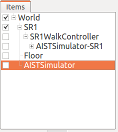

Data subject to an explicit operation on Choreonoid are normally managed as a "project item". As a view to do this, "Item Tree View" as depicted above is available. The details are described in  :doc:`item` .

.. _basics_mainwindow_item_property_view:

Item Property View
~~~~~~~~~~~~~~~~~~~

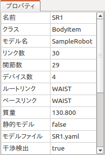

It is a view where you can view and edit :ref:`basics_item_property` . The list of the properties of the item selected in Item Tree View is displayed. It is also possible to enter a value by clicking on a configurable property.

Message View
~~~~~~~~~~~~~~~~

.. figure:: images/MessageView.png

Choreonoid are displayed. It can be used to check the operation status.

.. _basics_mainwindow_sceneview:

Scene View
~~~~~~~~~~~

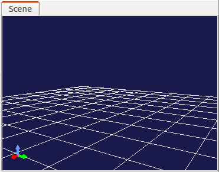

It is a view that displays different data with 3D computer graphics (3D-CG). A robot and environment models can be imaged on this view. Also, it is also possible to operate the target model on this view interactively. The details are described in   :doc:`sceneview` .

Status Bar
------------

Status Bar on the bottom of Main Window is the area where the content of the processing currently being executed on Choreonoid is informed in a simple message. The following messages are displayed there.

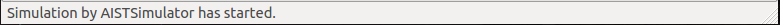

The area of Status Bar are separated into two parts. Basically, messages that inform the start and the end of a process are displayed on the left pane, while the right pane is a working view that displays the status of the object pointed at by the mouse cursor.

Switching of Views and Tool Bars
--------------------------------

You can place multiple Views and Tool Bars on Main Window of Choreonoid. However, if all Views and Tool Bars are displayed concurrently, some of them not actually in use are displayed and make the operation difficult and the sufficient size cannot be reserved for the those often used. Therefore, the display of Views and Tools Bars is switchable on Choreonoid. You can work comfortably by displaying only the views that are necessary for the current work using this function.

Switching of overlapped views
~~~~~~~~~~~~~~~~~~~~~~~~~~~~~

Multiple views can be overlapped in the same area. In this case, the list of the overlapped views is shown with tabs as depicted in the figure below. (* When tabs are not displayed, press F12 to show them.)

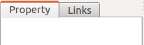

As you can imagine, by clicking a tab, you can bring the view to the front. A view not used so frequently but should be available from time to time can be placed in the back of the other views and you can simply use the tab to bring it to the front.

For how to change the overlapped tabs, the description is provided in  :ref:`basics_modify_layout` below.

.. _basics_show_hide_views:

How to Show/Hide Views
~~~~~~~~~~~~~~~~~~~~~~

When you select "Display" and "Display View" from Main Menu. The following Menu shows up.

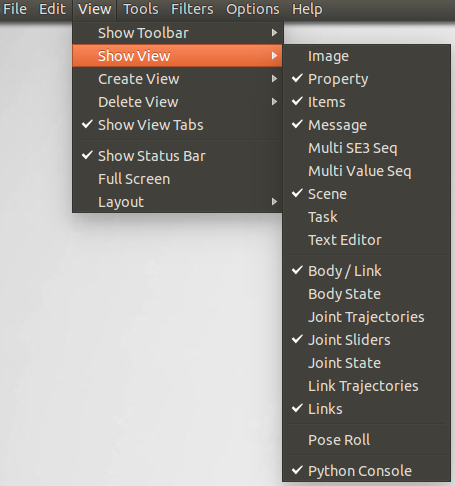

What is displayed here is a list of the views currently available on Choreonoid. The checked views (including those overlapped with tabs) are those displayed already and those unchecked are the views not displayed yet. By selecting a view, the check status of the view changes and you can show/hide views. When you show a hidden view, it is shown as overlapped on one of the views already displayed,

Note that a view not displayed yet is not internally generated yet and a view is generated when displayed. Once displayed, a view is not internally displayed by hiding it. When it is re-displayed, the status when it was displayed is retained.

Such internal generation/deletion can be explicitly ordered through "Generate View" and "Delete View" menus. These operations are used normally when you generate and display many views of the same type.  For example, :ref:`basics_mainwindow_sceneview`  supports this function and it is possible, using "Generate View", to display many Scene Views at the same time and display each of them in different viewpoints and imaging methods. Using "Delete View", a view is hidden and internally deleted. When a generated view becomes no longer necessary, you can use this menu to delete it completely.

.. _basics_show_toolbar:

How to Show/Hide Tool Bars
~~~~~~~~~~~~~~~~~~~~~~~~~~

Tool bars can be shown/hidden by selecting "Display" and "Display Tool Bar" from Main Menu.

.. _basics_modify_layout:

Change of Layout
----------------

The layout of Views and Tool Bars can be freely changed. The layout you prefer can be realised so that it fits to the work you are engaged in.

How to Change View Layout
~~~~~~~~~~~~~~~~~~~~~~~~~

The layout of View can be configured by performing

* :ref:`basics_view_split_position`
* :ref:`basics_view_tab_position`
* :ref:`basics_view_move`

and other operations in combination.

.. _basics_view_split_position:

Change of boundary line
'''''''''''''''''''''''
You can change the size of the Views by dragging the boundary between the views adjacent to each other. For example, two view areas are allocated side by side in the following illustration:

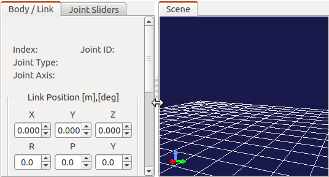

When you place your mouse cursor on the boundary between the areas, the cursor changes into an arrow as illustrated here. When the mouse cursor becomes an arrow, you can move the boundary to the right or the left by dragging it with the left button of your mouse pressed continuously. As a result, the size allocation can be changed. In addition, by dragging the boundary to either of the side, you can completely close one of the areas. Even in this situation, the boundary itself remains. So, you can re-display the area by dragging it. The above operations can be used for those areas that are allocated vertically.

.. _basics_view_tab_position:

Change of tab position
''''''''''''''''''''''
In an area where views are overlapped, you can change the order of the tabs by dragging them.In the example below, the order of the two tabs can be switched by dragging the tab in the left to the right.

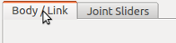
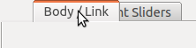
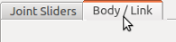

This operation only changes the order of the tabs visually. However,  for example, in case of processing a series of data one by one in the overlapped multiple views, it would be convenient to re-arrange the order of tabs in the order of the data.

.. _basics_view_move:

How to Relocate Views
'''''''''''''''''''''
By dragging the tab of a view beyond the tab area, you can relocate the view in a newly split area or, additionally, make it independent of Main Window.

When you drag the tab of a view, the mouse cursor will change into a hand-shaped icon, showing that the view is being dragged. When you move the mouse cursor to the centre of the view you want to relocate as illustrated below, dotted lines surrounding the view area is displayed. (In the real screen, black-and-white dotted lines are displayed.) When you finish dragging at this point, the view is relocated as overlapped on the area.

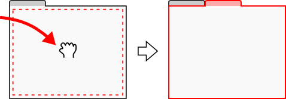

Also, when you drag it close to the edge of the moved-to view area, the view is relocated as if inserted in a new area adjacent to the edge. For example, if you drag it to the right end of the view area, the area is split as shown in the figure below and the view surrounded by the red lines is inserted in the right area.

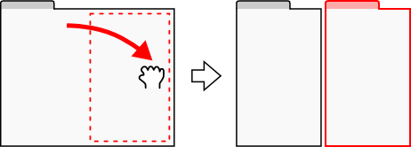

Areas are split in a similar way for the other edges as shown in the following figure.

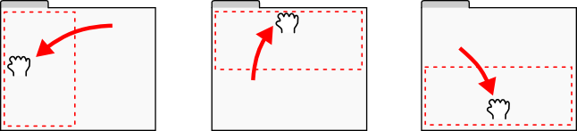

You can also relocate a view so that the entire area of Main Window is split. For example, if you drag a view to the upper side of the entire view area, the area is split as illustrated below and the view is inserted in the part surrounded by the red lines.

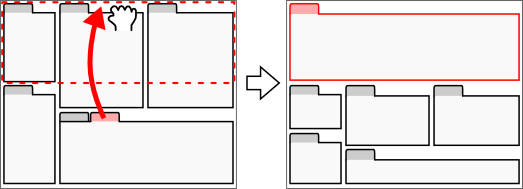

In the same way, a view can be relocated to another area as illustrated in the figure below:

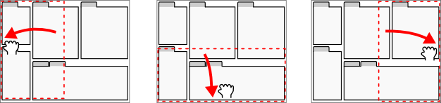

By dragging a view beyond the the entire view area, you can make it a new window independent of Main Window.

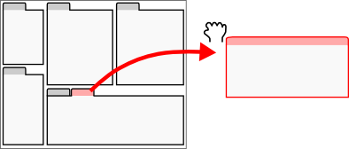

Any window of an independent view can also be used as a moved-to window of another view. By doing so, it is possible to make available a new window in which multiple views are allocated independently of Main Window. This operation can be utilised when using multi-display. It is also possible to move the independent view back to Main Window by dragging it back.

However, the tab is not displayed immediately after a view is made independent and the internal view cannot be dragged. In this case, the tab can be displayed by pressing F12 and then the view can be relocated to another area.

Change of Tool Bar Layout
~~~~~~~~~~~~~~~~~~~~~~~~~~

The position of each tool bar in the tool bar area can be changed by dragging the tool bar.

The part surrounded by the red lines in the figure below is a handle to drag the tool bar.

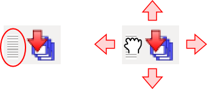

When you place your mouse cursor on it, the cursor becomes a hand-shaped icon. By dragging in this state, you can move the tool bar up and down and right and left. Even if there is another tool bar in the right or left, you can switch the positions of the tool bars by continuing to drag. For up and down, even if there is any more tool area, the vertical area will be expanded so that the tool bar can be moved there.

How to Expand View Area
------------------------

When the number of the tool bars and the view that are displayed concurrently increases, it becomes difficult to allocate enough area to all the views depending on the size of the display. In that case, it is necessary to show as few tool bars and views as possible. By manipulating as follows, it is possible to expand the view area.

First, by selecting "Full screen", the areas allocated for the title bar of Main Window and the management area for Windows system will become available and the display area can be slightly expanded. You can switch to Full screen by selecting "Display" then "Full screen" or by pressing F11 key.

You can also show or hide the tabs to select a view by selecting "Display" then "View tabs" or by pressing F12. When you hide the tabs, you cannot switch among the overlapped views, but you can also use the area allocated for the tabs unless you need to switch among the views for the time being.

Furthermore, it you uncheck "Display" -> "Display Status Bar", the status bar is hidden and the area allocated for it can be freed.

