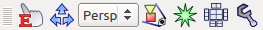

Displaying a Scene
==================

.. contents::
   :local:
   :depth: 1

Scene and Scene View
--------------------

In Choreonoid, information that can be displayed by three-dimensional computer graphics (3DCG) is called "Scene". Information handled as a scene includes robot and environment models and a virtual world containing multiple such models.

As a view to display a scene, the "scene view" is provided. The view enables you to visually check the conditions of models, such as robot model and environment model, through 3DCG. The scene view can also be used as an interface to edit a scene.

This section describes how to perform basic operations related to displaying a scene using the scene view.

Empty Scene and Coordinate System
---------------------------------

The default scene view is as shown below.

.. figure:: images/SceneView.png

A set of three arrows displayed at the bottom left of the view represents the coordinate system for the three-dimensional space viewed from the current viewpoint. The red, green, and blue arrows correspond to X, Y, and Z axes, respectively (RGB = XYZ). Choreonoid assumes that the positive direction of the Z-axis is the upward vertical direction, and the scene view provides a display/operation system based on that assumption. This is a relatively general method to set a coordinate system in robotics. However, a coordinate system where the positive direction of the Y-axis is the upward vertical direction is also common (especially in the field of CG). So, be careful that the former is different from the latter.

The wire grid frame represents the surface where Z = 0. Since you often assume a floor surface of Z = 0 when handling a robot model, the surface corresponding to it is displayed by default.

The following display items can be turned on/off using the settings dialog described later.

Supported Items
---------------

In Choreonoid, many pieces of the information that can be handled as a scene are defined as items. The following table lists some of these items.

.. tabularcolumns:: |p{3.0cm}|p{12.0cm}|

.. list-table::
 :widths: 22,78
 :header-rows: 1

 * - Item Class
   - Overview
 * - BodyItem
   - Item corresponding to a robot or environment model (Body model). The shape and posture of the model is displayed as a scene.
 * - WorldItem
   - Item that compiles multiple Body models into a virtual world. The collision information between models is displayed as a scene.
 * - SceneItem
   - Item specialized for the purpose of display as a scene. This item is used to simply view 3DCG data or to arrange the appearance of the scene.
 * - PointSetItem
   - Item to store and display point cloud data.

Besides these items, some of the items that are added by plugins may be able to be displayed as scenes.

Displaying Supported Items
--------------------------

A basic way to display an item supported for scene display in the scene view is to select the checkbox for the item in the item tree view.

For example, the item tree view for the "SR1Walk" project, which was introduced in :doc:`item` above, is as shown below.

.. figure:: images/ItemTreeView.png

Since the checkbox for "SR1", which is of BodyItem type, is selected here, the model of this robot is displayed in the scene view.

.. image:: images/SR1Walk_scene.png

However, when the checkbox is deselected, the displayed robot also disappears. In addition, "Floor" is also of BodyItem type in this project, and selecting the corresponding checkbox displays the model of the floor.

.. _basics_sceneview_scenebar:

Scene Bar
----------

The "scene bar" as shown below is provided as a toolbar to assist in scene view operations.

_images/SceneBar.png 

The following lists the functions of the bar in the order from the left:

* Edit mode switching
* Viewpoint operation mode switching
* Drawing camera selection
* Viewpoint restoration
* Collision line display
* Wire frame display
* Settings dialog
		      
The following describes how to use these functions.

.. _sceneview_editmode:

View Mode and Edit Mode
-----------------------

There are two modes for operations on the entire scene view: "view mode" and "edit mode".

The view mode is a mode to view the model and data displayed in the scene view. In this mode, you mainly perform an operation to change the viewpoint while displaying a model and data simply.

The edit mode is a mode that allows you to edit the model and data displayed in the view. For example, you can change the posture by dragging the model with the mouse.

The view mode is active immediately after Choreonoid starts up. You can switch the mode in any of the following ways:

* Click the "edit mode switching button" on the scene bar. When this button is off, the view mode is active. When it is on, the edit mode is active.
* Press the ESC key while the focus is on the scene view. (The mode changes every time you press the key.)
* Double-click on the scene view. (However, double-clicking in edit mode may be assigned to another operation.)

You can determine the current mode by checking whether the "edit mode switching button" on the scene bar is pressed. In addition, a marker or other indications may be displayed on the model for edit in edit mode. You can also determine the mode from such indications.

Since specific edit operations depend on the model and data to be edited, this section does not describe them in detail. ( :doc:`../handling-models/index` - :doc:`../handling-models/pose-editing`  describes operations performed on a robot model.) The following mainly describes operations performed in view mode.

Changing the Viewpoint
----------------------

In view mode, you can change the viewpoint by operating the mouse in the scene view. Mouse operations correspond to viewpoint elements to be changed in the following way:

* Left button drag: Viewpoint rotation
* Center button drag: Viewpoint translation
* Wheel: Viewpoint zoom (back-and-forth movement)

The behavior of any of these operations is designed to vary depending on the position the mouse cursor points to in the scene view when the operation is performed. The sight line is changed according to the position.

The viewpoint rotation operation is performed by using the position the cursor points to when drag starts as the rotation center. For example, if you start dragging from the tip of the right hand of the SR1 robot, the viewpoint changes using the tip of the right hand as the center (while the position of the tip of the hand does not change on the screen), and in the case of the left hand, the left hand is used as the rotation center. Try this out.

The viewpoint translation operation translates the viewpoint from the position the cursor points to when drag starts to the position of the cursor when the drag ends. This is effective for display in perspective using the perspective camera described later (default). In this case, the amount of movement is less when the cursor points to a closer object, and it is greater when the cursor points to a farther object.

Also, as for viewpoint zoom, the amount of zoom (back-and-forth movement) is less when the cursor points to a closer object, and it is greater when the cursor points to a farther object.

When the mouse cursor points to an empty part of the scene, an operation is performed according to the part the cursor previously pointed to.

Click the "viewpoint restoration button" on the scene bar to adjust the translational position and zoom to make all the objects in the scene visible without changing the direction of the viewpoint. This is useful when you are not sure what you are looking at while performing such a viewpoint change operation.

Modifier Keys for Viewpoint Change
----------------------------------

The following modifier key operations can be performed for viewpoint change:

* Shift key + rotation operation: Snaps the viewpoint direction to each axis. Use this operation when you want to acquire an image viewed from just beside or directly above.
* Shift key + zoom operation: Reduces the change in the amount of zoom. Use this operation when you want to change the zoomed position finely.
* Ctrl key + translation operation: Performs the zoom operation. Use this operation when you want to change the zoomed position continuously.

The space key can be used instead of the center button to perform an operation involving the center button in an environment that lacks the center button. However, note that the keyboard focus must be placed in the scene view to allow space key input.

First-Person Viewpoint Change Mode
----------------------------------

The viewpoint change operations described above are focused on an object in the scene view, for example, rotation centering on an object pointed by the mouse. On the other hand, an operation system focused on the viewpoint is also provided, which is called the "first-person viewpoint change mode". To switch to this mode, perform either of the following operations:

* Turn on the "viewpoint operation mode switching button" on the scene bar.
* Press the "1" key on the keyboard while the focus is on the scene view. (To return to the default mode, press the "3" key.)

In this mode, the viewpoint rotation and translation operations change in the following way:

* Rotation: The viewpoint is always used as the center of rotation regardless of the position of the mouse cursor.
* Translation: Movement is made in the direction of mouse drag.

This "first-person viewpoint change mode" is useful when, for example, you view the inside of a building as if you enter and search the building.

.. _basics_sceneview_change_camera:

Changing the Drawing Camera
---------------------------

In the scene view, a scene image is drawn by using a virtual camera. You can acquire an image with a perspective or viewpoint different from the default by switching the camera.

You can switch the camera using the "drawing camera selection combo box" on the scene bar. Click the combo box to display a list of available cameras, and select one from the list.

The "Perspective (perspective projection)" camera is selected by default. With this camera, you can acquire a perspective image.

On the other hand, when "Orthographic (orthographic projection)" is selected, you can acquire an orthographic image in which perspective is eliminated. This is useful when, for example, you want to know the shape and dimensions precisely.

Be careful in that the zoom operation differs slightly between the perspective camera and the orthographic camera. While the zoom operation with the perspective camera moves the position of the camera back and forth, the operation with the orthographic camera zooms in and out the field of view without changing the position of the camera. With the orthographic camera, you may not be able to display the entire object you want to view, depending on the front-back position of the camera. In that case, switch to the perspective camera to change the front-back position of the camera (move the camera backward) by the zoom operation, and then switch to the perspective camera again.

The above two cameras are provided by default. If a scene contains any additional camera, the camera can also be selected. For example, if a model of a robot with a camera mounted is added to a scene, the camera can also be selected. This enables you to acquire an image from the viewpoint of the camera mounted on the robot. In addition, when the robot moves, the image in the scene view changes accordingly. In this case, however, the viewpoint cannot be changed by a regular mouse operation in the scene view because the position of the robot determines the viewpoint.

.. _basics_sceneview_wireframe:

Wire Frame Display
------------------

Turn on the "wire frame display button" on the scene bar to draw a scene using a wire frame. This is useful when you want to view the polygonal configuration of the model or overlapping between objects. There are some other elements that change the scene drawing method. You can set them in the settings dialog described below.

.. _basics_sceneview_config_dialog:

Settings Dialog
--------------

There are other configurable settings for the drawing method and behavior of the scene view. Click the "settings dialog display button" on the scene bar to display the dialog where you can configure the settings in detail. The following table provides an overview of main setting items that are accessible from the dialog.

.. tabularcolumns:: |p{4.0cm}|p{11.0cm}|

.. list-table::
 :widths: 35,65
 :header-rows: 1

 * - Item
   - Description
 * - Viewing angle
   - Sets the viewing angle of the perspective camera. The greater the value is, the wider the angle.
 * - Clipping depth
   - Sets the front-back range of drawing, as viewed from the viewpoint. If there is no problem with drawing, you do not need to set a specific value.
 * - Lighting
   - Turns on/off shading by lighting.
 * - Smooth shading
   - Turns on smooth shading. When this setting is off, flat shading is applied.
 * - Headlight
   - Turns on the light that always comes from the viewpoint position.
 * - World light
   - Turns on/off the light fixed to the scene (that normally comes from above).
 * - Additional light
   - Turns on/off the light that the model loaded into the scene has, if any.
 * - Background color
   - Sets the color for the area of the scene where no objects are present.
 * - Floor grid line display
   - Specifies whether to display floor grid lines, and sets the size, color, etc. of the grid.
 * - Texture
   - Turns on/off texture display.
 * - Default color
   - Sets the color for drawing objects with no specified color.
 * - Default line width
   - Sets the default line width for line drawing.
 * - Default point size
   - Sets the default point size for point drawing.
 * - Normal line display
   - Displays the normal line of each point in the polygon. You can also sets the length of the normal line.
 * - Coordinate axes
   - Turns on/off the coordinate axes displayed at the bottom left of the scene view.
 * - Frame rate display
   - When this setting is on, the drawing frame rate is displayed at the top left of the scene view. Click the "test" button to test at what frame rate the current scene can be displayed.

The following setting items are also provided:

* Perform point rendering in wire frame mode

 Enables point rendering when "wire frame display" on the scene bar is turned on.

* Perform double rendering when a new display list is generated

 This is an option to avoid video driver bugs. The bugs may be able to be avoided by selecting this checkbox when a newly added object does not immediately appear.

* Use OpenGL pixel buffer for picking

 This is an option for debugging.

* Add checkboxes dedicated for selecting target items to the item tree view
 
 You may want to create multiple scene views and display different objects in each view. In that case, select this checkbox to display checkboxes dedicated to the target scene view on the right of the item tree view. Use them to turn on/off display in the scene view. If there are multiple scene views, the target view of the settings dialog will be the scene view that is focused last when the dialog appears.

Saving the State and Settings of the Scene View
-----------------------------------------------

As described in :ref:`basics_project_save` , the state and settings of a view are saved to the project file when the project is saved. The viewpoint position and various settings of the scene view are also saved at the same time as the project is saved, and are restored to the same state at the next load time.
