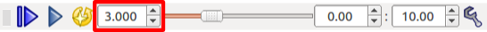
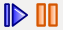
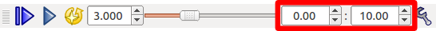
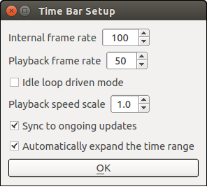

Time Axis Operations
====================

.. contents::
   :local:
   :depth: 1

Virtual Time and Time Bar
-------------------------

In Choreonoid, a virtual time axis is set, and users can change the current time on the axis. This enables you to change the display position (time) of data with a temporal extent or to display an animation according to such data.

The following "time bar" is provided as a toolbar used to perform these time axis operations.

.. image:: images/TimeBar.png

This section describes time axis operations, focusing on operations on this time bar.

Sequence Data
----------------

Time axis operations can be performed on data with a temporal extent, which is collectively called "sequence data". In Choreonoid, many pieces of sequence data are also defined as items. The following table lists some examples of specific sequence data items.

.. tabularcolumns:: |p{4.0cm}|p{11.0cm}|

.. list-table::
 :widths: 30,70
 :header-rows: 1

 * - Item Class
   - Overview
 * - MultiValueSeqItem
   - Item that stores multiple pieces of sequence data of floating-point scalar values. This item is used to store the joint angle trajectories of the robot.
 * - MultiSE3SeqItem
   - Item that stores multiple pieces of sequence data of three-dimensional positions and postures. This item is used to store the position and posture of each part (link) of the robot.
 * - Vector3SeqItem
   - Item that stores sequence data of three-dimensional vectors. This item is used to store the trajectories of the center of gravity, ZMP. etc.
 * - BodyMotionItem
   - Item that stores the motion trajectories of the :doc:`../handling-models/bodymodel` . This item stores the motion patterns, simulation results, etc. of the robot. It is defined as a :ref:`basics_composite_item` consisting of MultiValueSeqItem, MultiSE3SeqItem, Vector3SeqItem, etc.
 * - PoseSeqItem
   - Item that stores the key pose sequence. This item is used for choreographing the motion of the robot.
 * - AudioItem
   - Item that stores audio data.
 * - MediaItem
   - Item that stores media data, such as video.

To try the time bar operations described below, prepare some sequence data items beforehand. For example, as introduced in Example of the SR1Walk Project, load the SR1Walk project and press the simulation start button to generate simulation results as an item named "AISTSimulator-SR1". Because this is an item of the above BodyMotionItem type, time axis operations can be performed on this item.

Associating Sequence Data
--------------------------

When you display sequence data, you may directly display sequence data itself or update other data with sequence data contents at a given time and then indirectly check the sequence data contents through that data.

As for motion trajectory data, for example, the former case includes displaying the robot's motion trajectory itself using a graph, etc. and displaying the numerical values of joint angles, etc. of the motion trajectory for each instant of time. On the other hand, the latter case includes displaying the posture of the robot by applying the conditions of joint angles, etc. of the motion trajectory for each instant of time to the model of the robot.

In either case, how the data is displayed depends on the item and view types. However, some form of association between data must be ensured beforehand in the latter case.

Normally, data is associated by using the item tree structure. Items of the BodyItem type and BodyMotionItem type correspond to a robot model and motion trajectory data, respectively. To associate them, the BodyMotion item should be a child item of the Body item.

For example, the item tree in an SR1Walk simulation is as shown below.

.. image:: images/ItemTreeView.png

In this tree, the simulation result "AISTSimulator-SR1" is generated as a sub-item of "SR1". This means that they are associated with each other.

When you create or load data on your own, allocate each item in such a way that a tree structure for association like this is achieved.

Selecting Sequence Data
------------------------

Before displaying sequence data, regardless of directly or indirectly, you must select the data item you want to display from the item tree view. If there are multiple candidate data items, this is a required operation to determine which item to display actually.

Even in the case of a BodyMotion item, the item must be selected beforehand. Be sure to perform the operation.

.. note:: As for simulation results, selecting an item of the SimulatorItem type (item named "AISTSimulator" in the SR1Walk sample) has the same meaning as selecting all the BodyMotion items of the simulation result. (This is the default state immediately after simulation.) In this case, even when there are multiple models included in the simulated virtual world, selecting only one simulator item displays the motion results of all the models. Therefore, you can normally display the simulation results only by performing this selection operation.

Displaying and Changing Time
----------------------------

The current virtual time in Choreonoid is displayed in the following field of the time bar. The unit is normally "seconds".

In addition, this field allows you to enter a value. You can change the current time by entering a value. You can also change the numerical value in steps by clicking an arrow button of the input box or pressing the up- or down-arrow key on the keyboard.

Time Slider
------------

The position of the following time slider roughly shows you the current time.

.. image:: images/timeslider.png

In addition, you can change the current time continuously by dragging the slider with the mouse. The sequence data display also refreshes continuously according to this operation. Thus, if the contents of the sequence data vary from one instant in time to another, the corresponding contents are displayed as animations. Therefore, the time slider also works as an interface to manually display animations.

Playing Animations
------------------

You can automatically play animations by using the following buttons of the time bar.

.. image:: images/play_buttons.png

Although both the two buttons are used to start animations, the left button starts playing from time 0 (to be exact, from the minimum time in the :ref:`basics_timebar_range` ), regardless of the position of the current time. The right button starts playing from the current time.

During playing, the current time is updated at a constant speed, and you can view animations with the same time course as in the real world.

While animations are being played, the right button takes the form of the "stop play" button as shown below.

Click this button to stop the playing. When playing stops, the icon and function of the button return to those of the start play button.

Note that the functions of the above two play buttons are assigned to the "F5" and "F6" keys, respectively, for use as shortcut keys.

.. _basics_timebar_range:

Time Range
----------

You can set the time range handled by the time bar in the following numerical value input boxes.

The left box is for the minimum time and the right box is the maximum time. The relationship between the position and time of the time slider also depends on this range. If the sequence data to be handled has a long time length, set a longer time range accordingly. However, if the set time range is too long, the valid range on the time slider becomes narrow and it becomes hard to perform cueing and animation operations using the slider. Therefore, it is recommended to specify an appropriate range for the target data.

Settings Related to the Handling of Virtual Time
--------------------------

The time bar provides the following "setup" button.

.. image:: images/timebar_config.png

Click this button to display the following settings dialog, where you can configure settings related to the handling of virtual time.

The following table lists the setting items.

.. tabularcolumns:: |p{4.0cm}|p{11.0cm}|

.. list-table::
 :widths: 30,70
 :header-rows: 1

 * - Item Name
   - Setting Description
 * - Internal frame rate
   - Sets the time resolution used for internal processing in Choreonoid. This value is used as the delta time in kinetics simulation, frame rate for the motion trajectory generated by keyframe interpolation, etc.
 * - Playback frame rate
   - Sets the frame rate for playing animations. Even if the frame rate of the target data is finer than this setting, animations are played at this resolution. (However, this is the maximum frame rate value, and the actual frame rate may be lower than this value depending on the time taken for processing of drawing, etc.)
 * - Idle loop drive mode
   - When this mode is on, extra CPU power is used to improve the frame rate at the time of playing animations, regardless of the playback frame rate setting.
 * - Playback speed magnification
   - Sets the speed magnification to be applied to animation playback in comparison with the actual time. The default 1.0 means that playback is performed at the same speed as in the real world. When a value of 2.0 is set, it is performed at double speed.
 * - Synchronize with ongoing update 
   - Playback is performed in synchronization with the update speed of the target sequence data, regardless of the playback speed magnification. For example, when a motion trajectory that is being updated in a simulation is being played, the playback is performed in synchronization with the computational speed of the simulation.
 * - Automatically extend time range
   - When the maximum time is reached during animation playback, the animation continues with the maximum time being updated.
