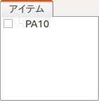
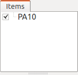
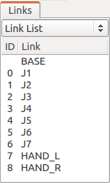
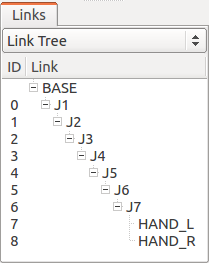
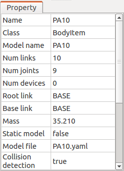

Body Model
==========

.. contents::
   :local:
   :depth: 1

Body Model and Body Item
------------------------

For a computer to perform various calculations related to a robot, it requires a model created from data, such as the shape, physical characteristics, etc. of the robot or environmental object. In Choreonoid, this model is called the "Body model". This corresponds to the "Body" class defined as a C++ class in the "Body library" used by Choreonoid.

The "BodyItem" type item (Body item) is defined to access the Body model from the Choreonoid GUI. Many of the robot operations in Choreonoid are performed through this item.

A Body item is normally generated by loading the :doc:`modelfile/index` in which the model of a robot or environmental object is written.

.. _bodymodel_samplemodels:

Sample Models
--------------

The following sample models, which come with Choreonoid as standard, are stored under the "model" directory of the share directory. It is recommended to confirm how to operate a model by loading these models first.

.. tabularcolumns:: |p{2.0cm}|p{3.5cm}|p{9.0cm}|

.. list-table::
 :widths: 15,25,60
 :header-rows: 1

 * - Model
   - File
   - Overview
 * - box1
   - misc/box1.wrl
   - Rectangular rigid body
 * - SR1
   - SR1/SR1.yaml
   - Sample of a simple biped robot model
 * - GR001
   - GR001/GR001.yaml
   - Model of the biped robot "GR001" manufactured by HPI
 * - PA10
   - PA10/PA10.yaml
   - Model of the manipulator "PA10" manufactured by Mitsubishi Heavy Industries, Ltd.
 * - Crawler
   - misc/crawler.wrl
   - Model of a simple crawler type mobile robot
 * - Tank
   - misc/tank.wrl
   - Sample of a tank type model
 * - floor
   - misc/floor.wrl
   - Floor model

.. _loading_model:

Loading a Model
----------------

Load a model file by selecting the main menu "File" - "Load" - "OpenHRP Model File". When this menu is executed, a file load dialog appears. Select the model file. When the file is loaded successfully, a Body item with the name of the loaded model is generated.

For example, load the "PA10" model, which is one of the sample models. Select "PA10.yaml" in the PA10 directory from the model file load dialog. When the file is loaded normally, the model name appears in the item tree view as shown below.

At this time, the following message is output in the message view. ::

 Loading OpenHRP model file "/usr/local/share/choreonoid-1.5//PA10/PA10.yaml"
 -> Completed!

If the model file has an error, an error message is output instead. Check the contents of the file.

.. note:: Select the Body item in the item tree view and press Ctrl + R to reload the Body item. Since this operation immediately reflects the reloaded model in the GUI, it is useful when, for example, you edit a model file.

Display in the Scene View
-------------------------

You can display a model loaded as a Body item by 3D graphics in the scene view. To do this, select the checkbox for the Body item you want to display from the item tree view.

For example, as shown in the figure, select the checkbox for the PA10 item to display the PA10 model.

Then, the CG of the PA10 model appears in the scene view.

.. image:: images/pa10scene.png

If you do not want to display the model, simply return the checkbox for the item to the deselected state.

.. _model_structure:

Structure of a Model
--------------------

In robotics, individual parts (rigid bodies) constituting a model are generally called "links". There are two types of models: one made up of a single link and the other made up of multiple links (multi-link model).

A model that can be considered as a single rigid body normally has a single link. For example, "box1", which is the sample model of a box, is a model of such type.

Normally, robots are multi-link models. The links of a multi-link model are connected by "joints", and the model can take various postures by moving the joints.

You can check the structure of a model using the "link view". Since display in the link view corresponds to the currently selected Body item, select the Body item of the model whose structure you want check from the item tree view first. For example, select the Body item of PA10 to display the link view as shown below.

As shown in the figure above, the PA10 model consists of the 10 links "BASE" to "HAND_R". Further, "J1" to "HAND_R" are links that also work as joints. The numbers displayed under "ID" are the identification numbers of the joints, showing that there are nine joints from 0 to 8. This display does not clearly show the connection relationship of the joints. However, you can check the relationship by changing the value of the combo box at the upper part of the link view from "Link List" to "Link Tree" to obtain the following display.

The parent-child relationship in this tree shows that joints exist between the parent and children. You can see from this display that the PA10 model has the links "BASE" to "J7" connected in series and "HAND_L" and "HAND_R" at the bottom are both links connected to "J7". Like "BASE" in this example, a link that is the root of the tree is called the "root link".

.. note:: As shown above, the structure of a multi-link model can basically be represented by a tree. However, if the model contains a closed loop structure, it cannot be represented by tree only. Be careful that Choreonoid does not currently support models containing a closed loop structure in a complete manner.

Body Item Properties
------------------------

When a Body item is selected, a list of the properties of the selected Body item is displayed in the property view. In the case of PA10, the following list should be displayed.

There are the following items specific to the Body item. You can check the overview of the model or change the edit method by using them.

.. tabularcolumns:: |p{3.5cm}|p{11.5cm}|

.. list-table::
 :widths: 25,75
 :header-rows: 1

 * - Property
   - Meaning
 * - Model name
   - The name of the model. Although you can arbitrarily set an item name to distinguish the individual actual state of the model, the same model always has the same model name because the model name identifies the type of the model.
 * - Number of links
   - The number of links the model has.
 * - Number of joints
   - The number of joints the model has.
 * - Number of devices
   - The number of devices (various sensors, lights, etc.) the model has.
 * - Root link
   - The name of the root link. 
 * - Base link
   - Shows the link used as the base of a posture change operation.
 * - Mass
   - The total mass of the model.
 * - Static model
   - Set to "true" for a model that does not move at all (fixed to the environment and has no movable joints).
 * - Model file
   - The file name of the model file. 
 * - Collision detection
   - Shows whether to detect collision with other objects.
 * - Self-collision detection
   - Shows whether to perform self-collision detection.
 * - Editable
   - Shows whether the position and posture can be edited in a scene view.
