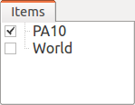
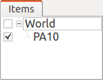
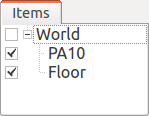
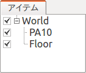
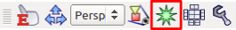
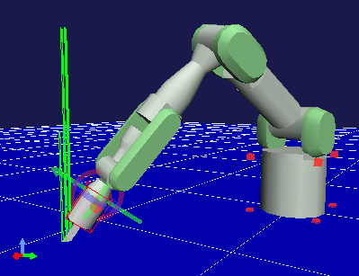
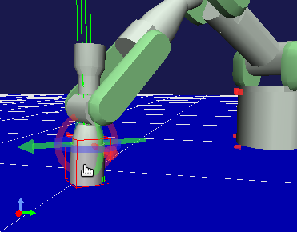
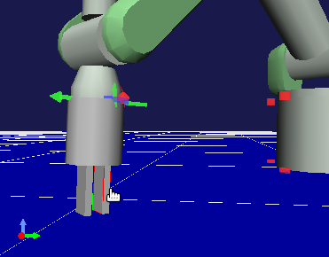
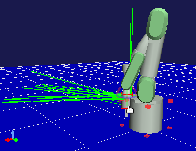
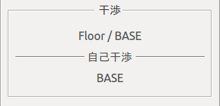

Collision Detection
===================

Sometimes a link collides (conflict) with another link while you are moving a model. Choreonoid provides a function to detect such collision. This section describes how to use the function.

.. contents::
   :local:
   :depth: 1

.. _model_collision_and_worlditem:

Collision Detection and World Item
----------------------------------

To detect collision, you must first install an item of the "WorldItem" type (World item).

The World item is an item representing one virtual world in Choreonoid. This item enables you to perform the following operations:

* Connecting a Body model to a virtual world
* Configuring settings for a virtual world as a whole
* Handling multiple virtual worlds at the same time

Some other operations can also be performed.

For collision detection, you must specify:

* Between which objects collision is to be detected.
* How the collision detection result is to be displayed.

It is reasonable to associate these settings with a virtual world. Therefore, configure collision detection settings through a World item.

Creating a World Item
-------------------

You can create a World item using the procedure for creating a normal item. Specifically, select the main menu "File" - "New" - "World" and click the "Generate" button in the "Generate New World Item" dialog that appears.

Associating a Body Model
------------------------

A World item only make sense if a Body model is associated with it. Associate a Body item with a World item by allocating the Body item as a sub-item of the World item.

Try to perform this operation using the PA10 model, which we have been used. Create the above World item in the state in which the PA10 is loaded. Then, the two items should be displayed in a row in the item tree view.

Drag "PA10" onto "World" by following the description in :ref:`basics_itemtree_management` - :ref:`basics_item_move` to move PA10 to make it a sub-item of World as shown in the figure below.

This means that the PA10 model is associated with the "World" virtual world.

.. note:: If you generate a World item when "PA10" is selected, the generated World item is allocated as a sub-item of PA10, resulting in a parent-child relationship that is inverse of the one in the above example. In this case, temporarily drag the World item to the empty area at the lower part of the item tree view. This makes the World item no longer be a sub-item of PA10. Then, perform the above operation.

.. note:: If you create a World item and load a Body model in the state in which the World item is selected, the model is loaded as a sub-item of the World item from the first. You can make operations more efficient in this way when creating a project with a World item installed from scratch.

Associating Multiple Body Models
--------------------------------

Normally, you associate multiple Body models with a virtual world. In this case, there is no problem if multiple Body items are simply allocated as sub-items of the same World item.

Try to add the model of the floor from :ref:`bodymodel_samplemodels` , in addition to the PA10 model, which was added earlier. Load "misc/floor.wrl" from the share directory and associate it with the same World item. The item tree should be as shown in the figure below.

Try to display the model of the floor in the scene view by selecting the Floor checkbox as shown in the figure. When you set PA10 to the standard posture, the following scene should be displayed.

.. image:: images/pa10_floor_scene.png

The following describes an example of collision detection by detecting and displaying collision between the PA10 and floor models.

Collision Detection Settings
----------------------------

You can specify whether to detect collision through the properties of the World and Body items. Relevant properties are as follows.

.. tabularcolumns:: |p{3.0cm}|p{4.0cm}|p{8.0cm}|

.. list-table::
 :widths: 20,35,45
 :header-rows: 1

 * - Item
   - Property (true, false)
   - Overview
 * - World Item
   - Collision detection
   - Whether to perform collision detection for the virtual world as a whole in the first place
 * - Body Item
   - Collision detection
   - Whether to detect collision between each Body model and other Body models
 * - Body Item
   - Self-collision detection
   - Whether to detect self-collision of each Body model

As an essential setting for collision detection, you must first set "Collision detection" of the World item to true. Then, set the two properties of the Body item to switch whether to perform collision detection individually for each model.

Since the "Collision detection" property of the World item is set to false by default, first set it to true (see :ref:`basics_item_property` ). The "Collision detection" of the Body item is set to true by default. Leave the setting as is. The "Self-collision detection" property is described later in this manual.

.. note:: Generally, collision detection is a process that takes a relatively long calculation time. Particularly, this impact is greater for a complex model (with many polygons, etc.), and in some cases, speed of displaying or operating the model becomes slower. Considering this, you may be more comfortable if you omit collision detection processing when perform work that does not particularly require collision detection. This is the reason why "Collision detection" of the World item is set to false by default.

The above settings enable internal collision detection calculation. However, you must also configure other settings to display the collision. This is because various methods are available to display collision and you do not always want to display it.

Displaying Collision Detection Result
-------------------------------------

This section introduces how to display collision detection result in the scene view. To do this, first select the checkbox for the World item in the item tree view.

Similar to the way selecting the checkbox for a Body item displays the model in the scene view, this means that the virtual world information of the World item is displayed in the scene view.

In addition, as a setting for the scene view, turn on the "collision line display" button (part in the red box in the figure below) of the :ref:`basics_sceneview_scenebar` .
      

This makes "collision lines" appear in the corresponding location in the scene view if collision occurs.

Settings for collision detection and display are now complete. If you no longer need collision calculation and display, turn off again the corresponding settings described above.

Example of Collision Detection
------------------------------

So, try to detect collision between PA10 and the floor. Move the head of the arm toward the floor by referencing :ref:`sceneview_inverse_kinematics` . When you move the arm to the degree at which it sinks into the floor, a number of green lines appear in the colliding part as shown in the figure below. These are collision lines.

The direction of a collision line represents the normal line of the colliding surface, and the length represents the depth of collision. In this way, you can confirm the result of collision detection.

.. _collision_detection_penetration_block:

Penetration Block Function
--------------------------

If collision is detected while you are moving a link, you can also block the collision to prevent it from being deepened (penetrating). To do this, turn on the "penetration block mode" button (part in the red box in the figure below) of the kinematics bar.

.. image:: images/PenetrationBlockButton.png

In this state, move the arm toward the floor as with the earlier operation. When the dragged link contacts with the floor, you cannot move it any further toward the floor. For example, blocking occurs in the state as shown in the figure below while you a moving the "J7" link.

As you can see, however, only the link you are moving is blocked. Note that if collision occurs in another link, the collision is not blocked. If you want to block collision in the gripper part at the head in this example, switch the kinematics mode to the inverse kinematics mode, and move the link at head ("HAND_L" or "HAND_R"). The collision is blocked at the position as shown in the figure below.

Self-collision Detection
------------------------

Although collision between different Body models is detected in the above example, you can also detect self-collision that may occur in a single Body model. This function is off by default. To enable the function, set the "Self-collision detection" property of the Body item to true.

In the example of PA10, you can see that self-collision can be detected when, for example, you make the head of the arm collide into the base part as shown in the figure below.

Note that the penetration block function is disabled for self-collision.

Displaying Collision in the Body/Link View
------------------------------------------

You can also check the result of collision detection in the "Collision" display area in the :ref:`model_body_link_view` . This view displays the link name of the colliding link if the target link encounters a collision. A link of another model is displayed in the "Collision" area, and the link in which self-collision occurs is displayed in the "Self-collision" area.

For example, if the J7 link of the PA10 model is selected as the target, and the J7 link collide with the floor model and the "Base" link of the PA10 model itself, the display should be as shown below.

.. _handling-models_switch-collision-detector:

Switching Collision Detectors
-----------------------------
 
Various algorithms for collision detection have been developed. To respond to a desire to use them according to their use or to use faster algorithms, Choreonoid has "Collision Detectors" with collision detection algorithms added by a plugin, and allows you to use them by switching them.

To switch collision detectors, set the "Collision Detector" property of the World item. This property is specified by selecting an option. Select a desired one from the displayed list of available collision detectors. The standard collision detector provided by Choreonoid is "AISTCollisionDetector", which is selected by default. There also is "NullCollisionDetector", which represents an empty collision detector. If you select this, collision detection is not performed.

The other collision detectors become available by installing plugins. For example, the "ODE plugin", which is one of optional plugins for Choreonoid, provides a collision detector called "ODECollisionDetector" that uses the collision detection function of the Open Dynamics Engine (ODE). The collision detector becomes available after installing the plugin.
