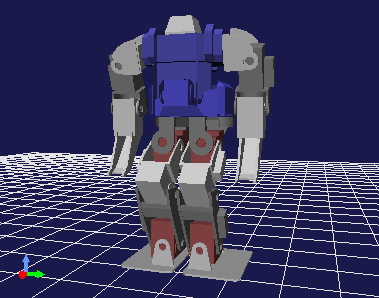
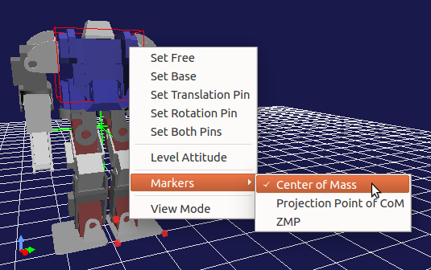
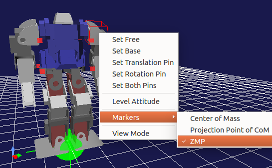
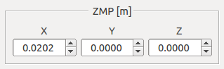
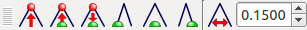
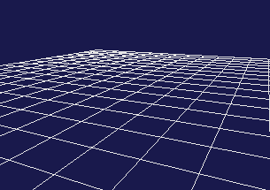
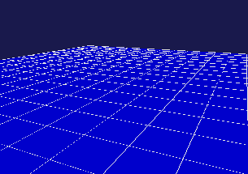

Operating a Leg-Type Model
==========================

Choreonoid provides useful functions to operate the posture of a leg-type robot, including a biped humanoid robot. This section introduces these functions.

.. contents::
   :local:
   :depth: 1

Sample Models
--------------

As a sample to introduce the functions, we use the model of the biped humanoid robot "GR001" here. The model is stored as the "GR001.yaml" file in the "model/GR001" directory in the share directory of Choreonoid. In addition, the project file "project/GR001Sample.cnoid" is available as a sample project to handle the model.

Load the project file as a preparation. Then, the following model of the GR001 robot should be displayed in the scene view.

Operating the Waist Using Preset Kinematics
-------------------------------------------

When editing the posture of a leg-type model, sometimes you want to move the position of the waist or the posture while the grounding positions of the legs are fixed. If only one leg needs to be fixed, this can be achieved using normal inverse kinematics (moving the waist using the leg as the base link). However, you often want to move the waist while multiple legs are fixed.

Actually, moving the waist of a leg-type model in "preset kinematics mode" (see :ref:`model_kinematics_mode` ) is normally an inverse kinematics operation that moves the waist while multiple legs are fixed. This enables you to efficiently edit the position of the waist or the posture.

Displaying the Center of Gravity
--------------------------------

When editing the posture of a leg-type model, sometimes you want to check whether the robot is balanced by viewing the position of the center of gravity of the whole robot. The scene view can display markers for this purpose.

You can switch the display from the context menu of the scene view. Right-click in edit mode while the mouse cursor points to the target model. The following menu appears.

You can see that there is the "Gravity Center" and "Projected Gravity Center Point" items in the "Marker" sub-menu. Click an item to check the item and to turn on the display of the marker. (Click the item again to remove the check and to turn off the display.)

When the "Gravity Center" is checked, the position of the center of gravity is displayed as green cross lines (the intersection point represents the position of the center of gravity). The "Projected Gravity Center Point" item displays the point of the center of gravity projected onto the floor surface (point where Z = 0). This is used when, for example, you check whether the center of gravity is within the sole area.

.. _legged_model_zmp:

Zero Moment Point (ZMP)
----------------------------

As with the marker for the center of gravity, you can also display the marker for "zero moment point (ZMP)" by checking "Marker" - "ZMP" in the context menu. The marker, which consists of a green ball and cross lines, normally is located near the feet of the robot. 

.. note:: The ZMP is a point at which the moment the sole receives from the floor surface is zero (center of pressure of floor reaction force), which is one of the basic concepts of biped walking control. Since the ZMP of an actual robot is present in the "specified area" consisting of the convex hull of the sole ground plane, you can use this condition for target motion trajectory planning and walking stabilization control. For details, see relevant documents, such as `"Humanoid Robot" by Shuuji Kajita. <http://www.amazon.co.jp/%E3%83%92%E3%83%A5%E3%83%BC%E3%83%9E%E3%83%8E%E3%82%A4%E3%83%89%E3%83%AD%E3%83%9C%E3%83%83%E3%83%88-%E6%A2%B6%E7%94%B0-%E7%A7%80%E5%8F%B8/dp/4274200582>`_

In Choreonoid, the ZMP marker is used in the following two ways:

One use is to display the ZMP calculated from certain motion trajectory data or obtained from the state of a sensor of the actual machine. This enables you to check whether the motion trajectory data or the state of the actual machine is normal.

The other use is for the user to give the target position of the ZMP (target ZMP) when editing the posture or motion of a model. In this case, the user can arbitrarily set the position of the ZMP marker.

One of the methods to move the ZMP marker is to directly drag the ZMP marker with the mouse in the scene view. In this case, you can change the two-dimensional position (X and Y coordinates) of the ZMP on the floor surface while the vertical position is fixed onto the floor surface (Z = 0).

Or, you can also change the position of the ZMP using the following "ZMP panel" displayed in the :ref:`model_body_link_view` for a leg-type model.

In this case, you can precisely check and change the position of the ZMP using coordinate values.

.. _model_legged_body_bar:

Leg-type Body Bar
-----------------

The following "leg-type body bar", which is useful for editing the posture of a leg-type model, is provided as a toolbar for a set of operations related to the markers for the center of gravity, ZMP, etc.

.. note:: This toolbar is not displayed by default. To use it, first display it by following the description in :ref:`basics_show_toolbar` .

.. |i0| image:: ./images/center-cm.png
.. |i1| image:: ./images/zmp-to-cm.png
.. |i2| image:: ./images/cm-to-zmp.png
.. |i3| image:: ./images/right-zmp.png
.. |i4| image:: ./images/center-zmp.png
.. |i5| image:: ./images/left-zmp.png
.. |i6| image:: ./images/stancelength.png

The function of each icon is as follows:

.. tabularcolumns:: |p{2.0cm}|p{13.0cm}|

.. list-table::
 :widths: 5,95
 :header-rows: 0

 * - |i0|
   - Horizontally moves the center of gravity in such a way that the projected gravity center point matches the center of both soles.
 * - |i1|
   - Horizontally moves the center of gravity in such a way that the projected gravity center point matches the ZMP.
 * - |i2|
   - Sets the ZMP at the position of the projected gravity center point.
 * - |i3|
   - Sets the ZMP at the center of the right foot.
 * - |i4|
   - Sets the ZMP at the center of both feet.
 * - |i5|
   - Sets the ZMP at the center of the left foot.
 * - |i6|
   - Adjusts the width between both feet. Set the length of the width in the numerical value input box next to the icon.

You can also set a posture in which the center of gravity is put over either the left or right foot by combining the function to set the ZMP at the center of the right or left foot with the function to match the projected gravity center point with the ZMP.

Operations Related to Sole Grounding
------------------------------------

When you edit the posture of a leg-type robot, it becomes necessary to ground the soles pm the floor surface. This section describes points to note when performing such a operation.

In some cases, you want to make the sole surfaces parallel to the floor surface when grounding the soles or moving the part above the floor. If the original postures of the sole surfaces are tilted at this time, you must correct them so that they become parallel. Although you can correct a posture by directly dragging it in the scene view, it is hard to exactly match it with the desired posture using this method.

If you want to make a sole parallel, simply execute "To horizontal posture" of the context menu on the link of the foot in the scene view. Also, if the floor is tilted, you should be able to obtain the posture of a sole parallel to the floor surface in a relatively easy manner by adjusting the roll (R) and pitch (pitch) values of the link in the :ref:`model_body_link_view` .

When you ground the soles, it becomes necessary to tightly fit the soles to the floor surface by setting not only the postures of the soles but also the altitude of them to the same as those of the floor surface. To do so, simply use the  :ref:`collision_detection_penetration_block` introduced in :doc:`collision-detection` .

Enable collision detection and the penetration block function. Adjust the sole surfaces to make them parallel to the floor surface by performing the above operation. Lower the links of the feet toward the floor surface. When the sole surfaces contact with the floor surface, you cannot move them any further toward the floor surface. In this way, you can set the altitude of the sole surfaces to almost the same as that of the floor surface. You can perform an operation to lower the link of a foot toward the floor surface by directly dragging it in the scene view or decreasing the Z coordinate value in the body/link view. In the latter way, you can more easily adjust the horizontal position on the floor surface.

Floor Grid and Floor Model
--------------------------

The scene view displays the "floor grid" by default as shown in the figure below.

This assumes a floor surface of Z = 0 and is provided to enable you to easily perceive the position of the floor in the scene view.

However, the floor grid is only displayed and not handled as the model of the floor surface by internal processing, that is, it is handled as if nothing is present there. Therefore, you cannot check collision with a Body model present in the scene. In this state, you also cannot use the penetration block function for the floor surface, and an object passes through and drops from the floor surface when a kinetics simulation is performed. Pay attention to this point before using the floor grid.

To make the floor surface effective for internal processing, you must load the model corresponding to the floor surface as a Body item beforehand. Floor models include, for example, the model file "model/misc/floor.wrl" in the share directory of Choreonoid. Load and display the file to display the blue floor as shown in the figure below.

Installing such a floor model enables you to use functions related to collision with the floor surface. The GR001 sample project is also designed to load this floor model.

However, when a floor model is displayed in the scene view, sometimes it may be harder to perform operations to edit the posture of a robot. This is because, for example, you cannot view the condition of a sole from the underside since it is hidden by the backside of the floor, or you cannot change the viewpoint the way you want since the mouse cursor points to the floor surface. That is, the floor surface interferes with operations on a robot.

In such a case, there is an option to use only the floor grid to perceive the floor surface by only loading the model of the floor and leaving the display of it off. If this is done, the floor surface does not interferes with operations while collision with the floor surface is processed. This setup is recommended for work focused on editing the posture of a robot. The GR001 sample project also has this setup.
