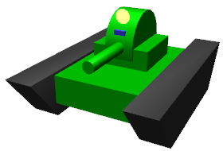
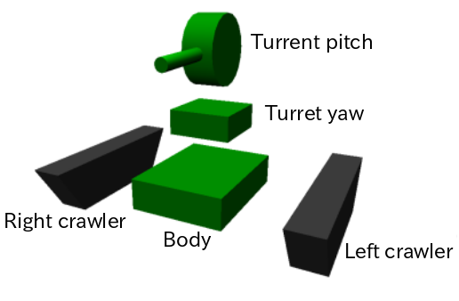
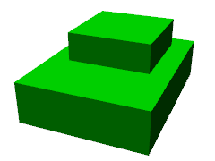
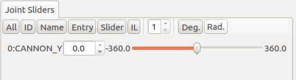
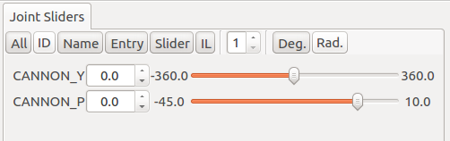
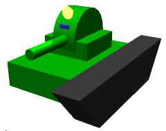

Body file tutorial
==========================

This page contains a tutorial describing how to format Body files, the standard model file used on Choreonoid.

.. contents::
   :local:
   :depth: 2

.. highlight:: YAML

.. _bodyfile-tutorial-simple-tank-model:

SimpleTank model
---------------------

The model we will use is the “SimpleTank” model shown below.

This model contains two rotating joints used to move the gun turret and gun barrel, with a camera and light acting as onboard devices.

SimpleTank is a simplified version of the “Tank,” a standard sample of a crawler-based mobile robot. The former’s basic structure is the same as the Tank model. For more on the Tank model, please refer to these files:

* TankJoystick.cnoid
* TankVisionSensors.cnoid

These are packaged as sample projects with Choreonoid.

This manual contains a :doc:`../../simulation/tank-tutorial/index` as a sample summarizing how to conduct a simulation using this model.

Basic model layout
---------------------------

The SimpleTank model comprises the five parts shown in the figure below.

The base is composed of the tank body. On top of the body are installed the gun turret and gun barrel. This piece acts as a foundation for the turret and consists of a rotating yaw axis and, on top of this, the gun barrel and a separate pitch axis attached to the barrel. Each side of the body is outfitted with crawlers used for movement.

These five parts are modeled together as “links.” The body piece acts as the core of the model and is modeled as a “root link.” Each model must have a single root link defined. The two links on the gun turret are modeled as rotating joints. The crawlers are modeled as links that correspond to a :doc:`../../simulation/pseudo-continuous-track` .

The tiered structure (parent-child relationship) between the links is as follows: ::

 - Body (root)
     + turret yaw axis (rotating joint)
            + turret pitch axis (rotating joint)
     + left crawler
     + right crawler

This tutorial describes the shape of each link as text declarations in the model file. This allows you to create a finished model using text files alone and not need figural data created through CAD or modeling tools. By the same token, you can also choose to use data created through said CAD or modeling tools. For details on this, please refer to the section on  :doc:`tank-blender` .

Preparing the model file
-------------------------------------

First, we create a Body format model file as a text file. The file extension is normally saved as “.body.”

To begin creating a model file, first create an empty text document in a text editor and save the extension as “.body,” with a filename of your choice. For our purposes, we will save the file as “simpletank.body.” A finished version of this file can be found in the Choreonoid /share directory under “/model/tank.” In this tutorial, we refer to that file and explain it in detail to show you the steps of how to create the finished file from start to finish.

You can find a summary of the steps below in the section on  :doc:`tank` .

.. note:: If creating a model file using the default text editor in Ubuntu (gedit), select View from the main menu, then Highlight Mode. On the dialog that appears, select YAML to toggle syntax highlighting for the YAML format, allowing for easier editing.

YAML
------------

Body files use YAML as the basis for their notation. You can obtain an understanding in the essentials of practical YAML notation by reading the below. For more details, please refer to the `YAML documentation <http://www.yaml.org/spec/1.2/spec.html>`_  or various manuals available on the subject.

The below is a good resource that is easy to understand.

* `Programmer's Guide to YAML (Beginner) <http://magazine.rubyist.net/?0009-YAML>`_

Header format
--------------------

We begin by using YAML mapping to create a header for the model file. ::

 format: ChoreonoidBody
 formatVersion: 1.0
 angleUnit: degree
 name: Tank

The parameter on the last line allows Choreonoid to recognize this file as a model file. As of this writing, the formatVersion should be set to 1.0. If future changes are made to the Choreonoid specifications, version numbers will be used in order to distinguish between them.

“angleUnit” is used to specify the unit of measure of angle joints in the model file. In this case, we have used “degree,” so the angle is declared in degrees. If you want to use radians, enter “radian” here. Under normal circumstances, using degree should be easier.

The name of the model is specified in the “name” field.

.. _modelfile_yaml_links:

Link notation
----------------------

The link data contained by models is declared as follows using “links:” ::

 links:
   -
     Link 1 (root link) notation
   -
     Link 2 notation
   -
     Link 3 notation
   ...

In this way, you can declare a desired number of links in the form of a YAML list. The code for each link is referred to as a “Link node.” The final Link node given acts as the model’s root link.

.. _modelfile_yaml_link_node:

Link nodes
---------------------

Link nodes are described using the YAML mapping format. Parameters like the below can be used as mapping elements.

.. list-table::
 :widths: 20, 80
 :header-rows: 1

 * - Key
   - Details
 * - name
   - The link name.
 * - parent
   - The parent link. Specified by calling the name of the parent link (the string declared in the name field). This is not used for root links.
 * - translation
   - Location relative to the parent link for the link-local frame. For root links, used as the default position at import.
 * - rotation
   - The orientation relative to the parent link for the link-local frame. The orientation is expressed (Axis-Angle format) as four values corresponding to the rotational axes and angles. For root links, used as the default position at import.
 * - jointType
   - The joint type. Specify either **fixed**, **free** (no fixed root link), **revolute** (rotating joint), **prismatic** (direct joint), or **pseudoContinousTrack** (simplified caterpillar track)
 * - jointAxis
   - The joint axis. Specify the axis joint as a list containing the three elements of the 3D vector. Use unit vectors for the value here. Where the joint axis corresponds to any of the X, Y, or Z coordinates for the link-local coordinates, you can also declare this using the corresponding letter for that axis (X, Y, or Z).
 * - jointRange
   - The range of motion of the joints. Give a list containing the two values of maximum and minimum. Declaring the value as “unlimited” allows for removing range of motion restrictions. Where the maximum and minimum values are the same, with the flags respectively being the negative and positive signs, you can also declare just one absolute value (as a scalar value).
 * - jointId
   - The joint ID. Specify an integer value greater than zero. You can specify any value so long as it does not overlap with another value in the model. If the link is not a joint (if the root link or jointType are fixed), or if you do not need access via IDs, you can omit this.
 * - centerOfMass
   - The position of the center of gravity. Set using link-local coordinates.
 * - mass
   - The mass in kg.
 * - inertia
   - The moment of inertia. Given as a list of nine inertia tensors. Due to the symmetry of inertia tensors, you need only list the six elements of the upper triangle.
 * - elements
   - Give the child nodes that are constituent elements of the link

Body link notation
-------------------------

We begin by setting the root links that correspond to the tank body for this model. Declare the corresponding Link node below “links,” as below. ::

 links:
   -
     name: CHASSIS
     translation: [ 0, 0, 0.1 ]
     jointType: free
     centerOfMass: [ 0, 0, 0 ]
     mass: 8.0
     inertia: [
       0.1, 0,   0,
       0,   0.1, 0,
       0,   0,   0.5 ]
     elements:
       Shape:
         geometry:
           type: Box
           size: [ 0.45, 0.3, 0.1 ]
         appearance: &BodyAppearance
           material:
             diffuseColor: [ 0, 0.6, 0 ]
             specularColor: [ 0.2, 0.8, 0.2 ]
             shininess: 0.6

In YAML, indents on each line prescribe the structure of the data, so ensure that the indentation you see above is preserved when you write your own code.

For the link definitions, begin by setting a name used to identify the link. Here, we use ::

 name: CHASSIS

This gives it the name “CHASSIS.”

Checking a model in progress
-------------------------------------

We have not set a root link yet, but the model is already functioning in this state. You can now import the file in progress into Choreonoid, render the model, and check whether you have written it correctly. From the main menu, select File > Import > Body, then select the corresponding file in the dialog box that appears. On the dialog, you can enable the option “Add a check on the Item Tree View,” or alternately click the checkbox for the item after import. This will display the model on the Scene View as below.

.. image:: images/tank_chassis.png

If there is an error on import, or if the model is imported but does not render properly, check your text file to see if there are any problems in your notation.

If you want to re-import the model file after editing it and that file is already imported as a body item, you can use the Re-Import feature to refresh the view. This can be done by either of the methods below.

* Select the corresponding item on the Item Tree View and press **"Ctrl + R"** .
* Right-click on the corresponding item in the Item Tree View and select Re-Import.

Re-importing a model will refresh the view with the updated version of the file (provided there are no import errors), and the current item will be replaced with its latest version. If there have been changes to the shape of the model in the file, the Scene View display will immediately reflect this. You can use this feature to edit your model file directly as a text file while updating it in the live view, letting you work more efficiently. We will use the Re-Import feature several times in this tutorial, so you should learn and remember it.

Notation unique to root links
--------------------------------------

The chassis link is declared as: ::

 translation: [ 0, 0, 0.1 ]

This specifies its starting coordinates at the time of import. (Strictly speaking, these correspond to the origin of the root link in the world coordinate system.)

The translation parameter is generally used to describe the relative position from a parent link, but root links do not have parent links. Instead, their relative position from the world coordinate system’s starting point at the time the model is imported is used. It is also possible to use rotation to specify the starting orientation. If you are not concerned with the starting position, you do not have to set these parameters.

Setting the Z-coordinate value to 0.1 here allows you to set the root link starting position 0.1[m] above the default Z axis. This lets you utilize the root link starting point as the center of the tank body while also allowing the bottom of the crawlers to sit flush at Z=0 when imported. In most environment models, this coordinate is treated as the floor/ground, so the above settings allow for easily fitting the model to that practice.

Next is the ::

 jointType: free

notation. This tells the system that the model can freely move about the space.

The jointType parameter is generally used to specify the type of joints connecting parent and child links, but its meaning varies slightly in the case of root links -- it specifies whether the link is fixed to the environment or not. Declaring a link as “fixed” will fix it to the environment. For manipulators and other items where the base is fixed to the ground, you can use this functionality. For models like the one in this tutorial, which are not fixed to a specific point, declare the link as “free.”

.. _modelfile_yaml_rigidbody_parameters:

Rigid body parameters
------------------------------

Links are normally modeled as rigid bodies. :ref:`modelfile_yaml_link_node` used to specify the above include centerOfMass, mass, and inertia. The CHASSIS link uses the below notation for these.

.. code-block:: yaml
 :dedent: 0

     centerOfMass: [ 0, 0, 0 ]
     mass: 8.0
     inertia: [
       0.1, 0,   0,
       0,   0.1, 0,
       0,   0,   0.5 ]

centerOfMass takes the center of gravity for the link-local coordinates. The link-local coordinate start point for the CHASSIS link is set as the center of the tank body, with the center of gravity also set as the same point.

mass takes the mass, and inertia takes a matrix element for the inertia tensor.

We have put an arbitrary value in the inertia tensor here, but you should use a proper calculation or CAD tool to set the correct value.

Inertia tensors are a symmetric matrix, so you can simply include the six elements of the upper triangle. In this case, the above value is written as:

.. code-block:: yaml
 :dedent: 0

     inertia: [
       0.1, 0,   0,
            0.1, 0,
                 0.5 ]

.

The rigid body parameter can also make use of the “RigidBody” node to treat it as a standalone entity. This will be discussed in detail later.

.. _modelfile_yaml_chassis_shape:

Body shape notation
--------------------------------

The link shape is declared underneath the “elements” section of the Link node. For the CHASSIS link, the below code is used.

.. code-block:: yaml
 :dedent: 0

       Shape:
         geometry:
           type: Box
           size: [ 0.45, 0.3, 0.1 ]
         appearance: &BodyAppearance
           material:
             diffuseColor: [ 0, 0.6, 0 ]
             specularColor: [ 0.2, 0.8, 0.2 ]
             shininess: 0.6

This section acts as a Shape node. The shape displayed in the Scene View when we imported the model file earlier is drawn from this section.

Shape nodes use the geometry element to declare the geometric shape, and the appearance element to declare the appearance of the surface.

For the geometry type, we use “Box” and create a Box node that will render a geometric, rectangular box. For the Box node’s size parameter, a list describing the length of the x, y, and z axes is used. You can also use shape nodes like “Sphere,” “Cylinder,” and “Cone.”

For appearance, “material” is used to declare the material on the item surface. The below parameters can be set for material.

.. list-table::
 :widths: 20, 80
 :header-rows: 1

 * - Key
   - Details
 * - ambientIntensity
   - Sets a scalar value of the reflection coefficient of ambient light. The range can be between 0.0 and 1.0. By default, it is set to 0.2.
 * - diffuseColor
   - Sets an RGB value for the diffusion coefficient. The RGB value is a list comprising the three elements of red, green, and blue, with each having a range between 0.0 and 1.0.
 * - emissiveColor
   - Specifies the RGB value of emissive color. By default, it is disabled (all set to 0).
 * - specularColor
   - Specifies the RGB value of the specular reflection coefficient. By default, it is disabled (all set to 0).
 * - shininess
   - Use a scalar value between 0.0 and 1.0. The larger the value, the sharper the highlights from specular reflection become. By default, it is set to 0.2.
 * - transparency
   - Specifies the transparency. Use a scalar value from 0.0 to 1.0. At 0.0, the item is completely opaque. At 1.0, it is completely transparent. By default, the value is set to 0.0.

Using the three parameters of diffuseColor, specularColor, and shininess allows us to create a material with a slightly greenish, metallic gloss.

.. note:: While the syntax of this code  varies slightly here and there, the structure, shape types, and parameters are based on those defined in `VRML97 <http://tecfa.unige.ch/guides/vrml/vrml97/spec/>`_ （ `Shape <http://tecfa.unige.ch/guides/vrml/vrml97/spec/part1/nodesRef.html#Shape>`_ , `Box <http://tecfa.unige.ch/guides/vrml/vrml97/spec/part1/nodesRef.html#Box>`_ , `Sphere <http://tecfa.unige.ch/guides/vrml/vrml97/spec/part1/nodesRef.html#Sphere>`_ , `Cylinder <http://tecfa.unige.ch/guides/vrml/vrml97/spec/part1/nodesRef.html#Cylinder>`_ , `Cone <http://tecfa.unige.ch/guides/vrml/vrml97/spec/part1/nodesRef.html#Cone>`_ , `Appearance <http://tecfa.unige.ch/guides/vrml/vrml97/spec/part1/nodesRef.html#Appearance>`_ , `Material <http://tecfa.unige.ch/guides/vrml/vrml97/spec/part1/nodesRef.html#Material>`_ , etc.) VRML97 is based on OpenHRP model files, so if you have used it before, this system should be relatively easy to understand.

.. note:: As mentioned in the preface, this tutorial makes use of the above notation format to describe the shape of links in the model using a text file. You can also use a modeling or CAD tool to separately create a shape data file. Details on using these tools are explained elsewhere.

.. _modelfile_yaml_anchor:

Setting anchors
-------------------------

In the above code, ::

 appearance: &BodyAppearance

&BodyAppearance is appended immediately after appearance.

This corresponds to the “anchor” functionality provided by YAML and allows you to assign a specific name to a location in YAML and then refer to it by that name. This lets you set an initial anchor and then simply refer to that anchor for subsequent uses, instead of having to repeat the same code multiple times. In YAML, the part of the code that refers to the anchor is called an “alias.”

We will also apply the material parameters we set in the appearance section to the :ref:`modelfile_yaml_turret_pitch_shape`  so an anchor is used in order to let us quickly reference that section of the code later. The actual usage is explained in the :ref:`modelfile_yaml_alias` section.

.. _modelfile_yaml_elements:

Elements notation
------------------------

Groups of constituent elements in a model file are referred to as “nodes.” Some examples include the Link nodes and Shape nodes that we have discussed thus far.

Nodes can also include subordinate nodes treated as child nodes. This lets you describe nodes in a hierarchical manner. The standard means of doing this is using the “elements” key.

elements generally uses YAML’s list functionality to describe a child node as below. ::

 elements:
   -
     type: node type name
     key1: value1
     key2: value2
     ...
   - 
     type: node type name
     key1: value1
     key2: value2
   ...

Where the subordinate node includes further elements, you can add layers to the hierarchy as below. ::

 elements:
   -
     type: node type name
     key1: value1
     elements:
       -
         type: node type name
         key1: value1
         elements:
           ...

In this way, using elements lets you combine multiple types of nodes.

Where there is only one type of node below the elements key, you can simplify the notation as below. ::

 elements:
   node type name:
      key1: value1
      key2: value2
      ...

This has no major difference from the previous method, but since it does not use lists, it allows for a slightly simpler notation.

Using these elements in Link nodes allows you to incorporate a range of aspects like shape and sensor details. Nodes which support elements are the Transform and RigidBody nodes, among others.

.. note:: Where a model contains multiple links, the relationship between links generally becomes hierarchical. This could also potentially be achieved by using elements for the Link node, but this type of model file does not utilize that format. This is because employing that notation means the structure of the text for the model file becomes progressively more nested the deeper you create a link hierarchy, making checking and editing the text more difficult. Link hierarchy is declared by using the “parent” key for the Link node.

Gun turret yaw axis link notation
----------------------------------------

Next, let’s declare the links for the gun turret base and the yaw axis. Add the below to the code you have so far.

.. code-block:: yaml
 :dedent: 0

   -
     name: TURRET_Y
     parent: CHASSIS
     translation: [ -0.04, 0, 0.1 ]
     jointType: revolute
     jointAxis: -Z
     jointRange: unlimited
     maxJointVelocity: 90
     jointId: 0
     centerOfMass: [ 0, 0, 0.025 ]
     mass: 4.0
     inertia: [
       0.1, 0,   0,
       0,   0.1, 0,
       0,   0,   0.1 ]
     elements:
       Shape:
         geometry:
           type: Box
           size: [ 0.2, 0.2, 0.1 ]
         appearance: *BodyAppearance

Once you add the above, save your file and try re-importing it again as before. You will see that the model in the Scene View will have changed to the figure below.

The new part on top of the tank body is the base of the gun turret. This controls the yaw axis rotation and includes joints for that purpose.

As specified in the name field, the name of this link is “TURRET_Y.” This indicates that it is the yaw axis for the Turret. As we did for the CHASSIS link, you specify rigid body parameters: centerOfMass, mass, and inertia.

Similarly, the shape can be specified using the geometry parameter for the Box type. Adjusting the size parameters here lets you shape the gun turret base into the adequate size.

.. _modelfile_yaml_alias:

Using aliases
-------------------------

The appearance used in the shape notation above can be the same as the CHASSIS link; we can reuse the same code from  :ref:`modelfile_yaml_chassis_shape`. We also  :ref:`modelfile_yaml_anchor` called “BodyAppearance” that corresponds to the appearance of the CHASSIS link. We use the below code: ::

 appearance: *BodyAppearance

to call the anchor as a YAML alias. In this way, by prepending an asterisk to the anchor name, you can reference it as an alias.

.. _modelfile_yaml_offset_position:

Describing relative link position
--------------------------------------------

We model the TURRET_Y link as a sub-link of the CHASSIS link.

To achieve this, we use ::

 parent: CHASSIS

This indicates that the link’s parent link is CHASSIS.

Next, we set the relative position (offset) from the parent link. The translation parameter controls this. For this link, we use ::

 translation: [ -0.04, 0, 0.08 ]

This allows the link to be offset 5[cm] back from the starting point of the CHASSIS link and 8[cm] up. The position is based on the coordinates for the parent link.

In order to see how the relative position goes into effect, try importing the file without the translation line. You can delete the above line or comment it out with a # at the start of the line, then re-import the model.

You will see that the gun turret has now disappeared. This is because the gun turret has been positioned inside of the center of the tank body and is embedded within it. Try turning on the :ref:`basics_sceneview_wireframe` in the Scene View. You should see the below.

.. image:: images/tank_turret_y_0.png

In this way, enabling wireframes lets you confirm that the gun turret is physically within the tank body.

As you can see, properly setting the link position requires using the aforementioned translation parameter. Try playing with the values of this parameter to see how it changes the outcome.

You can also use the rotation parameter to change the relative orientation (within the coordinate system). Rotation is controlled as follows: ::

 rotation: [ x, y, z, θ ]

This controls the orientation (rotation) based around a rotating axis and the angles of rotation around it, with unit vectors for X, Y, and Z given, and the angle of rotation given for θ.

An actual example of using this parameter will follow.

Joint notation
-----------------------

Two parent-child links are generally connected as a standard joint. The TURRET_Y link is connected to the CHASSIS parent link by way of a yaw axis, with the yaw axis configurable. Data controlling this can be set by placing the below code below the TURRET_Y link section. ::

 jointType: revolute
 jointAxis: -Z
 jointRange: unlimited
 jointId: 0

We begin by setting the jointType as revolute. This creates a revolute (rotating) joint between the parent and child links. (This is a joint with one degree of freedom, also known as a hinge.)

jointAxis is given the joint axis. In the case of a hinged joint, we specify the corresponding axis of rotation. You can use X, Y, and Z coordinates, or use 3D vector units. In both cases, the axis orientation is given in the form of link-local coordinates. You can specify -Z to set a negative position on the Z axis as the axis of rotation. Where specifying the joint axis as a 3D vector, the syntax is: ::

 jointAxis: [ 0, 0, -1 ]

With the above, you can set an orientation of your choice other than the X, Y, and Z axes.
  
Typically, the Z axis is set perpendicular and upward (the same is true in this model). In this joint, it controls the yaw axis rotation. We have set the orientation as negative on the Z axis, meaning the angle of rotation on the positive side will rotate to the right, while the negative side will rotate to the left. The joint position is set with this link as a starting point. The position as seen from the parent link corresponds to the position we just set using the translation parameter.

For the jointType, you can also set “prismatic,” which corresponds to a direct joint. In this case, you give jointAxis the direct orientation.

For the range of motion of the joint, use jointRange. Here we used “unlimited,” implying that it has no restrictions on range of motion. If you want to restrict the range, use specific values like: ::

 jointRange: [ -180, 180 ]

This sets a lower and upper limit. Where the lower and upper limits are an absolute value that is the same, you can notate this as: ::

 jointRange: 180

.

jointId takes an ID assigned to the joint (an integer of 0 or larger). The ID is referenced on the Choreonoid interface and allows you to control joints by calling the ID. You can also call these IDs from the program used to control the robot and select specific joints. The values are not set automatically. When creating the model, you must explicitly assign an integer value of your choice to act as an ID. Note that there is no requirement that all joints be given an ID. However, when storing joint angles in an array, these values are used as an index, so you should ideally aim to assign sequential values beginning with 0.

This model contains the yaw axis for the gun turret and the pitch axis, so we will assign them 0 and 1, respectively.

Checking joint functionality
-------------------------------------

To check whether the joints are properly modeled, the most effective way is to actually move them around on the model in the Choreonoid GUI. Try using the functionality previously discussed in  :doc:`../index` - :doc:`../pose-editing`.

First, try :ref:`pose_editing_joint_slider_view`. By selecting a model in progress in the Item Tree View, the joint slider view should present the below.

This display indicates that the joint with ID 0 has been defined at TURRET_Y. Try manipulating this slider. You will see that the box corresponding to TURRET_Y on the Scene View will rotate along the yaw axis. The model orientation for joints with angles of respectively -30°, 0°, and +30 is as follows. 

.. image:: images/tank_turret_y_rotation.png

TURRET_Y’s joint range of motion has been set as unlimited, meaning that the joint slider can be moved between -360° and +360°. If you have placed limitations on the range of motion, the slider will let you move the figure within that range.

You can also :ref:`sceneview_forward_kinematics`. Toggle the Scene View to edit mode and drag the TURRET_Y section with the mouse. You will see that the joint can be rotated to follow the path of the mouse. If you have trouble, please refer to the above linked page and check your settings.

.. _modelfile_yaml_TURRET_P_description:

Gun turret pitch axis notation
----------------------------------

Next, let’s supply the code for the gun turret pitch axis. Begin by adding the below code after the links section.

.. code-block:: yaml
 :dedent: 0

   -
     name: TURRET_P
     parent: TURRET_Y
     translation: [ 0, 0, 0.05 ]
     jointType: revolute
     jointAxis: -Y
     jointRange: [ -10, 45 ]
     maxJointVelocity: 90
     jointId: 1
     elements:
       - 
         # Turret
         type: RigidBody
         centerOfMass: [ 0, 0, 0 ]
         mass: 3.0
         inertia: [
           0.1, 0,   0,
           0,   0.1, 0,
           0,   0,   0.1 ]
         elements:
           Shape:
             geometry:
               type: Cylinder
               height: 0.1
               radius: 0.1
             appearance: *BodyAppearance

As specified in the name field, the name of this link is “TURRET_P.”

The line reading ::

 # Turret

s a comment; this code will not execute. Lines preceded by a # are comments; code spanning to the end of the line is not interpreted as part of the program.

If you re-import the model at this stage, it should appear as below.

.. image:: images/tank_turret_p.png

The base of the gun turret pitch axis has been added.

RigidBody nodes
----------------------

In the above code, the :ref:`modelfile_yaml_rigidbody_parameters` do not make use of a Link node; instead, the RigidBody node is used.

The RigidBody node is a node developed specifically for notation of rigid body parameters, and it allows for specifying the centerOfMass, mass, and inertia parameters. These carry the same meaning as the corresponding parameters used in Link nodes. You can also set rigid body parameters by including a RigidBody node below the elements section of a Link node. Conversely, you could also interpret writing rigid body parameters directly within a Link node as an abbreviated form of RigidBody notation.

Some of the benefits of deliberately using a RigidBody note to set rigid body parameters include:

1. Enable sharing of rigid body parameters
2. Use a coordinate system of your choosing
3. Combine multiple rigid bodies together

First, you can break out rigid body parameters into a standalone node, then use :ref:`anchors <modelfile_yaml_anchor>` and :ref:`aliases <modelfile_yaml_alias>` to share the same rigid body parameters across different code blocks. This is convenient when modeling forms in which the same parts are used multiple times.

Further, when a node is independent, you can also separately apply :ref:`modelfile_yaml_transform_node` and use these to set various rigid body parameters within a coordinate system of your choice.

Since there is no restriction on the number of RigidBody nodes used for each link, you can describe link-wide rigid body parameters by combining multiple rigid bodies. In this case, rigid body parameters reflecting all RigidBody components within the link are set as parameters of that link. By combining benefits 1) and 2) above, you can efficiently model complex figures even if they consist of multiple parts, all while maintaining consistency.

The TURRET_P link consists of two RigidBody nodes combined as an example of how to use this node. The first is the base for the gun turret pitch axis, which we imported earlier. The second is the gun barrel, which extends past the turret.

The RigidBody node also supports :ref:`modelfile_yaml_elements`, which can be used to include other nodes within it. Here, we incorporate the following shape details within the elements section. Doing so allows us to store the rigid body’s physical parameters and shape within the RigidBody node and make the structure of the model easier to understand.

.. _modelfile_yaml_turret_pitch_shape:

Describing the gun turret pitch axis base shape
----------------------------------------------------

The shape of the gun turret pitch base is set as follows. ::

          Shape:
            geometry:
              type: Cylinder
              height: 0.1
              radius: 0.11
            appearance: *BodyAppearance

By using Cylinder for the geometry, we give the shape a cylindrical form. The Cylinder node takes the cylinder height (“height”) and radius (“radius”) as parameters. The position and orientation of the cylinder correspond to a circle with its center set as a radius on the XZ plane, with the height of both the positive and negative Y axes pushed out. Here, we use this as-is without changing the orientation.

For the appearance, we reference the BodyAppearance alias as before and use the foregoing settings.

Gun barrel notation
---------------------------

Now let’s add the gun barrel notation. Add the following code below the elements section of the TURRET_P link. (Ensure that the indentation is preserved.) 

.. code-block:: yaml
 :dedent: 0

       - 
         # Gun
         type: Transform
         translation: [ 0.2, 0, 0 ]
         rotation: [ 0, 0, 1, 90 ]
         elements:
           RigidBody:
             centerOfMass: [ 0, 0, 0 ]
             mass: 1.0
             inertia: [
               0.01, 0,   0,
               0,    0.1, 0,
               0,    0,   0.1 ]
             elements:
               Shape:
                 geometry:
                   type: Cylinder
                   height: 0.2
                   radius: 0.02
                 appearance: *BodyAppearance
	 
Re-import the model, and the gun barrel should appear as follows.
	   
.. image:: images/tank_turret_barrel.png

As before, this section is described using a RigidBody node, with the shape included in the node. The shape is a cylinder, of course, with its length and radius tweaked to create the gun barrel shape.

.. _modelfile_yaml_transform_node:

Transform nodes
---------------------

For the gun barrel, add the below to the top of the RigidBody node code: ::

 type: Transform
 translation: [ 0.2, 0, 0 ]
 rotation: [ 0, 0, 1, 90 ]
 elements:

This section is referred to as a Transform node.

Transform nodes are a node which is used to transform the coordinates that appear below the elements section of that node. This achieves the same functionality as Link node translation and rotation parameters, as discussed in the section on :ref:`modelfile_yaml_offset_position` . However, what differs is that the target is a node located below the elements section of a Link node, and that you can combine multiple Transform nodes.

To see how this works, try disabling the Transform node. While you can remove the entire Transform node, commenting out the translation and rotation sections as follows: ::

 type: Transform
 #translation: [ 0.2, 0, 0 ]
 #rotation: [ 0, 0, 1, 90 ]
 elements:

will achieve the same effect. Re-importing the model will produce a figure like the below.

.. image:: images/tank_turret_barrel_no_transform.png

What you see embedded in the gun turret is the gun barrel. The position is not matched up correctly, and the barrel is pointing sideways.

This is because the cylinder created by the Cylinder node is referencing a coordinate system set for this orientation. The gun turret pitch axis base was fine with these coordinates, but when creating a gun barrel, we must modify the position and orientation.

To do so, we insert the above Transform node. Here, we use ::

 rotation: [ 0, 0, 1, 90 ]

This first creates a 90 degree rotation on the Z axis, causing the gun barrel to match the front-to-back (X axis) orientation of the model. Next, use ::

 translation: [ 0.2, 0, 0 ]

to move the cylinder 20cm forward and place it in front of the gun turret.

Note that the elements section of Transform also contains a RigidBody node. This applies the coordinate transformation not just to the shape, but also to the rigid body parameters included in the RigidBody node. Put differently, you can set rigid body parameters for the local coordinates of the cylinder, allowing you to save time on the calculations required for the center of gravity and moment of inertia, among others.

.. _modelfile_yaml_transform_parameters:

Transform parameters
~~~~~~~~~~~~~~~~~~~~~~~~~~~~~~~~~~~~~~

In lieu of using a Transform node, you can directly declare the translation and rotation parameters for the node in question. These parameters are referred to as Transform parameters.

For example, Transform parameters also work with RigidBody nodes, so you can describe the gun barrel as follows. 

.. code-block:: yaml
 :dedent: 0

       - 
         # Gun
         type: RigidBody:
         translation: [ 0.2, 0, 0 ]
         rotation: [ 0, 0, 1, 90 ]
         centerOfMass: [ 0, 0, 0 ]
         mass: 1.0
         inertia: [
           0.01, 0,   0,
           0,    0.1, 0,
           0,    0,   0.1 ]
         elements:
          Shape:
             geometry:
               type: Cylinder
               height: 0.2
               radius: 0.02
             appearance: *BodyAppearance

The translation and rotation parameters from the Transform node are simply being used here in a RigidBody node. The notation for this node is simpler. Internally, the process is the same as inserting a Transform node, but you can think of the notation as a simplified form.

Transform parameters can also be used in Shape nodes and in device-related nodes, discussed later.

Gun turret pitch axis joint notation
-----------------------------------------------

Let’s also take a look at the gun turret pitch axis joint. Set the joint for the TURRET_P link using the code below. ::

 parent: TURRET_Y
 translation: [ 0, 0, 0.04 ]
 jointType: revolute
 jointAxis: -Y
 jointRange: [ -45, 10 ]
 jointId: 1

The parent link is TURRET_Y. The joint is set between these links. Furthermore, the translation parameter is used to set an offset from the parent link of 4cm on the Z axis.

The joint type is, as with TURRET_Y, set to revolute, creating a hinged joint. The axis of revolution is the Y axis, which corresponds to pitch. However, the orientation of the axis is negative. The negative orientation of the joint angle is rotated to be downward from the gun barrel, while the positive direction is rotated to be upward. jointRange is used to set the range of motion for the upper section as 45 degrees, and the lower as 10 degrees. Set 1 for the jointId; note that this differs from the 0 we used for TURRET_Y.

Now, let’s take a look at how the joint behaves. In the joint slider view, you will see interfaces for the two joints, corresponding to TURRET_Y and TURRET_P.

You can use these sliders, or drag directly on the Scene View, to move the pitch axis (TURRET_P). This should allow you to change the up-and-down orientation of the gun barrel as below.

The yaw axis functions as before, but you will also notice that the orientation moves in accordance with the rest. This is because the TURRET_P link is a child link of the TURRET_Y link.

Device notation
-----------------------

For robot models defined in Choreonoid, the sensors and other devices equipped on the robot are referred to as “devices.” The devices this tank model has equipped are the spotlight and the camera. Below, we describe the notation for these devices.

.. _modelfile-tank-spotlight:

Spotlight notation
~~~~~~~~~~~~~~~~~~~~~~~~~~

First, in order to simulate a robot working in the darkness, we equip it with a light device, which acts as a lightsource. There are various types of light. The light we will attach to the robot in this case is a standard spotlight.

Devices can be applied to any link, so define which link to apply the device to below the elements section for that link. Install the light on the gun turret’s pitch axis in order to be able to freely change its orientation. This allows the light to change direction along with the movement of the yaw and pitch axes of the gun turret.

To do so, add the below underneath the elements section of the TURRET_P link.

.. code-block:: yaml
 :dedent: 0

       -
         type: SpotLight
         name: Light
         translation: [ 0.08, 0, 0.1 ]
         direction: [ 1, 0, 0 ]
         beamWidth: 36
         cutOffAngle: 40
         cutOffExponent: 6
         attenuation: [ 1, 0, 0.01 ]

By setting type: SpotLight, we treat the spotlight device as a SpotLight node. Below are the key points to pay attention to when styling the above.

* The name of the device is set as “Light.” Because the program handling the device uses its name to frequently poll it, give the device the name above.
* Device nodes also let you use :ref:`modelfile_yaml_transform_parameters` . The use of translation here lets us specify the position of the light. This describes the relative position from the origin of the TURRET_P link.
* The SpotLight direction parameter lets you specify the direction of the optical axis. We want it to face the front of the model, so we set it as the X axis.
* beamWidth, cutOffAngle, and cutOffExponent are parameters that let you set the illumination range of the spotlight. attenutation lets you set the degree of attenuation based on distance from the lightsource.

Light shape notation
~~~~~~~~~~~~~~~~~~~~~~~~~~~~~~~~~~~~

Now, let’s add the light’s shape. At the end of the SpotLight node, add the following as an elements section.

.. code-block:: yaml
 :dedent: 0

         elements:
           Shape:
             rotation: [ 0, 0, 1, 90 ]
             translation: [ -0.02, 0, 0 ]
             geometry:
               type: Cone
               height: 0.04
               radius: 0.025
             appearance:
               material:
                 diffuseColor: [ 1.0, 1.0, 0.4 ]
                 ambientIntensity: 0.3
                 emissiveColor: [ 0.8, 0.8, 0.3 ]

For the shape of the light, we have opted to use a conical one (Cone node). In the default coordinate system, the orientation will be incorrect, so we use :ref:`modelfile_yaml_transform_parameters` to align it correctly. To ensure that the lightsource is not hidden behind this shape, we set it slightly behind. This is a key point to consider if you want to generate shadows when rendering.

For material, we use emissiveColor to ensure that the light appears to glow even in the dark.

After adding the above and re-importing the model, the shape of the light should appear as follows.

.. image:: images/tank_light.png

You can now look at the model to confirm whether the light is in the right location and oriented correctly.

Note that, when applying a device, there is no requirement to have a corresponding shape for it. Even if there is a corresponding shape, there is no requirement to declare that shape below the device node’s elements section. In this example, we did so in order to make the modeling more clear, but devices generally function irrespective of shape.

.. _modelfile-tank-camera:

Camera notation
~~~~~~~~~~~~~~~~~~~~~~~~~~~

Now, let’s add a camera device. As with the SpotLight node, add the below underneath the elements section of the TURRET_P link.

.. code-block:: yaml
 :dedent: 0

       - 
         type: Camera
         name: Camera
         translation: [ 0.1, 0, 0.05 ]
         rotation: [ [ 1, 0, 0, 90 ], [ 0, 1, 0, -90 ] ]
         format: COLOR_DEPTH
         fieldOfView: 65
         nearClipDistance: 0.02
         width: 320
         height: 240
         frameRate: 30
         elements:
           Shape:
             rotation: [ 1, 0, 0, 90 ]
             geometry:
               type: Cylinder
               radius: 0.02
               height: 0.02
             appearance:
               material:
                 diffuseColor: [ 0.2, 0.2, 0.8 ]
                 specularColor: [ 0.6, 0.6, 1.0 ]
                 shininess: 0.6

Cameras make use of the Camera node.

This node lets you specify the format of the images polled by it. You can specify any of the below parameters to do so.

* COLOR
* DEPTH
* COLOR_DEPTH

If using COLOR, it will obtain a standard color image. If you specify DEPTH, it will obtain a distance image. If you specify COLOR_DEPTH, it will obtain both images simultaneously. This functionality is designed for cases like simulation of RGBD cameras used in the Kinect and other devices.

You can also specify the image size (resolution) using the width and height parameters. In this case, we have set a resolution of 320 pixels wide by 240 pixels tall. Next, you can set the framerate at which to poll images using the frameRate parameter.

Camera position and orientation
~~~~~~~~~~~~~~~~~~~~~~~~~~~~~~~~~~~~~~~~~

For the camera position, use ::

 translation: [ 0.1, 0, 0.05 ]

to install the camera slightly lower than the light.

The orientation of the camera by default has the positive direction on the Y axis correspond to the upper direction of the camera, with the negative direction of the Z axis correspond to the front of the camera (line of sight). To orient the camera in a different direction, use a  :ref:`modelfile_yaml_transform_node` or the rotation aspect of :ref:`modelfile_yaml_transform_parameters`.

In this model, the Z axis is pointed upward. This means that by default, the camera will be facing down. Thus, we add the below to the upper Transform node: ::

 rotation: [ [ 1, 0, 0, 90 ], [ 0, 1, 0, -90 ] ]

This allows us to change the camera orientation to our desired one.

To specify the orientation using the rotation parameter, we combine the axis and angle of rotation, as discussed in the section on :ref:`modelfile_yaml_offset_position` . In this section, we see how two sets have been added. The rotation parameter can actually be accompanied by multiple lists of orientations. In this case, the orientation values (rotation commands) are applied in sequence, starting from the right. (Think of each element as a rotation matrix, with the multiplication for each matrix being applied in that order.)

First, [ 0, 1, 0, -90 ] is applied on the Y axis, for a -90 degree rotation. This allows the camera to face forward. In this current state, the upper orientation of the camera corresponds to the left of the model, so the image will be as though the camera has fallen over on its side. To this, we add [ 1, 0, 0, 90 ] to make an additional 90 degree rotation on the X axis, propping the camera back up and obtaining the image we want.

These two rotations can be combined into one string, but this is hard to interpret at a glance or calculate. Instead, combining multiple rotation sets as we have done above allows for more intuitive notation.

Camera shape
~~~~~~~~~~~~~~~~~~~~~

We have given the figure a cylindrical shape so as to have it act like a camera lens. The model will now appear as below.

.. image:: images/tank_camera.png

The camera definition is set as: ::

 nearClipDistance: 0.02

This allows the external field of view created in the camera image to be pushed slightly forward from center. Giving the camera a shape and not modifying it causes its inherent shape to have the field of view obstructed in the front. By inserting the above line, the exterior of the camera is able to properly display the camera image as desired.

.. _modelfile_yaml_crawlers:

Crawler notation
-----------------------

Lastly, we add the crawler notation.

Left crawler notation
~~~~~~~~~~~~~~~~~~~~~~~~~~~~~

We begin by adding the left crawler. As described in the :ref:`modelfile_yaml_links`  section, return to the links hierarchy (indented) and append the following below.

.. code-block:: yaml
 :dedent: 0

   -
     name: TRACK_L
     parent: CHASSIS
     translation: [ 0, 0.2, 0 ]
     jointType: fixed
     jointAxis: Y
     actuationMode: jointSurfaceVelocity
     centerOfMass: [ 0, 0, 0 ]
     mass: 1.0
     inertia: [
       0.02, 0,    0,
       0,    0.02, 0,
       0,    0,    0.02 ]
     elements:
       Shape: &TRACK 
         geometry:
           type: Extrusion
           crossSection: [
             -0.22, -0.1,
              0.22, -0.1,
              0.34,  0.06,
             -0.34,  0.06,
             -0.22, -0.1
             ]
           spine: [ 0, -0.05, 0, 0, 0.05, 0 ]
         appearance:
           material:
             diffuseColor: [ 0.2, 0.2, 0.2 ]

Re-importing the model at this stage will append the left-hand crawler to the model as seen below.

Crawlers are attached to the tank body; in this link, the parent link is again set as CHASSIS.

For the relative position from the parent link, using ::

 translation: [ 0, 0.2, 0]

allows the figure to be positioned to the left of the tank body.

By design, crawlers are linked treads made of metal or rubber and functioning in a belt-like formation that drives wheels inside. However, such a complex structure is difficult to recreate in a simulation. To that end, the crawlers we are modeling are pseudo-crawlers that consist of a single link. Since it is one link, there is no belt tread; the crawler itself is expressed as a single rigid body. While its travel ability does not match that of an accurate crawler model, by applying driving force to the point where the crawler and the environment make contact, you can to some extent simulate movement like that of a real crawler. For details, please refer to the section on  :doc:`../../simulation/pseudo-continuous-track`.

In the case of pseudo (simplified) crawlers, the joints themselves do not move, so the link jointType is set to fixed.

For jointAxis, we assign the presumed direction of the crawler wheel rotational axes. A right-forward twist of this axis corresponds to forward motion. Here, we use the Y axis for rotation.

Next, we set the actuationMode to jointSurfaceVelocity. This allows the link to move like a pseudo-crawler. (This parameter can be set in the control program when using the model, so it need not be described in the model file. However, in the case of pseudo-crawlers, including it in the model file makes for better readability at a glance.)

The crawler shape is described as a geometric node of the Extrusion type. This is an extruded form; first, the crossSection is set, and this follows the spine parameter to create a structural, extruded figure. Here we treat the crawler cross-section as a trapezoid and extrude it along the Y axis, extending its width. This notation is defined in VRML97; for details, please refer to `the Extrusion node documentation for VRML97 <http://tecfa.unige.ch/guides/vrml/vrml97/spec/part1/nodesRef.html#Extrusion>`_.

For this figure, we will, as before, make use of :ref:`anchors <modelfile_yaml_anchor>` . We assign the “TRACK” anchor in order to reuse the previous crawler for the right-hand side.

Right crawler notation
~~~~~~~~~~~~~~~~~~~~~~~~~~~~~~

Let’s add the notation for the right crawler. As before, add the below code underneath the links section.

.. code-block:: yaml
 :dedent: 0

   -
     name: TRACK_R
     parent: CHASSIS
     translation: [ 0, -0.2, 0 ]
     jointType: fixed
     jointAxis: Y
     actuationMode: jointSurfaceVelocity
     centerOfMass: [ 0, 0, 0 ]
     mass: 1.0
     inertia: [
       0.02, 0,    0,
       0,    0.02, 0,
       0,    0,    0.02 ]
     elements:
       Shape: *TRACK 

This link is largely the same as the left crawler, with the exception of one symmetrical section. The shape uses the alias of the CRAWLER anchor we previously set.

Re-import the model and you should see a model like the below. This completes the tank!

