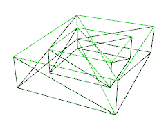
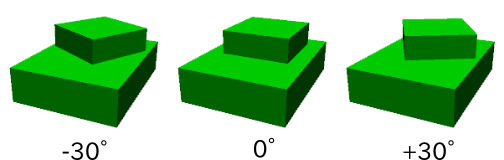
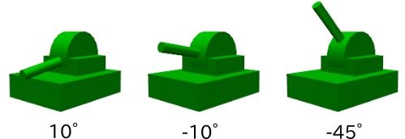

New YAML format model file tutorial
===================================

.. contents::
   :local:
   :depth: 2

.. highlight:: YAML

Summary
-------

The development version currently on GitHub is being created so as to use a new format of model files based on YAML. Compared to the existing OpenHRP format of model files, it allows for more concise notation and offers a high degree of flexibility. We are pursuing development towards using this to replace the OpenHRP format. Use of the YAML format is discussed in  :doc:`Additional information notation through YAML <modelfile-yaml>`. This format allows not only for describing additional information, but all information, including model files.

In this section, we describe the tutorial file format in order to explain the new model file type. This section will allow you to learn both the specifications of the new format and how to edit model files. The model file we will focus on is the Tank model.

.. image:: images/tank.png

This model consists of twin-axis joints used to move a gun turret and gun barrel, two crawlers used to move the tank, and a camera, laser range sensor, and light device. This model acts as a sample for mobile crawler-based robots, so sample projects featuring this model are bundled with Choreonoid in the form of TankJoystick.cnoid and OpenRTM-TankJoystick.cnoid.

.. note:: for details on YAML notation, please refer to the `YAML Specifications <http://www.yaml.org/spec/1.2/spec.html>`_ . A helpful set of articles on using YAML is `YAML Primer for Programmers (Introductory) <http://magazine.rubyist.net/?0009-YAML>`_ .

Basic Structure of Tank Model
-----------------------------------

The Tank model is composed of the five parts described below.

.. image:: images/tank_decomposed.png

The main part of the model is its body. On top of the body are a gun turret and gun barrel. These act as the fundamental base of the turret and consist of a section which controls yaw rotation and, on top of that part and with the gun barrel, a part controlling pitch rotation. The left and ride sides of the tank are equipped with crawlers used for movement.

These five parts are modeled as links. The body of the Tank is the center of the model and is modeled as the Root Link. Models must have one single Root Link defined. The two links of the gun turret are modeled as rotation joints. The crawlers are modeled as joints used with :doc:`continuous track simulation <../../simulation/crawler-simulation>`.

The structural links between these parts (parent-child relationship) are as follows. ::

 - Body (root)
     + Turret yaw (rotation joint) 
            + Turret pitch (rotation joint) 
     + Left crawler 
     + Right crawler

In this tutorial, the shape of each link is notated in the model file as text. This eschews the need for shape data created in CAD or other modeling tools and allows for full modeling using text files alone.
At the same time, you are certainly free to use shape data created in CAD or other modeling tools. That method is described separately.

Preparing model files
---------------------------

Model files are created as text files in YAML format. Many YAML files end with the .yaml extension, but we will use the .body extension in order to distinguish the model files from other YAML files.

When creating model files, you begin by using a text editor to create an empty file. Save it with a filename of your choice. We will use the name tank.body. The completed file is found in the model/misc path of the Choreonoid share directory. Here we will describe how the file works while giving you instructions on how to create your own.

You can refer to the :doc:`Complete Tank model file <tank>` for details on the above.

Header notation
---------------------

We first use YAML mapping to describe the model file’s headers. ::

 format: ChoreonoidBody
 formatVersion: 1.0
 angleUnit: degree
 name: Tank

As seen in the first line, this file will be read as a Choreonoid file. formatVersion is currently 1.0. If the specifications change in the future, discrete version numbers are used to identify them from each other.

angleUnit is used to specify the joint angle of the model file. We have used the degree parameter here, which indicates this in degrees. You can also indicate it in radians by using the radian parameter. Degree is generally more intuitive to use, we find.

The model name is set with the name parameter.

.. _modelfile_yaml_links:

Link notation
-----------------

For link details pertaining to a model, add the following to the links: section. ::

 links:
   -
     Link 1 (root link)
   -
     Link 2
   -
     Link 3
   ...

In this way, you can assign links of your choice using a YAML list. The notation in each link is referred to as a Link node. The first Link node written is treated as a Root link for the model.

.. _modelfile_yaml_link_node:

Link nodes
-------------

Link nodes are described using YAML mapping. The below parameters can be used as mapping elements.

.. list-table::
 :widths: 20, 80 
 :header-rows: 1

 * - Key 
   - Details
 * - name
   - The link name
 * - parent
   - The parent link. Specified with the name of the parent link (the string given for the name key). Not used for root-relative links
 * - translation
   - Relative position of link local frame to parent. For Root Links, used as default position when importing models
 * - rotation
   - The relative position of the link local frame to the parent link. Its position is described using four values that correspond to rotation axis and rotation angle (Axis-Angle format), For Root Links, this is used as the default position when reading in the mode.
 * - jointType
   - The joint type. Joints can be set as **fixed**, **free**, **revolute**, **prismatic**, or **pseudoContinousTrack**
 * - jointAxis
   - The joint axis. The orientation of this axis is specified using a list of three elements in a three-dimensional vector. The value used is vectors. Where the joint corresponds to either X, Y, or Z on the link local coordinates, the corresponding axis letter (X, Y, or Z) can be called.
 * - jointRange
   - The joint range. A list specifying a minimum and maximum value is given. The value can be set to unlimited to specify an unlimited range. Where both values are the same and their notation is negative or positive, you can list one absolute value (as a scalar value).
 * - jointId
   - The joint ID. Specified using an integer of 0 or above. You can specify any value provided it does not overlap within the model. Where the link is not a joint (a Root Link or a jointType of the fixed class), or where no access is needed via ID, you can leave this blank.
 * - centerOfMass
   - Center of gravity. Specified with link local coordinates
 * - mass
   - Mass [kg]
 * - inertia
   - The moment of inertia. Gives a list of nine inertia tensors. Given symmetry of inertia tensors, only the six elements of the top triangle can also be listed if desired
 * - elements
   - Describes child nodes serving as link elements

Body link notation
---------------------------

Let us begin by programming the Root Links to serve as the body of the Tank model. Notate the corresponding link nodes in the links section as below. ::

 links:
   -
     name: CHASSIS 
     translation: [ 0, 0, 0.1 ] 
     jointType: free 
     centerOfMass: [ 0, 0, 0 ] 
     mass: 8.0 
     inertia: [
       0.1, 0,   0,
       0,   0.1, 0, 
       0,   0,   0.5 ]
     elements:
       Shape:
         geometry:
           type: Box 
           size: [ 0.45, 0.3, 0.1 ]
         appearance: &BodyAppearance
           material:
             diffuseColor: [ 0, 0.6, 0 ] 
             specularColor: [ 0.2, 0.8, 0.2 ] 
             shinines: 0.6

In YAML, the layout of indented data for each line is also prescribed, so for lines you find indented above, you must preserve that indentation when writing your code.

To define links, begin by first setting a name to identify the link. Using the below string will set the name “CHASSIS.” ::

 name: CHASSIS

Check models in progress
--------------------------------

We have not set a Root Link yet, but the model is already functional. Let’s import it into Choreonoid and check whether the notation is correct. Import the model file we have been working on as a body item and place a check next to it. You should see it appear in the scene view

.. image:: images/tank_chassis.png

If you get an error when importing or the model is not rendered correctly, check your code thus far.

To re-import a model file after making changes, provided the pre-edit file has already been imported in, you can use the re-import function to easily update it in Choreonoid. To do so, click the item you wish to update and press **Ctrl + R**. This will cause the updated file to be re-imported and (provided there are no import errors), replace the current file with its updated version. If you make changes to the shape, etc., of your model in the text file, they will appear immediately in the scene view. You can use this function to edit a text file in-place and see your changes on-the-fly, allowing for a comparatively more efficient workflow. This functionality is mentioned frequently in this tutorial, so please remember it.

Specific notation of root links
---------------------------------------

The CHASSIS link has the following notation: ::

 translation: [ 0, 0, 0.1 ]

This sets its default position when the model is read in (more accurately, it sets a root link starting point based on the world coordinates.) appearance: &BodyAppearance material: diffuseColor: [ 0, 0.6, 0 ] specularColor: [ 0.2, 0.8, 0.2 ] shinines: 0.6 name: CHASSIS translation: [ 0, 0, 0.1 ]

Translation generally refers to the offset from the parent link, but Root Links do not have parent links. Instead, they are treated based on their position relative to the world starting coordinates when imported. The initial stance is determined with the rotation parameter. If you are not concerned with the initial position, you are free to ignore these parameters.

Treating the Z coordinate as 0.1 allows us to raise the Root Link’s initial position by 0.1m on the Z axis. This lets the Root Link starting point be centered in the tank while allowing the underside of the crawlers to correspond precisely to Z=0 upon import. Environment models often use this for the floor surface, so the above settings are used to allow things to correspond.

Next, you will find the code below: ::

 jointType: free

This lets the model freely move about the space.

jointType is generally used as a parameter to specify the joint connecting to a parent link. For Root Links, the meaning is slightly different; this specifies whether the link is fixed to the environment or not. Specifying fixed will make the link fixed; for manipulators and other objects which are fixed to the ground, use this. For the model we are using, it moves freely and is not fixed to the floor, so use the free class.

.. _modelfile_yaml_rigidbody_parameters:

Rigid body parameter notation
---------------------------------

Links are always modeled as rigid bodies. We use centerOfMass, mass, inertia :ref:`modelfile_yaml_link_node` to set these. The CHASSIS link contains the following information: ::

 centerOfMass: [ 0, 0, 0 ] 
 mass: 8.0 inertia: [
   0.1, 0,   0,
   0,   0.1, 0, 
   0,   0,   0.5 ]

centerOfMass is given a specific gravity for the link local coordinates. The local coordinates for the CHASSIS link are set in the center of the vehicle, with specific gravity matched to that.

mass is given the mass, and inertia is given an inertia tensor matrix.

We have placed an arbitrary value for the inertia tensor, but you can use your own calculations or CAD tools to determine an appropriate number.

Inertia tensors are set as symmetric matrixes, with only the six elements of the upper triangle used. In this case, you would write this as follows: ::

 inertia: [
   0.1, 0,   0,
        0.1, 0,
             0.5 ]

Rigid bodies are specified in a standalone fashion used the RigidBody node. This is described in detail later.

.. _modelfile_yaml_chassis_shape:

Describing body shape
----------------------------

The link shape is defined with elements within the Link node. Details follow below. For the CHASSIS link, we would use the following: ::

 Shape:
   geometry:
     type: Box 
     size: [ 0.45, 0.3, 0.1 ]
   appearance: &BodyAppearance
     material:
       diffuseColor: [ 0, 0.6, 0 ] 
       specularColor: [ 0.2, 0.8, 0.2 ] 
       shinines: 0.6

This section is a Shape node. The shape described in the scene view for the model file we imported is described here.

Shape nodes define a geometric form using the geometry parameter and the surface appearance using the appearance parameter.

Here we specify Box as the geometry type, creating a rectangular Box node. The Box node’s size is given using the length of the x, y, and z parameters as a list. You can also specify a Sphere, Cylinder, or Cone.

appearance is given a material parameter in order to describe its surface material. The following parameters can be set for material:

.. list-table::
 :widths: 20, 80 
 :header-rows: 1

 * - Key
   - Details
 * - ambientIntensity
   - A scalar value describing the refraction coefficient with respect to environmental light. The range is from 0.0 to 1.0. By default, it is set to 0.2.
 * - diffuseColor
   - The diffusion coefficient is described with RGB values. RGB is a list composed of red, green, and blue elements, with each having a range between 0.0 and 1.0.
 * - emissiveColor
   - The emissive color is given in RGB values. By default, this is disabled (all values at 0).
 * - specularColor
   - The specular coefficient is given using RGB values. By default, this is disabled (all values at 0).
 * - shinines
   - Shininess is defined as scalar values ranging from 0.0 to 1.0 The higher the value, the greater the specular highlights become. By default, it is 0.2.
 * - transparency
   - Specifies the transparency. This a scalar value ranging from 0.0 to 1.0. At 0.0, it is fully transparent. By default, it is set to 0.0.

Here we set the diffuseColor, specularColor, and shininess parameters to create a slightly metallic and glossy green material.

.. note:: notation for these shapes is, while slightly different in syntax, based on the structures, shapes, types, and parameters found in the `Shape <http://tecfa.unige.ch/guides/vrml/vrml97/spec/part1/nodesRef.html#Shape>`_ 、 `Box <http://tecfa.unige.ch/guides/vrml/vrml97/spec/part1/nodesRef.html#Box>`_ 、`Sphere <http://tecfa.unige.ch/guides/vrml/vrml97/spec/part1/nodesRef.html#Sphere>`_ 、 `Cylinder <http://tecfa.unige.ch/guides/vrml/vrml97/spec/part1/nodesRef.html#Cylinder>`_ 、 `Cone <http://tecfa.unige.ch/guides/vrml/vrml97/spec/part1/nodesRef.html#Cone>`_ 、 `Appearance <http://tecfa.unige.ch/guides/vrml/vrml97/spec/part1/nodesRef.html#Appearance>`_ 、 `Material <http://tecfa.unige.ch/guides/vrml/vrml97/spec/part1/nodesRef.html#Material>`_ , and other parameters defined in `VRML97 <http://tecfa.unige.ch/guides/vrml/vrml97/spec/>`_ . VRML97 is based on files in OpenHRP format, so if you are familiar with that format, you will be right at home here.

.. note:: As described at the beginning, in this tutorial, we use the above notation to add text for the shape of each link. You can also use shape data files you created with a modeling tool, CAD, etc. This usage is described in a separate document.

.. _modelfile_yaml_anchor:

Setting anchors
--------------------

The above code is added to as follows: ::

 appearance: &BodyAppearance

Immediately after appearance is the &BodyAppearance notation.

This is done in order to correspond to YAML’s anchor functionality; a specific name in YAML is given to a location and then this location is polled after the fact. This allows you to simply set an initial anchor for actions that are repeated, allowing you to abbreviate later code. In YAML, references to anchors are called aliases.

The material parameters set in appearance can also be applied to the :ref:`gun turret pitch axis base notation <modelfile_yaml_cannon_pitch_shape>`, so we will create an anchor to be reused in that section. For details, please see :ref:`using aliases <modelfile_yaml_alias>`.

.. _modelfile_yaml_elements:

Describing elements
-------------------------

Groups of structural element data within a model file are referred to as nodes. We have thus far described Link nodes and Shape nodes.

Some nodes also allow for including subordinate nodes as children of that node. This allows for creating a hierarchical structure. The general means of doing this is using the elements key.

Elements generally uses YAML lists to describe child nodes as below. ::

 elements:
   -
     type: node type name 
     key1: value1 
     key2: value2 
     ...
   - 
     type: node type name 
     key1: value1 
     key2: value2
   ...

The subordinate node also can contain its own elements, in which case the hierarchy is made deeper: ::

 elements:
   -
     type: node type name 
     key1: value1 
     elements:
       -
         type: node type name 
         key1: value1 
         elements:
           ...

In this way, using elements lets you combine multiple types of nodes in one piece of code.

Where there is only one type of node within an elements section, you can use an abbreviated notation. ::

 elements:
   node type name:
      key1: value1
      key2: value2
      ...

There is no major difference from the previous code but, since this does not use a list, it is a more simple form of notation.

Using this elements notation in the Link node allows us to incorporate a range of shapes, sensors, and other elements. Other nodes that allow for using elements are Transform nodes and RigidBody nodes.

.. note:: for models with multiple links, the relationship between links is a traditional hierarchical structure. Using elements within Link nodes is one way to describe this, but this model file eschews that notation. This is because doing so causes the link hierarchy to become very deep, which in turn affects the depth of the text file, making it difficult to read and edit. We notate the link hierarchy use the Link node's parent key.

Gun turret axis link notation
----------------------------------

Next, let’s code a link for the gun turret yaw, which will serve as its base. Add the below to the code you have. ::

  -
    name: CANNON_Y
    parent: CHASSIS
    translation: [ -0.04, 0, 0.08 ]
    jointType: revolute
    jointAxis: Z
    jointRange: unlimited
    jointId: 0
    centerOfMass: [ 0, 0, 0.025 ]
    mass: 4.0
    inertia: [
      0.1, 0,   0,
      0,   0.1, 0,
      0,   0,   0.1 ]
    elements:
      Shape:
        geometry:
          type: Box
          size: [ 0.2, 0.2, 0.08 ]
        appearance: *BodyAppearance

Save your file and then use the aforementioned Ctrl + R functionality to re-import the model. You should see the below model in the scene view.

.. image:: images/tank_cannon_y.png

The new piece added atop the body forms the base of the gun turret. This section is designed to rotate on the yaw, so it contains joints.

As indicated in the name parameter, this link is named CANNON_Y. As with the CHASSIS link, it is defined with rigid body parameters of centerOfMass, mass, and inertia.

As with the CHASSIS link, it uses the geometry parameter of the Box type in order to define its shape. The size parameter can be adjusted to the correct size for the gun turret base.

.. _modelfile_yaml_alias:

Use of aliases
-------------------

The above uses the same appearance parameter as the CHASSIS link, so we are simply reusing the content from  :ref:`describing body shape <modelfile_yaml_chassis_shape>` . The appearance parameter of the CHASSIS link is :ref:`set to an anchor <modelfile_yaml_anchor>` with BodyAppearance. Using the below code, ::

 appearance: *BodyAppearance

we can call those settings as a YAML alias. Adding an asterisk to an anchor name allows you to call it as an alias.

.. _modelfile_yaml_offset_position:

Describing relative link position
----------------------------------------

The CANNON_Y link is modeled as a sublink of the CHASSIS link.

To do so, we first do the following: ::

 parent: CHASSIS

This indicates that the link’s parent is the CHASSIS link.

Next, we specify the relative position (offset) of this link from the parent link. The translation parameter is used for this. For this link, we set it as: ::

 translation: [ -0.04, 0, 0.08 ]

This sets the starting point of the link as 5cm back from the CHASSIS link’s starting point and 8cm above. This position is based on the coordinate system used by the parent link.

To confirm that the offset has worked correctly, let’s try disabling the translation code. You can either delete the translation line or add a # at the beginning to comment it out, then re-import the model.

This will cause the gun turret to disappear. This is because the turret is positioned within the tank and embedded inside. Try setting the :ref:`wireframe view <basics_sceneview_wireframe>` to ON. You should see the following.

Displaying this as a wireframe allows us to see that the turret is embedded inside of the tank body.

As you can see, properly setting a link’s position requires using the translation parameters described above. Try changing this value in a range of ways and seeing what happens.

The rotation parameter can also be used to specify offset (position in the coordinate system). Offset is described as follows: ::

 rotation: [ x, y, z, θ ]

This specifies the rotational axis and the surrounding angle and is set with rotation vectors in the x, y, and z format, with θ given the rotation angle.

We will describe an actual usage case for this parameter later on.

Describing joints
------------------------

Parent-child links are generally connected by joints. The CANNON_Y link is connected to the parent CHASSIS link by way of a yaw joint, and its yaw against the CHASSIS link can be changed. This data is found in the below parameter under the CANNON_Y link. ::

 jointType: revolute
 jointAxis: Z
 jointRange: unlimited
 jointId: 0

First, we set the jointType to revolute. This causes a rotational joint to be set with the parent link. (This joint is free-rotating and is also referred to as a hinge).

jointAxis specifies the joint axis. For hinged joints, you specify the rotational joint. This is done with the letters X, Y, and Z or with three-dimensional vectors. In both cases, the joint direction is set using link local coordinates. Specifying Z allows us to set a rotational joint on the Z axis. Specifying three-dimensional vectors is done as follows: ::

 jointAxis: [ 0, 0, 1 ]

This notation lets you freely set the orientation of other axes beyond X, Y, and Z.

Generally, the Z axis is set perpendicularly, as it is in this model. This joint is used to manipulate yaw rotation. The joint’s position is set at the start of this link. Seen from the parent link, the position is that which we previously set with translation.

The jointType used is prismatic. We set the linear direction for the jointAxis parameter.

The joint range of motion is set using the jointRange parameter. We have set it as unlimited, with no restriction. To set the range, use: ::

 jointRange: [ -180, 180 ]

In this way, we list a minimum and maximum threshold. Where the absolute value of the minimum and maximum threshold is the same, this absolute value can also be written as: ::

 jointRange: 180

The jointId is set with an ID (an integer of 0 or above). IDs can be checked in the Choreonoid interface and the joint to be manipulated called with its ID. These values can also be used within the robot control program to call specific joints. The values are not assigned automatically, but must be specifically assigned a proper value when creating the model. You are not required to give every joint an ID. However, when storing joint angles and other data in an array, you will need these values to index it, so it is best to give them serial numbers starting with 0, with no omissions.

This model contains two axes – one for the yaw, and one for the pitch – so they are assigned the respective IDs of 0 and 1.

Checking joint motion
------------------------------

To check whether the joints are properly rendered, it is best to try actually moving them within the Choreonoid GUI.

Let's use the functionality we described in  :doc:`../index` - :doc:`../pose-editing`.

Let's try using the :ref:`joint slider view to shange stance <pose_editing_joint_slider_view>` . Selecting the model from the item tree view causes the joint slider view to appear as follows:

.. image:: images/jointslider0.png

You can see that the CANNON_Y joint with an ID of 0 has been defined. Try moving the slider. The rectangle corresponding to CANNON_Y on the slider will rotate on the yaw within the scene view. If the axis angles are respectively 30°, 0°, and +30°, the appearance is as follows:

We have set the joint range for CANNON_Y to unlimited, so you can move the joint slider from 360 degrees to +360 degrees. If you have restricted the range, the slider will only move within that range.

This also allows for :ref:`sceneview_forward_kinematics` . Toggle the scene view to edit mode and drag the CANNON_Y section with the mouse. The joints can be rotated to follow the movement of the mouse. If this does not work as intended, please check the configuration settings described in the above pages.

.. _modelfile_yaml_CANNON_P_description:

Gun turret pitch axis notation
-------------------------------------

Next, let’s describe the gun turret pitch axis. First add the below code underneath the links section. ::

  -
    name: CANNON_P
    parent: CANNON_Y
    translation: [ 0, 0, 0.04 ]
    jointType: revolute
    jointAxis: Y
    jointRange: [ -45, 10 ]
    jointId: 1
    elements:
      - 
        # Turnet
        type: RigidBody
        centerOfMass: [ 0, 0, 0 ]
        mass: 3.0
        inertia: [
          0.1, 0,   0,
          0,   0.1, 0,
          0,   0,   0.1 ]
        elements:
          Shape:
            geometry:
              type: Cylinder
              height: 0.1
              radius: 0.11
            appearance: *BodyAppearance

As specified in name, the link is named CANNON_P.

If we re-import our model thus far, it should look like this:

.. image:: images/tank_cannon_p.png

The gun turret pitch axis base has been added.

RigidBody nodes
-----------------------

Per the above,  :ref:`modelfile_yaml_rigidbody_parameters` is not done with Link nodes, but instead using RigidBody nodes, described later.

RigidBody nodes are specifically designed to be used for rigid body parameters, and they specify the three parameters of centerOfMass, mass, and inertia. These have the same meaning as those used in Link nodes. You can set rigid body parameters by adding these nodes below the elements section of a Link node. You can also add rigid body parameters directly to Link nodes to serve as a simplified form of notation for RigidBody nodes.

The advantages to using a RigidBody node for the rigid body parameters are:

1. Ability to share rigid body parameters
2. Ability to set coordinates freely
3. Notation involves combining multiple rigid bodies

By describing rigid body parameters as standalone nodes lets us :ref:`set anchors <modelfile_yaml_anchor>` and :ref:`use aliases <modelfile_yaml_alias>` to share the same rigid body parameters with other nodes. This is convenient when working with models composed of multiple instances of the same parts.

Standalone nodes also let us individually apply  :ref:`modelfile_yaml_transform_node` ; this lets us freely set coordinates for each rigid body parameter.

There is no limit on the number of RigidBody nodes you can define within a link, so you can also combine them as you wish. In this case, rigid body parameters drawn from RigidBody nodes within links are applied as rigid body parameters to the link in question. If you combine benefits 1 and 2 described above, you can model complex forms using multiple parts in an efficient and maintainable fashion.

The CANNON_P link contains a combination of two RigidBody links as an example of how to combine RigidBody nodes. The first is the gun turret pitch axis base we just imported, and the second is the gun turret which is attached to its end.

RigidBody is also a node that corresponds to  :ref:`element notation <modelfile_yaml_elements>` , and you can use it to incorporate other nodes. The shape described below is added to the elements section of the code. Doing so allows us to incorporate the rigid body parameters and shape within the RigidBody node, making the structure of the model easier to understand.

.. _modelfile_yaml_cannon_pitch_shape:

Gun turret pitch axis base shape notation
-----------------------------------------------

The shape of the gun turret pitch axis base is described as follows. ::

          Shape:
            geometry:
              type: Cylinder
              height: 0.1
              radius: 0.11
            appearance: *BodyAppearance

Using a Cylinder node or the geometry allows us to draw a cylinder shape. The Cylinder node takes the parameters of height and radius. The cylinder’s position and stance correspond to a flat XZ surface the center of which is a starting point, with the extrusion of both the positive and negative Y height values used to give it shape. This stance is left as-is.

Appearance uses an alias for Body Appearance, causing it to inherit the same settings as before.

Gun barrel notation
------------------------------

Let us proceed by adding the gun turret notation. Add the following code to the elements section of the CANNON_P link (ensure that the indentation is preserved). ::
	     
      - 
        # Barrel
        type: Transform
        translation: [ 0.2, 0, 0 ]
        rotation: [ 0, 0, 1, 90 ]
        elements:
          RigidBody:
            centerOfMass: [ 0, 0, 0 ]
            mass: 1.0
            inertia: [
              0.01, 0,   0,
              0,    0.1, 0,
              0,    0,   0.1 ]
            elements:
              Shape:
                geometry:
                  type: Cylinder
                  height: 0.2
                  radius: 0.02
                appearance: *BodyAppearance
	 
Re-importing the model will cause the gun barrel to appear as below.

.. image:: images/tank_cannon_barrel.png

As before, this section is described using a RigidBody node , with the shape contained within this node. We use a cylinder, with the length and radius defined to create a gun barrel.

.. _modelfile_yaml_transform_node:

Transform nodes
----------------------

The gun barrel is described by adding the following code to the top of the RigidBody node: ::

 type: Transform
 translation: [ 0.2, 0, 0 ]
 rotation: [ 0, 0, 1, 90 ]
 elements:
 
This is referred to as a Transform node.

Transform nodes are nodes used to transform the coordinates listed therein. As described in  :ref:`modelfile_yaml_offset_position` , they have the same function as the translation and rotation parameters found in Link nodes. However, they differ in that they target the nodes described below the elements section of a Link node and that they can be used by combining multiple Transform nodes.

Try disabling the Transform node in order to see its effect. You can remove the entire Transform node, or you can do as below. ::

 type: Transform
 #translation: [ 0.2, 0, 0 ]
 #rotation: [ 0, 0, 1, 90 ]
 elements:

By commenting out the translation and rotation sections, the same effect is achieved. Re-importing the model will produce the following:

.. image:: images/tank_cannon_barrel_no_transform.png

Embedded in the turret is the shape we defined for the gun turret. The position is not correct, and it is oriented to the right.

This is because the coordinate system used for cylinders created with the Cylinder node functions this way. While the gun turret pitch axis base we used before worked within this coordinate system, when using a gun turret, the position and stance must be corrected.

To do so, we insert the below into the Transform node. ::

 rotation: [ 0, 0, 1, 90 ]

The above rotates the Z axis 90 degrees and then sets the gun turret’s orientation to match the front-to-back movement (X axis) of the model. ::

 translation: [ 0.2, 0, 0 ]

The above moves the cylinder 20cm forward and sets it to the front of the gun turret.

Note that the Transform elements section contains a RigidBody node. This allows for the above coordinate transformation to be applied not only to the shape, but to the rigid body parameters defined in the RigidBody node. Put differently, we can specify the rigid body parameters using the cylinder’s local parameters, making it easier to compute specific gravity and inertia tensors.

.. _modelfile_yaml_transform_parameters:

Transform parameters
~~~~~~~~~~~~~~~~~~~~~~~~~~~

Instead of using the Transform node, we can add translation and rotation parameters directly to the node in question. These are referred to as Transform parameters.

For example, Transform parameters are compatible with RigidBody nodes, so you can add the below code below the gun turret notation. ::

      - 
        # Barrel
        type: RigidBody:
        translation: [ 0.2, 0, 0 ]
        rotation: [ 0, 0, 1, 90 ]
        centerOfMass: [ 0, 0, 0 ]
        mass: 1.0
        inertia: [
          0.01, 0,   0,
          0,    0.1, 0,
          0,    0,   0.1 ]
        elements:
     Shape:
            geometry:
              type: Cylinder
              height: 0.2
              radius: 0.02
            appearance: *BodyAppearance

All we have done is taken the translation and rotation parameters from the Transform node and used them as-is in the RigidBody. This allows for a more simple form of notation. Internally, this is the same as inserting a Transform node; you can think of this as a simplified version of that process.

Transform parameters can also be used in Shape nodes and in the device-related nodes we will describe later.

Gun turret pitch axis joint notation
-------------------------------------------------
Let us continue looking at the gun turret pitch axis joint notation. The joints of the CANNON_P link are described as follows. ::

 parent: CANNON_Y
 translation: [ 0, 0, 0.04 ]
 jointType: revolute
 jointAxis: Y
 jointRange: [ -45, 10 ]
 jointId: 1

The parent link is CANNON_Y. The joints are set within this link. The translation parameter is used to set an offset on the Z axis of 4cm from the parent link.

As with CANNON_Y, we set the joint type as revolute and created a rotational (hinged) joint. Here we give the Y axis as a pitch axis. The use of jointRange allows us to set the top movable range to 45 degrees and the bottom to 10 degrees. jointId is set to 1, a different value from that used in CANNON_Y.

Let us check the behavior of these joints. As seen below, you should see two joint interfaces corresponding to CANNON_Y and CANNON_P.

.. image:: images/jointslider01.png

You can use this slider or drag atop the scene view to move the pitch axis (CANNON_P). This allows us to change the vertical orientation of the gun barrel as seen below.

The yaw axis is treated as before, but the orientation can be changed in synch with the yaw of the gun barrel. This is because the CANNON_P link is a child link of CANNON_Y.

Device notation
-----------------------

Sensors and other equipment installed on robots defined in Choreonoid models are called devices. This tank model is equipped with a spotlight, camera, and laser range sensor. Below, we describe how to notate this.

Spotlight notation
~~~~~~~~~~~~~~~~~~~~~~~~~

First, in order to simulate a robot working in the darkness, we will need to install a light source device on it. There are various lights to use; we will use a standard spotlight found on most robots.

The device will contain various links, so we add those definitions below the elements section in the links. The light will be installed on the gun turret pitch axis in order that we can change its orientation. This allows the orientation of the light to move in synch with the gun turret yaw and pitch.

In order to achieve the above, add this code below the elements section of the CANNON_P link. ::

      -
        type: SpotLight
        name: MainLight
        translation: [ 0.08, 0, 0.1 ]
        direction: [ 1, 0, 0 ]
        beamWidth: 36
        cutOffAngle: 40
        cutOffExponent: 6
        attenuation: [ 1, 0, 0.01 ]
        elements:
          Shape:
            rotation: [ 0, 0, 1, 90 ]
            translation: [ -0.02, 0, 0 ]
            geometry:
              type: Cone
              height: 0.04
              radius: 0.025
            appearance:
              material:
                diffuseColor: [ 1.0, 1.0, 0.4 ]
                ambientIntensity: 0.3
                emissiveColor: [ 0.8, 0.8, 0.3 ]

Using type: SpotLight, we describe a Spotlight node to correspond to the spotlight device. The shape of the light is described below the elements section of the SpotLight node. Key points are described below.

* The name of the device is MainLight. Many programs that make use of devices access them by name, so set the device with this name.
* You can use :ref:`modelfile_yaml_transform_parameters` for the device node. We use the translation parameter to set the light position. This is the offset respective to the CANNON_P link. 
* Using the SpotLight direction parameter, we set the direction of the light axis. We want the light to face the front of the model, so we use the X axis.
* The parameters beamWidth, cutOffAngle, and cutOffExponent are used to set the range of the spotlight. The attenuation parameter is used to specify the degree of attenuation from the light source based on distance.
* We use a Cone node for the shape of the light. By default, the coordinates will not match, so :ref:`modelfile_yaml_transform_parameters` are used to change the orientation. In order to prevent the light source from being hidden by this shape, we shift it backwards a bit. When rendering shadows, this aspect must be taken into account.
* We set emissiveColor for the light, causing the light to appear to shine within the darkness.

Using the above notation and re-importing the model will show the light shape as follows.

.. image:: images/tank_light.png

.. note:: Note: You need not have a corresponding shape for devices installed. Even where you do, they need not necessarily be below the elements section in the device node. In this example, we have done so for greater clarity, but devices are basically separate from shapes.

Camera notation
~~~~~~~~~~~~~~~~~~~~~

Next, let’s add camera devices. As with the SpotLight node, add this below the CANNON_P link elements. ::

      - 
        type: Transform
        translation: [ 0.1, 0, 0.05 ]
        rotation: [ [ 1, 0, 0, 90 ], [ 0, 1, 0, -90 ] ]
        elements:
          -
            type: Camera
            name: Camera
            format: COLOR_DEPTH
            width: 320
            height: 240
            frameRate: 30

The camera is set using the Camera node.

This node is given a format for the images to be captured. You can set one of three parameters:

* COLOR
* DEPTH
* COLOR_DEPTH

Setting COLOR will specify a standard color image. DEPTH yields the image depth. COLOR_DEPTH obtains both at the same time. This is designed for contexts like RGBD color simulations using Kinect or other devices.

The image size (resolution) can be set using width and height parameters. We will use a width of 320 x a height of 240. The frame rate can further be specified using the frameRate parameter.

Camera position notation
~~~~~~~~~~~~~~~~~~~~~~~~~~~~

The camera position and stance are set using a Transform node inserted at the top of the Camera node. If you are working with a Camera node alone, you can simply add a Transform parameter to it, but we will be also using laser range sensors, so in order to set them in the same stance, we use the Transform node.

The camera position is set with: ::

 translation: [ 0.1, 0, 0.05 ]

This places it slightly below the light.

By default, the camera stance has a Y positive axis above the camera, with the negative Z axis in front of the camera (camera viewpoint). If you want to align the camera in a different direction, you must use the rotation parameter as per the :ref:`modelfile_yaml_transform_parameters` or :ref:`modelfile_yaml_transform_node` to change it.

In this model, the Z axis is perpendicular, so the default camera points down. TO adjust this, we specify the upper Transform node: ::

 rotation: [ [ 1, 0, 0, 90 ], [ 0, 1, 0, -90 ] ]

This sets the camera to the orientation we desire.

As explained in :ref:`modelfile_yaml_offset_position` , using rotation to specify stance involves setting a combination of rotation axis and angle. In this case, we will use two sets of these. Rotation can, in this way, be used as a list of multiple stances. In this case, the values (rotation) are applied in order, starting from the right. (Treat each value as a rotation matrix, with the multiplication of the matrix being applied to this order of operations.)

First, the [ 0, 1, 0, -90 ] notation creates a negative rotation of 90 degrees on the Y axis. This causes the camera to face the front. However, the upward orientation of the camera still corresponds to the left of the model, so the camera will appear to have fallen over. We then use an additional [ 1, 0, 0, 90 ] on the X axis to rotate it 90 degrees, lift up the camera, and obtain the image we want.

Combining these two rotations in one can be done, but understanding these combined values at a glance is difficult, as is computing them. Using combinations of multiple rotations makes it easier to notate these operations in simple text.

Laser range sensor notation
~~~~~~~~~~~~~~~~~~~~~~~~~~~~~~~~~~~

Let’s now add laser range sensor. Add the below to the elements section of the same layer as the Camera. ::

  -
    type: RangeSensor
    name: RangeSensor
    scanAngle: 90
    scanStep:  0.5
    scanRate:  10
    maxDistance: 10

In this way, laser range sensors are described using the RangeSensor node. The parameters given are scanAngle, which describes the viewing angle on the horizontal direction, scanStep, which describes the angle resolving power, scanRate, which describes the measured framerate, and maxDistance, which describes the maximum measured distance.

The sensor’s default stance (measurement direction) is the same as the camera coordinates. Applying the same Transform node as the camera allows you to set it in the same position and stance as the camera.

Sensor shape notation
~~~~~~~~~~~~~~~~~~~~~~~~~~~~~

As described above, installing a device does not necessarily require you to specify its shape. However, using a shape makes it easier to identify the place it is installed, so we will assign a shape corresponding to the camera and laser range sensors. It takes time to properly model their shapes, however, so here we use a schematic box format. Add this to the same layer as the aforementioned sensors. ::

 -
   type: Shape
     geometry:
       type: Box
       size: [ 0.04, 0.015, 0.01 ]
     appearance:
       material:
         diffuseColor: [ 0.2, 0.2, 0.8 ]
         specularColor: [ 0.6, 0.6, 1.0 ]
         shininess: 0.6

Adding this and then re-importing the model creates the blue box shape seen below.

.. image:: images/tank_camera.png

The shape is included in the Transform node, as with the sensors discussed above. This guarantees that the sensor will be at this position. This allows us to confirm that the sensor is installed in the correct position.

Crawler notation
--------------------

Lastly, we describe the crawlers.

Left crawler notation
~~~~~~~~~~~~~~~~~~~~~~~~~~~~~

Let’s begin by coding the left crawler. Return to the links layer (indented) described in :ref:`modelfile_yaml_links` and add the code below. ::

 -
   name: CRAWLER_TRACK_L
   parent: CHASSIS
   translation: [ 0, 0.2, 0 ]
   jointType: pseudoContinuousTrack
   jointId: 0
   jointAxis: [ 0, 1, 0 ]
   centerOfMass: [ 0, 0, 0 ]
   mass: 1.0
   inertia: [
     0.02, 0,    0,
     0,    0.02, 0,
     0,    0,    0.02 ]
   elements:
     Shape: &CRAWLER 
       geometry:
         type: Extrusion
         crossSection: [
           -0.2, -0.1,
            0.2, -0.1,
            0.3,  0.06,
           -0.3,  0.06,
           -0.2, -0.1
           ]
         spine: [ 0, -0.05, 0, 0, 0.05, 0 ]
       appearance:
         material:
           diffuseColor: [ 0.2, 0.2, 0.2 ]

Re-importing the model in this state adds the left crawler to the model, as seen below.

.. image:: images/tank_crawler_l.png

The crawler is attached to the vehicle body, so for this link, the parent link is again set as CHASSIS. 

The offset from the parent link is described with: ::

 translation: [ 0, 0.2, 0]

This allows the link to be on the left of the vehicle.

Crawlers are by design driven by an internal wheel over which a tread of metal or rubber is applied. However, this structure is generally difficult to simulate. The crawlers we have modeled here are pseudo crawlers drawn with one link. Since it is a single link, there is no belt tread; the crawler is a single rigid body. Its travel ability does not match that of a true crawler, but applying propelling force to the point where the crawler interacts with the environment, you can achieve a movement like an actual crawler. Details can be found in :doc:`../../simulation/crawler-simulation` .

This pseudo cloak (simplified cloak) can be used by specifying pseudoContinuousTrack for jointType.

In this case, we give jointAxis the presumed direction of the crawler wheel rotational axis. The right forward torsional rotation acts as forward locomotion against this axis. The Y axis is treated as the rotational axis here.

The crawler shape is described using a geometric node of the Extrusion type. The cross-section shape is defined using the crossSection parameter, with the spine notation used to create a three-dimensional, extruded shape. The cross-section of the crawler is treated as a base, with width extruded on the Y axis. This notation method is defined in VRML97. You can find details `VRML97 Extrusion node specifications <http://tecfa.unige.ch/guides/vrml/vrml97/spec/part1/nodesRef.html#Extrusion>`_ .

We will also :ref:`set anchors <modelfile_yaml_anchor>` for the code written here. Add an anchor called CRAWLER; this can then be repurposed for the right crawler, too.

Right crawler notation
~~~~~~~~~~~~~~~~~~~~~~~~~~~~~~~~
Let’s program the right crawler. As before, add the following below the links layer. ::

 -
   name: CRAWLER_TRACK_R
   parent: CHASSIS
   translation: [ 0, -0.2, 0 ]
   jointType: pseudoContinuousTrack
   jointId: 1
   jointAxis: [ 0, 1, 0 ]
   centerOfMass: [ 0, 0, 0 ]
   mass: 1.0
   inertia: [
     0.02, 0,    0,
     0,    0.02, 0,
     0,    0,    0.02 ]
   elements:
     Shape: *CRAWLER 

Aside from the left-right symmetry of part of these links, the content is largely the same as the left crawler. You can use an alias of the CRAWLER anchor created previously.

Import the model in again; if the model seen below is displayed, you are finished!

.. image:: images/tank.png

Describing additional devices
------------------------------------

This concludes the discussion of notation for the model itself. You can, however, also add additional information.

This is notated in the same way as discussed in :doc:`modelfile-yaml` . In that section, we describe how to combine OpenHRP format model files and YAML files. The model files we used herein are based on YAML, so you can use the notation described in :doc:`modelfile-yaml` as-is.

