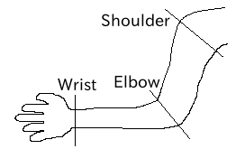
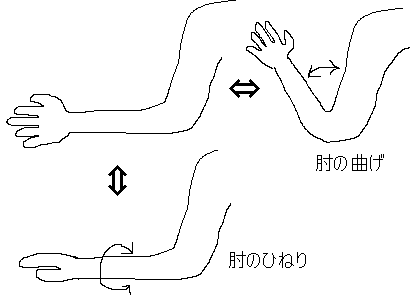
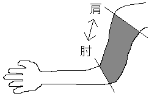

OpenHRP Model File
=====================

.. contents::
   :local:
   :depth: 1

Overview
--------

Model files in OpenHRP format is based on "VRML97", which is a language to describe three-dimensional models. One robot or environment model is described per model file. The VRML97 extension of ".wrl" is appended as the file extension.

The basic configuration of a model file consists of:

* PROTO declaration part (structure declaration part)
* Real-model definition part (instance notation part using PROTO)

The PROTO declaration part uses the node called "PROTO", which corresponds to the structure in C language, to define new nodes that are not defined by VRML97. The following nodes are defined as PROTO nodes. A model is created by building up these instances.

The following nodes are defined as nodes that define the link structure and kinetics/mechanical parameters. (These nodes are extended/modified from ones established by the "h-anim1.1" format, which is for description of human figures.)

* Humanoid node
* Joint node
* Segment node
* ExtraJoint node

A model is created through the creation of a hierarchy structure by combining instances of these nodes in the real-model definition part. For example, a humanoid robot has a structure as shown below. ::

 Humanoid sample（The root node of the whole model）
   + Joint Waist (The center of the humanoid. A free point floats in the s)
   |　....
   |
   |  + Joint Chest
   |    + Joint Head
   |    + Joint Left Arm
   |    + Joint Right Arm
   |
   + Joint Left Leg
   |
   + Joint Right Leg

This is a structure where "Waist" has a chain connected to "Left Leg" and "Right Leg" and a chain connected to "Chest", and "Chest" has a chain connected to "Head", "Left Arm", and "Right Arm".

In addition, the following PROTO nodes are available to define various sensors.

* AccelerationSensor node
* GyroSensor node
* VisionSensor node
* ForceSensor node
* RangeSensor node 

You can include sensor information in a model by using these nodes.

The following describes the details of each node.

Nodes that Define the Link Structure and Kinetics/Mechanical Parameters
-----------------------------------------------------------------------

Humanoid Node
~~~~~~~~~~~~~~

The Humanoid node is the root node of the model. ::

	PROTO Humanoid [
	  field         SFVec3f     bboxCenter        0 0 0
	  field         SFVec3f     bboxSize          -1 -1 -1
	  exposedField  SFVec3f     center            0 0 0
	  exposedField  MFNode      humanoidBody      [ ]
	  exposedField  MFString    info              [ ]
	  exposedField  MFNode      joints            [ ]
	  exposedField  SFString    name              ""
	  exposedField  SFRotation  rotation          0 0 1 0
	  exposedField  SFVec3f     scale             1 1 1
	  exposedField  SFRotation  scaleOrientation  0 0 1 0
	  exposedField  MFNode      segments          [ ]
	  exposedField  MFNode      sites             [ ]
	  exposedField  SFVec3f     translation       0 0 0
	  exposedField  SFString    version           "1.1"
	  exposedField  MFNode      viewpoints        [ ]
	]
	{
	  Transform {
	    bboxCenter       IS bboxCenter
	    bboxSize         IS bboxSize
	    center           IS center
	    rotation         IS rotation
	    scale            IS scale
	    scaleOrientation IS scaleOrientation
	    translation      IS translation
	    children [
	      Group {
		children IS viewpoints
	      }
	      Group {
		children IS humanoidBody 
	      }
	    ]
	  }
	}

.. tabularcolumns:: |p{3.0cm}|p{12.0cm}|

.. list-table:: Humanoid Node Fields
 :widths: 15,85
 :header-rows: 1

 * - Field
   - Description
 * - bboxCenter
   - Not used in OpenHRP.
 * - bboxSize
   - Not used in OpenHRP.
 * - center
   - See "center" described for the Joint node.
 * - humanoidBody
   - Field which child nodes belong to. 0 or more Joint nodes and 0 or 1 Segment nodes belong to this field.
 * - info
   - Field that describes comment regarding the model.
 * - joints
   - Field that stores a list of defined Joints.
 * - name
   - Field that specifies the name of the model.
 * - rotation
   - See "rotation" described for the Joint node.
 * - scale
   - See "scale" described for the Joint node.
 * - scaleOrientation
   - See "scaleOrientation" described for the Joint node.
 * - segments
   - Field that stores a list of defined Segments.
 * - sites
   - Not used in OpenHRP.
 * - translation
   - See "translation" described for the Joint node.
 * - version
   - Field that specifies the version number of the model.
 * - viewpoints
   - Field that specifies the positions of viewpoints in a virtual environment.

.. note:: Ensure that there is only one Humanoid node, which is the root node of the model. Also ensure that the joints and segments fields of the Humanoid node list all the Joint and Segment names, respectively, that are used in the model.

Joint Node
~~~~~~~~~~~

A Joint node defines a link frame. ::

	PROTO Joint [
	  exposedField     SFVec3f      center              0 0 0
	  exposedField     MFNode       children            []
	  exposedField     MFFloat      llimit              []
	  exposedField     MFFloat      lvlimit             []
	  exposedField     SFRotation   limitOrientation    0 0 1 0
	  exposedField     SFString     name                ""
	  exposedField     SFRotation   rotation            0 0 1 0
	  exposedField     SFVec3f      scale               1 1 1
	  exposedField     SFRotation   scaleOrientation    0 0 1 0
	  exposedField     MFFloat      stiffness           [ 0 0 0 ]
	  exposedField     SFVec3f      translation         0 0 0
	  exposedField     MFFloat      ulimit              []
	  exposedField     MFFloat      uvlimit             []
	  exposedField     SFString     jointType           ""
	  exposedField     SFInt32      jointId             -1
	  exposedField     SFVec3f      jointAxis           0 0 1

	  exposedField     SFFloat      gearRatio           1
	  exposedField     SFFloat      rotorInertia        0
	  exposedField     SFFloat      rotorResistor       0
	  exposedField     SFFloat      torqueConst         1
	  exposedField     SFFloat      encoderPulse        1
	]
	{
	  Transform {
	    center           IS center
	    children         IS children
	    rotation         IS rotation
	    scale            IS scale
	    scaleOrientation IS scaleOrientation
	    translation      IS translation
	  }
	}

.. tabularcolumns:: |p{2.5cm}|p{12.5cm}|

.. list-table:: Joint Node Fields
 :widths: 15,85
 :header-rows: 1

 * - Field
   - Description
 * - name
   - Field that specifies the Joint name.
 * - translation
   - Field that sets the position in the local coordinate system. Specify an offset value relative to the parent node.
 * - rotation
   - Field that sets the posture in the local coordinate system. Specify an offset relative to the parent node.
 * - center
   - Field that specifies the position of the joint rotation center. Specify an offset relative to the origin of the local coordinate system.
 * - children
   - Field which child nodes belong to. 0 or more Joint nodes and 0 or 1 Segment nodes belong to this field.
 * - jointType
   - Field that is used to set the joint type. Specify free, slide, rotate, or fixed. "free" enables translation along any axis and rotation around any axis. This value is set for the root link of a model for which the root link is not fixed (6 degrees of freedom). "rotate" enables rotation only around the axis specified in jointAxis (1 degree of freedom). "slide" makes the joint a linear motion joint that translates only along the axis specified in jointAxis (1 degree of freedom). "fixed" fixes the joint (0 degrees of freedom).
 * - jointId
   - Field that is used to specify the joint number. jointId is used when attribute values, such as joint angle, are arranged and stored in an array. It is used to specify in which element in the array an attribute value is stored. In many cases in robot controller development, only controllable joints allows their joint angles to be read or specified. Therefore, it can be considered that jointId is assigned such a joint (which is not an imperative). The following rules apply when assigning the Ids: jointIds start from 0. A continuous sequence of integers are used for jointIds. (There should be no gap or overlap.)
 * - jointAxis
   - Field that is used to specify the axis of the joint. In OpenHRP version 2 or earlier, the axis is specified using a character string "X", "Y", or "Z". In OpenHRP 3 or later, however, an axis of any direction can be specified using a vector. Although the specification method for earlier versions is also supported, use the new specification method from now on.
 * - ulimit
   - Field that specifies the upper limit [rad] of the joint rotation angle. (Default value: "+∞")
 * - llimit
   - Field that specifies the lower limit [rad] of the joint rotation angle. (Default value: "-∞")
 * - uvlimit
   - Field that specifies the upper limit [rad/s] of the joint rotation angular velocity. (Default value: "+∞")
 * - lvlimit
   - Field that specifies the lower limit [rad/s] of the joint rotation angular velocity. (Default value: "-∞")
 * - gearRatio
   - Gear ratio: If the reduction ratio from the motor to the joint is 1/100, write 100.
 * - gearEfficiency
   - Efficiency of the decelerator. If the efficiency is 60%, write 0.6. If this field is not present, a decelerator with an efficiency of 100% is assumed.
 * - rotorInertia
   - Moment of inertia of the motor rotor [kgm^2].

.. note:: Normally, ulimit, llimit, uvlimit, and lvlimit are not used in a simulation. These are parameters defined for the controller to read the values to control the joint not to exceed the limits.

A joint is defined by using the Joint node. The Joint node contains link frame information. The parent-child relationship of joints directly corresponds to the parent-child relationship of Joint nodes. For example, consider a human arm. Joints of a human arm are arranged the order of "shoulder -> elbow -> wrist". In this case, the link structure is defined using Joint nodes as shown in the figure below.

	Arm Link Structure

When you want to assign n degrees of freedom (where n is equal to or greater than 2) to a joint, you can consider that the joint consists of n number of joints that share the same origin. In this case, define n number of Joints, using common origin for link frames. For example, a human elbow can be considered to have two degrees of freedom as shown in the figure below. In this case, the definition should be as follows.

	Elbow Link Structure

In this case, the definition should be as follows.

.. code-block:: yaml

 DEF Elbow0 Joint {      #← Elbow bending motion
   children [
     DEF Elbow1 Joint {  #← Elbow twisting motion

       :
       :
       :
     }
   ]
   translation 0 0 0  #← Place all joints at origin
 } 

Segment Node
~~~~~~~~~~~~~

A Segment node defines a link shape.

.. code-block:: yaml

	PROTO Segment [
	  field         SFVec3f   bboxCenter        0 0 0
	  field         SFVec3f   bboxSize          -1 -1 -1
	  exposedField  SFVec3f   centerOfMass      0 0 0
	  exposedField  MFNode    children          [ ]
	  exposedField  SFNode    coord             NULL
	  exposedField  MFNode    displacers        [ ]
	  exposedField  SFFloat   mass              0 
	  exposedField  MFFloat   momentsOfInertia  [ 0 0 0 0 0 0 0 0 0 ]
	  exposedField  SFString  name              ""
	  eventIn       MFNode    addChildren
	  eventIn       MFNode    removeChildren
	]
	{
	  Group {
	    addChildren    IS addChildren
	    bboxCenter     IS bboxCenter
	    bboxSize       IS bboxSize
	    children       IS children
	    removeChildren IS removeChildren
	  }
	}

.. tabularcolumns:: |p{3.0cm}|p{12.0cm}|

.. list-table:: Segment Node Fields
 :widths: 15,85
 :header-rows: 1

 * - Field
   - Description
 * - bboxCenter
   - Not used in OpenHRP.
 * - bboxSize
   - Not used in OpenHRP.
 * - centerOfMass
   - Field that specifies the position of the center of gravity.
 * - children
   - Field which child nodes belong to. Add here a node for which the shape to be defined.
 * - coord
   - Not used in OpenHRP.
 * - displacers
   - Not used in OpenHRP.
 * - mass
   - Field that specifies the mass.
 * - momentsOfInertia
   - Field that defines the tensor of inertia around the position of the center of gravity.
 * - name
   - Field that specifies the Segment name.
 * - addChildren
   - Not used in OpenHRP.
 * - removeChildren
   - Not used in OpenHRP.

A link shape is defined by a Segment node. Multiple Segment nodes can be set as child nodes of a Joint node. A Segment node can also be written as a child node of a Transform node.

.. code-block:: yaml

	DEF JOINT1 Joint {
	  children [
	    DEF SEGMENT1 Segment {
	      children [
		  :
	      ]
	    }
	    Transform {
	      translation 0 0 0.5
	      rotation 1 0 0 1.57
	      children DEF SEGMENT2 Segment {
		children [
		  :
		]
	      }
	    }
	  ]
	}

For example, if you want to define a shape of the part from the human shoulder to elbow and the shape belongs to a shoulder link frame, the link fame should be as shown in the figure below.

	Elbow Link Frame

.. code-block:: yaml

	DEF Shoulder Joint {
	  children [
	    DEF ShoulderToelbow Segment {
	      children [
		:
		:    #←Specify the actual shape.
		:
	      ]
	    }
	    DEF Elbow Joint {
		:
		:
		:
	    }
	  ]
	}

Define the actual shape in the children field of the Segment node. It is recommended to use a modeling tool to define a shape. For a simple shape, you can also edit the file manually using a text editor.

ExtraJoint Node
~~~~~~~~~~~~~~~~

An ExtraJoint node defines a closed link mechanism. Supposing that a joint of a closed link is connected with a ball joint, generate restricting force so that two links are not separated from each other.

.. code-block:: yaml

	PROTO ExtraJoint [
	  exposedField SFString link1Name 	""
	  exposedField SFString link2Name 	""
	  exposedField SFVec3f  link1LocalPos 	0 0 0
	  exposedField SFVec3f  link2LocalPos 	0 0 0
	  exposedField SFString jointType 	"xyz"
	  exposedField SFVec3f  jointAxis 	1 0 0
	]
	{
	}

.. tabularcolumns:: |p{3.0cm}|p{12.0cm}|

.. list-table:: ExtraJoint Node Fields
 :widths: 15,85
 :header-rows: 1

 * - Field
   - Description
 * - link1Name
   - Specifies the name of the joint receiving the ball joint.
 * - link2Name
   - Specifies the name of the joint to which the ball joint is attached.
 * - link1LocalPos
   - Specifies the restricting position of the link1Name joint in terms of the local coordinates of the joint.
 * - link2LocalPos
   - Specifies the restricting position of the link2Name joint in terms of the local coordinates of the joint.
 * - jointType
   - Specifies the number of axes to be restricted. xyz: 3 axes that are at right angles to one another; xy: 2 axes that are at right angles to the axis specified by jointAxis; z: 1 axis specified by jointAxis
 * - jointAxis
   - Specifies the unit vector in terms of the local coordinates of the link1Name joint. The meaning of the vector varies depending on the value of jointType.

As a sample of a closed link mechanism, "model/misc/ClosedLinkSample.wrl" is in the share directory. Use it as a reference.

.. _oepnrhp_modelfile_sensors:

Nodes that Define Various Sensors
---------------------------------

AccelerationSensor Node
~~~~~~~~~~~~~~~~~~~~~~~~

An AccelerationSensor node defines a 3-axis acceleration sensor.

.. code-block:: yaml

	PROTO AccelerationSensor [
	  exposedField SFVec3f    maxAcceleration -1 -1 -1
	  exposedField SFVec3f    translation     0 0 0
	  exposedField SFRotation rotation        0 0 1 0
	  exposedField SFInt32    sensorId        -1
	]
	{
	  Transform {
	    translation IS translation
	    rotation    IS rotation
	  }
	}

.. tabularcolumns:: |p{3.0cm}|p{12.0cm}|

.. list-table:: AccelerationSensor Node Fields
 :widths: 15,85
 :header-rows: 1

 * - Field
   - Description
 * - maxAcceleration
   - Specifies the maximum acceleration that can be measured.
 * - translation
   - Specifies the position in the local coordinate system, using an offset value relative to the parent node coordinate system.
 * - rotation
   - Specifies the posture in the local coordinate system, using an offset value relative to the parent node coordinate system.
 * - sensorId
   - Specifies the ID of the sensor. Assign a continuous sequence of sensor ID numbers in the order from 0 to the sensors of the same type in a model, ensuring that there is no gap or overlap. These IDs are used to determine the order in which data from sensors of the same type is arranged.

	
Put a sensor node under the Joint node to which the corresponding sensor is attached. For example, if an acceleration sensor is attached to the WAIST of the sample model, write as follows:

.. code-block:: yaml

	DEF WAIST Joint
	{
	     :
	  children [
	    DEF gsensor AccelerationSensor
	    {
		:
	    }
	     :
	  ]
	}

GyroSensor Node
~~~~~~~~~~~~~~~~

A Gyro node defines a 3-axis angular velocity sensor.

.. code-block:: yaml

	PROTO Gyro [
	  exposedField SFVec3f    maxAngularVelocity -1 -1 -1
	  exposedField SFVec3f    translation        0 0 0
	  exposedField SFRotation rotation           0 0 1 0
	  exposedField SFInt32    sensorId           -1
	]
	{
	  Transform {
	    translation IS translation
	    rotation    IS rotation
	  }
	}

VisionSensor Node
~~~~~~~~~~~~~~~~~~

An VisionSensor node defines a vision sensor.

.. code-block:: yaml

	PROTO VisionSensor
	[
	  exposedField  SFVec3f     translation       0 0 0
	  exposedField  SFRotation  rotation          0 0 1 0
	  exposedField  SFFloat     fieldOfView       0.785398
	  field         SFString    name              ""
	  exposedField  SFFloat     frontClipDistance 0.01
	  exposedField  SFFloat     backClipDistance  10.0
	  exposedField  SFString    type              "NONE"
	  exposedField  SFInt32     sensorId          -1
	  exposedField  SFInt32     width             320
	  exposedField  SFInt32     height            240
	  exposedField  SFFloat     frameRate         30
	]
	{
	  Transform
	  {
	    translation IS translation
	    rotation    IS rotation
	  }
	}

.. tabularcolumns:: |p{3.0cm}|p{12.0cm}|

.. list-table:: VisionSensor Node Fields
 :widths: 15,85
 :header-rows: 1

 * - Field
   - Description
 * - translation
   - Specifies the position of the viewpoint relative to the parent node coordinate system.
 * - rotation
   - Specifies the posture of the viewpoint relative to the parent node coordinate system. The posture of the viewpoint is defined as follows: Forward viewing direction: Negative direction of the Z-axis in the local coordinate system; Upper viewing direction: Positive direction of the Y-axis in the local coordinate system. Sight line vector
 * - fieldOfView
   - Specifies the viewing angle of the camera. The unit is rad, and a value of (0, pi) can be set.
 * - name
   - Specifies the name of the sensor.
 * - frontClipDistance
   - Specifies the distance from the viewpoint to the front clip surface.
 * - backClipDistance
   - Specifies the distance from the viewpoint to the rear clip surface.
 * - type
   - Specifies the type of information to be acquired from the sensor. "COLOR": Acquires color information. "DEPTH": Acquires depth information. "COLOR_DEPTH": Acquires color and depth information. "NONE": Does not acquire none of the information.
 * - sensorId
   - Specifies the ID of the sensor.
 * - width
   - Specifies the width of images.
 * - height
   - Specifies the height of images.
 * - frameRate
   - Specifies how many images the camera outputs per second.
   
	
ForceSensor Node
~~~~~~~~~~~~~~~~~

A ForceSensor node defines a force-torque sensor.

.. code-block:: yaml

	PROTO ForceSensor [  
	  exposedField SFVec3f maxForce -1 -1 -1
	  exposedField SFVec3f maxTorque -1 -1 -1
	  exposedField SFVec3f translation 0 0 0
	  exposedField SFRotation rotation 0 0 1 0
	  exposedField SFInt32 sensorId -1
	]
	{
	  Transform {
	translation IS translation
	    rotation IS rotation
	  }
	}

.. tabularcolumns:: |p{3.0cm}|p{12.0cm}|
	
.. list-table:: ForceSensor Node Fields
 :widths: 15,85
 :header-rows: 1

 * - Field
   - Description
 * - maxForce
   - Sets the maximum value of force that can be measured.
 * - maxTorque
   - Sets the maximum value of torque that can be measured.
 * - translation
   - Specifies the position in the local coordinate system, using an offset value relative to the parent node coordinate system.
 * - rotation
   - Specifies the posture in the local coordinate system, using an offset value relative to the parent node coordinate system.
 * - sensorId
   - Specifies the ID of the sensor.
	

RangeSensor Node
~~~~~~~~~~~~~~~~~

A RangeSensor node defines a range sensor.

.. code-block:: yaml

	PROTO RangeSensor [
	   exposedField SFVec3f    translation       0 0 0
	   exposedField SFRotation rotation          0 0 1 0
	   exposedField MFNode     children          [ ]
	   exposedField SFInt32    sensorId          -1
	   exposedField SFFloat    scanAngle         3.14159 #[rad]
	   exposedField SFFloat    scanStep          0.1     #[rad]
	   exposedField SFFloat    scanRate          10      #[Hz]
	   exposedField SFFloat    maxDistance	    10
	]
	{
	   Transform {
	     rotation         IS rotation
	     translation      IS translation
	     children         IS children
	   }
	}

.. tabularcolumns:: |p{3.0cm}|p{12.0cm}|

.. list-table:: RangeSensor Node Fields
 :widths: 15,85
 :header-rows: 1

 * - Field
   - Description
 * - translation
   - The position of the sensor relative to the link to which this sensor is attached.
 * - rotation
   - The posture of the sensor relative to the link to which this sensor is attached. In the sensor coordinate system, the Z-axis negative direction is the measurement front, and the measurement surface at the time of scanning is the X-Z plane. Since this is the same as for VisionSensor, if you modify a model for which VisionSensor has been used alternatively, the posture can be used without change.
 * - sensorId
   - The serial number of RangeSensor. The serial numbers are assigned to RangeSensors attached to this robot.
 * - scanAngle
   - The angle at which the range is scanned [rad]. Angles in the range of scanAngle are measured in steps of an angle of multiples of scanStep in both directions from 0 degrees. If the sensor has no scan function, set a value of 0.
 * - scanStep
   - Step size in degrees with which distance measured during scanning.
 * - scanRate
   - The number of scans to be performed per second [Hz].
 * - maxDistance
   - The maximum distance that can be measured [m].

