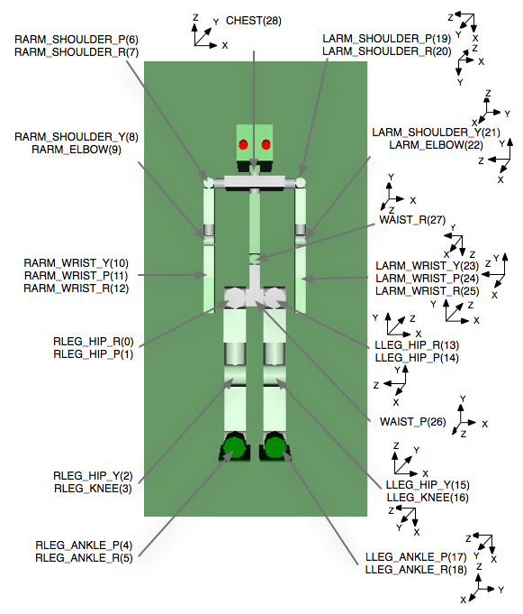
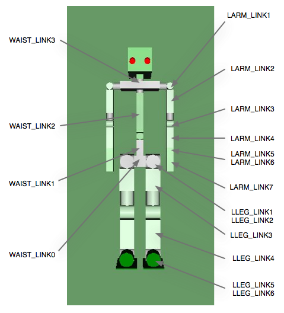

SR1 Sample Model
=================

This section describes what the "SR1" model, which is a sample model of a simple humanoid robot, represents.

This model is described in the following files under the model/SR1 directory in the share directory.

* SR1.wrl: Main model file
* SR1.yaml: Additional information file

This section introduces the description contents of "SR1.wrl", which is the main model file. For the contents of the additional information file, see the next section, :doc:`modelfile-yaml` . (Normally in Choreonoid, load the additional information file of a model if available, rather than writing the information.)

Joint Structure
---------------

The SR1 model consists of one waist joint (WAIST), four trunk joints (WAIST_JOINT0 to CHEST), two head joints (HEAD_JOINT0 and HEAD_JOINT1), 16 arm joints (LARM_SHOULDER_P to LARM_WRIST_R and RARM_SHOULDER_P to RARM_WRIST_R), and 14 leg joints (LLEG_HIP_R to LLEG_ANKLE_R and RLEG_HIP_R to RLEG_ANKLE_R), and has the following Joint-Segment hierarchy structure. For the correspondence between the Joint position and the coordinate system set for each Joint and between the Segment name and the actual link, see the figure below.

.. code-block:: yaml

	(Joint Joint node name: Segment Segment node name)
	Humanoid SAMPLE
	|
	| # Root
	+-humanoidBody
	  |
	  | # Upper half body
	  +-Joint WAIST : Segment WAIST_LINK0
	  |   Joint WAIST_P : Segment WAIST_LINK1
	  |     Joint WAIST_R : Segment WAIST_LINK2
	  |       Joint CHEST : Segment WAIST_LINK3
	  |       |
	  |       | # Cameras
	  |       +-VisionSensor VISION_SENSOR1
	  |       +-VisionSensor VISION_SENSOR2
	  |       |
	  |       | # Left arm
	  |       +-Joint LARM_SHOULDER_P : Segment LARM_LINK1
	  |       |   Joint LARM_SHOULDER_R : Segment LARM_LINK2
	  |       |     Joint LARM_SHOULDER_Y : Segment LARM_LINK3
	  |       |       Joint LARM_ELBOW : Segment LARM_LINK4
	  |       |         Joint LARM_WRIST_Y : Segment LARM_LINK5
	  |       |           Joint LARM_WRIST_P : Segment LARM_LINK6
	  |       |             Joint LARM_WRIST_R : Segment LARM_LINK7
	  |       |
	  |       | # Right arm
	  |       +-Joint RARM_SHOULDER_P : Segment RARM_LINK1
	  |           Joint RARM_SHOULDER_R : Segment RARM_LINK2
	  |             Joint RARM_SHOULDER_Y : Segment RARM_LINK3
	  |               Joint RARM_ELBOW : Segment RARM_LINK4
	  |                 Joint RARM_WRIST_Y : Segment RARM_LINK5
	  |                   Joint RARM_WRIST_P : Segment RARM_LINK6
	  |                     Joint RARM_WRIST_R : Segment RARM_LINK7
	  |
	  | # Left Leg
	  +-Joint LLEG_HIP_R : Segment LLEG_LINK1
	  |   Joint LLEG_HIP_P : Segment LLEG_LINK2
	  |     Joint LLEG_HIP_Y : Segment LLEG_LINK3
	  |       Joint LLEG_KNEE : Segment LLEG_LINK4
	  |         Joint LLEG_ANKLE_P : Segment LLEG_LINK5
	  |           Joint LLEG_ANKLE_R : Segment LLEG_LINK6
	  |
	  | # Right Leg
	  +-Joint RLEG_HIP_R : Segment RLEG_LINK1
		Joint RLEG_HIP_P : Segment RLEG_LINK2
		  Joint RLEG_HIP_Y : Segment RLEG_LINK3
		    Joint RLEG_KNEE : Segment RLEG_LINK4
		      Joint RLEG_ANKLE_P : Segment RLEG_LINK5
			Joint RLEG_ANKLE_R : Segment RLEG_LINK6

	Position and Coordinate System of Each Joint of the Robot

	Segment Name Corresponding to Each Link of the Robot

Vision Sensor
-------------

As described above, two vision sensors are attached under CHEST.

.. code-block:: yaml

	CHEST
	  +-VisionSensor VISION_SENSOR1
	  +-VisionSensor VISION_SENSOR2

The coordinate systems of the vision sensors are as shown in Figure 6. The red axis is the X-axis; green, the Y-axis; and blue, the Z-axis. The direction of the sight line is the negative direction of the Z-axis. For specific numerical values of the position and posture, see sample.wrl.

.. figure:: images/cameracs.png
	:align: center

	Coordinate Systems of the Vision Sensors
