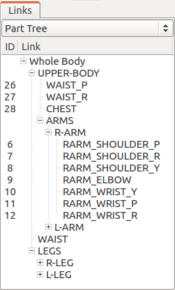

.. highlight:: yaml

Writing Additional Information in YAML
======================================

Choreonoid can load model files in OpenHRP format, and also is designed to enable you to write additional information in combination with a file in YAML format. If an additional information file is available for the model, load the file to make best use of the functions of Choreonoid.

.. contents::
   :local:
   :depth: 1

Additional Information of the SR1 Sample Model
----------------------------------------------

The following is the contents of the additional information file (SR1.yaml) of the SR1 sample model. A specific writing method for additional information is described later through this example. ::

 modelFile: SR1.wrl
 
 standardPose: [ 
     0, -30, 0,  60, -30, 0,
    20, -10, 0, -40,   0, 0, 0,
     0, -30, 0,  60, -30, 0,
    20,  10, 0, -40,   0, 0, 0,
     0,   0, 0 
 ]
 
 linkGroup:
   - name: UPPER-BODY
     links:
       - WAIST_P
       - WAIST_R
       - CHEST
       - name: ARMS
         links:
           - name: R-ARM
             links: [ RARM_SHOULDER_P, RARM_SHOULDER_R, RARM_SHOULDER_Y,
                      RARM_ELBOW, 
                      RARM_WRIST_Y, RARM_WRIST_P, RARM_WRIST_R ]
           - name: L-ARM
             links: [ LARM_SHOULDER_P, LARM_SHOULDER_R, LARM_SHOULDER_Y, 
                      LARM_ELBOW, 
                      LARM_WRIST_Y, LARM_WRIST_P, LARM_WRIST_R ]
   - WAIST
   - name: LEGS
     links:
       - name: R-LEG
         links: [ RLEG_HIP_R, RLEG_HIP_P, RLEG_HIP_Y, 
                  RLEG_KNEE, 
                  RLEG_ANKLE_P, RLEG_ANKLE_R ]
       - name: L-LEG
         links: [ LLEG_HIP_R, LLEG_HIP_P, LLEG_HIP_Y,
                  LLEG_KNEE, LLEG_ANKLE_P,
                  LLEG_ANKLE_R ]
 
 footLinks:
   - link: RLEG_ANKLE_R
     soleCenter: [ 0.05, 0.0, -0.055 ]
   - link: LLEG_ANKLE_R
     soleCenter: [ 0.05, 0.0, -0.055 ]

 defaultIKsetup:
   WAIST: [ RLEG_ANKLE_R, LLEG_ANKLE_R ]
   RLEG_ANKLE_R: [ WAIST ]
   LLEG_ANKLE_R: [ WAIST ]
 
 collisionDetection:
   excludeTreeDepth: 3
   excludeLinks: [ ]

Specifying the Main Model File
------------------------------

Since the additional information file only adds information to the main model file, you must first clearly specify which file is the main model file.

This is achieved by the following part. Write the file name after the "modelFile" key. ::

 modelFile: SR1.wrl

If the additional information file is in the same directory as the main file, writing the name of the main file is enough. If it is in a different directory, write the path relative to the directory.

Standard Posture Settings
-------------------------

Actually, the "standard posture" introduced in  :ref:`model_body_bar` in :doc:`../pose-editing` is written in the additional information file. This is achieved by the following part. ::

 standardPose: [ 
     0, -30, 0,  60, -30, 0,
    20, -10, 0, -40,   0, 0, 0,
     0, -30, 0,  60, -30, 0,
    20,  10, 0, -40,   0, 0, 0,
     0,   0, 0 
 ]

As you can see, joint angles corresponding to the standard posture are written under the "standardPose" key in the form of a list. The joint angles are arranged in the order of joint IDs, and the unit of joint angle is [degree] (for a linear motion joint, [m]).

Link Group Structure Settings
-----------------------------

The "link view" introduced in :ref:`model_structure`  in :doc:`../bodymodel` displays a list of the links of a model, allowing you to check the structure of the model. You can also select the target link of an edit operation from the view.

The link view allows you to switch the way how the model structure is displayed using the combo box at the upper part of the view. The combo box provides the display method "Body part tree" as one of its items. When the item is selected, the following display appears In the case of the SR1 model.

The view displays links that are broken down by hierarchically grouped body part. This enables you to understand the relationship between links and body parts. Therefore, this display method is also used for the choreography function with key poses.

The following part beginning with the "linkGroup" key describes such a hierarchical group structure. ::

 linkGroup:
   - name: UPPER-BODY
     links:
       - WAIST_P
       - WAIST_R
       - CHEST
       - name: ARMS
         links:
           - name: R-ARM
             links: [ RARM_SHOULDER_P, RARM_SHOULDER_R, RARM_SHOULDER_Y,
                      RARM_ELBOW, 
                      RARM_WRIST_Y, RARM_WRIST_P, RARM_WRIST_R ]
           - name: L-ARM
             links: [ LARM_SHOULDER_P, LARM_SHOULDER_R, LARM_SHOULDER_Y, 
                      LARM_ELBOW, 
                      LARM_WRIST_Y, LARM_WRIST_P, LARM_WRIST_R ]
   - WAIST
   - name: LEGS
     links:
       - name: R-LEG
         links: [ RLEG_HIP_R, RLEG_HIP_P, RLEG_HIP_Y, 
                  RLEG_KNEE, 
                  RLEG_ANKLE_P, RLEG_ANKLE_R ]
       - name: L-LEG
         links: [ LLEG_HIP_R, LLEG_HIP_P, LLEG_HIP_Y,
                  LLEG_KNEE, LLEG_ANKLE_P,
                  LLEG_ANKLE_R ]

This part describes groups and the links categorized into each group using combinations of maps and lists. "name" indicates the group name, and links and subgroups belonging to the group are written under "links".

Leg Link Settings
-----------------

For a leg-type model, clearly specify which link is a leg link and write information on leg operations. This enables you to utilize functions for leg-type models provided by Choreonoid. This is achieved by the following part. ::

 footLinks:
   - link: RLEG_ANKLE_R
     soleCenter: [ 0.05, 0.0, -0.055 ]
   - link: LLEG_ANKLE_R
     soleCenter: [ 0.05, 0.0, -0.055 ]

As you can see, information on links that correspond to legs (have soles that can be grounded on the floor) is listed under the "footLinks" key. Write information on each leg link by writing the link name after the "link" key and the center point of the sole after the "soleCenter" key using coordinates relative to the leg link. This enables you to use, for example, the :ref:`model_legged_body_bar` function.

.. note:: The center point write after "soleCenter" is assumed to be the most stable point when the projected gravity center point or the ZMP exists there, and need not necessarily be the geometric center. For example, if the stable point is near the ankle for the sake of control, set the position of the ankle in soleCenter even when the ankle is connected to a position off from the center of the sole.

.. _modelfile_yaml_preset_kinematics:

Preset Kinematics Settings
--------------------------

In "preset kinematics mode", which was described in :doc:`../pose-editing` - :ref:`model_kinematics_mode` , the mode automatically switches between forward kinematics and inverse kinematics according to the link the user tries to move. Settings for this are configured in the following part of the additional information file. ::

 defaultIKsetup:
   WAIST: [ RLEG_ANKLE_R, LLEG_ANKLE_R ]
   RLEG_ANKLE_R: [ WAIST ]
   LLEG_ANKLE_R: [ WAIST ]

The following two settings are configured here:

* When the user tries to move the WAIST link (waist), inverse kinematics is performed with both the RLEG_ANKLE_R link (right leg) and the LLEG_ANKLE_R link (left leg) fixed as base links.
* When the user tries to move the RLEG_ANKLE_R link, inverse kinematics is performed using the WAIST link as the base link.
* When the user tries to move the LLEG_ANKLE_R link, inverse kinematics is performed using the WAIST link as the base link.

In this way, simply specify the link for which inverse kinematics is to be performed in preset kinematics mode, and the base link(s) to be used in that case.

Collision Detection Settings
----------------------------

Settings related to collision detection are written under the "collisionDetection" key. ::

 collisionDetection:
   excludeTreeDepth: 3
   excludeLinks: [ ]

The "excludeTreeDepth" setting is used to exempt adjacent links in a parent-child relationship in the joint tree from self-collision. When a value of 0 is set, all pairs of links are checked for collision. When a value of 1 is set, the self-collision check is not performed on links that are directly connected each other. If you increase the value, links that are further apart from each other by the increment are also exempted from the collision check.

In "excludeLinks", you can specify the names of links to be exempted from the collision check from the first.

For a joint that is embedded in another link or a joint that has a combination of multiple rotation axes, it is normally necessary to design to prevent collision inside the joint from occurring in the movable range. However, it may take time and effort to elaborate shapes in the model file to such a degree. In contrast, the design of links covered with soft surfaces may tolerate collision. In that case, specify links to be exempted from the collision check using the above setting. This enables you to perform operations efficiently in Choreonoid.

About Other Information Description
-----------------------------------

Although main information written in the SR1 sample has been described so far, you can write any information in the additional information file, as long as it is in YAML format. The contents of the file can be read internally in Choreonoid, and each function can obtain required information through the file. If information required by a new plugin to be installed is written in the file, the functions of the plugin can be used. Even when a user develops a plugin, the user can use the file by defining required information. Thus, the additional information file in YAML can be handled flexibly and is designed to play a important role in enhancing the functions of Choreonoid.
