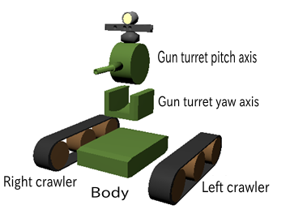
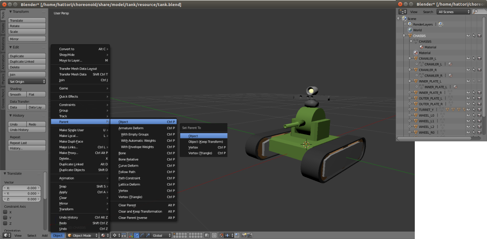
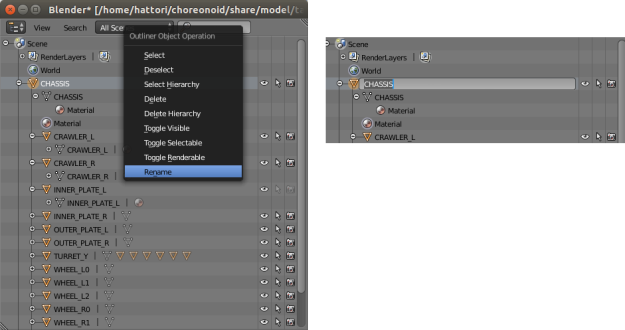
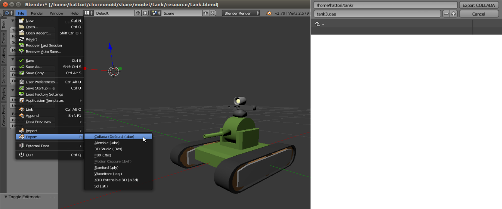

Using external mesh files
================================

Here we describe how to import as models into Choreonoid external mesh files created in CAD or other modeling tools. In this example, we use Blender, a free modeling tool, to create a mesh, but you can also import meshes created other tools using this same process.

.. contents::
   :local:
   :depth: 2
   
.. highlight:: YAML

Tank model
----------------

First we import a mesh for the Tank model, which is a fleshed-out version of the :ref:`bodyfile-tutorial-simple-tank-model` . The tank model comprises the five parts seen in the figure below.

The base is composed of the tank body. On top of the body are installed the gun turret and gun barrel. This piece acts as a foundation for the turret and consists of a rotating yaw axis and, on top of this, the gun barrel and a separate pitch axis attached to the turret. The left and right sides of the tank body are respectively outfitted with crawlers.

These five components are modeled. The tank body acts as the center of the model and is modeled as a parent object. Child objects of the tank body (the parent) are the gun turret yaw axis and crawlers. The child object of the gun turret yaw axis is the gun turret pitch axis. In addition, the gun barrel attached to the gun turret and camera light (a device) are also modeled.

The hierarchy of these objects (parent-child relationship) is as follows: ::

 - Body
     + gun turret yaw axis
            + gun turret pitch axis
     + left crawler
     + right crawler

We use a modeling tool to create the model shape above. Please refer to :doc:`modelfile-blender`  for details on actual steps to modeling the Tank.

Setting parent-child relationships
------------------------------------------

Select the child object. Next, select the parent object and, from the 3D View header, select Object > Parent > Object. The parent window will appear. Selecting Object will complete the parent-child relationship. Creating this relationship will show the hierarchy in the Outliner.

Object name settings
-------------------------------

When importing model files created with Blender into Choreonoid, if you set an object name in Blender, you can then use the object name as-is in Choreonoid. Right-click on the object displayed in the Outliner, then select Change Name to change the object’s name.

Exporting model files
----------------------------

Once you finish creating your model file, export it in Collada (.dae) format. From the Menu Bar, select File, Export, then Collada (.dae, selected by default). Enter a filename and click Export to Collada.

Importing YAML-formatted model files
--------------------------------------------

Adding the resource field underneath elements as per below lets you import the model file you created and display it in Choreonoid. The Collada (.dae) file contains the entirety of the Tank model data; specifying the object name you set in Blender for node lets you import the corresponding node parts and display them. Setting the node type as Visual lets you specify it as a display model. Setting the type as Collision lets you specify it as a collision model. ::

 links:
   -
     name: CHASSIS
     translation: [ 0, 0, 0.1 ]
     jointType: free
     centerOfMass: [ 0, 0, 0 ]
     mass: 8.0
     inertia: [
       0.1, 0,   0,
       0,   0.1, 0,
       0,   0,   0.5 ]
     elements:
       -
         type: Visual
         resource:
           uri: "resource/tank3.dae"
           node: CHASSIS 
       -
         type: Collision
         elements:
           -
             type: Shape
             translation: [ 0.0, 0.0, 0.0 ]
             geometry: { type: Box, size: [ 0.375, 0.3, 0.1 ] }
           -
             type: Shape
             translation: [ 0.20625, 0.0, 0.0 ]
             geometry: { type: Box, size: [ 0.0375, 0.3, 0.08 ] }
           -
             type: Shape
             translation: [ 0.205, 0.0, 0.04 ]
             rotation: [ 0, 1, 0, 15 ]
             geometry: { type: Box, size: [ 0.03881, 0.3, 0.01 ] }
           -
             type: Shape
             translation: [ 0.205, 0.0, -0.04 ]
             rotation: [ 0, 1, 0, -15 ]
            geometry: { type: Box, size: [ 0.03881, 0.3, 0.01 ] }
          -
            type: Shape
            translation: [ -0.20625, 0.0, 0.0 ]
            geometry: { type: Box, size: [ 0.0375, 0.3, 0.08 ] }
          -
            type: Shape
            translation: [ -0.205, 0.0, 0.04 ]
            rotation: [ 0, 1, 0, -15 ]
            geometry: { type: Box, size: [ 0.03881, 0.3, 0.01 ] }
          -
            type: Shape
            translation: [ -0.205, 0.0, -0.04 ]
            rotation: [ 0, 1, 0, 15 ]
            geometry: { type: Box, size: [ 0.03881, 0.3, 0.01 ] }
