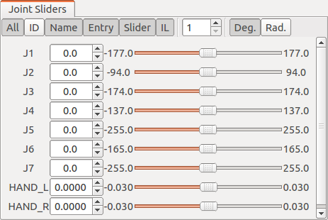
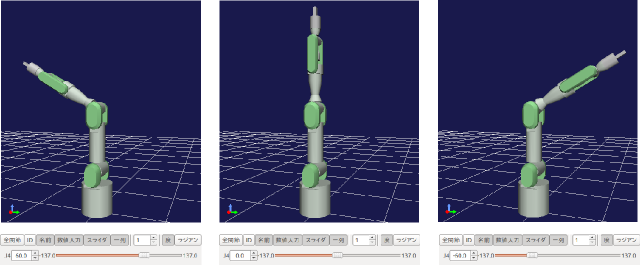
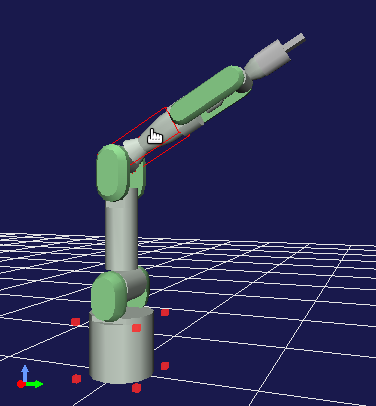
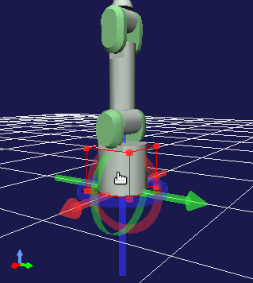
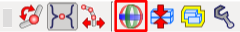
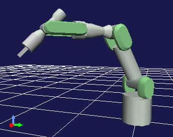
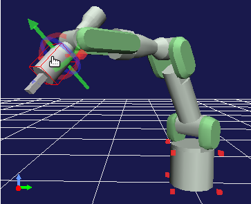
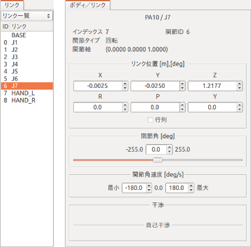

Changing the Position and Posture
=================================

This section describes how to perform basic operations to change the position and posture of a Body model.

The description here uses the PA10 model introduced in :ref:`loading_model` as an example. So, load and display the model before confirming how to perform operations in Choreonoid.

.. contents::
   :local:
   :depth: 1

Kinematics Bar
--------------

The behavior of an operation for the position and posture of a Body model varies depending on the state of the following "kinematics bar".

.. image:: images/KinematicsBar.png

The first three buttons are especially important. These buttons are designed in such a way that only one of them is turned on, and used to switch the "kinematics mode". They are:

* Forward kinematics
* Preset kinematics
* Inverse kinematics 

from the left.

There is no problem for now if the "preset kinematics" button is on (default). Details on these modes and the functions of other buttons are described later in this manual.

.. _pose_editing_joint_slider_view:

Changing the Posture Using the Joint Slider View
------------------------------------------------

To change the posture of a model, you basically change joint angles. Although various functions can achieve this, this section describes how to change joint angles using the "joint slider view", which is one of the basic views.

As preparation, select the body item of PA10 in the item tree view. This sets PA10 as the target model of the joint slider view.

.. note:: Not just when using the joint slider view, when performing an operation on a model through a view or the toolbar, you must select the target Body item beforehand to specify the target of the operation. Once you select the item, there is no problem if you deselect it later. The Body item selected last remains as the target until another Body item is selected next. Note that, when using another view or the toolbar as described in this section, you basically must also specify a Body item beforehand by performing this operation.

Then, the display of the joint slider view will be as follows.

This view has buttons for switching the display at the top. In the main area under the buttons, interfaces to display/change the states of the joints are arranged in the order of joint IDs from the top to down. The joint name, current joint angle value, minimum angle, joint angle slider, and maximum angle of each joint are arranged from the left to the right. Turn on the "ID" button at the top to also display joint ID values.

.. note:: Although the term "angle" is used here, it applies to the case in which the joints are "rotary joints". While many of the joints of a robot are rotary joints, it also has "linear motion joints". Actually, the model of PA10 has linear motion joints: "HAND_L" and "HAND_R", which correspond to the grippers at the tips of the hands. The value of the current position of a linear motion joint should be called "position", not "angle", in a normal way. However, this section uses the term "joint angle" as is for general description that covers both the former and latter.

Users can change the joint angle values and slider positions in this view. The internal state of the model and the display in the scene view change in synchronization with the user's operation. For example, change the value or slider position of the "J4" joint. Then, the joint in the middle of the arm of PA10 will bend as shown below.

You can also move other joints in the same way. Try it out.

.. _sceneview_forward_kinematics:

Changing a Joint Angle in the Scene View
----------------------------------------

You can change a joint angle by directly dragging the position of the joint with the mouse in the scene view.

This operation is performed in "edit mode", which is described in  :ref:`sceneview_editmode` in :doc:`../basics/index` - :doc:`../basics/sceneview` . Switch the scene view to the edit mode first by following the description there. Then, move the mouse cursor to the position of the J4 link, which you operated earlier, to obtain the following display.

The red markers around the bottom of the PA10 model indicate that this part is the current base link. The markers appear when the scene view is switched to the edit mode. Therefore, you can see that the view is in edit mode from the markers. The red box surrounding the J4 link indicates that the mouse cursor points to the J4 link and the link is the target of edit operations. If you move the cursor to another link, the link will be surrounded by a red box.

In this state, drag the mouse while pressing the left mouse button. Then, you can see that the J4 joint moves with mouse drag. In this way, you can change the posture by dragging joints intuitively in the scene view.

Even when you drag a joint in the scene view, the state of the above joint slider view changes synchronously. This applies not only to the joint slider view but also all the views for displaying and editing the state of a Body model. Thus, consistency on the GUI is always maintained through synchronization of the behaviors of the views.

About Base Link
--------------------

The previous section described that the red markers around the bottom of the PA10 model indicate the current base link. The term "base link" here refers to a link that is used as the starting point of kinematics calculation, and users can the base link arbitrarily.

To confirm this effect, change the base link of PA10. Change the base link using the context menu that is displayed by right-clicking while the cursor points to a link. For example, right-clicking while the mouse cursor points to the "J5" link results in the display as shown in the figure below.

.. image:: images/pa10_j5_tobase.png

Select "To base" from the context menu to set J5 as the base link. The red markers for the base link also move to the location of J5.

In this state, change the joint angle of J4 again using the joint slider view or other functions. Although the joint angle of J4 changes as before, the final posture should change as shown below.

.. image:: images/pa10_j4_inv.png

The bottom of the robot that had been fixed is now movable. In contrast, the position of the J5 link, which is now the base link, is fixed. This is because the forward kinematics calculation to obtain the position of each link from the joint angle is performed using the base link as the starting point.

As described above, you can change the part to be fixed in the posture by setting the base link. For a manipulator like PA10, the link of the base fixed to the floor is usually set as the base link, and you may rarely want to set another link as the base link. However, switching the base link can be effective depending on the shape of the robot.

.. _model_move:

Moving a Model
--------------

You can move the Body model as a whole by dragging the base link. For example, when the "BASE" link at the bottom of the PA10 model is the base link, click the link to obtain the following display.

Drag the mouse in this state to move the whole model as if it follows the drag.

By default, a marker consisting of three-colored arrows and rings (the position dragger) also appears as shown in the figure above. You can also move or even rotate (change the position of) a model by dragging the marker. Specifically, dragging an arrow part achieves translation along the axis of the arrow, and dragging a ring part achieves rotation along the outer circumference of the ring. The red, green, and blue colors of the arrows and rings correspond to X, Y, and Z axes, respectively, in the local coordinate system of the link.

You can specify whether to display the position dragger using the following button of the kinematics bar.

This button is on by default. However, if the dragger interferes with your edit operation, you can hide it by deselecting the button.

Undo and Redo of a Position/Posture Change Operation
----------------------------------------------------

When you are editing the position or posture, sometimes you may want to restore the last state. In that case, press "Ctrl + Z" while the mouse cursor points to the model in edit mode. This invokes the last position or posture. A state earlier than it can also be invoked by repeatedly performing the Undo operation.

An Redo operation is performed by pressing "Shift + Ctrl + Z". This also enables you to cancel the state restored by an Undo operation. The Redo operation can also be repeated as many times as you need.

.. _model_body_bar:

Body Bar
--------

While editing the position or posture of a model, sometimes you may want to record a state of the model and invoke the state later again or to restore the initial or standard state. The following "body bar" provides the functions to perform these operations.

.. image:: images/BodyBar.png

Click the first button from the left to record the current position and posture. You can invoke the recorded state by clicking the second button.

The third button from the left moves the position of the root link of the model to the origin position and returns the posture to its initial state (in which the local coordinate system matches the global one).

The fourth button restores the "initial posture" in which all the joint angles are zero. The fifth button changes all the joints of the model in such a way that the preset "standard posture" is restored. Although it depends on the definition of the model, the standard posture is generally different from the initial one. In the example of PA10, for example, the initial posture is one in which the arm stands upright, but the following posture is registered as the standard posture.

It is considered that when this robot actually operates as a manipulator, it rarely operate an object directly above it with an upright posture, and it often starts operating a surrounding object with the posture like this. After consideration of these matters, this posture is registered as the standard posture of the model of PA10 and distinguished from the initial posture.

.. _sceneview_inverse_kinematics:

Changing the Posture Using Inverse Kinematics
---------------------------------------------

As a method to change the posture of a model, the method to directly change the joint angle of a specific joint has been described so far. The procedure in this case is "first specify the angle of a joint and, as a result, the position and posture of each link change". Such a process is called "forward kinematics".

Although forward kinematics is one of the effective techniques to obtain a desired posture, it is very hard to obtain a desired position and posture of a certain type of link (e.g. tip of a manipulator) by using forward kinematics. So, there are cases in which you want to perform a process that is inverse of forward kinematics, that is, "specify the position and posture of a link and then the joint angle achieving them change". This is called "inverse kinematics". In Choreonoid, you can also use this technique to change the posture of a model.

Rather than reading such description, inverse kinematics may be easier to understand if you try the technique by actually moving a link. Try this by using the model of PA10. First, click the "standard posture" button of the Body bar introduced earlier in this manual to put PA10 in the standard posture. Also confirm that the "BASE" link is the base link (default).

Then, drag the link (J7) at the head of PA10. The display changes as shown in the figure below. The head link should move by following the mouse cursor. (As with when :ref:`model_move` , you can also move the link by dragging each axis of the position dragger of the head link.)

As you move the head link, you can see that the joint in the middle moves by following the link. In this way, inverse kinematics enables you to directly change the position and posture of a link. You can utilize this inverse kinematics operation when you want to intuitively move a specific link to achieve its desired position and posture.

.. note:: The reason why we first put the model in the standard posture is that the initial posture in which the manipulator stands upright is a "singular posture" of the robot, where calculation to move the head link with inverse kinematics cannot be performed. Like the "standard posture", a posture in which each joint is bent to some degree is not a singular posture. Pay attention to this point when you use inverse kinematics. However, some models have analytical solution for inverse kinematics. In that case, you can move a link without paying so much attention to singular postures, although details are not covered here.

.. _model_kinematics_mode:

Switching Kinematics Modes
--------------------------

In :ref:`sceneview_forward_kinematics` , we changed the posture using forward kinematics by dragging the J4 link of PA10 in the scene view. In addition, in :ref:`sceneview_inverse_kinematics` , we changed the posture using inverse kinematics by dragging the J7 link. For these operations, we did not explicitly specify whether to use forward kinematics or inverse kinematics. This is because Choreonoid was in a mode in which a type of kinematics was automatically selected depending on the dragged link. However, there may be cases in which you want to move the J4 link using inverse kinematics or the J7 link using forward kinematics. For such occasions, Choreonoid is designed to enable you to explicitly switch the types of kinematics. To do so, use the following three buttons at the head of the kinematics bar.

.. image:: images/KinematicsBarModeButtons.png

The center button is on by default. The button sets the "preset kinematics mode", where the type of kinematics is automatically switched depending on the link. The correspondence between links and kinematics types is predefined for each model. In the case of the PA10 model, the correspondence is as follows.

======================= =====================
 Link                    Kinematics Type
======================= =====================
 BASE, J1〜J5            Forward kinematics
 J6〜J7                  Inverse kinematics
 HAND_L, HAND_R          Forward kinematics
======================= =====================

The above correspondence relationship in preset kinematics mode is determined based on a policy that inverse kinematics should be set for links that are considered to be often moved using inverse kinematics, and is probably enough for many posture change operations. (Actually this setting is configured in  :ref:`modelfile_yaml_preset_kinematics` in :doc:`modelfile/modelfile-yaml` .）

If you want to specify a kinematics type manually, use the other two buttons. The left button is for "forward kinematics mode" and the right button is for "inverse kinematics mode". When either of the buttons is on, the selected kinematics type is applied regardless of the link to be dragged. Use an appropriate mode as needed.

Specifying the Base Link for Inverse Kinematics
-----------------------------------------------

When you perform an inverse kinematics operation in "inverse kinematics mode", the behavior varies depending on which link is specified as the base link, as with forward kinematics.

For example, turn on the inverse kinematics mode, and drag the base link of PA10. If the "BASE" link is the base link, which is the default setting, the behavior should be the same as in :ref:`model_move` , and the whole model should move. In this case, you get this result because "BASE" is the base link and also the dragged link, and there is no joint in the middle for which inverse kinematics calculation is performed.

Next, set the J7 link at the head of the arm or another link as the base link, and then drag the "BASE" link. In this case, the "BASE" link should move, while the J7 link is fixed. This is an operation that is inverse of the case in which you moved the J7 link with the "BASE" link set as the base link. Thus, you need to pay attention to the base link setting to perform an inverse kinematics operation the way you want.

However, the base link setting has no impact when you move a link set to inverse kinematics in "preset kinematics mode", which is the default kinematics mode. In this case, which link should be set as the base link to perform calculation is also preset. In the example of PA10, "BASE" is set as the base link for both the J6 and J7 links, which are set to inverse kinematics. If the setting is different from the current base link, the specified link is temporarily used as the base link when inverse kinematics is performed, without changing the original base link setting and marker indication.

.. _model_body_link_view:

Body/Link View
--------------------

You can also use the "body/link view" in the right figure below to change the position and posture of a model.

This view is used in combination with the "link view" on the left of the figure. A link to be displayed and edited in the "body/link view" is specified by selecting the link in the link view. The J7 link of the PA10 model is selected in the figure above.

.. note:: You can also select a link by switching to the edit mode in the scene view and double-clicking the link.

The index number, joint ID, joint type, joint axis vector, and other information of the link are displayed at the top.

The "link position" area under them displays the current position and posture of the target link. The position is represented by X, Y, and Z coordinate values in the global coordinate system, and the posture is represented by rotation amount values of three axes, that is, roll, pitch, and yaw. This view allows you not only to confirm the current values but also to enter a value in a numerical box to move the position or posture of the link. In this case, the way the link is moved is calculated from the current base link using inverse kinematics. (Inverse kinematics is always applied in this case independently of the kinematics mode.) Link position edit by entering a numerical value is very useful when you want to finely adjust the link position or precisely move it along an axis.

In the "Joint Angle" area, you can confirm and edit the joint angle and as with the joint slider view. The area differs from the joint slider view in that only the joint angle of the selected link is displayed and edited.

The "Joint Angular Velocity" area displays the minimum and maximum values of joint angular velocity and the current joint angular velocity. The joint angular velocity values are not updated when the posture is edited. However, it is updated when data, such as motion trajectory including a joint angular velocity value, is applied to the model.

The "Collision" area displays the names of colliding links if the target link and another link collide with each other. The following :doc:`collision-detection` describes this in detail.
