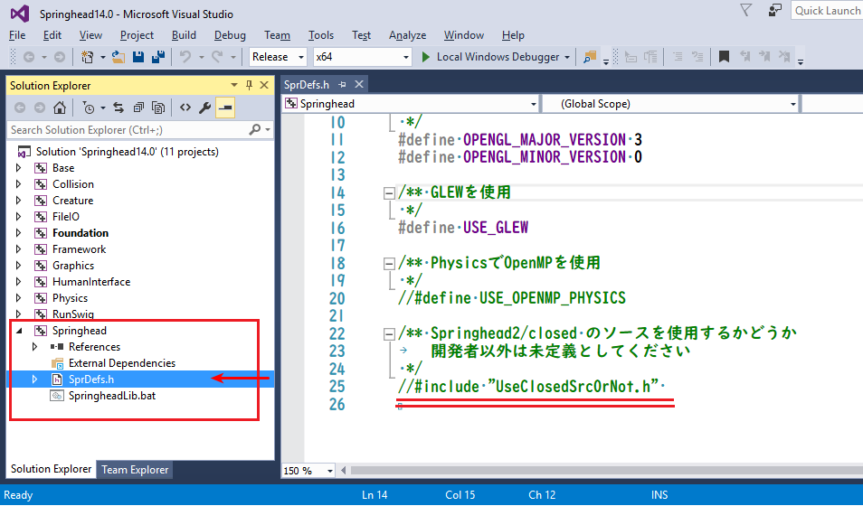
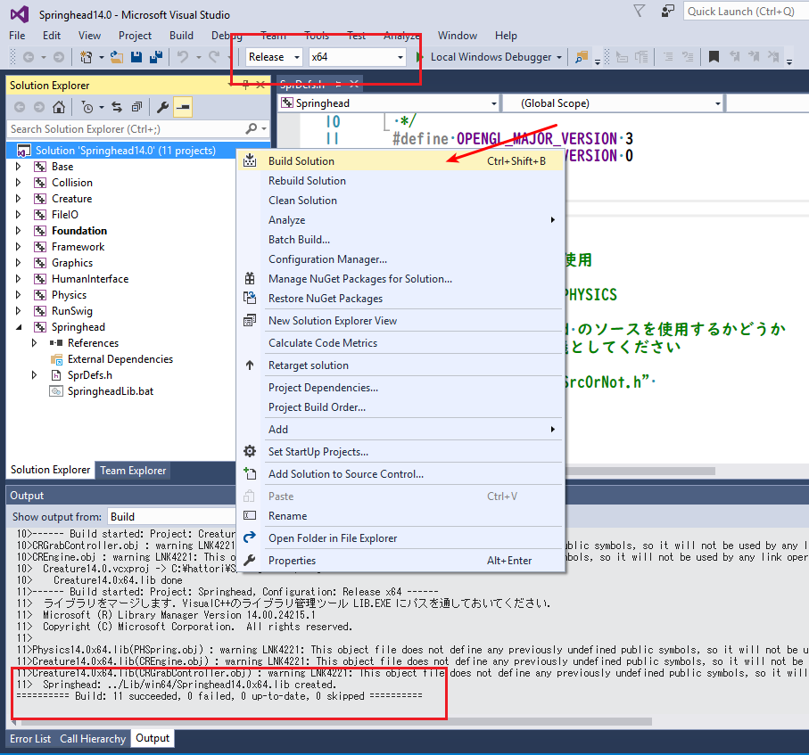

Building the Springhead plugin
==============================

.. sectionauthor:: 中岡 慎一郎 <s.nakaoka@aist.go.jp>

.. contents:: 目次
   :local:

Installing Springhead
---------------------

Springhead needs to be installed in order to use the Springhead plugin. There is a detailed explanation on the `Springhead website <http://springhead.info/wiki/index.php?top%28en%29>`_ .

The Springhead plugin is currently tested as working only on Windows.

Getting the source code
~~~~~~~~~~~~~~~~~~~~~~~
First, get the source code. The source code for Springhead is managed on GitHub. To get the latest version, go from the download link on the Springhead website. You can download it from there, or you can execute the following command to get the source code. ::

 git clone https://github.com/sprphys/Springhead.git

Building on Windows
~~~~~~~~~~~~~~~~~~~

Open the Visual Studio 2015 solution file named Springhead14.0.sln which is in Springhead/core/src.

Using Solution Explorer, click SprDefs.h in Springhead as shown in the screenshot below.

When the editor opens, comment out **#include “UseClosedSrcOrNot.h”** on the last line and save the file.

When you set the items outlined in red in the screenshot to **Release** and **x64** and right-click on **Solution ‘Springhead 14.0’**, a dropdown menu will be displayed. Select **Build Solution**.

When the build is complete and a message saying, **Springhead: ../Lib/win64/Springhead14.0x64.lib created**. is displayed, everything is okay.

Building plugins
----------------

In the CMake build settings for Choreonoid, set the **BUILD_SPRINGHEAD_PLUGIN** flag to ON and specify the path to Springhead\core with **SPRINGHEAD_DIR**.

Execution of simulation
-----------------------

Before launching Choreonoid, set the library path in the environment variable PATH (Springhead\core\bin\win64 in the above example) The settings can be done by opening the control panel and using the GUI or by using the Set command in the command prompt.

Simulation using the Springhead plugin is the same as when using  :ref:`other physics simulators <simulation_creation_and_configuration_of_simulator_item>` . It can be executed by generating the simulator item SpringheadSimulator and allocating it as a child item of the world item.

