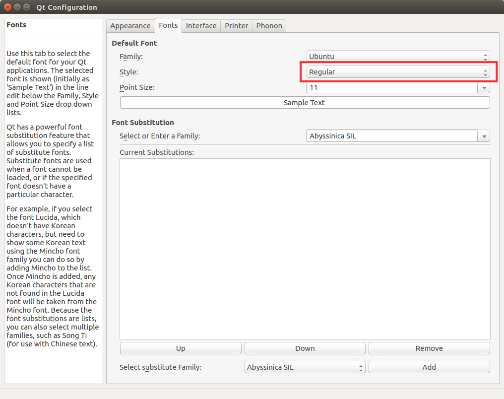
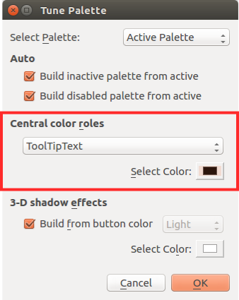

Building and Installing from Source (Ubuntu Linux)
=======================================================

.. sectionauthor:: 中岡 慎一郎 <s.nakaoka@aist.go.jp>

There are many different Linux distributions. For now, Choreonoid is officially supported in Ubuntu Linux. This document explains how to build Choreonoid from source in Ubuntu Linux. You may be able to build Choreonoid on other distributions by following these instructions, so we encourage you to try and do so if necessary.

We have confirmed that the latest development version of Choreonoid can be built on, and works normally in, Ubuntu versions 14.04 and 16.04, on x64 architecture (64-bit systems).

.. contents::
   :local:

Obtaining the source code
----------------------------------

Release version
~~~~~~~~~~~~~~~~~~~~~

You can download the source code for the release version of Choreonoid from the `download <http://choreonoid.org/ja/download.html>`_ page. Go there to download the source package that corresponds to your version of Ubuntu Linux. The source package comes as a ZIP file. Open it in the appropriate directory, for example: ::

 unzip choreonoid-1.6.0.zip

When you open the ZIP file, a directory called choreonoid-1.6.0 will be created. This directory holds the complete source code. From now on, this manual will refer to this directory as the **“source directory.”**

Development version
~~~~~~~~~~~~~~~~~~~~~~~~~~~~~

You can also use the development version of Choreonoid. This version is managed as a `git <http://git-scm.com/>`_ repository. You can find it at the following `GitHub <https://github.com/>`_ address.

- https://github.com/s-nakaoka/choreonoid

You need to run git commands to use this repository. In Ubuntu, you can install git using the following command. ::

 sudo apt-get install git

You can check out the Choreonoid repository by executing the following command. ::

 git clone https://github.com/s-nakaoka/choreonoid.git

This creates a "choreonoid" directory that holds the repository. In this directory, you can use commands such as ::

 git pull

to update to the source code to the latest available version.

For details on how to use git, see the git manual and explanatory articles.

Installing development tools and dependent software
----------------------------------------------------------

Development tools
~~~~~~~~~~~~~~~~~~~~~~~~~~~

You need the following development tools to build Choreonoid from source.

- Standard C/C++ development tool suite: You need a set of standard development tools such as a C/C++ compiler, Make, and so on. In Ubuntu, you can install these tools with the package “build-essential.” GCCC is the standard C/C++ compiler, but you can also use Clang/LLVM.
- `CMake <http://www.cmake.org/>`_ : A build tool. Use this tool to configure and generate the files of standard build tools such as Make and Visual Studio. CMake allows you to efficiently describe build methods for many environments.

Dependent libraries
~~~~~~~~~~~~~~~~~~~~~~~~~~~~

You also need the following libraries to build basic functionality.

* `Boost C++ Libraries <http://www.boost.org/>`_ : A collection of useful C++ libraries.
* `Eigen <eigen.tuxfamily.org>`_ : A high-speed, high-performance template library for matrix/vector/linear algebraic calculations.
* `Qt <http://qt-project.org/>`_ : A framework/library that includes a GUI toolkit.
* `gettext <http://www.gnu.org/s/gettext/>`_ : A tools library to support the display of multilingual messages.
* `libjpeg <http://libjpeg.sourceforge.net/>`_ : A library for reading image files in JPEG format.
* `libpng <http://www.libpng.org/pub/png/libpng.html>`_ : A library for reading image files in PNG format.
* `LibYAML <http://pyyaml.org/wiki/LibYAML>`_ : A parser for text in YAML format.
* `Assimp <http://assimp.sourceforge.net/>`_ : A library for reading 3D files in various formats.

If you want to build optional functionality, you also need the following software.

* `Python <https://www.python.org/>`_ : You need this if you want to use the “Python plugin” to run Choreonoid using the programming language Python. Normally Python is installed by default, but you will need a development library to build plugins.
* `Numpy <http://www.numpy.org/>`_ : A Python library for doing various kinds of scientific computing. You will also need Numpy for the Python plugin.
* `omniORB <http://omniorb.sourceforge.net/>`_ : An open source CORBA implementation. You need this to use the CORBA, OpenRTM, and OpenHRP plugins.
* `OpenRTM-aist <http://openrtm.org/>`_ : An implementation of RT-middleware by AIST. You need this to use the OpenRTM plugin.
* `Open Dynamics Engine (ODE) <http://www.ode.org/>`_ : A physics calculations library. You need this to use the “ODE plugin” that generates simulations using these physics calculations.
* `Bullet Physics Library <http://bulletphysics.org>`_ : A physics calculations library. You need this to use the “Bullet plugin” that generates simulations using these physics calculations.
* `GStreamer <http://gstreamer.freedesktop.org/>`_ : A library for handling media files. You need this to use the “Media plugin” that plays audio or video files in Choreonoid.
* `PulseAudio <http://www.freedesktop.org/wiki/Software/PulseAudio/>`_ : A system for generating audio output. It comes standard with Ubuntu, but you need a separate development library to build the Media plugin.
* `libsndfile <http://www.mega-nerd.com/libsndfile/>`_ : A library for reading audio files. You need this to use the Media plugin.

.. _build-ubuntu-install-packages:

Installing dependent packages
~~~~~~~~~~~~~~~~~~~~~~~~~~~~~~~~~~~~~
  
In Ubuntu, you can easily install most of the software above by running the script “install-requisites-ubuntu-x.x.sh” under “misc/script.” x.x should be your version of Ubuntu. For example, if you have Ubuntu 16.04, execute ::

 misc/script/install-requisites-ubuntu-16.04.sh

You will be prompted to enter your sudo password. After you do so, the necessary packages will be automatically installed via the package management system.

This script will install all the software above except for OpenRTM-aist and the Bullet Physics Library.

OpenRTM-aist it is currently not in any default Ubuntu package repositories. You need to install the package from an additional repository provided by the developer or build it from source. Check the OpenRTM-aist documentation for details. If you do not need the OpenRTM plugin, there is no need to install it.

While Bullet is included as a package in an official Ubuntu repository, a required file seems to be missing, which will prevent you from building the Bullet plugin. If you want to build the Bullet plugin, you need to obtain the source code from Bullet, then build it from source and install it. As with the OpenRTM plugin, there is no need to install the Bullet plugin if you do not need it. When building Bullet, set **BUILD_SHARED_LIBS** and **USE_DOUBLE_PRECISION** to "ON" in the CMake settings.

Qt is available in version 4 and version 5. Version 4 is used by default in Ubuntu. If you want to use version 5, first install the packages related to Qt5 as follows. ::

 sudo apt-get install qt5-default libqt5x11extras5-dev qt5-style-plugins

Also set **USE_QT5** in CMake to ON.

.. note:: When testing with Qt5 in Ubuntu 14.04, we found that text was garbled and Choreonoid did not work properly. We were unable to find a solution. While these issues also seem to be related to settings, we believe that Qt5 is not fully supported in Ubuntu 14.04. We recommend using Qt4. In Ubuntu 16.04, Qt5 works normally. We recommended using Qt5 in Ubuntu 16.04 because Qt4 seems to slow down the launch of Choreonoid for some reason.

.. note:: If you are using Qt5, you may notice problems with font size depending on your environment. When we tested Choreonoid on the Ubuntu Mate desktop environment with Ubuntu 16.04, for example, fonts looked far too large. We were able to fix this by resetting the resolution (dots per inch) via “Details” in the “Fonts” tab that can be found under “Appearance” in the control center.

.. note:: We recommend using Qt4 in Ubuntu 14.04. However, Choreonoid may become inoperable in this environment in some rare instances. For example, the mouse’s left-click function may stop working. Using Qt5 solves this particular problem. However, using Qt5 will cause Japanese characters in the Choreonoid interface to appear garbled. We do not have a solution for this problem yet.
 For now, you can execute the following command to display the English version of the interface instead. ::

  export LANG=C

.. _build-ubuntu-cmake:
	  
CMake build settings
---------------------------

First, use the cmake command to generate the makefile you need to build Choreonoid. In the Choreonoid source directory, execute ::

 cmake .

to find the necessary libraries and generate a makefile. (Note the period after the cmake command.)

If you are working in one of the Ubuntu versions described above, you should be able to generate a makefile without any problems. However, if the necessary libraries are not installed in the prescribed location, you may get an error when executing cmake. In that case, you will need to install the libraries properly or modify the CMake build settings. You can also change these build settings from the command line by using the cmake command. Execute the ccmake command ::

 ccmake .

to access all settings in the form of a menu. Check the CMake manual for details.

Choreonoid also has some optional functions that are not built during the default process described above. You can find a summary of these functions in :doc:`options` . If you want to use them, you can enable them in the CMake settings. For example, if you want to use the simulation function of the Open Dynamics Engine, set **BUILD_ODE_PLUGIN** to "ON."

.. note:: The directory in which CMake was executed is called the **“build directory.”** In the example above, the build directory is right under the source directory. Usually, however, you should create another directory and make that the build directory. Doing so will allow you keep the source files separate from the intermediate files that you need for the build and also allow you to use them simultaneously, giving them different settings for debugging, releasing, and so on.
 For example, this is how you create a “build” directory in the source directory and make it the build directory. ::

  mkdir build
  cd build
  cmake .. (or ccmake ..)

.. note:: When compiling with GCC in a 32-bit environment, you can enable the SSE expansion order to generate binaries with faster execution speeds for simulations and the like. You can do this by entering the following options in CMake's **ADDITIONAL_CXX_FLAGS_RELEASE** . ::

  -mtune=core2 -march=core2 -mfpmath=sse -msse -msse2 -msse3 -mssse3 -msse4 -msse4.1 -msse4.2

 When we tested this in the developer environment, enabling the expansion order increased simulation execution speed by 10% to 15%.

 The expansion order is enabled by default in a 64-bit environment, so you do not need to enable it there. Also, execution speeds in the example above seem to increase even further in a 64-bit environment compared to a 32-bit environment.

.. _install_build-ubuntu_build:

Building Choreonoid
------------------------------

If CMake successfully generates a makefile, you can use the make command to build Choreonoid. In the directory where you executed CMake (the build directory), execute ::

 make

to build Choreonoid.

If you have a multi-core CPU, you can shorten the build time by using the “-j” option to do a parallel build. For example, ::

 make -j4

will cause up to four build processes to run simultaneously. For parallel building, you can probably get the most out of your CPU if you set the number of processes at the number of logical cores plus one or two.

Also, when you use make with a makefile generated by CMake, the details of the commands you execute will not be shown. The output of the build process will be shown in a clear and uncluttered fashion. While this makes it very easy to see the progress of a build, it does not allow you to check things such as detailed GCC compilation options. If you need to see these options, execute make with the VERBOSE variable turned on, as follows: ::

 make VERBOSE=1

This will result in output that includes all command execution statements in detail.

.. _build-ubuntu_install:

Installation
----------------------

On Linux, you can run the executable file generated in the build directory as it is (without going through an installation process). If the build was successful, an executable file called “choreonoid” will have been generated in the “bin” directory inside the build directory. Execute this file. ::

 bin/choreonoid

If there are no problems with the build, this will launch the Choreonoid main window.

It is convenient that you can run the program without going through the installation process. Usually, however, you would go through this installation process and then run the executable file in the installation destination directory. To install the program, execute ::

 make install

in the build directory. A set of files needed to run the program will be installed in the specified directory.

On Linux, the default install location is “/usr/local.” You will usually need root privileges to write to this directory. Execute ::

 sudo make install

You can also change the install location by changing CMake's **CMAKE_INSTALL_PREFIX** setting. If there is no need for multiple accounts to have access to Choreonoid, you can install it anywhere in the Home directory. In that case, you also will not need sudo to install the program.

Normally, you would need have a common library path pointing to the lib directory of the install location. If you set **ENABLE_INSTALL_RPATH** to "ON," you can use the program even without that common library path.

Improving rendering speed by changing the Qt style
---------------------------------------------------------

Qt, the GUI library used by Choreonoid, has a “style” functionality that you can use to customize the appearance of various components of the GUI such as buttons. When Ubuntu is in its default state, the Qt style is set to match the appearance of “Linux GTK+,” the standard GUI library used by Linux. GTK+ has its own functions for customizing the appearance of a GUI, and Qt's GTK+ style will dynamically reflect any customizations made in GTK+.

This is very useful for giving your desktop a uniform appearance, but it seems that having Qt dynamically reflect GTK+ style settings comes with a cost. In this default state, Qt becomes very slow at rendering GUI components. This is not a serious problem for most applications. Choreonoid, however, has GUI functions such as displaying and changing a robot’s joint angle. When this is combined with movement, the program needs to render many GUI elements smoothly. If Qt's style is the default GTK+ style, GUI rendering in Choreonoid will not be smooth.

We recommend that you change the Qt style to a style that is not GTK+ to solve this problem. The way to do this is different in Qt4 and Qt5. Each method is explained below.

For Qt4
~~~~~~~~~

In Qt4, it is easiest to use the “qtconfig-qt4” GUI tool shown below. (Run this tool by executing “qtconfig-qt4” from the command line or by choosing “Qt4 Settings” from the application menu.)

In this tool, make the necessary changes to “GUI style” in the “Appearance” tab. For example, change the GUI style to the “Cleanlooks” style.

.. image:: images/qtconfig-qt4-1.png

Next, go to the “Fonts” tab and change “Style” to “Regular.” If you fail to do this, fonts will be displayed in bold.

If you change the Qt style to “Cleanlooks,” tooltips in Choreonoid will not be displayed properly. To fix this, go to “Palette Adjustment” in the “Appearance” tab, choose “Tooltips Text,” and change the font color to black. Tooltips will now be displayed properly.

Finally, go to “File” in the menu and click “Save” to implement these settings.
   
For Qt5
~~~~~~~~~

Qt5 does not seem to have anything like Qt4’s GUI tool. For Qt5, you can change the style with the environment variable “QT_STYLE_OVERRIDE.” Set a style name as follows: ::

 export QT_STYLE_OVERRIDE=style name

Fusion, Windows, and GTK+ seem to be available for use as styles. In Ubuntu, GTK+ is probably the default, and Choreonoid’s appearance will match that of GTK+. However, as we described above, this will have an impact on the program’s performance. In Ubuntu 16.04, you can install a package called qt5-style-plugins to get access to the styles Cleanlooks, Motif, and Plastique. We recommended Cleanlooks.

If you launch the Qt application after setting the style with the environment variable, Qt will use the style you set. For example, if you specify ::

 export QT_SYTLE_OVERRIDE=Cleanlooks

in the .profile file, this style will be used even if you do not specify it every time the OS is started.
