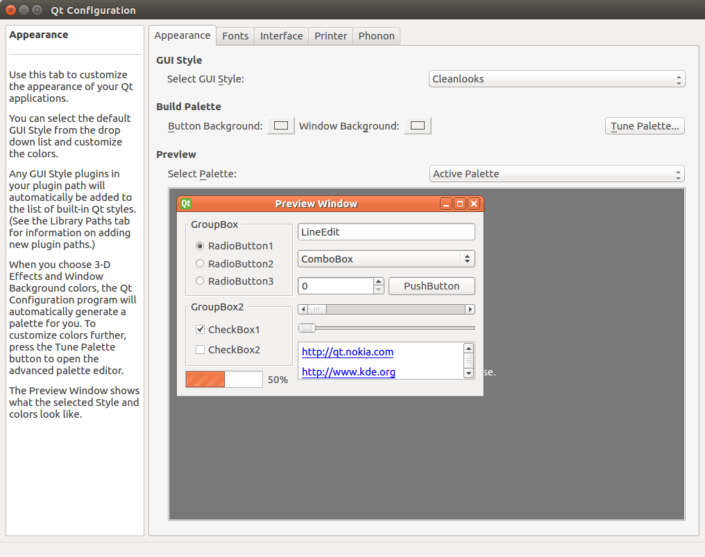

Building and Installation from Source Code (for Ubuntu Linux)
=============================================================

.. sectionauthor:: 中岡 慎一郎 <s.nakaoka@aist.go.jp>

Even though there are different distributions of Linux, currently Ubuntu Linux is the only distribution version that Choreonoid officially supports. This document describes how to build Choreonoid from source code in Ubuntu Linux. You may be able to build other versions if you grasp the basics. Try to do so if required.

In the latest development version of Choreonoid, we have verified the build process and operation for Ubuntu versions 14.04, 16.04 and the x64 architecture.

.. contents::
   :local:

How to Get Source Code
-----------------------

Release version
~~~~~~~~~~~~~~~

The source code of the release version of Choreonoid can be downloaded from its `download webpage <http://choreonoid.org/ja/download.html>`_. Please download the corresponding version of the "source package" from this site. As it is a ZIP file, you can use ::

 unzip choreonoid-1.6.0.zip

to extract the source package to an appropriate directory.

After executing the previous command a directory named choreonoid-1.6.0 containing the source code will be created. In the present manual, this directory is hereinafter referred to as the **"source directory"**.

Development version
~~~~~~~~~~~~~~~~~~~

The source code of the development version of Choreonoid are managed as `git <http://git-scm.com/>`_ repository and published in the following addresses of `github <https://github.com/>`_ .

- https://github.com/s-nakaoka/choreonoid

git command is required to use the repository. For Ubuntu, you can install git with the following commands: ::

 sudo apt-get install git

The repository of Choreonoid can be obtained by running the following command: ::

 git clone https://github.com/s-nakaoka/choreonoid.git

Now, a directory named "choreonoid" containing the repository is created. You can update the source code to the latest version as of the time, by executing the command: ::

 git pull

or some other commands.

In this way, you can obtain the source code. For a detailed description how to use git, see the manual or the description of git.

.. note:: The above-mentioned repository contains a full set of the source code, so we call it **"Source Directory"** .

Installation of Development Tools and Dependent Software
--------------------------------------------------------

The following development tools are required to build Choreonoid from the source code:

- Full set of C/C++ Standard Development Tools : The standard development tools including C/C++ Compiler and Make. In case of Ubuntu, the full set can be installed with the package called "build-essential". Normally, GCO is used for C/C++ Compiler, but Clang/LLVM can also be used.
- `CMake <http://www.cmake.org/>`_ : It is a build tool. From the unique description of this tool, the standard build tool files such as Make and Visual Studio are generated. It is possible to describe builds supporting multiple environments in an effective way.

Also, the following libraries are required to build the basic functions:

* `Boost C++ Libraries <http://www.boost.org/>`_ : Convenient libraries for C++.
* `Eigen <eigen.tuxfamily.org>`_ : A library of high-speed and high-functional templates for matrix-vector and linear algebraic calculations.
* `Qt <http://qt-project.org/>`_ : A framework library including GUI tool kit.
* `gettext <http://www.gnu.org/s/gettext/>`_ :  A tool library to support multi-language presentation.
* `libjpeg <http://libjpeg.sourceforge.net/>`_ : A library used for reading JPEG images.
* `libpng <http://www.libpng.org/pub/png/libpng.html>`_ :  A library used for reading PNG images.
* `LibYAML <http://pyyaml.org/wiki/LibYAML>`_ : A parser for YMAL texts.
* `GLEW <http://glew.sourceforge.net/>`_ : A library for using expansion functions of OpenGL.

Also, it is necessary to add the following pieces of software to build optional functions.

* `Python <https://www.python.org/>`_ :  It is required when utilising "Python Plug-in" to operate Choreonoid using Python programming language. Normally Python is installed as default, but its library is required when building the plug-in.
* `omniORB <http://omniorb.sourceforge.net/>`_ :  It is open-source CORBA implementation. It is required when using CORBA plug-in, an OpenRTM plug-in and an OpenHRP plug-in.
* `OpenRTM-aist <http://openrtm.org/>`_ :  It is middle-ware implementation provided by National Institute of Advanced Industrial Science and Technology (AIST). It is required when using OpenRTM plug-in.
* `Open Dynamics Engine (ODE) <http://www.ode.org/>`_ :  It is a library for a physical calculation. It is required when using "ODE plug-in" for a simulation using this physical calculation.
* `Bullet Physics Library <http://bulletphysics.org>`_ : It is a library for a physical calculation. It is required when using "Bullet plug-in" for a simulation using this calculation.
* `GStreamer <http://gstreamer.freedesktop.org/>`_ : It is a library for handling media files. It is required when using "Media plug-in" to play an audio file or a video file on Choreonoid.
* `PulseAudio <http://www.freedesktop.org/wiki/Software/PulseAudio/>`_ :  It is a system for audio output. Though it is installed as default in case of Ubuntu, the library for development is separately required when building a Media plug-in.
* `libsndfile <http://www.mega-nerd.com/libsndfile/>`_ :  It is a library used for reading an audio file. It is required when using a Media plug-in.

In case of Ubuntu, you can install without difficulty most of the following pieces of software with the use of “install-requisities-ubuntu-x.x.sh” script located in ”misc/script” x.x stands for the version of Ubuntu. In case of Ubuntu 14.04, for example, if you execute ::

 misc/script/install-requisites-ubuntu-14.04.sh

you are prompted to enter the sudo password. Enter it. Then the necessary package will be automatically installed via the package system.

Note, however, that, among the software products listed above, OpenRTM-aist and Bullet Physics Library are not installed with this script.

OpenRTM-asit is not included as a standard package of Ubuntu for the time being. You can either install the package from the additional repository provided by the developer or build from source codes. See OpenRTM-asit documents for detail. You need not install any OpenRTM plug-in if not required.

Bullet is included as a standard package in Ubuntu 14.04, but you cannot build a Bullet plug-in as it seems that a necessary file is missing in this package. Therefore, when you build a Bullet plug-in, you should build Bullet itself from source codes and install it. Again, you need not install a Bullet plug-in if not required. For CMake setting when building Bullet, turn “ON” **BUILD_SHARED_LIBS** and **USE_DOUBLE_PRECISION**.

Build Setting using CMake
-------------------------

First, create the Makefiles necessary to build Choreonoid using cmake command. On the source directory of Choreonoid, run ::

 cmake .

Then it checks the necessary library and generates Makefiles. (Be careful not to omit the period after cmake command.)

If you proceed with the work on the supported version of Ubuntu according to the above explanation, Makefiles will be generated without difficulty, but an error can occur if the necessary library is not installed in the specified location. It is necessary, in that case, to install the library properly ot to modify the build setting by CMake. You can make the build setting from the command line using cmake command, but by executing ccmake command ::

 ccmake .

you can configure the different settings using the menu. See CMake manual for detail.

Choreonoid has some more optional functions that cannot be built with the above-mentioned default setting. The general description of such optional functions is provided in :doc:`options` Enable such functions you desire in CMake setting. For example, if you desire to used the simulation function using Open Dynamic Engine, turn "ON" **BUILD_ODE_PLUGIN**. 

.. note:: A directory to which CMake was executed is called **"Built Directory"** . In the above example, the building directories are generated under the source directory. In general, however, another directory should be created and used for build directories. By doing so, it will be possible to separate the source files and the intermediate files for build and also to use them simultaneously by giving different setting for debugging and releasing. 
 For example, if you create "build" directory under the source directory and use it as the build directory. Follow the instruction below :: 

  mkdir build
  cd build
  cmake .. (or ccmake ..)

.. note:: In case of compiling with GCC in a 32-bit environment, you can generate a binary file with faster simulation speed by enabling the expansion order related to SSE. This can be realised by entering the following option in **ADDITIONAL_CXX_FLAGS_RELEASE** ::

  -mtune=core2 -march=core2 -mfpmath=sse -msse -msse2 -msse3 -mssse3 -msse4 -msse4.1 -msse4.2

In the developer's environment, the simulation speed was improved by 10 to 15% by entering this description.

In a 64-bit environment, such expansion orders are used as default, so it is not necessary to make any additional configuration. We heard that the execution speed is even higher in a 64-bit environment than in a 32-bit environment with the above expansion order configuration.

Building Choreonoid
--------------------

If Makefiles generation using CMake is successful, you can build Choreonoid using make commands: Execute ::

 make

on the directory (build directory) where CMake was executed.

In case with a multi-core CPU, the time for building can be shorter if building in parallel is used by specifying the option "-j". For example, if you enter ::

 make -j4

Up to four build processes can run at the same time. I assume, by normally specifying the number of the processes equivalent to one or two larger than the number of the logical cores will normally ensure building in parallel by making the best out of the CPU capability.

Note that the detail of the executed command is not provided in case of make using Makefile generated by CMake. Instead, the summary of the build process will be output. This is quite comprehensive to check the progress in building, but you cannot verify detailed compile options that impacts on GCC. If you need to verify such detailed compile options, enter: ::

 make VERBOSE=1

Then, all the detailed texts of the command execution can be output by turning on "VERBOSE" variable as above.

Installation
------------

With Linux, it is possible to execute the execution file that is generated in the build directory (without need to install). When building is successful, an execution file called "choreonoid" is created under the "bin" directory under the build directory. Run this execution file. ::

 bin/choreonoid

Unless there is a problem in the build, the Main window of Choreonoid opens.

It is convenient, in this way, that the execution files can be run without installation, while, in general, you should install and then run the execution files. To do so, run: ::

 make install

on the directory (build directory) where CMake was executed. Then, a set of the files necessary for execution is installed in the specified directory.

In case of Linux, the default installation directory is "/usr/local". To write anything in this directory, root authorisation is required. So, enter: ::

 sudo make install

You can change the installation directory by modifying the configuration of CMAKE_INSTALL_PREFIX of CMake. Unless you need to use more than one account,you can specify any location under the home directory. In that case, you need not run sudo at the time of installation.

Normally, it is necessary to have the common library path in the lib directory of the installation destination. By turning "ON" **ENABLE_INSTALL_RPATH** , you can operate it if there is no path.

Improvement of Imaging Speed by Changing Qt Style
-------------------------------------------------

Qt in GUI library that Choreonoid uses has the "style" function that customises the appearance of GUI parts including the buttons. In the default status of Ubuntu, this Qt style is configured so that it looks the same as the appearance of "GTK+", which is the standard library of Linux. In fact, GTK+ per se has the function to customise the appearance, but GTK+ style of Qt also dynamically reflects the appearance as customised by GTK+.

Though it is an excellent feature with regards to the unified appearance, it seems costly to reflect the dynamic style configuration of GTK+ to Qt. So, in the default status, it takes a very long time to draw the GUI parts of Qt. Yet, it is not so serious a problem in comparison with normal applications. However, Choreonoid has a GUI function that can present or modify a joint angle of a robot, for example. To link this function with the move of the robot, it is required to draw a lot of GUI parts smoothly.  However, if the style of Qt is GTK+ style, images cannot be drawn smoothly in such a case.

To solve this, it is recommended to change the Qt style to a style other than GTK+. For this operation, it is easy to use a GUI tool called "qtconfig-qt4" shown below. (This tools can be initiated either by running "qtconfig-qt4" from the command line or executing "Qt4 configuration" from the application menu.)

Provide a proper change to "GUI style" under "Appearance" tab on this tool. For example, change to "Cleanlooks" style. 

This configuration can be reflected by executing "File" -> "Save" in this menu. By doing so, GUI of Choreonoid will move smoothly.
