Build and install from source code (Windows version)
====================================================

.. sectionauthor:: 中岡 慎一郎 <s.nakaoka@aist.go.jp>

.. contents:: 目次
   :local:

Preparation
-----------

To build Choreonoid from source code and install, you will need to prepare in advance the libraries and tools required for the build.

* Required tools

  * Visual C++ 2015 or Visual C++ 2017 (The build cannot be done with older versions. Also, version 1.1.2 of OpenRTM has no library for 2017. Anyone using OpenRTM should use 2015.)
  * `CMake <http://www.cmake.org/>`_ (3.12.0)

- Required libraries

  * `Boost <http://www.boost.org/>`_ (1.67.0)
  * `Qt <http://www.qt.io/>`_ (5.11 Requires 5.10 or later)
  * `Eigen <http://eigen.tuxfamily.org/>`_ (3.3.5)

First of all, install the above tools and libraries. The numerical values in parentheses for each library indicate the version which we have tested and confirmed to be working as of July 2018. Apart from the libraries where a minimum version is specified, older versions may or may not work. But on the other hand, building from source may fail even when using newer versions. (It is difficult to specify a version that is working correctly, so please forgive this vague description.) Generally, if the first two digits of the version number are the same, you should be able to use it in the same way.

Additional information about installing each tool and library is provided below. Installation should be done under an account with administrator privileges. Also, if the user account control is displayed as in the screenshot below, click on **Yes** to proceed.

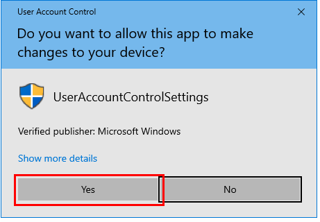

.. _install_visualc++:

Visual C++ 2015
~~~~~~~~~~~~~~~

You can use Microsoft’s Visual C++ for compiling Choreonoid. The commercial version is fine, or the free version can also be used.
The free version of Visual Studio Community 2015 can be downloaded from `this page <https://visualstudio.microsoft.com/vs/older-downloads/>`_ . 

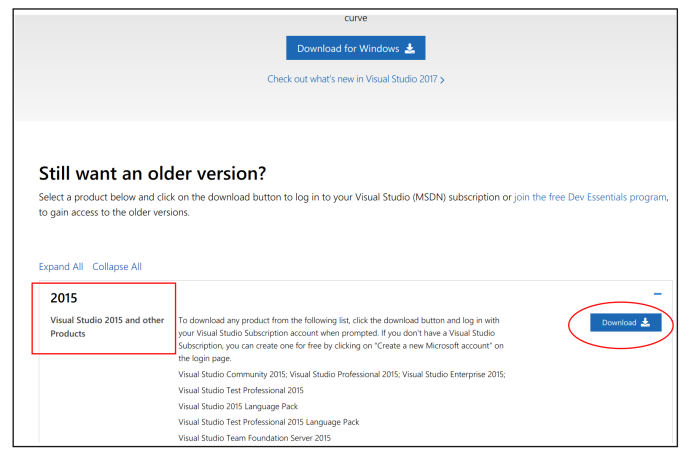

Click the Download button in the Visual Studio 2015 section. On the following screen, login using your Microsoft account when asked to do so. If you are already logged in, you will be taken directly to the download page. If you don’t have an account, you will need to create a new one. You can create one free of charge.

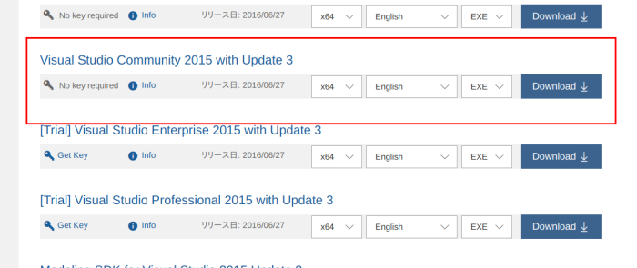

In the “Visual Studio Community 2015 with Update 3” section, select **x64**, **English** and **EXE**, and click the **Download** button. When you run the downloaded file, the installation will begin. So, follow the displayed instructions.

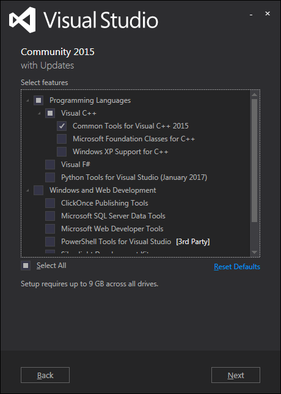

When selecting which components to install as shown in the screenshot, select the **Common Tools for Visual C++ 2015**.

Visual C++ 2017
~~~~~~~~~~~~~~~
The free version of Visual Studio Community 2017 can be downloaded from `this page <https://visualstudio.microsoft.com/downloads/>`_ .

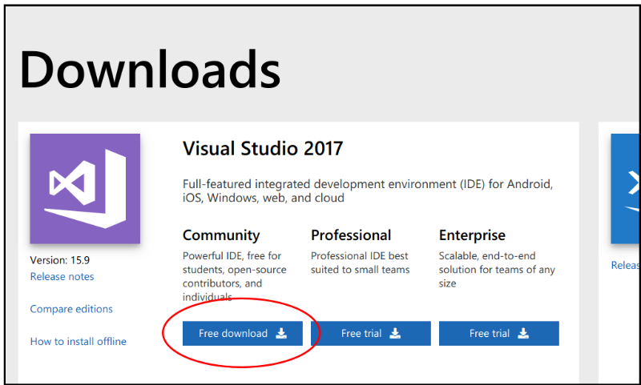

Click the Free Download button. When you run the downloaded file, the installation will begin. So, follow the displayed instructions.

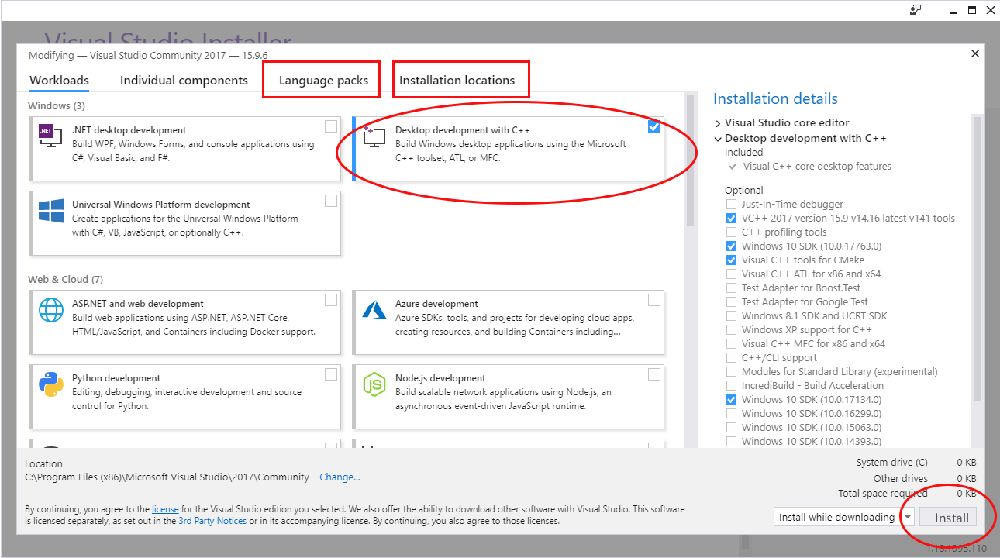

If the screen appears as in the screenshot above, click the checkbox for **Desktop Development with C++**, click the Language Pack tab and select English. If you want to change the installation location, set that here. Once you have finished with the settings, click the **Install** button.

CMake
~~~~~

This is a tool for specifying the build process. The build process for Choreonoid is described using the format of this tool, and it can be used to generate Visual Studio project files on Windows.

You can download the Windows installer "Windows win64-x64 Installer" from the `CMake download page <https://cmake.org/download/>`_.
We are currently testing operation with version 3.12.0.

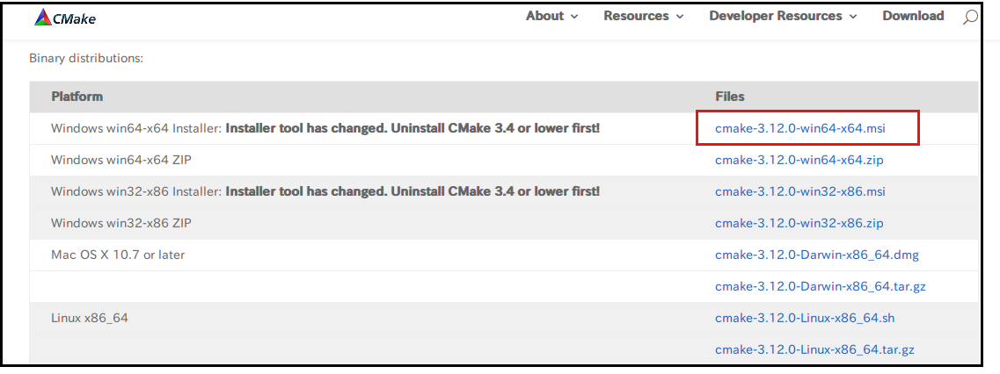

Click cmake-3.12.0-win64-x64.msi to download, and run this file to install. Follow the displayed instructions.

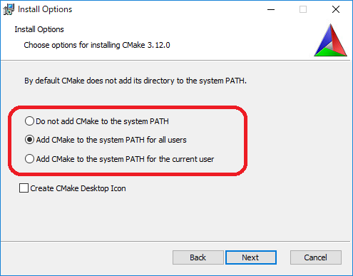

When you see the screen as in the screenshot above, select **Add CMake to the system PATH for all users**.

Other settings can be left at their defaults.

Boost
~~~~~

This is a useful collection of C++ libraries. You can download it from the `Boost Downloads <http://www.boost.org/users/download/>`_  page.

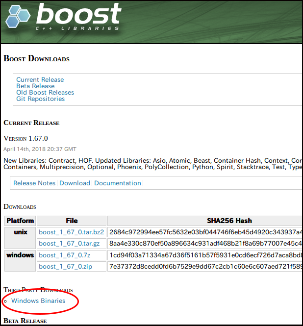

f you download the source code, you will need to compile it. There is already an installer that is easier to use, as it contains prebuilt binaries compiled for Windows. Click **Windows Binaries** on the screen and it will take you to the download page.

  * boost_1_67_0-msvc-14.0-64.exe (for VC2015) or 
  * boost_1_67_0-msvc-14.1-64.exe (for VC2017).

Download either

Run the file to begin the installation process. By default, the installation location is the “C:\\local\\boost_1_67_0” folder. If you don’t change this, CMake will automatically detect Boost in a later step. If you do change it, remember that you will need to specify the folder manually.

Qt
~~
Qt is a comprehensive framework library that includes a GUI, and Choreonoid also uses it as the basis for its GUI.

You can get the Qt installer from the `Qt download page <https://www.qt.io/download>`_ . On that page, you can select the Commercial version or the Open Source version, as shown in the screenshot below. The Open Source version is fine, so select that.

.. figure:: images/QtInstall1.png

When you go to the next page, it will auto-detect your OS and display the appropriate installer.

.. figure:: images/QtInstall2.png

Check that “Recommended download: Qt Online Installer for Windows” is displayed and click the **Download** button. When you launch the downloaded file, you will be asked to login. It is okay to click the Skip button and skip ahead.

By default, the installation location is the “C:\\Qt” folder. If you don’t change this, CMake will automatically detect Qt. If you do change it, remember that you will need to specify the folder manually.

During the process, on the Select Components screen as shown below, select the library to install.

.. figure:: images/QtInstall.png

Select the latest version **5.11.1** of **MSVC2015 64bit** or **MSVC2017 64bit**. Then, follow the instructions of the installer.

Eigen
~~~~~

It is a library used to calculate matrices, vectors, etc. It can be downloaded from the `official Eigen page <http://eigen.tuxfamily.org/>`_ .

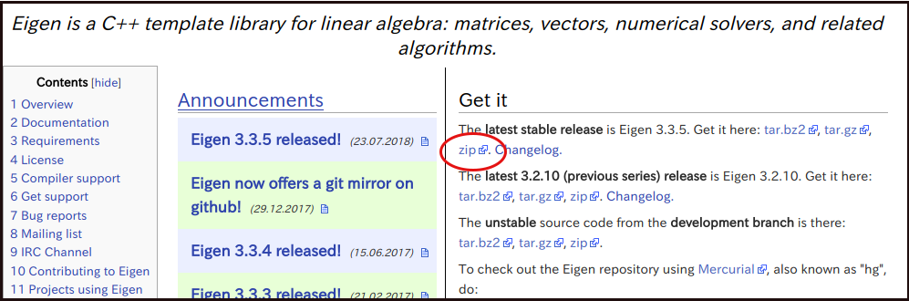

The latest version 3.3.5 Zip file can be downloaded by clicking on Zip.
This library is made up of a header file only and doesn’t need to be compiled, so it is okay to just extract the downloaded file to a suitable location. However, in Eigen, the archive file name and extracted folder name consist of characters that do not give the version number, which can be confusing if left as it is. Refer to the example shown below for how to change folder names during installation.

* Download the Zip file of the version you are going to use from the Eigen page. For version 3.3.5, the file will be named “eigen-eigen-b3f3d4950030.zip”. As you can see, the file name doesn’t specify that the version number is 3.3.5. Also, the word “eigen” is included twice for some reason.

* Extract the Zip file using Explorer or a similar tool. By default, the extracted folder will be named “eigen-eigen-b3f3d4950030”, and Eigen itself will be inside.

 | eigen-eigen-b3f3d4950030
 |   bench
 |   blas
 |   cmake
 |   ...
 
* Change the folder name to include the version number and move it to a suitable location. Boost will be under C:\\local, so it is a good idea to also save Eigen here. The final Eigen installation will be as shown below. If it is installed in this location, CMake will automatically detect Eigen. If you install it somewhere else, remember that you will need to specify the folder manually.

 | local
 |   boost_1_60_0
 |    ...
 |   eigen-3.3.4
 |     bench
 |     blas
 |     cmake
 |     ...
 
 
Getting the source code
-----------------------

Official release version
~~~~~~~~~~~~~~~~~~~~~~~~

The source code of the official release version of Choreonoid can be downloaded from the `Downloads <http://choreonoid.org/ja/download.html>`_  page. Download the corresponding version of the “source package” from this page. The files are Zip archives, so extract them into a suitable directory using Explorer or a similar tool.

When you extract it, it generates a directory named something like choreonoid-1.6.0. The complete source code is stored in this directory, which from now on is referred to in this manual as the **“source directory”**.

Development version
~~~~~~~~~~~~~~~~~~~

You can also use the Choreonoid development version if you wish. It is managed as a `Git <http://git-scm.com/>`_  repository, and it is published at the following `github <https://github.com/>`_ address.

- https://github.com/s-nakaoka/choreonoid

There are two ways to get the source code from here.

* Install Git
* Get the Zip file

Installing Git
^^^^^^^^^^^^^^
Git tools are required in order to use the repository. There are several tools that have been released free of charge, but here we will explain how to use the Git tools in Visual Studio and how to install a tool used at the command prompt. Of course, you can use other tools that you’re already familiar with.

Use Visual Studio
"""""""""""""""""
Launch Visual Studio, select **Team Explorer** from the **View** menu and it will be displayed.

.. figure:: images/VSgithub1.png

Click the icon circled in red in the screenshot.

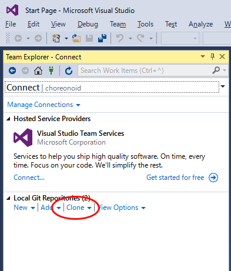

Under Local Git Repositories, click Clone.

.. figure:: images/VSgithub3.png

Enter the URL of the Choreonoid repository in the upper field outlined in red, enter the directory where you want to keep the source code in the lower field, and click the Clone button.

The source code will be cloned.

Once cloned, select choreonoid as shown below, right-click and select Open from the dropdown menu.

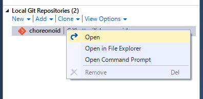

When the screen changes as shown below, select Sync. Then, when you click Pull, the latest source code will be updated.

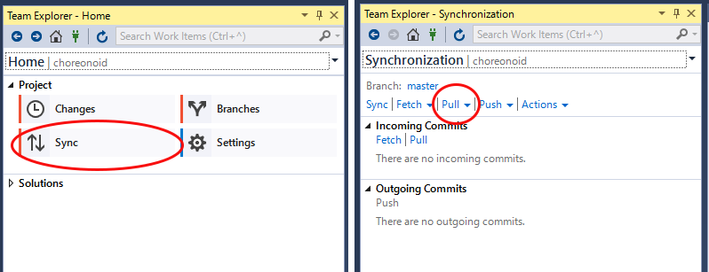

Use Git for Windows
"""""""""""""""""""

Next, we will explain about the tool used at the command prompt.

Download the file from `Git for Windows <https://git-for-windows.github.io/>`_ and run. Follow the instructions of the installer. It’s fine to keep the default setting, but if the screen below appears, select “Use Git from the Windows Command Prompt”, which will add wrappers to your PATH.

.. figure:: images/GitSetup.png

When the installation is complete, launch the Command Prompt, go to the directory which contains the Choreonoid source you want to save, and execute the following command.: ::

 git clone https://github.com/s-nakaoka/choreonoid.git
 
This will create a “choreonoid” directory containing the repository. You can then use the following command: ::
 
  git pull
  
in this directory and update to the latest version of the source code.

The above will allow you to get the source code, but for detailed usage of Git you should refer to the Git manual or explanatory articles.

Getting it as a Zip file
^^^^^^^^^^^^^^^^^^^^^^^^

Open the `Choreonoid repository <https://github.com/s-nakaoka/choreonoid/>`_  using a web browser, click on the green Clone or download button outlined by the red rectangle, and it will be displayed as follows.

.. figure:: images/downloadZip.png
   :width: 600px

Click the blue **Download ZIP** circled in red to download the latest content in Zip format. Extract the downloaded file in the directory where you keep the source code.

While this method is simple, after the second time the **git pull** command can only get updated files, and using this method means downloading all the files every time.

.. _build-windows-cmake:

Configure build settings with CMake
-----------------------------------

First, launch CMake (cmake-gui) from the Start menu. Then, the dialog box shown below will be displayed.

.. figure:: images/cmake0.png
   :width: 600px
   
Next, enter the Choreonoid source directory in the input field to the right of **Where is the source code**: indicated by the No.1 red frame in the screenshot above. Click **Browse Source...** and a dialog box will open, from which you can select the directory. Next, enter the directory where you want to build Choreonoid in the input field to the right of **Where to build the binaries**:. The directory for the build can be the same one used for the source code, but this may create a confusing structure. So, create a sub-directory called “build” below the source directory and enter the name of that sub-directory. Once you’ve entered the above, click **Configure** indicated by the No.2 red frame.

If the directory for the build has not been created in advance, a dialog box will now be displayed asking if you want to create one.

Next, a dialog box will be displayed as shown below. Select the compiler from the dropdown menu outlined in red.

.. figure:: images/cmake1.png

Select **"Visual Studio 14 2015 Win64"** or **"Visual Studio 15 2017 Win64"**  and click the **Finish** button.

This will then run CMake’s configuration process and the compiler, libraries, etc. will be detected.

.. note:: At this time, you may see a message saying, “The C compiler identification is unknown” or, “The CXX compiler identification is unknown”. This indicates that the Visual C++ compiler has not been detected correctly. The cause is unclear, but this problem has occurred in one of our developer environments. In this case, it is not possible to continue processing correctly from this point.

 Regarding this issue, we tested running CMake with administrator privileges, which correctly detected the compiler and made it possible to proceed past this issue. To do this, right-click on the CMake icon and select “Launch as Administrator" in the menu that appears. If you encounter this problem, we recommend trying this workaround.
 
.. note:: If the program called pkg-config.exe is installed in the Windows environment, you may encounter an error during this operation. If that happens, you should uninstall pkg-config.exe.

When installing the libraries, if you selected the default directory, it will automatically detect the libraries and a message will be displayed with **Configuring done** on the last line as shown below.

.. figure:: images/cmake2.png

(If you install in another directory, an error message will probably be displayed. The settings for that situation are explained later.)

Next, set the installation location. Scroll through the field shown in the center as in the screenshot below until the item **CMAKE_INSTALL_PREFIX** is displayed.

.. figure:: images/cmake3.png

By default, it is set to “c:\\Program Files\\Choreonoid”. In Windows, only administrators have access to paths below “c:\\Program Files”, so this may cause the installation to fail. You can run the installer with administrative privileges, but it is probably easier to simply install in a different directory. You can set this with **CMAKE_INSTALL_PREFIX**, specifying a directory structure such as “c:\\choreonoid\\program”, for example.

When the settings are complete, click the **Configure** button and confirm that a message ending with **Configuring done** is again displayed.

.. figure:: images/cmake4.png

Next, click the **Generate** button in order to create a Visual Studio project file. If the **Generate** button is not clickable, click **Configure** again.

Once the solution file is created, you will see the message **Generating done** displayed in the output pane.

Next, we will explain the steps to take if an error message is displayed or you want to change other settings. If you have not seen any errors up to this point, you can read this after you have proceeded to :ref:`build-windows-visualstudio` .

If libraries cannot be detected automatically, an error dialog like the one shown will be displayed.

.. figure:: images/cmake5.png

Click **OK** to close the dialog box. Scroll down in the window where the message in the section below is displayed and find where the error is displayed. Ignore the warnings. An error displayed lower down is sometimes due to an error above, so start searching from the top.

In the screenshot below, an error appears saying that Eigen libraries could not be found.

.. figure:: images/cmake9.png

Look up **EIGEN_DIR** from the previous settings and enter the Eigen installation directory.

.. figure:: images/cmake10.png

Click the **Configure** button and confirm that the error has disappeared.

In the screenshot below, an error appears saying that Boost libraries could not be found.

.. figure:: images/cmake6.png

BOOST_ROOT is not in the above settings. In this case, click the **Add Entry** button. A dialog box will appear, so enter the details as shown below.

.. figure:: images/cmake7.png

In the **Value** field, specify the directory where the Boost libraries are installed. Click **OK** to close the dialog box, and confirm that BOOST_ROOT has been added as shown below.

.. figure:: images/cmake8.png

Click the **Configure** button.。

If errors pertaining to QT5 appear, enter the directory in which the Qt5CoreConfig.cmake file is kept (it should be the path to the Qt installation location, followed by, /5.5/msvc2015_64/lib/cmake/Qt5Core) in the **Qt5Core_DIR** field.   You may also see errors pertaining to other QT5 libraries, so enter details in the same way as above. You are free to ignore these warnings.

After that, it is possible to set various other options related to the build as required. For example, some Choreonoid functions are off by default, but you can turn these on as required by toggling the options that begin with BUILD_.

Repeat the same settings as above until the installation locations of all the necessary libraries are specified and there are no errors.

When all the required settings are complete, click **Generate**.

.. note:: Regarding other libraries, depending on the version of CMake you are using and the versions of installed libraries and their locations, detection may fail and produce similar errors. Errors may also appear for some of the optional features described below. The order in which errors appear may also vary depending on the installation. If this occurs, find the error locations and manually enter the installation location in the same way as described above.

.. note:: The details of the settings are saved as a file called **CMakeCache.txt** in the location specified by **Where to build the binaries**. If you want to redo the settings from scratch, delete this file. It can also be deleted using **File - Delete Cache** from the CMake menu.

.. _build-windows-visualstudio:

Launching Visual Studio and importing solutions
-----------------------------------------------
Next, you can build Choreonoid.

The previous operations should have resulted in the Visual Studio solution file Choreonoid.sln being created in the location specified by **Where to build the binaries** in CMake. Double click this file.

Visual Studio will be launched and the solution file should be opened.

If Visual Studio fails to launch, there may have been an issue with the installation process, so reinstall it and attempt to repair the file association. Alternatively, you can try launching Visual Studio and opening the solution file from the menu.

Since the build operation is the same in Visual Studio 2015 and 2017, the following description does not specify which version. Therefore, there may be differences in the screen design, etc.

Compiling
---------

Once a solution is read in, you will see the screen below. Change the section outlined in red to Release and confirm that x64-bit is displayed. If you change it to Debug, you will be able to create a debuggable binary. However, the debugging binary will be considerably slower than the Release version you compiled, so you should use the compiled Release binary unless you need to debug.

.. figure:: images/VS1.png

Next, you will build Choreonoid. Click Build in the menu and the dropdown menu seen below will appear. Click **Build Solution** as outlined in red. Choreonoid will now begin building. When you see the message “**0 Failed**” in the message window at the bottom, the compilation is complete.

.. figure:: images/VS2.png

Installation
------------

Once the Choreonoid build is complete, you will finish by installing it. Install is selected, as shown below, from the Solution Explorer seen on the upper left. Right-click on the INSTALL project and a menu will appear. The top option of this menu is **Build** (see the area outlined in red shown below). Select this. If the process goes smoothly, the Choreonoid binary will be copied to the directory you specified with **CMAKE_INSTALL_PREFIX** when using CMake. If you checked the box next to **INSTALL_DEPENDENCIES** when creating the solution file with CMake, the library dependencies will also be copied.

.. figure:: images/VS3.png

This completes the installation of Choreonoid.

Double-clicking on **choreonoid.exe** in the bin directory of your installation location will launch Choreonoid.

Building optional features
--------------------------

In addition to setting Choreonoid to the default state following the steps above, there are several modules, plugins, and samples that can be used. These can be enabled with CMake and built into the software. In this section, we describe building several of these optional features. A summary of other features can be found in :doc:`Optional Features<options>`.

We will briefly explain the installation method of the library used by each plugin, but there may be major changes due to a library version upgrade, for example. There may also have been updates to the developer’s website or changes to link destinations. If that is the case, you should be able to find up-to-date information by searching online using keywords such as the library name, “install”, etc.

.. note:: After configuring optional features in CMake, click the **Configure** and **Generate** buttons to update the solution file. Compiling and installing in Visual Studio using this file will create an optional plugin. Be sure to compile and install after changing options in CMake.

Assimp plugin
~~~~~~~~~~~~~

This plugin is for using  **Open Asset Import Library (Assimp)**, a library for reading 3D model data in various formats, in Choreonoid. In order to use this plugin, you need to build the Assimp library from source and install.

Open the page for `assimp on github <https://github.com/assimp/assimp/>`_ in your browser.

.. figure:: images/assimp1.png
   :width: 800px

Click **Branch:master** as indicated by red circle No.1, then **Tags** as indicated by red circle No.2, and select the version. The current version tested as working is 4.1.0. In the screenshot, version 4.1.0 is selected.

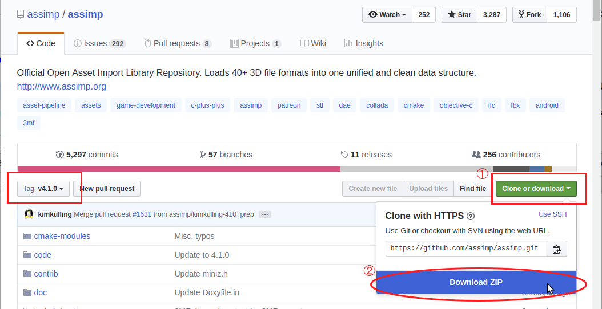

Confirm that the display has changed to **Tag: v4.1.0**, click **Clone or download**, and click **Download ZIP** to download the source file in Zip format.

Extract the Zip file.

You can use CMake, in the same way as explained in the Choreonoid build, to create a Visual Studio project file. You don’t need to change the CMake option settings.

The installation destination of **CMAKE_INSTALL_PREFIX** is set to **c:\\Program Files\\Assimp**, but if you set it to be under **c:\\local**, it will be detected automatically. So, if possible, specify it as **c:\\local\\Assimp**.

.. figure:: images/assimp3.png

Compile and install in Visual Studio in the same way as Choreonoid.

Once you have installed Assimp, re-launch CMake and specify the source and build directory of Choreonoid.

The previous setting details are saved, so this time you only need to do the Assimp settings. (If you don’t have saved settings, such as when you specify a new build directory, click **Configure** without doing the following operation.)

.. figure:: images/assimp4.png

As shown, the value for **ASSIMP_DIR** is displayed as **ASSIMP_DIR - NOTFOUND**.

.. figure:: images/assimp5.png

There is an item below that called **ENABLE_ASSIMP**, so select this and click the **Remove Entry** button to delete this item. Then click **Configure**, which should automatically detect Assimp.

If the automatic detection fails, set **ENABLE_ASSIMP** to **ON** and enter the value for **ASSIMP_DIR** manually. At this point, you need to specify the directory that contains Assimp's CMake file, not the top directory of the Assimp installation. It should be at **(installation location)\\Assimp\\lib\\cmake\\assimp-4.1**.

Next, you will build Choreonoid.

.. _build_windows_openrtm_plugin:

OpenRTM plugin
~~~~~~~~~~~~~~
This plugin is used to perform simulations using RT-Components in Choreonoid. Use of this plugin requires that OpenRTM-aist 1.1.2 and Python are installed. (There is no Visual C++ 2017 library for OpenRTM-aist 1.1.2, so this plugin cannot be built with 2017.)

First install **Python2**, as this is required in order to install OpenRTM-aist 1.1.2. 

Access the `Python <http://www.python.org/>`_  website.

.. figure:: images/python2_1.png
   :width: 500px

Hover your cursor over **Downloads** and select **Windows** from the dropdown menu that appears.

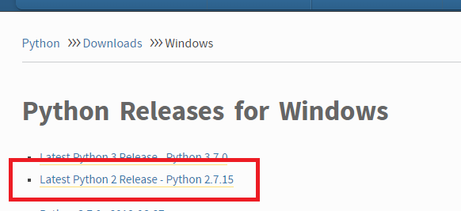

Click **Latest Python 2 Release - Python 2.7.15**.

.. figure:: images/python2_3.png
   :width: 500px

Click the Windows 64-bit installer to download it. When you run the downloaded file, the installation will begin. So, follow the displayed instructions.

.. figure:: images/python2_4.png
   :width: 500px
   
If the screen above appears, change **Add python.exe to Path** to **Will be installed on local hard drive** and continue.

Next, install OpenRTM-aist 1.1.2. You can download OpenRTM-aist 1.1.2 from the `official website <http://openrtm.org/>`_ . Note that this is a temporary site while a security update is carried out.

Download the Windows 64-bit installer.

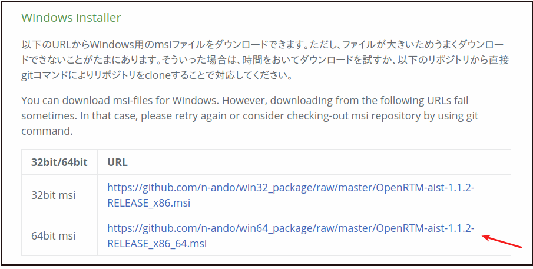

Launch this file to begin the installation. If the screen appears as shown below, select Typical.

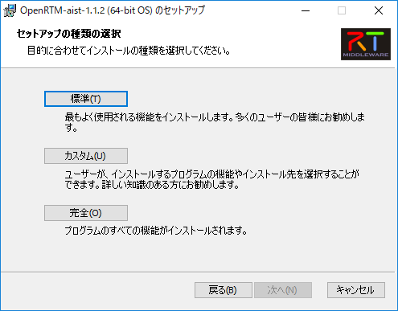

.. _build-windows-setenv:

When the installation is complete, confirm and set the environment variables. Below, we will explain the process for Windows 10.

Enter **Control Panel** where “Type here to search” is displayed in the taskbar, and click on the displayed control panel to open it.

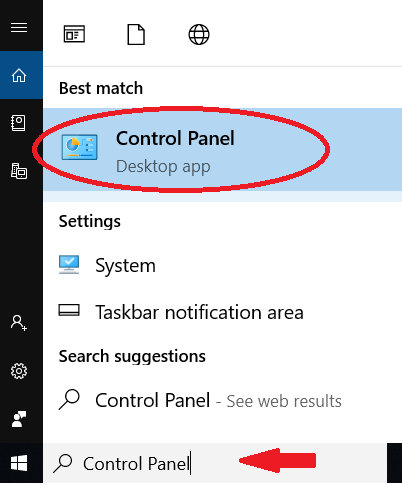

Click **System and Security** - **System** - **Advanced System Settings** and open **System Properties**.

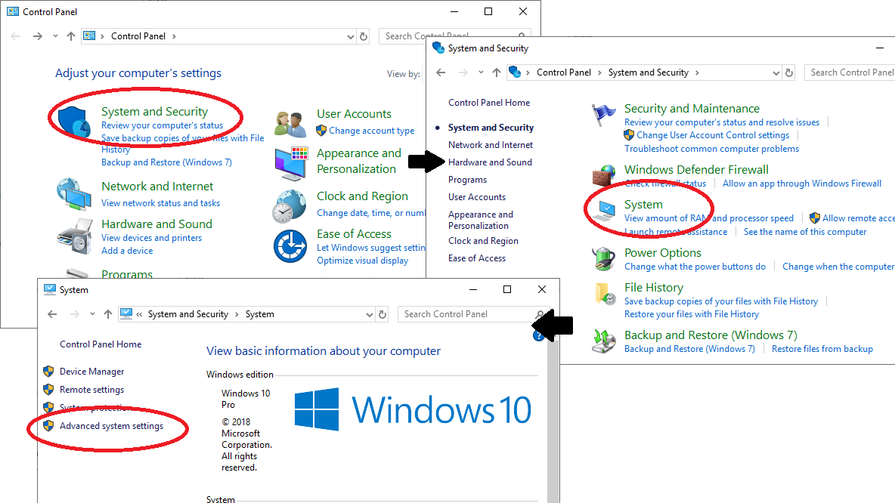

Click the **Environment Variables button** to display them. Confirm that **OMNI_ROOT**, **RTM_BASE** and others are among the system environment variables in the lower section.

If these variables are not present, reboot Windows.

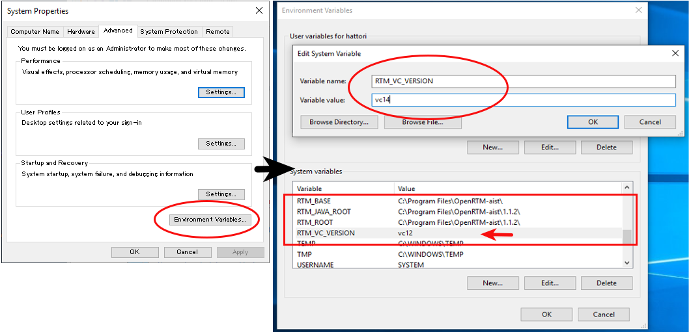

Immediately after installation, the **RTM_VC_VERSION** variable should be vc12. Double-clicking on this column opens the dialog box for editing, so change it to **vc14** (meaning VC ++ 2015). Click the **OK** button and close all the dialog boxes.

Once you have installed OpenRTM-aist, re-launch CMake and specify the source and build directory of Choreonoid. Set **ENABLE_CORBA**, **BUILD_CORBA_PLUGIN**, and **BUILD_OPENRTM_PLUGIN** to **ON** and click **Configure**. The OpenRTM plugin depends on the Corba plugin, so you need to turn on all of them. Also, if **BUILD_OPENRTM_SAMPLES** is toggled on, a simulation sample using the RT component will also be built, so turn it on here first and try out the sample.

If you installed using the above OpenRTM-aist installer, by default it should be installed in the directory named c:\Program Files\OpenRTM-aist\1.1.2 and should be detected automatically. If you get an error message saying that OpenRTM-aist cannot be found, set **OPENRTM_DIR** to the directory where you installed OpenRTM-aist.

Media plugin
~~~~~~~~~~~~
This plugin allows you to play back media files. Set **BUILD_MEDIA_PLUGIN** to ON in CMake.

Some file formats, such as MPEG-4 media files, may not play back by default. You can enable playback by installing the corresponding codec pack for that file format. You can search online to easily find these codec packs for free. Because these codecs can affect the functionality of other video software, we do not make specific recommendations. You should use codecs that match your system.

ODE plugin
~~~~~~~~~~
The Open Dynamics Engine (ODE) is an open-source dynamics computation library; it is used in Choreonoid as a plugin to compute its simulations.

In order to build this plugin and use it, you must first install the ODE library. Prebuilt binaries of this library are not available, so you must build it from source. Access the `Open Dynamics Engine site <http://www.ode.org/>`_   to download the file and extract it. We have tested versions up to 0.12 as working. (There are reports of 0.13 not working with Choreonoid.)

.. figure:: images/ODEinstall1.png
   :width: 700px

Click **Get the source code here**.

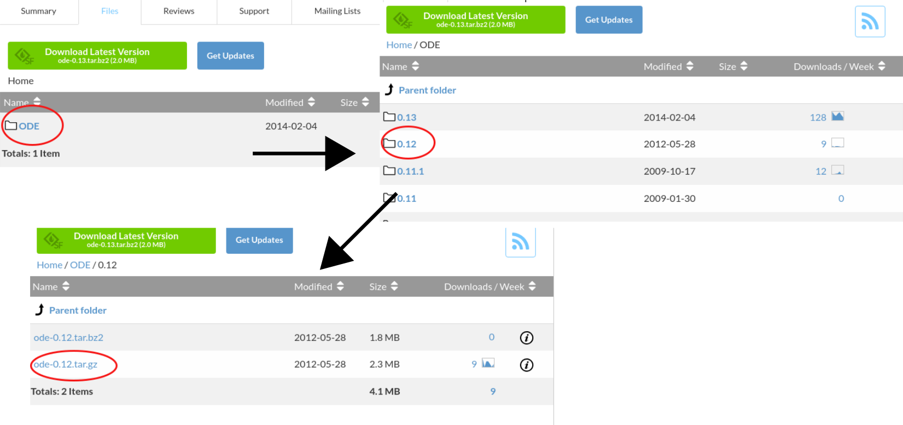
   
Go to **ODE** - **0.12** and click **ode-0.12.tar.gz** to download the file.  

It is in the tar.gz file format, so you will need extraction software for Windows. If you don’t have it installed, you can install free software such as **Lhaplus**. )

Extract the Zip file and perform the build.

Use the command “premake” to build ODE. Launch the command prompt and go to the directory called “build” under the expanded directory. Then, run ::

 premake4.exe --with-libccd --platform=x64 vs2008
 
. When you do so, it will create a directory called vs2008, which contains the file ode.sln. (Since ode 0.12 supports only up to vs2008, it creates a solution file for 2008. ) When you launch VS2015 (or VS2017) and open this file, a dialog box will open to convert the solution. Click the **OK** button to run it.

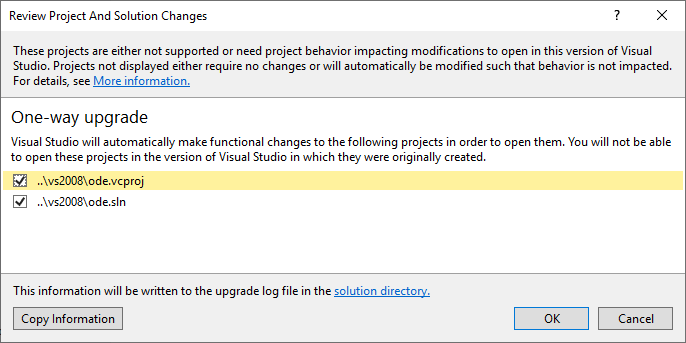

Several warnings will be displayed, but you can ignore these.

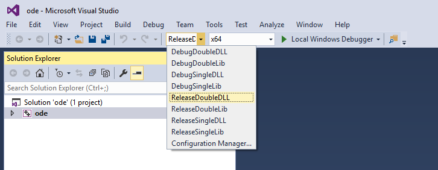
   
Using the converted solutions file, you will now perform a build. Select **ReleaseDoubleDLL** and **x64** for the solution structure and confirm. If successful, a file named **ode_double.*** will be created in **lib/ReleaseDoubleDLL**.

Next, in the CMake build settings for Choreonoid, set **BUILD_ODE_PLUGIN** to ON and specify the ODE lib root directory for **ODE_DIR**.

Bullet plugin
~~~~~~~~~~~~~
This plugin lets you make use of the Bullet Physics Library, an open-source dynamics computation library, as a computation engine for simulations in Choreonoid.

In order to build and use this plugin, you will need to build the Bullet Physics Library from source. You can get the source from `bulletphysics on github <https://github.com/bulletphysics/bullet3>`_ . We have tested version bullet-2.83.7 as working. We cannot confirm the operability of any later versions.

In the same way as described for the Assimp plugin, open the page in your browser, select the version, and download the ZIP file.

You can use CMake, in the same way as explained previously, to create a Visual Studio project file. Change the following options to ON.

* **BUILD_EXTRAS**
* **INSTALL_EXTRA_LIBS**
* **INSTALL_LIBS**
* **USE_DOUBLE_PRECISION**
* **USE_MSVC_RUNTIME_LIBRARY_DLL**

Setting the following options to OFF is also the safest approach.

* **All of BUILD_XXX_DEMOS** 
* **BUILD_BULLET3**
* **BUILD_UNIT_TESTS**

Set the installation destination with **CMAKE_INSTALL_PREFIX**.

Compile and install in Visual Studio in the same way.

When Bullet has been installed, re-launch CMake. In the CMake build settings for Choreonoid, set the **BUILD_BULLET PLUGIN** flag to ON and specify the directory in which the Bullet library is installed with **BULLET_DIR**.

Python plugin
~~~~~~~~~~~~~
This plugin is used to import and execute Python scripts and to use the features of the Python console used in Choreonoid.

In order to build this plugin and use it, you must first install Python. We have tested versions 2.7.15 and 3.6.3 as working.

If you use the OpenRTM plugin, version 2.7.15 of Python was installed at the same time as OpenRTM. To use that Python version, set **USE_PYTHON3** to OFF in the CMake settings.

Install Python 3 if you prefer to use it.

As described for the OpenRTM plugin, go to the Python 3 download page on the `Python <http://www.python.org/>`_  website. Download and run **Windows x86-64 executable installer**.

.. figure:: images/Python3install1.png
   :width: 600px
   
If you don’t have Python 2.7 installed, check the box for **Add Python 3.7 to PATH**. If you do have Python 2.7 installed, don’t check this box. Click **Install Now** to install.

Next, you will install **Numpy**.

Numpy is installed for the Python that is used in Choreonoid. If only one of either Python 2 or Python 3 is installed, it will be in your PATH, so launch the command prompt and execute the following command. ::

python -m pip install numpy

If both are installed, your PATH will go through Python 2. In order to install to Python 3, execute a command specifying the directory where Python 3 is installed. Launch the command prompt and install with this command: ::

C:\Users\(username)\AppData\Local\Programs\Python\Python37\python -m pip install numpy

. C:\Users... is the default installation destination, so change this as required.

When the installation is complete, open CMake for Choreonoid again and set the following settings to ON: **ENABLE_PYTHON**, **BUILD_PYTHON_PLUGIN**, and **BUILD_PYTHON_SIM_SCRIPT_PLUGIN**.

.. note:: If your PATH does not include Python 3, you need to pass PATH when launching Choreonoid. ::

              set PATH=(installation destination of Python 3);%PATH%
              choreonoid
        
        It is easy to prepare and execute a batch file written as shown above.

Uninstalling plugins
~~~~~~~~~~~~~~~~~~~~
Plugins installed by enabling the **BUILD_XXX_PLUGIN** option will not be deleted even if you turn the option off later. If you add a plugin and want to later delete it due to unstable performance or other issues, you must delete the file manually. Plugins are installed to (Choreonoid installation destination)/lib/choreonoid-1.7 in the format of Cnoid***Plugin.dll.

