Building from source code and installing (Windows)
=====================================================

.. sectionauthor:: 中岡 慎一郎 <s.nakaoka@aist.go.jp>

.. contents:: 目次
   :local:

Preparing to build
-----------------------

To build Choreonoid from source and install, you will need the following tools and libraries on your system:

* Tools required

  * Visual C++ 2015 or  Visual C++ 2013 
  * `CMake <http://www.cmake.org/>`_ (3.5.2)

- Libraries required

  * `Boost <http://www.boost.org/>`_ (1.60.0)
  * `Qt <http://qt.nokia.com/>`_ (5.6)
  * `Eigen <http://eigen.tuxfamily.org/>`_ (3.2.8)

First install the requisite tools and libraries listed above. 
The figures in parenthesis next to each list the versions we have tested as working as of June 2016. 
This does not necessarily mean that Choreonoid does not support older versions, and it may mean that building from source fails when using newer versions. 
(Specifying an exact working version is difficult.) 
Generally speaking, if the first two numbers of your version number are the same, you should be able to use it in an equivalent fashion.

Instructions on installing these tools and libraries follow below.

Visual C++ 2015 or Visual C++ 2013
~~~~~~~~~~~~~~~~~~~~~~~~~~~~~~~~~~~~~~

You can use Microsoft Visual C++ to compile Choreonoid. 
The standalone version can be used, or the free version. 
To download the Visual Studio Community 2015, see `this page <http://www.visualstudio.com/downloads/>`_ . 
Select either Visual Studio Express 2015 for Desktop or Visual Studio Express 2013 for Desktop.

We have confirmed that both 32-bit and 64-bit binaries can be built. (The 32-bit binary also runs on 64-bit versions of Windows.) 
You must ensure that the libraries you use are consistent (32-bit or 64-bit).

CMake
~~~~~~~~~

This tool is used to specify the build method. 
The build method used for Choreonoid is described with this tool; in Windows, this then allows for creating a Visual Studio project file.

You can download the Windows (Win32) installer from the `CMake download page <http://www.cmake.org/cmake/resources/software.html>`_ to easily install the tool.

Boost
~~~~~~~~

This is a useful collection of C++ libraries. 
You can download it from `Boost Downloads <http://www.boost.org/users/download/>`_ , but note that downloading from source requires compiling it first.

There is already an installer that contains prebuilt binaries compiled for Windows, so this is the easier choice. 
From the above page, click the link that reads, “Prebuilt windows  binaries.” 
This will take you to the `Boost Binaries for Windows page <http://sourceforge.net/projects/boost/files/boost-binaries/>`_ . 
Select the folder for the version number you want, and you will be presented with two files:
 
  * boost_1_60_0-msvc-14.0-64.exe (64-bit) 
  * boost_1_60_0-msvc-14.0-32.exe (32-bit)

Download one of these. (The msvc-14.0 part of the file name indicates that these are for Visual C++ 2015. 2013 versions read msvc-12.0.)

Run the file to begin the installation process. By default, Boost will be installed to C:\local\boost_1_60_0. You must specify this path later, so remember it.

Qt
~~~~~~

Qt is a comprehensive framework library that includes a GUI. Choreonoid uses this as the basis for its GUI.

You can obtain the Qt installer from the `Qt download page <http://qt-project.org/downloads>`_ . 
The page will auto-detect your OS and present the installer you need. 
It should read, “Recommended download: Qt Online Installer for Windows.” Click “Download Now” to download the installer. 
You can then launch the download file and follow the installer’s instructions. 
The figure below shows the menu that will appear, asking you which libraries to install.

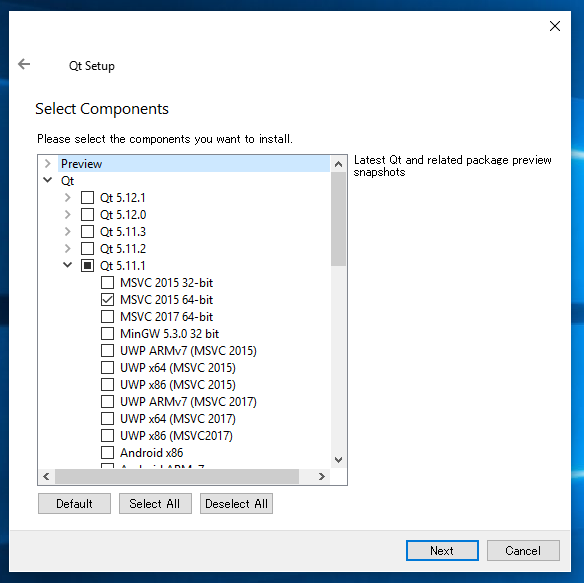

By default, multiple versions will be selected. 
However, old versions are not needed, and you must use the version that matches your compiler, so only select the most recent version. 
In this example, we’ve selected the msvc2015 64bit version of Qt 5.6. For 32-bit, select msvc2015 32bit. 
If you are using Visual C++ 2013, select msvc2013.

After this step, installation will begin. 
By default, Qt is installed to C:Qt. Remember this path for later.

Eigen
~~~~~~~~~

This is a library used to compute matrixes and vectors. 
You can download it from `the official Eigen web site <http://eigen.tuxfamily.org/>`_ .

This library consists solely of a header file, so no compilation is necessary. 
You can simply open the file you download from wherever you like. 
However, Eigen files use a nomenclature and folder version structure that is non-standard, and create several nested folders, which can confuse matters. 
Below is an example of how to change folder names when installing.

* From the Eigen page, download the ZIP file for the version you wish to use. For version 3.2.8, download eigen-eigen-07105f7124f9.zip. As you can see, the filename does not specify the version number. Also, the term “eigen” appears twice for some reason.

* Use Windows Explorer or another tool to open the ZIP archive. By default, the folder name will be eigen-eigen-07105f7124f9. You will then find another folder within that with the same name, after which you will find Eigen itself.

 | eigen-eigen-07105f7124f9
 |  eigen-eigen-07105f7124f9
 |     bench
 |     blas
 |     cmake
 |     ...
 
* Begin by changing the second folder to a more logical name. Add the version number as below.

 | eigen-eigen-07105f7124f9
 |  **eigen-3.2.8**
 |     bench
 |     blas
 |     cmake
 |     ...

* Lastly, move this new folder to a directory of your choice. Boost is found in C:\local, so putting Eigen here would be a good idea. The final structure would be as follows:

 | local
 |   boost_1_60_0
 |    ...
 |   eigen-3.2.8
 |     bench
 |     blas
 |     cmake
 |     ...
 
Obtaining the source code
-------------------------------

Official release
~~~~~~~~~~~~~~~~~~~~

The source code for the official release of Choreonoid can be downloaded from the `Downloads page <http://choreonoid.org/en/download.html>`_ . 
Download the corresponding version of the source package from that page. 
The files are ZIP archives, so you should expand them with Windows Explorer or another tool into a directory of your choice.

Once expanded, the directory choreonoid-1.5.0 will be created. 
The source code is contained in this directory, which this manual refers to as the “source directory.”

Development version
~~~~~~~~~~~~~~~~~~~~~~~

You can also use the development version of Choreonoid if you choose to. 
This is housed on the Choreonoid `git <http://git-scm.com/>`_ repository and at the github URL below.

- https://github.com/s-nakaoka/choreonoid

There are two ways to obtain the source from here.

* Install Git
* Obtain the ZIP file

Installing Git
^^^^^^^^^^^^^^^^^^^^

In order to use the repository, you will need to use tools to access git. 
There is a variety of tools available; here we describe how to install a tool used at the command prompt. 
You are of course welcome to use other tools you are accustomed to.

Download the file from `Git for Windows <https://git-for-windows.github.io/>`_  and run it, following the instructions from the installer. 
The default settings should be fine. 
If the window below appears, select “Use Git from the Windows Command Prompt,” which will add wrappers to your PATH.

.. figure:: images/GitSetup.png

Once the installation is complete, launch a command prompt and move to the directory which contains the Choreonoid source you wish to save. 
Execute the following command: ::

 git clone https://github.com/s-nakaoka/choreonoid.git
 
This will create the “choreonoid” directory with the repository contents. 
You can then use the following command and update to the latest version of the source code: ::
 
  git pull
  
The above is all you need to obtain the source code. 
For details on using git further, refer to the git manual or explanatory articles.

Obtaining as a ZIP file
^^^^^^^^^^^^^^^^^^^^^^^^^^^^

You can use a web browser to access the `Choreonoid repository <https://github.com/s-nakaoka/choreonoid/>`_ , where you will see the following:

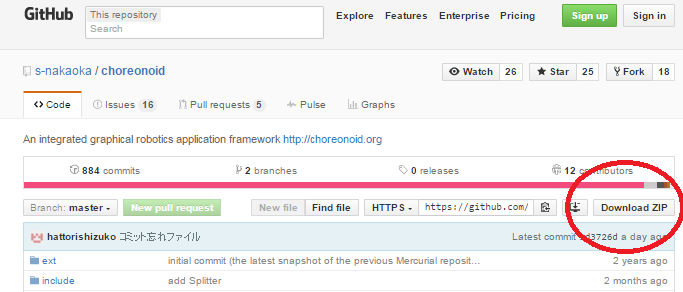

Click the Download ZIP button circled above to download the latest content in ZIP format. You should then open this file.

While this method is simple, it differs from the git pull command in that you have to download the file each time you want the latest version, rather than simply updating the local content.

Configure build settings with CMake
--------------------------------------------

From the Start Menu, launch CMake (cmake-gui). This will bring up the following dialog.

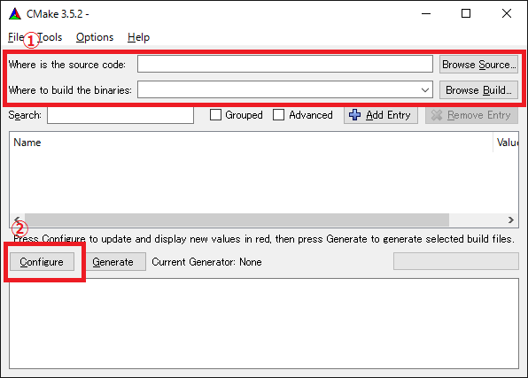
   
The figure above highlights in red a section to the left of the menu reading, “Where is the source code:” To the right of that is a field you can use to enter the Choreonoid source directory. 
For “Where to build the binaries:” enter the directory in which to build Choreonoid’s binaries. 
You can build the binaries in the same directory as where the source code is found, but it can create a confusing structure, so we suggest creating a “build” directory below the source directory and using this for your output. Once finished, click the Configure button marked in red. 
A dialog like that seen below will appear, and you can select your compiler.

.. figure:: images/cmake1.png

Select “Visual Studio 14 2015 Win64”(64-bit) or “Visual Studio 14 2015” (32-bit), or ”Visual Studio 12 2013 Win64” or “Visual Studio 12 2013,” then click Finish.

This will then run CMake’s configure command and detect the compiler and libraries.

.. note:: You may receive a message reading, “The C compiler identification is unknown” or, “The CXX compiler identification is unknown.” This means that the Visual C++ compiler has not been detected properly. The reasons remain unclear, but this has occurred to us during development. If this happens, you will be unable to proceed to the steps below.
  
 We tested launching CMake with administrator privileges, which properly detected the compiler and allowed for proceeding past this issue. You can right-click on the CMake icon and select Launch as Administrator (actual wording may differ). If you encounter problems, we recommend trying this workaround.
 
The program should then reach an error dialog like the one below and halt. 
You will see an error (indicated with the arrow below) stating that the BOOST settings could not be found. 
(You may first experience a different error, explained below.) Click OK to hide this dialog.

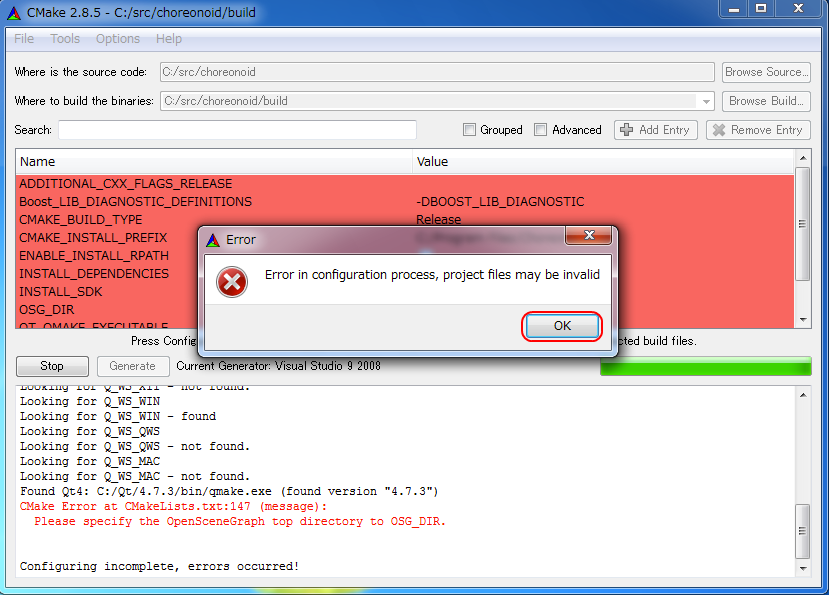

From the input fields at the top, enter the Boost installation directory in the field to the right of **BOOST_ROOT** and the directory in which the Boost libraries (.lib, .dll) are stored in the field to the right of **BOOST_LIBRARYDIR**. 
Then, click Configure again.

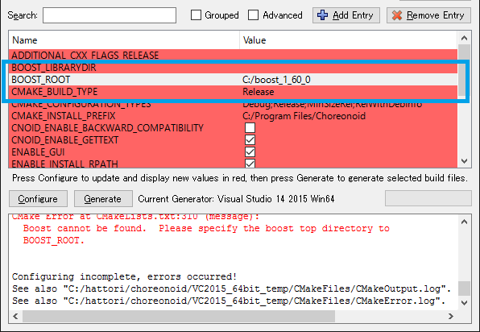

If errors pertaining to Eigen appear, enter the Eigen installation path in the **EIGEN_DIR** field.

If errors pertaining to QT5 appear, enter the directory in which the Qt5CoreConfig.cmake file is housed (it should be the Qt installation path, followed by/5.5/msvc2015_64/lib/cmake/Qt5Core) in the **Qt5Core_DIR** field. 
You may also see errors pertaining to other QT5 libraries, but these errors will disappear once you set the Core settings and click Configure. 
You are free to ignore these warnings.

.. note:: Depending on the version of CMake you are using and the versions of installed libraries and their locations, you may have other points that fail to be detected and produce similar errors. Errors may also appear for some of the optional features described below. If this occurs, use the same steps as above to manually enter the install location.

Continue repeating the above until the installation points for all requisite libraries have been set and errors stop appearing. Once this is complete, you will see a message stating “Configuring done,” as shown below.

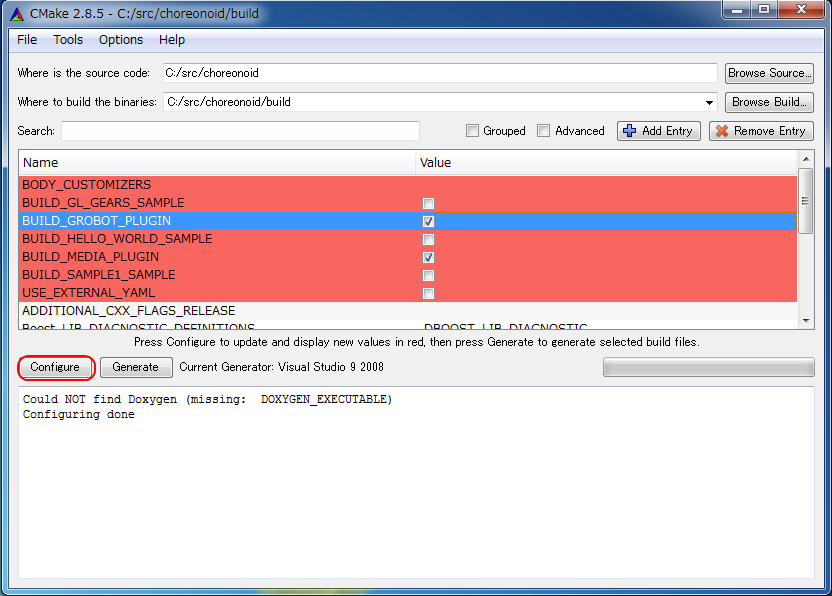
   
You can then set a range of optional features as needed for your particular build. 
For example, a range of Choreonoid functions are off by default, but you can turn these on by toggling the flags that begin with BUILD\_.

You can specify the install path using the **CMAKE_INSTALL_PREFIX** parameter. 
By default, it is set to "c:\\Program Files\\Choreonoid". 
In Windows, only administrators have access to paths below "c:\\Program Files", so this may cause the installation to fail. 
You can run the installer with administrative privileges, but it is probably easiest to simply specify a different directory. 
You can set this with **CMAKE_INSTALL_PREFIX**, specifying a directory structure like, for example, "c:\\choreonoid\\program".

Once you have toggled these settings, click Configure.
If you finish the setup but the Generate button is not clickable, click Configure again. 
Once the Configure process runs and you get a message like that seen below, with “Configuring done” displayed and the Generate button activated, setup is complete.

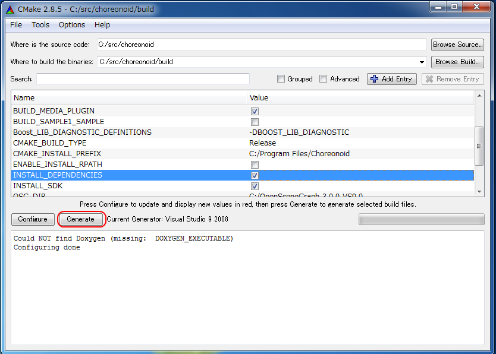

Lastly, click Generate in order to create a Visual Studio project file.

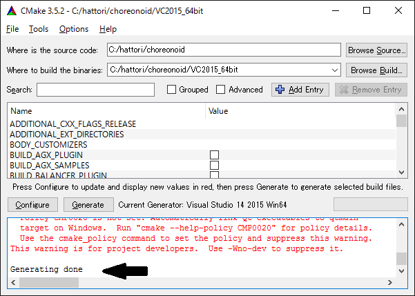

Once the solution file is created, you will see the message **Generating done** in the output pane. 
Use Windows Explorer or another tool to confirm that Choreonoid.sln, a Visual Studio solution file, has been created in the directory in which Choreonoid was built.

Launching Visual Studio and importing solutions
-----------------------------------------------------

If you confirm that the Visual Studio solution file has been created with CMake, you can next build Choreonoid. 
Double-click the file Choreonoid.sln. 
Visual Studio will launch, and the solution file should have opened. 
If Visual Studio fails to launch, there may have been an issue with the installation process, so please reinstall it and attempt to repair the file association. 
You can alternately try to launch Visual Studio on its own and then open the solution file from the menu.

Compiling
-------------

Once a solution is read in, you will see the menu below. 
Change the section marked in red to **Release** and confirm that, for the 64-bit binary, **x64** is displayed, and for the 32-bit binary, **Win32**. 
If you go into debugging, you will be able to create a debuggable binary. 
However, the debugging binary will be considerably slower than the Release version you compiled, so you should use the normal Release binary unless you need to debug.

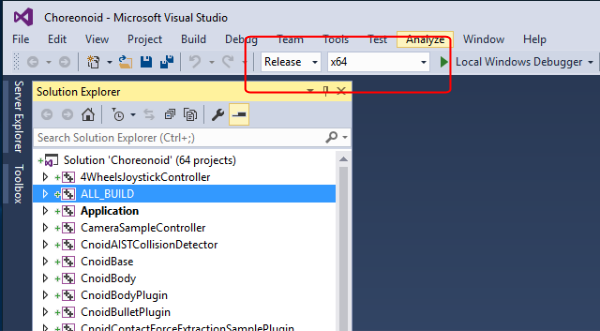

Next, we will build Choreonoid. 
Clicking the build option on the menu will bring up to pulldown menu seen below. 
Click Build Solution (B). 
Choreonoid will now begin building. 
When you see the message **“0 Failed”** in the message window at the bottom, compilation is complete.

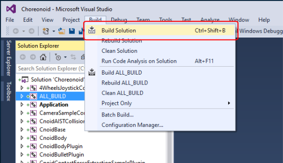

Installation
---------------

Once Choreonoid finishes building, you will then install it. 
Install is selected from the Solution Explorer seen at the upper left. 
Right-clicking on the INSTALL project opens up a menu. 
The top option of this menu is Build (U) (see red border in image). 
Select this. The Choreonoid binary will be copied to the directory you specified with **CMAKE_INSTALL_PREFIX** when using CMake. 
If you place a checkmark next to **INSTALL_DEPENDENCIES** when creating the solution file with CMake, the library dependencies will also be copied.

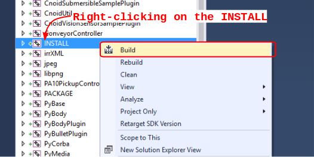

This concludes the process of installing Choreonoid.

Double-clicking on choreonoid.exe in the bin directory of your install path will launch Choreonoid.

Building optional features
-----------------------------------

In addition to setting Choreonoid to the default state as per the steps above, there are several modules, plugins, and samples that can be used. 
These can be enabled with CMake and built into the software. 
In this section, we describe several key optional features. 
You will find an in-depth summary of them at :doc:`Optional Features<options>`.

OpenRTM plugin
~~~~~~~~~~~~~~~~~~~

This plugin is used to perform simulations using RT-Components in Choreonoid. 
Use of this plugin requires that OpenRTM-aist 1.1.x and Python be installed.

To install OpenRTM-aist, you can obtain an installer from the official web site. 
From the `OpenRTM-aist downloads page <http://www.openrtm.org/openrtm/en/content/openrtm-aist-c-112-release>`_ , download the file OpenRTM-aist-1.1.2-RELEASE_x86_64.msi  or OpenRTM-aist-1.1.2- RELEASE_x86.msi. 
Clicking on this file will launch the installer.

To obtain python, access the Python 2.7 download page on the `Python website <http://www.python.org/>`_  and download the Windows MSI installer and run it.
 (The same installer is found on the OpenRTM-aist download page.) 
 We have encountered issues with version 2.7.11, so 2.7.10 is recommended. 
 Follow the installer instructions and, when the option Customize Python 2.7 appears, change **Add python.exe to Path** to **Will be installed on local hard drive**.

.. note:: These installers set environment variables like OMNI_ROOT, but these may not immediately be updated after installation (in particular, in Windows 10). This will cause CMake to not proceed as intended, so please reboot Windows after installation before proceeding.

Once OpenRTM-aist has been installed, set the CMake flags **ENABLE_CORBA**, **BUILD_CORBA_PLUGIN**, and **BUILD_OPENRTM_PLUGIN** to ON. 
The OpenRTM plugin depends on Corba, so you must set all of these parameters on. 
Setting **BUILD_OPENRTM_SAMPLES** to on also builds sample simulations that make use of RT-Components, so it is recommended to first set this to on and try the samples.

If, after clicking the Configure button in CMake, you receive an error stating that OpenRTM-aist could not be found, set the OpenRTM-aist install path using the **OPENRTM_DIR** parameter. 
By default, the path when installing with the above OpenRTM-aist installer will be c:\Program   Files\OpenRTM-aist\1.1.2.

Clicking the Generate button after setting the above CMake parameters will update the solution file. 
You can then compile and install Visual Studio with this file in order to create the OpenRTM plugin. 
The same applies to other plugins; after changing CMake parameters, always compile and install.

Media plugin
~~~~~~~~~~~~~~~

This plugin allows you to play back media files. Set **BUILD_MEDIA_PLUGIN** to ON in CMake.

Some formats, such as MPEG-4 media files, may not play back by default. 
You can enable playback by installing the corresponding codec pack for that file format. 
You can search online to find these codec packs for free. 
Because these codecs can affect the functionality of other video software, we do not make specific recommendations. 
You are encouraged to use codecs that match your system.

ODE plugin
~~~~~~~~~~~~~~~~~~

The Open Dynamics Engine (ODE) is an open-source dynamics computation library; it is used in Choreonoid as a plugin to compute its simulations.

In order to build this plugin and use it, you must first install the ODE library. 
Prebuilt binaries of this library are not available, so you must build it from source. 
Access the `Open Dynamics Engine site <http://www.ode.org/>`_  to download the file and extract it. 
We have tested versions up to 0.12 as working. (Reports have been made of 0.13 not working with Choreonoid.)

The premake command is used to build ODE. 
Launch a command prompt and enter the build directory in the ODE hierarchy. 
For 32-bit architectures, execute this command:

 premake4.exe --with-libccd vs2008
 
For 64-bit architectures, use:

 premake4.exe --with-libccd --platform=x64 vs2008
 
This will create a directory entitled vs2008, which contains the file ode.sln. 
(ODE 0.12 support up to vs2008, so it creates a solution file intended for vs2008. 
If you open this file in VS2015, the conversion wizard will launch and change it into a 2015-compatible format. 
Some warnings may appear, but you can likely ignore these.

Using the converted solutions file, we will now perform a build. 
Select **ReleaseDoubleDLL** for the solution structure and check the **x64** or **Win32** setting. 
Once successful, a file named ode_double.* will be created in lib/ReleaseDoubleDLL.

Next, in the CMake build settings for Choreonoid, set **BUILD_ODE_PLUGIN** to ON and specify the ODE lib root directory for **ODE_DIR**.

Bullet plugin
~~~~~~~~~~~~~~~~
This plugin lets you make use of the Bullet Physics Library, an open-source dynamics computation library, as a computation engine for simulations in Choreonoid.

In order to build and use this plugin, you will need to build the Bullet Physics Library from source. 
Access the `Bullet Physics Library <http://bulletphysics.org>`_  and obtain the source. 
We have tested version bullet-2.83.7 as working.

You can use CMake here in a fashion equivalent to that described before. 
Change the following options to ON.

* **BUILD_EXTRAS**
* **INSTALL_EXTRA_LIBS**
* **INSTALL_LIBS**
* **USE_DOUBLE_PRECISION**
* **USE_MSVC_RUNTIME_LIBRARY_DLL**

Setting the following options to OFF is also the safest approach.

* **All of BUILD_XXX_DEMOS** 
* **BUILD_BULLET3**
* **BUILD_UNIT_TESTS**

Set the install path with **CMAKE_INSTALL_PREFIX**.

.. note:: If you see an error in Extras\HACD\hacdICHull.cpp saying “error C2039:  not a member of ‘max’ : ‘std’”  add the following to the head of this file. ::

   #include "hacdICHull.h"
   #include <limits>
   #include <algorithm>  <--add this line
   
.. note:: Different versions of Bullet may have different CMake options. Consider the below as examples that should be adapted to your version.

In the CMake build settings for Choreonoid, set the **BUILD_BULLET PLUGIN** flag to ON and specify the directory in which the Bullet library is installed with **BULLET_DIR**.

Python plugin
~~~~~~~~~~~~~~~~~~

This plugin is used to import and execute Python scripts and manipulate the Python console used in Choreonoid.

In order to build and use this plugin, you will need Python. 
We have tested version 2.7.10 as working. 
If you already installed Python in the OpenRTM section, skip to the next section. 
From the `Python site <http://www.python.org/>`_ , access the Python 2.7 download page and download the Windows MSI Installer. 
Follow the installer’s instructions and, when asked to Customize Python 2.7, change Add python.exe to Path to Will be installed on local hard drive and complete the installation.

.. note:: The above settings are used to set environment variables, but they may not be reflected immediately after installation (in particular, in Windows 10). This will prevent you from proceeding, so you should reboot Windows after installation of the above.

Once Python is installed, install **Numpy**. 
It can be downloaded from `this page <https://pypi.python.org/pypi/numpy/1.11.0/>`_ . 
Download the file numpy-1.11.0-cp27-none-win_amd64.whl or numpy-1.11.0-cp27-none-win32.whl. 
Launch the command prompt and enter the directory in which the downloaded files are, then install them with this command:

 pip install downloaded filename

Next, set the following Choreonoid build flags to on in the CMake settings:  **ENABLE_PYTHON**, **BUILD_PYTHON_PLUGIN**, and **BUILD_PYTHON_SIM_SCRIPT_PLUGIN**. 

.. note:: Python script functionality is currently only supported in the 64-bit version.

.. note:: We have confirmed that some updates to Visual C++ 2015 cause Python script functionality to malfunction. Specifically, while we were able to successfully build with version 14.0.25123.00 Update 2 (Visual C++ 2015 00325-20000-00000-AA770) of Visual Studio Express 2015 for Windows Desktop, 14.0.25421.03 Update 3 (Visual C++ 2015 00325-20000-00000- AA035), which we believe is a newer version, failed to build, producing an unknown link error.

Uninstalling plugins
~~~~~~~~~~~~~~~~~~~~~~~~~~~~~~
Plugins installed by enabling the **BUILD_XXX_PLUGIN** option will not be deleted even if you turn the option off later. 
If you install a plugin and want to later delete it for unstable performance or other issues, you must delete the file manually. 
Plugins are installed to the Choreonoid install path, followed by /lib/choreonoid-1.5 in the format of Cnoid***Plugin.dll.

