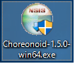
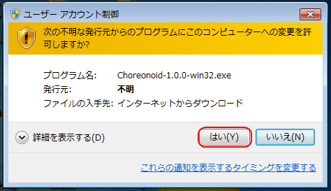
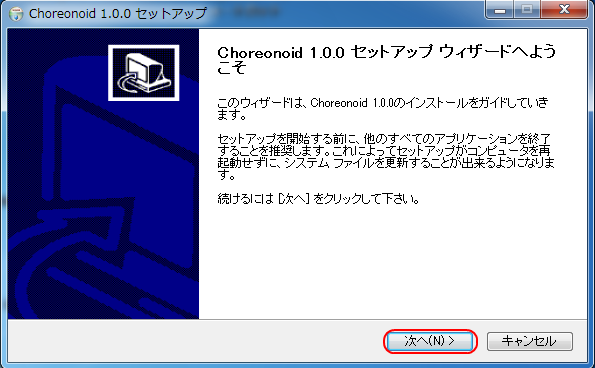
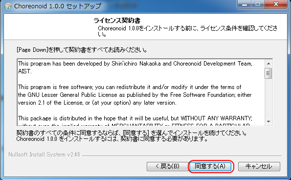
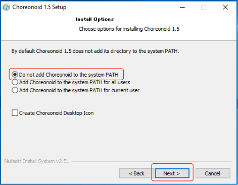
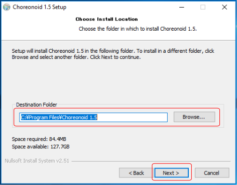
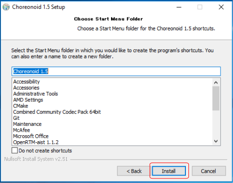
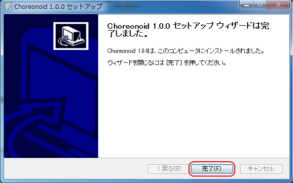

Installing with the installer (Windows)
=============================================

Here we describe how to use the dedicated installer to install Choreonoid on Windows.

First download the installer form the `download page <http://choreonoid.org/ja/download.html>`_ . 
The file named Choreonoid-x.x.x-win64.exe is the Windows installer. (If you see a different version number in the figures and text below, simply replace it with your own.)

Double-click this installer’s icon. On Windows 7, a warning like that seen below will appear. Click Yes (Y) to proceed.

The Choreonoid setup wizard will launch. Click Next (N) to proceed.

You will see the license for Choreonoid and its libraries. If you accept, click Accept (A). 
If you decline to accept, the installer will quit and Choreonoid will not be installed.

If you agree to all of the license terms, the install options menu will appear. 
In most circumstances, you can simply press Next (N) to proceed.

The next menu will ask you to specify a directory in which to install Choreonoid. The default path is generally fine. 
If you do wish to install the program in a different place, you can do so here. Once you select a destination path, click Next (N).

Next, proceed to setting the folder path for the Start Menu. 
This can also usually be left as-is, but if you have a specific folder hierarchy you want to preserve, you can set it here. 
Once you finish this, click Install to start the installation.

Once the entire installation is complete, the menu below will appear. Click Finish (F) to compete the process.

You can choose to launch Choreonoid from the Start Menu. 
This concludes the installation of Choreonoid on Windows.

You can now launch Choreonoid from its desktop icon or from the Start Menu. 
Installing Choreonoid with the installer automatically associates Choreonoid project files (the .cnoid extension) with the program. 
This lets you double-click these files in Windows Explorer to automatically launch them in Choreonoid in one step.

