Details about the OpenRTM plugin
================================

The overall configuration of the OpenRTM plugin is shown below.

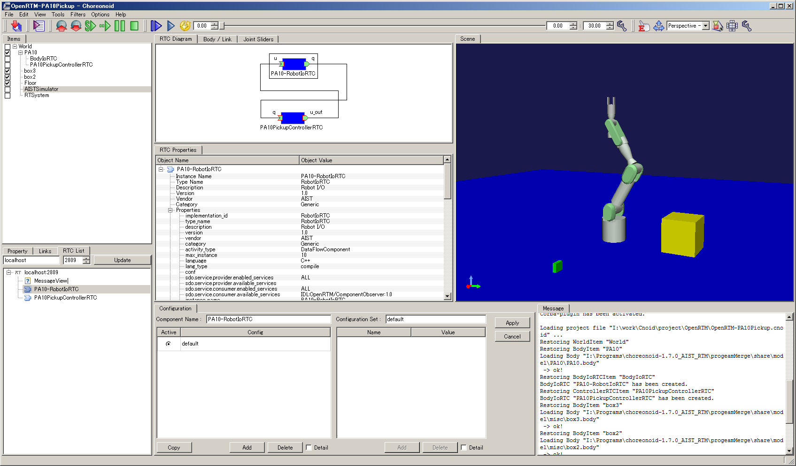

The OpenRTM plugin is made up of the following views.

* RTC List view
 This view displays the RTCs registered in the specified name service in tree format.
 In OpenRTM-aist, a name service is used to manage and publish RTCs. The RTC list view displays the RTCs that can be used when constructing the RT system in tree format.

* RTC Diagram view
 This view is for constructing the RT system. It is used to check/edit the RTCs used by the RT system, information about the I/O ports of each RTC, and the connection parameters between the ports.

* RTC Configuration view
 This is a view for checking/editing RTC configuration information. An RTC’s “configuration information” means the parameters that each RTC uses inside its core logic. By using this view, the user can change the configuration information.

* RTC Property view
 This view is used to display detailed information about RTCs and about connections between ports specified in the RTC Diagram view.

To open each view, select View - Show View from the toolbar at the top of the screen. For details on how to use views, see the "View" section of :doc:`../basics/mainwindow`.

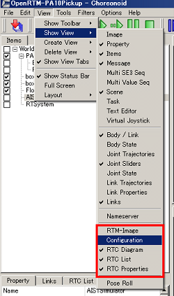

RTC List
--------

In OpenRTM-aist, a name service is used to manage and publish RTCs. The RTC List view displays the RTCs registered in the specified name service in tree format.

The RT system is constructed using the RTCs displayed in this view.

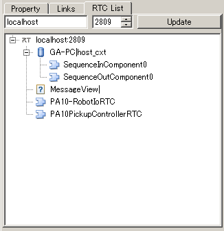

.. note:: When Choreonoid is launched with the OpenRTM plugin installed, the name service will launch automatically with the default settings (IP address: localhost, port number: 2809). So, you don’t need to explicitly start the name service.

Connecting to the name server
,,,,,,,,,,,,,,,,,,,,,,,,,,,,,

| To connect to the name server, click the **Add** button at the top of the RTC List view. Then, in the “Name server connection dialog box”, set the IP address and port number of the target name server.
| When “Name server set in OpenRTM” is checked, connection is made to the name server (default name server) using the information set in Manager of OpenRTM used by Choreonoid. The default name server appears in the RTC List view with the prefix “Default”.

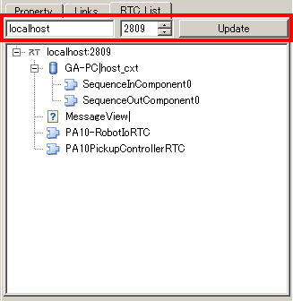

If a component is registered on the specified name server, the registered details are displayed in tree format. The meaning of each icon is explained below.

.. .. tabularcolumns:: |p{3.5cm}|p{11.5cm}|

.. list-table::
  :widths: 8,15,75
  :header-rows: 1

  * - Icon
    - Kind
    - Details
  * - .. image:: images/View/Server.png
    - host_cxt
    - host context
  * - .. image:: images/View/ManagerNamingContext.png
    - mgr_cxt
    - manager context
  * - .. image:: images/View/CategoryNamingContext.png
    - cate_cxt
    - category context
  * - .. image:: images/View/ModuleNamingContext.png
    - mod_cxt
    - module context
  * - .. image:: images/View/Folder.png
    - other than those above
    - folder (other than those above)
  * - .. image:: images/View/NSRTC.png
    - none
    - RT component
  * - .. image:: images/View/Question.png
    - none
    - object (objects other than RT components)
  * - .. image:: images/View/NSZombi.png
    - none
    - A zombie object that is entered in a name server, but where the actual object cannot be accessed

| In a case where, for example, a project is imported while the RTC List view is not active, the display of the name server may be deactivated as shown below. Since a name server that is displayed in this way is failing to get the registration details, try the “update” process described below.

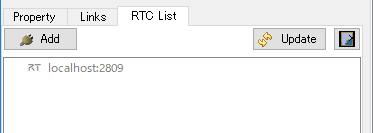

Updating name server information
,,,,,,,,,,,,,,,,,,,,,,,,,,,,,,,,

| If, after connecting to the name server, you want to update the contents of the RTC List view, such as when you launched a new RTC, click the **Update** button. The tree details will be updated with the latest information. The Update button changes to **Cancel Updating** while the update is being processed. If you want to stop the update process partway through, click the **Cancel Update** button.

| If you want to delete a zombie object in the RTC List tree, click the **Clear Zombie** button on the far right. The existence of each element in the tree is checked, and any elements that do not respond are deleted from the tree.

.. image:: images/View/RTCList-03.png

Adding or deleting entries/objects in the name service
,,,,,,,,,,,,,,,,,,,,,,,,,,,,,,,,,,,,,,,,,,,,,,,,,,,,,,

| In the RTC List view, you can add or delete naming objects and object entries in the name service.
| To add a naming object, select the entry from which you want to add it and select **Add Context** from the context menu. Then, on the displayed settings screen, set the **Name** and **Kind** of the context to be added.

.. note::  The addition of contexts can be done for host context, manager context, category context, module context, and other contexts. And each context can be identified by Name + Kind. That is why it is not possible to add a context with a duplicate Name and Type directly under a given context.

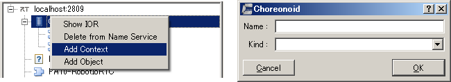

| To register an object, select the entry from which you want to add it and select **Add Object** from the context menu.
| Then, on the displayed settings screen, set the **Name** and **Kind** of the object to be added.

.. note::  The addition of objects can be done for host context, manager context, category context, module context, and other contexts.

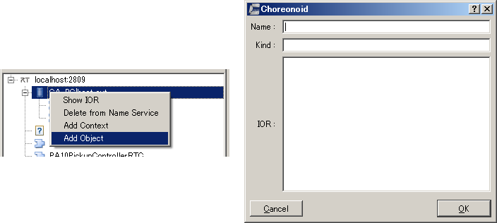

| You can check the IOR of the target entry by selecting **Show IOR** in the context menu.

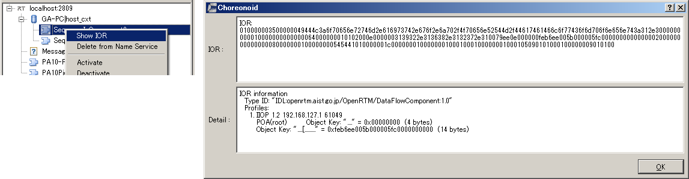

| To delete a name server, entry or object displayed in the RTC List view, select the element to be deleted and select **Delete from Name Service** from the context menu.

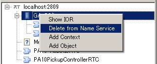

Changing the status of RTCs
,,,,,,,,,,,,,,,,,,,,,,,,,,,

| In the RTC List view, you can change the status of a registered RTC. Select the target RTC and select the operation to be executed from the context menu.

.. image:: images/View/RTC_Action.png

| The meaning of each icon is explained below.

.. .. tabularcolumns:: |p{3.5cm}|p{11.5cm}|

.. list-table::
  :widths: 15,75
  :header-rows: 1

  * - Action name
    - Details
  * - Activate
    - Activates the target RTC. Can be enabled only when the RTC is deactivated.
  * - Deactivate
    - Deactivates the target RTC. Can be enabled only when the RTC is activated.
  * - Reset
    - Resets the target RTC from an error status. Can be enabled only when the RTC status is “Error”.
  * - Exist
    - Stops the target RTC and stops.
  * - Start
    - Starts the operation of the execution context (ExecutionContext: EC) of the target RTC. Can be enabled only when the EC is stopped.
  * - Stop
    - Stops the operation of the execution context (ExecutionContext: EC) of the target RTC. Can be enabled only when the EC is running.

RTC Diagram view
----------------

| This view is for constructing the RT system. The RT system is constructed by dragging and dropping the RTCs that make up the target system from the RTC list.
| In this view, the RTCs and their ports are displayed in schematic format, and their status is displayed in real time. Also, the connection status between ports is displayed as lines connecting the ports.
| In order to build an RT system in this view, it is necessary to first create an RTSystem item.

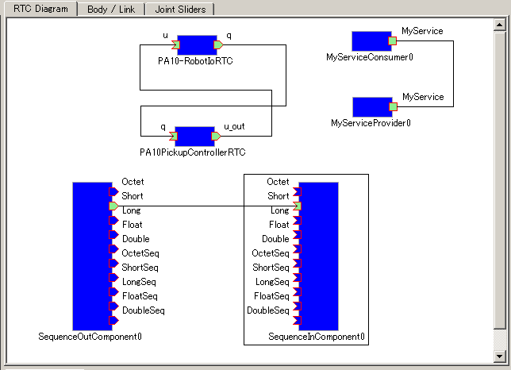

Adding or deleting RTCs
,,,,,,,,,,,,,,,,,,,,,,,

To add RTCs that make up the RT system, drag and drop the target RTCs from the RTC List onto the RTC Diagram.

.. note:: It is not possible to place the same RTC more than once. However, if an RTC with the same IOR is registered on the RTC List as a separate path, it is possible to add each RTC (whether it is the same RTC or not is decided based on the full path on the RTC List and not the IOR).

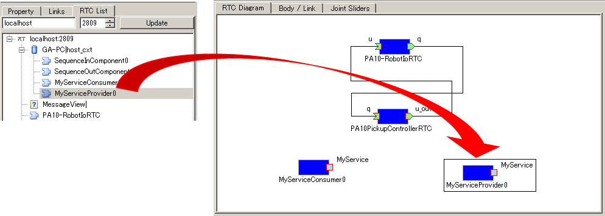

| An RTC placed on the RTC Diagram is displayed as a rectangle. Also, the ports defined for each RTC are displayed around that rectangle.
| The status of each RTC and port is indicated by color. The meanings of icons and colors on the RTC Diagram are shown below.

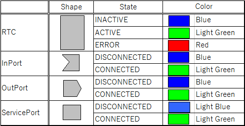

| If you want to change the location of a placed RTC, select the target RTC and drag with the mouse. You can move it to an arbitrary position.
| The RTC Diagram monitors (polls) the status of each RTC at a specified cycle and displays its status in real time. The polling cycle can be set in **Polling cycle** on the settings screen.

| To delete the RTC from the RTC Diagram, select the target RTC and press the **Delete** key, or select **Remove** from the context menu.

.. image:: images/View/Delete_RTC.png

Updating the status of the RT system
,,,,,,,,,,,,,,,,,,,,,,,,,,,,,,,,,,,,

| When the “State Check” of the RT system item is set to “Polling”, the status of each element on the RTC Diagram is automatically updated at each set polling cycle.
| On the other hand, if you want to update the status of each element on the RTC Diagram when the “State Check” of the RTSystem item is set to “Manual”, right-click the background of the RTC Diagram and select **Update** from the menu.

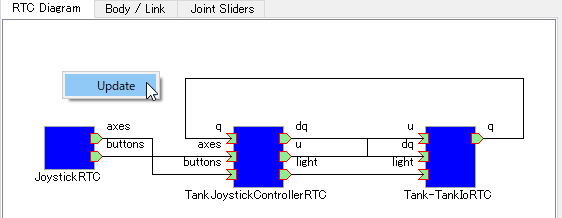

Changing the status of RTCs
,,,,,,,,,,,,,,,,,,,,,,,,,,,

In the RTC Diagram, you can change the status of a deployed RTC. Select the target RTC and select the operation to be executed from the context menu.

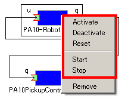

| The meaning of each icon is explained below.

.. .. tabularcolumns:: |p{3.5cm}|p{11.5cm}|

.. list-table::
  :widths: 15,75
  :header-rows: 1

  * - Action name
    - Details
  * - Activate
    - Activates the target RTC. Can be enabled only when the RTC is deactivated.
  * - Deactivate
    - Deactivates the target RTC. Can be enabled only when the RTC is activated.
  * - Reset
    - Resets the target RTC from an error status. Can be enabled only when the RTC status is “Error”.
  * - Exist
    - Stops the target RTC and stops.
  * - Start
    - Starts the operation of the execution context (ExecutionContext: EC) of the target RTC. Can be enabled only when the EC is stopped.
  * - Stop
    - Stops the operation of the execution context (ExecutionContext: EC) of the target RTC. Can be enabled only when the EC is running.

.. note:: The RTCs under the RTSystem item are automatically activated when the simulation starts and automatically deactivated when it ends.

Connecting and disconnecting ports
,,,,,,,,,,,,,,,,,,,,,,,,,,,,,,,,,,

| To connect between RTC ports, drag and drop between the ports to be connected.
| When you start dragging from the port where the connection originates, the border color of the connectable ports within the deployed RTCs changes.
| If the port you are trying to connect to is not connectable, its icon will change to a prohibited symbol as you hold the mouse, and you will not be able to drag and drop.

.. note:: Determine whether or not ports can be connected is done using the following checks. “Are the port to be connected of the same type (data port, service port)?” If the connection ports are data ports, the following further check is done. “Do the ports to be connected have opposite orientations (in/out)?” “Do the ports to be connected have shared elements in their settings for ‘data type’, ‘interface type’, and ‘subscription type’?”

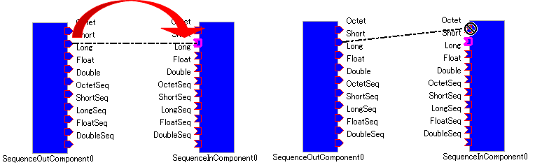

|
| If you drag and drop between connectable data ports, the following dialog box will be displayed.

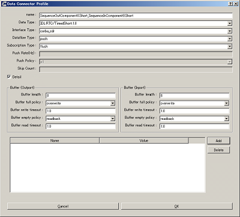

The meaning of each item in the settings is explained below.

.. .. tabularcolumns:: |p{3.5cm}|p{11.5cm}|

.. list-table::
  :widths: 25,75
  :header-rows: 1

  * - Item name
    - Details
  * - Name
    - Name of the connection. You can set this to any name.
  * - Data Type
    - The type of data to be sent and received between ports. Select from the details defined for the ports to be connected.
  * - Interface Type
    - The type of port that sends and receives data. Select from the details defined for the ports to be connected.
  * - Dataflow Type
    - How data is transmitted and received.
  * - Subscription Type
    - | The timing for transmitting data. Select from the following. Enabled only when the dataflow type is Push.
      |   New: transmit when new data is stored in the buffer
      |   Periodic: periodically transmit data at regular intervals
      |   Flush: transmit instantly without going through a buffer
  * - Push Rate
    - Data transmission frequency (the unit is Hz). Enabled only when the subscription type is Periodic.
  * - Push Policy
    - | Data transmission policy. Select from the following. Enabled only when the subscription type is New or Periodic.
      |   all: transmit all data stored in the buffer
      |   fifo : transmit data in the buffer in the first-in first-out style
      |   skip : transmit thinned out data in the buffer
      |   new : transmit new data in the buffer (discard old, unsent data)
  * - Skip Count
    - The number of transmitted data skips. Enabled only when Push Policy is set to skip.
  * - Buffer length
    - The size of the buffer.
  * - Buffer full policy
    - | Behavior in case of buffer full when writing data to buffer. Select from the following.
      |   overwrite : overwrite
      |   block : block writing to the buffer
      |   do_nothing : do nothing
  * - Buffer write timeout
    - Time to generate the timeout event when writing data to the buffer (the unit is seconds) If 0.0 is set, timeout does not occur.
  * - Buffer empty policy
    - | Behavior in case of buffer empty when writing data to buffer. Select from the following.
      |   readback : reread the last element.
      |   block : lock reading from the buffer
      |   do_nothing : do nothing
  * - Buffer read timeout
    - Time to generate the timeout event when reading data from the buffer (the unit is seconds) If 0.0 is set, timeout does not occur.

If you want to set properties in the connection profile other than those specified above, you can set arbitrary properties using the list at the bottom of the screen.

.. note:: Data type, Interface type, Dataflow type, and Subscription type get the PortProfile of the ports to be connected, and only the items that match for the OutPort and the InPort are displayed. Since the PortProfile information is defined when creating the RTC, items cannot be added during run time. If the item you want is not displayed, check the definition details of the target RTC.

.. note:: If Buffer Policy is set to block and the timeout value is specified, it will timeout if it cannot be read/written after the specified time.

| If you drag and drop between connectable service ports, the following dialog box will be displayed.

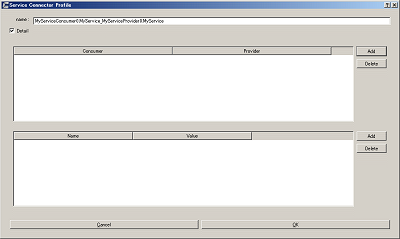

| For Name, specify the connection name. You can set this to any name.
| When connecting service ports, of the service interfaces defined for each port, the compatible ones are connected automatically. However, it is also possible to use the middle list to explicitly specify the service interface to which the user connects. If you click the Add button, the service interface defined for each service port will be displayed in a dropdown menu, so select the service interface to be connected.
| If you want to set user-specific connection information in the connection profile, use the list at the bottom of the screen. It is possible to set arbitrary, user-defined properties.
|
| If you want to move the position of a displayed connection line, drag the black dot on the connection line to move it. Using the mouse, you can move a vertical line in the horizontal direction and a horizontal line in the vertical direction.

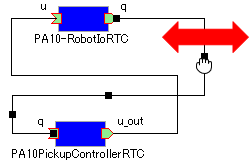

| To cancel a connection between ports, select the connection line and click the **Delete** button, or select **Delete** in the context menu.

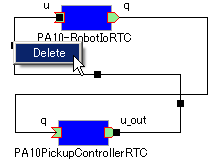

RTC Configuration view
----------------------

This is a view for displaying/editing RTC configuration information. It displays information on the RTC selected in the RTC List or RTC Diagram. A list of Configuration Sets is displayed on the left side of the screen, and on the right you will see the properties in the Configuration Set.

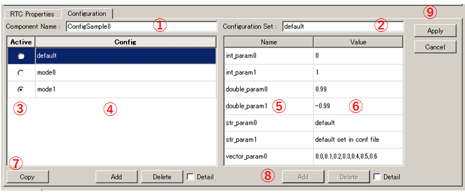

The details for each item are as follows.

.. .. tabularcolumns:: |p{3.5cm}|p{11.5cm}|

.. list-table::
  :widths: 5,95
  :header-rows: 1

  * - Number
    - Details
  * - ①
    - The name of the selected RTC.
  * - ②
    - The name of the selected Configuration Set.
  * - ③
    - The active Configuration Set. You can change the active Configuration Set using the radio buttons.
  * - ④
    - A list of the Configuration Sets.
  * - ⑤
    - The name of the Configuration Set selected on the left.
  * - ⑥
    - The property values of the Configuration Set selected on the left.
  * - ⑦
    - Buttons to Clone, Add or Delete a Configuration Set.
  * - ⑧
    - Buttons to Add or Delete a property.
  * - ⑨
    - Buttons to Apply or Cancel the changes.
    
| The left/right grid can be edited. If you want to modify the setting values, edit each grid directly.
| Also, it is also possible to change the active Configuration Set with the radio buttons in the leftmost column of the left grid.
| 
| Edited items have a light red background. The edited details will not be reflected in the RTC until the **Apply** button is clicked. (Items with a light red background are not reflected in the actual RTC.)

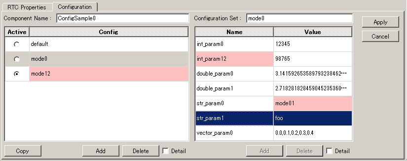

Toggle **ON** the **Detail** checkboxes below the left and right grids to display all the information that has been set for the Configuration Set.

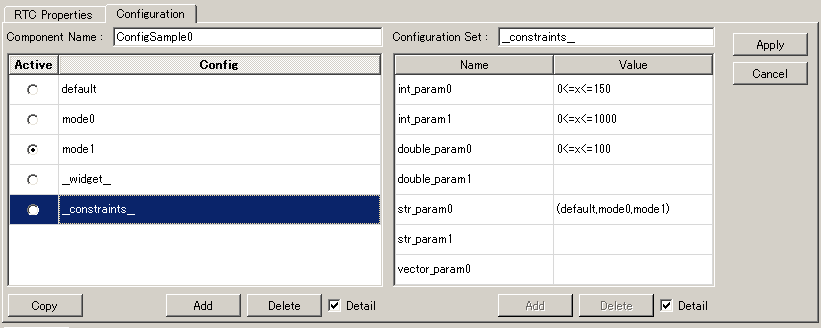

.. note:: A Configuration Set has hidden elements which define information to be used in normal operation, limitations of each property, etc. If you toggle **ON** the **Detail** checkbox, the hidden elements will be displayed. Refer to the RTCBuilder page of the official OpenRTM-aist website for the definition method and details of hidden elements.

RTC Property view
-----------------

This view is used to display detailed information about RTCs and about connections between ports. It displays information on the RTC or port connections selected in the RTC List or RTC Diagram.

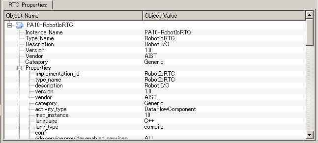

| When an RTC is selected, you can check such things as the basic information (instance name, type name, version number, etc.) of the target RTC, information on the Execution Context related to the target RTC, and port definition information.
| When a connection line between ports is selected, you can check the connection profile that has been set up and details of the related InPorts/OutPorts.
| It is used when for such things as confirming the types that can be used on the ports of a given RTC or checking the information about properties set when connecting between ports.

Settings screen
---------------

Select **Tools** - **OpenRTM** - **Preferences** in the upper tool bar to display the settings screen related to the OpenRTM plugin.

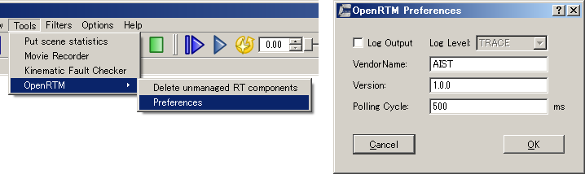

The meaning of each item in the settings is explained below.

.. .. tabularcolumns:: |p{3.5cm}|p{11.5cm}|

.. list-table::
  :widths: 25,75
  :header-rows: 1

  * - Item name
    - Details
  * - Log output
    - A checkbox used to specify whether to output log information of each RTC.
  * - Log level
    - Set the log level for the RTC. Can only be set when **Log output** is set to **ON**.
  * - Setting
    - Specifies the settings file for the OpenRTM-aist manager used in Choreonoid. An example of how to specify the name server to be used is shown below. Refer to the official OpenRTM-aist website for details about what information is configurable and how to set it.
  * - Vendor name
    - Set the default value for Vendor name of the RT system. Set when an RTSystem item is newly created.
  * - Version
    - Set the default value for Version number of the RT system. Set when an RTSystem item is newly created.

::

 corba.nameservers: 192.168.0.11:2809

