TankJoystick tutorial: creating and running a project
==========================================================

.. contents::
   :local:
   :depth: 1

Summary
-------------

This tutorial makes use of the OpenRTM framework to create a sample and manipulate the “Tank” model, one of Choreonoid’s sample models, with a joystick (gamepad). The Tank model is a mobile robot styled like a tank; it consists of two crawlers and twin-axis joints used to rotate the position of the gun turret and gun barrel. The end of the gun barrel has a light and camera attached. This is used to illuminate a space and view camera footage from within, with the crawlers used to maneuver around the environment and search for things.

You will see the following screen when launching the sample. The scene in the center draws the view seen from the tank’s camera.

.. image:: images/TankJoystickScreenShot.png

This sample requires a joystick with four or more axes and at least one button. If you do not have an actual joystick, you can use the virtual joystick view provided in Choreonoid and manipulate it with the keyboard.

This sample is included in the OpenRTM samples provided with Choreonoid. The project file is OpenRTM-TankJoystick.cnoid.

.. _tankjoystick_openrtm_plugin_samples:

Using OpenRTM plugins and samples
---------------------------------------

In order to use the OpenRTM functionality, you must have `OpenRTM-aist <http://openrtm.org/>`_ installed on your OS, as well as the OpenRTM plugin, one of Choreonoid’s :doc:`optional features <../install/options>`.
If building Choreonoid from source, set the following parameters to ON in CMake.

* ENABLE_CORBA
* BUILD_CORBA_PLUGIN
* BUILD_OPENRTM_PLUGIN

Once the OpenRTM plugin is installed, you will see this message in the message view when launching Choreonoid. ::
  
 OpenRTM plugin loaded.

Enabling BUILD_OPENRTM_SAMPLES to ON will build the sample used in this tutorial. You will need the files contained in the sample in order to proceed with this tutorial, so please set that flag to on.

Building a simulated world
----------------------------------

You will first build the virtual world in which to run the simulation and set the basic parameters. For details on this process, please refer to :doc:`../simulation/simulation-project`.

We begin by creating a world item. The Tank model is then imported as a sub-item of the world item. You can find this model file in the Choreonoid share directory under model/misc/tank.body. This item is imported as the body item. Place checkmarks in the item tree view for the new item and open the scene view.

One simple environmental model you could use is a floor model, but we will opt to use the Labo1 model here, which evokes a research plant that is more fitting for a “robotic” mood. You will find this model in the share directory as the file model/Labo1/Labo1.wrl. As with the Tank model, import this as a sub-item of the world item and place a checkmark next to it.

After importing the model, we :ref:`configure its initial state <simulation_setting_initial_status>`. Arrange this such that the surface below the Tank model’s crawlers is the top of the floor in Labo1.

Next, we :ref:`create a simulator item and configure its settings <simulation_creation_and_configuration_of_simulator_item>`. We need a simulation item that supports :doc:`../simulation/crawler-simulation`. Standard AIST simulator items support this functionality, so we will use that. Create an AIST simulator item and place it as a sub-item of the world item. The properties can be set as the default.

After taking the above steps, the item tree view should be as follows: ::

 [ ] - World
 [/]   + Tank
 [/]   + Labo1
 [ ]   + AISTSimulator
 
Next, we set :ref:`set time intervals <simulation-time-step>`. For the time being, use 1000 [fps].
 
This will create the foundations for your simulation project. You can now :ref:`save the project <basics_project_save>` using a filename of your choice. We recommend saving your project file each time you complete a series of steps and modify settings.

.. _tankjoystick_rtsystemitem:

Using RT System Items
--------------------------------

OpenRTM allows for using RT-Components (RTC) to build a robot system. Systems generally are composed of multiple RTC and the underlying connections to their I/O ports and service ports. The Choreonoid OpenRTM plugin provides RT System Items as a project item used to administrate this connection data. This item can be used to build RTC systems as Choreonoid projects.

In this sample, we will use multiple RTCs, so the RT System Item is required. From the main menu, select File > New> RT System and create this item. This item can be located anywhere in the item tree, but we will choose to make it a sub-item of the World item. The item tree should look as follows: ::

 [ ] - World
 [/]   + Tank
 [/]   + Labo1
 [ ]   + AISTSimulator
 [ ]   + RTSystem

This orientation makes it clear at a glance that the RT system is intended for the virtual world in question.

Using the RTC administration view
--------------------------------------------

Building a system on Choreonoid that makes use of RTC requires an interface for the same. The Choreonoid OpenRTM plugin provides three views to that end:

* RTC list view

 This view displays a list of RTCs existing in the current system. This can be used to confirm whether the desired view has been created; you can also select and manipulate various RTC.
  
* RTC diagram view

 This view is used to check and edit I/O ports for each RTC and the connection parameters therein. The RTCs and ports are displayed like a schematic, with connections between ports displayed as lines. This view generally edits RT system items and first requires the creation of RT system items.

* RTC property view

 This view is used to check RTC properties. RTC selected in the RTC list view appear in this view.

When using OpenRTM in Choreonoid and building a system, these views are essential, so begin by opening them. As seen in the :ref:`switching views section <basics_show_hide_views>`, from the main menu, select Display > Display Views. If the OpenRTM plugin is loaded, you will see RTC List, RTC Diagram, and RTC Property in the menu. Place checkmarks next to these to display them. The views appear in a fixed position by default, but you can :ref:`change the layout <basics_modify_layout>` as needed to match your workflow. The actual use of these views is described later, so it may be best to first use them before deciding where to put them.

After displaying the views, save this state in the project file. To do so, as described in :ref:`saving a layout <basics_layout_save>`, from the main menu, select File > Project File Options > and place a checkmark next to Layout. With this setting, the view states and their layout will be saved in the project file, allowing them to be reproduced the next time you load the project.

.. note:: Note: these interfaces provide functionality similar to that provided by `RT System Editor <http://www.openrtm.org/openrtm/ja/content/rtsystemeditor-110>`_ , a development tool included in OpenRTM-aist. If using RT System Editor, you must launch the tool and configure it separately from Choreonoid. The above interfaces, by contrast, provide ad integrated approach that does not require running the tools separately.

.. _tankjoystick_introduce_robot_io_rtc:

Using RTC for robot I/O
-------------------------------------

When using RT-Components to build a robot system, you first need RTC for the robot. More accurately, you need an RTC to handle the input/output for the various devices on the robot – architecture, encoders, power sensors, acceleration sensors, angular velocity sensors, cameras, laser range sensors, et cetera. While RTCs are sometimes individually used for each of these, we presume use of a single RTC that covers all of these for the robot, and we refer to it as the Robot I/O RTC.

The Choreonoid OpenRTM plugin makes use of a property item in order to implement a robot I/O RTC Choreonoid. That item is the BodyIoRTC Item. This item allows you to run processes to synchronize movement from I/O RTC in time with the progress o the simulation.

Let’s try using the BodyIoRTC item to configure I/O RTC (BodyIoRTC) for the robot model. First, create a BodyIoRTC item and set it as a sub-item of the Tank item. The item tree should be as follows. ::

 [ ] - World
 [/]   + Tank
 [ ]     + BodyIoRTC
 [/]   + Labo1
 [ ]   + AISTSimulator
 [ ]   + RTSystem
 
This allows you to specify within the parent-child relationship on the item tree the robot model that is to be subject to I/O from the BodyIoRTC item. Without this relationship, BodyIoRTC will fail to function as intended.

Next, we specify the actual BodyIoRTC that we intend to use. This is done by using the RTC module property for the BodyIoRTC item. Select the BodyIoRTC item on the item tree and configure the RTC module property. The right side of this property shows a file icon; clicking this brings up a file selection dialog. By default, this is set to open the rtc subdirectory within the Choreonoid plugin directory. There you will find TankIoRTC.so, which is the RTC module file we will be using. Select it. If this file is not there, check to see whether the OpenRTM samples are properly built and installed.

.. note:: You can also enter TankIoRTC directly into the property field without using the file dialogue. Setting it this way causes the TankIoRTC.so module file, which is formatted as the module name and shared library extension .so, to be read from the directory set in the relative path properties. The default relative path is the RTC directory, which refers to the target directory for the import commands above.

The above settings should cause an instance of TankIoRTC to be created. You can check it in the RTC list view. When pressing the Update button in the RTC list view, you should see the Tank-TankIoRTC message seen below.

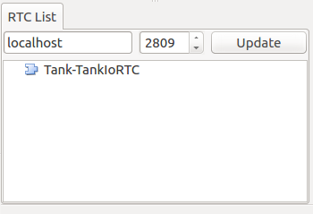

If the above is not displayed, RTC generation may have failed, so check your settings and the existence of the RTC module files, etc.

Tank-TankIoRTC is the default instance name. The format generally follows that of the robot item name, a dash, and the RTC module name. However, the RTC instance name property of the BodyIoRTC item can be freely changed.

Next, check the I/O ports for the newly-created RTC. Click and drag the Tank section of the RTC list view and drop it on the top of the RTC diagram view. This should cause the RTC diagram view to display the following. (If it does not, check to ensure that the RT system item created per  :ref:`tankjoystick_rtsystemitem` was created correctly.

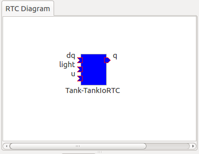

The blue rectangle seen here represents an instance of TankIoRTC. Below it is the instance name, which shows that this is the RTC we created. The shapes on the side of the rectangle are the input and output ports used by the RTC. On the left are input ports, and on the right are output ports. These ports function as follows.

.. list-table::
 :widths: 15,20,25,50
 :header-rows: 1

 * - Port name
   - I/O
   - Format
   - Details
 * - u
   - Input
   - TimedDoubleSeq
   - Joint torque value (twin axes of gun turret)
 * - dq
   - Input
   - TimedDoubleSeq
   - Drive velocity of crawlers
 * - light
   - Input
   - TimedBooleanSeq
   - Turn lights ON/OFF
 * - q
   - Output
   - TimedDoubleSeq
   - Joint angle (twin axes of gun turret)
	   
These ports allow for embedding OpenRTM input/output for the Tank model we will use in the simulation.

There are two ways of preparing the BodyIoRTC used for input/output.

1. Prepare one to match the robot model in advance

2. Use an existing BodyIoRTC

For this sample, we use TankIoRTC, a BodyIoRTC for the Tank model. This corresponds to number 1 above. As for how to create the TankIoRTC, that is outside of the scope of this document; here we discuss use of the element after it has been already created. For details on creating the TankIoRTC, please refer to the :doc:`tank-joystick-bodyiortc` .

Support for the second method above is not yet complete, but we plan to provide a generic BodyIoRTC in the future for use on standard robot models.

.. note:: the BodyIoRTC item used here, as described in  :ref:`simulation_select_controller_item_type`, responds directly to the  :ref:`simulation-concept-controller-item` used in the  :doc:`../simulation/index`. BodyIoRTC items inherit the properties of ControllerItems. BodyIoRTC, which is the basis of the BodyIoRTC item, is designed to only provide I/O to the robot, so remember that the actual control is handled by other RTCs. This is discussed in detail later.

.. note:: in addition to the BodyIoRTC item, you will also find the BodyRTC item used to create robot I/O RTC. This item was used by default before the introduction of the BodyIoRTC item and is designed slightly differently. The BodyRTC item does not require using a BodyIoRTC module; instead, the corresponding RTC is created internally within the BodyRTC item. You can allow the BodyRTC item to automatically determine what I/O ports to use, or you can use a settings file to indicate specific ports. In some contexts, this is a more convenient alternative, but the more complex your I/O setup becomes, the more this method becomes unable to account for all of the ports you will need and can cause some trouble with respect to creating a ubiquitous and generic design. The BodyIoRTC item is by contrast intended to be a more simple and ubiquitous item, so we recommend using it instead.

Using RTC for control
-------------------------------

The BodyIoRTC item allows for controlling robot I/O through RTC ports. Controlling the robot requires a control RTC, so let us install that below.

In this sample, a joystick is used to manually operate the Tank model. This is an RTC called TankJoystickControllerRTC. You can refer to the  :doc:`tank-joystick-controller`  for details. In this section, we describe solely how to use said RTC to build a control system for the Tank model.

The control RTC is employed using a controller RTC item. From the main menu, select File > New > Controller RTC and create this item. By default, its name will be ControllerRTC. We have already created a separate controller RTC item by that name in this sample project, so in order to distinguish the two, change the name to TankJoyStickController. The item can be anywhere provided it is below the World item, but placing it as a sub-item of the Tank item will make it easier to understand that this RTC is intended to control the Tank model. The item tree should look like the following. ::

 [ ] - World
 [/]   + Tank
 [ ]     + BodyIoRTC
 [ ]     + TankJoystickController
 [/]   + Labo1
 [ ]   + AISTSimulator
 [ ]   + RTSystem

Next we specify the actual control RTC we will use. As when we created the BodyIoRTC item, use the RTC module property for the created item to specify it. The RTC module we will be using is TankJoystickControllerRTC.so. This is included in the default RTC directory. You can select it from the file selection dialog opened from the icon to the right of properties, or you can enter the name TankJoyStickController RTC directly in the property field to call the module.

These settings will create a control RTC instance. Clicking the Update button on the RTC list view will cause the TankJoystickControllerRTC entry to appear.

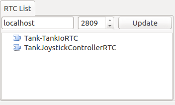

Drag this RTC to the RTC diagram view. This will cause the RTC diagram view to display the following two RTCs.

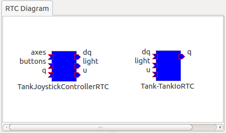

This will let you verify the ports for TankJoystickControllerRTC. The ports work as follows:

.. list-table::
 :widths: 15,20,30,60
 :header-rows: 1

 * - Port name
   - I/O
   - Format
   - Details
 * - axes
   - Input
   - TimedFloatSeq
   - State of joystick axes
 * - buttons
   - Input
   - TimedBooleanSeq
   - State of each joystick button
 * - q
   - Input
   - TimedDoubleSeq
   - Joint angle (2 axes of gun turret)
 * - u
   - Output
   - TimedDoubleSeq
   - Joint torque value (2 axes of gun turret)
 * - dq
   - Output
   - TimedDoubleSeq
   - Drive velocity of crawlers
 * - light
   - Output
   - TimedBooleanSeq
   - Turn light ON/OFF

This RTC is the most central part of the controller that governs the robot’s actions. The processes it carries out specifically involve obtaining the state of joystick input and computing values to issue the Tank model’s crawlers and gun turret axes, and outputting those.

The ControllerRTC item contains the Execution Context property. By default, this is set as Choreonoid Execution Context; for the purposes of this control RTC, you can leave that setting as-is. Doing so allows calling the onExecute variable of the control RTC to synchronize with the progress of the simulation itself. For control programs that must be executed in real-time on a robot, such as PD control of the joint architecture, you can specify the execution context to do so.

Connecting control RTC and I/O RTC
---------------------------------------------

In order to use the control RTC we obtained above as a controller, you must first connect to the robot’s I/O RTC and port. These settings are performed in the RTC diagram view.

First, move your mouse to the figure labeled dq on the TankJoystickControllerRTC. Dragging it will create a dotted line that you should drop on the point labeled dq on the Tank-TankIoRTC. This will produce a dialog like that seen below. Click OK.

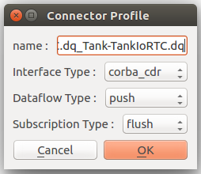

This will cause each dq to become connected by lines as seen below.

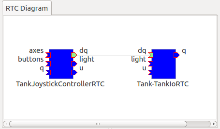

This causes the controller’s dq output port and the robot’s dq input port to establish a connection.

Similarly, q, u, and light also connect to those ports of the same name, creating the schematic below.

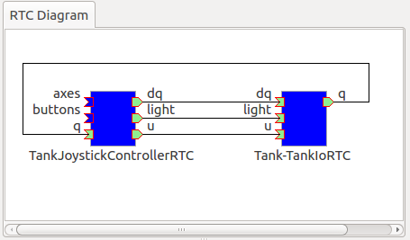

You can also adjust the way the lines indicating connections are displayed. Clicking a connected line will display several squares on top of it; you can drag these to adjust its position. In this example, after connecting port q, it overlaps other connection lines, so for the purposes of better visibility, we adjust them to be arranged like the figure above.

If you mistakenly connect two ports, you can click the line and press the Delete key to cut the connection.

Using joystick RTC
-----------------------------

The settings thus far will enable you to control the Tank robot. Launching the simulation will control the robot’s gun barrel to maintain its current state. This alone is not enough to move the robot, however. This system is predicated on using a joystick to move the robot. The TankJoystickControllerRTC that we implemented above does not include a component to poll the state of the joystick. Instead, it has ports used to input the joystick state; connecting its state to these ports allows for proper control.

This requires us to set up a separate RTC to read the joystick’s state. We will enable a JoystickRTC to do so. This RTC is also deployed via the ControllerRTC item. Just as we did when deploying the control RTC, first create a ControllerRTC item and assign it within the World item. For the RTC Module properties, use the JoystickRTC module found in the same RTC directory as before. Naming the ControllerRTC item “Joystick” or something similar will aid understanding. The item tree should look like that seen below. ::

 [ ] - World
 [/]   + Tank
 [ ]     + BodyIoRTC
 [ ]     + TankJoystickController
 [ ]     + Joystick
 [/]   + Labo1
 [ ]   + AISTSimulator
 [ ]   + RTSystem

The RTC list view should appear as below. Check that the JoystickRTC instance has been properly created.

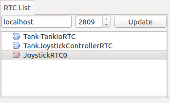
 
One difference from the TankJoystickControllerRTC is that the Execution Context property is set with PeriodicExecutionContext. Doing so enables the joystick state values to be refreshed at a regular interval in real-time irrespective of progress of the simulation. The joystick itself is not an element existing within the virtual simulation, but a real-world physical object, so this setting is more appropriate for its context.

In addition to the Execution Context, we set the Execution Frequency property. The Hz frequency which we set controls when the RTC onExecute variable is called. If we set it to 30, the joystick state will be polled thirty times a second and outputted to the port.

.. note:: Note: setting the Execution Context for the joystick RTC to ChoreonoidExecutionContext does not imply that it will not run. By contrast, you must not set the TankJoystickControllerRTC Execution Context to PeriodicExecutionContext. Doing so will prevent you from controlling the robot as intended and break the simulation, potentially causing the robot to fly about.

Lastly, drag the JoystickRTC to the RTC dialog view and connect the ports. You will find axes, which output the state of the joystick's axes, and buttons, which output the state of its buttons. These correspond to the input ports of the same names on the TankJoystickControllerRTC; connect the two. You should see the following configuration.
	  
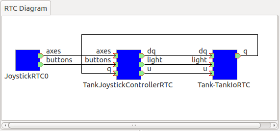

Using joystick devices
------------------------------

In addition to the RTC used to process the joystick, you will also need – it goes without saying – a joystick itself. There are many joysticks on the market; many available for game consoles like PlayStation and Xbox and those like them have many axes and buttons, making control easy. They are also readily available, so these types of joysticks are an excellent choice. We use a Logicool F310 gamepad. Gamepads normally come with USB interfaces and, in most cases, will be automatically detected by your OS when plugged in. The aforementioned JoystickRTC is designed to access joysticks via Linux’s /dev/input/js0 device file.

.. note:: in Linux, you can use jstest to determine whether joystick hardware is detected by the OS. In Ubuntu, issue the command sudo apt-get install joystick to install this tool. You can run it in the manner of "js test /dev/input/js0." If the joystick detected on /dev/input/js0 is correctly detected, it will display the state of the axes and buttons. If your joystick is not detected correctly, it will print the error message "jstest: No such file or directory."

Even if you do not have joystick hardware, you can use the virtual joystick below in lieu of that.

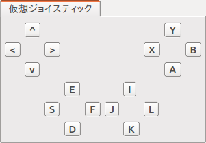

This view is accessed by selecting Main Menu > Display Views > Virtual Joystick View. As with the RTC control view, you :ref:`Change the layout <basics_modify_layout>` as needed.

If your hardware joystick is detected, you would use that; if it is not, you use this virtual joystick view to control.

This view is based on the layout of traditional gamepads. The cursor keys on the keyboard correspond to the directional pad on the gamepad, and the A, B, X, and Y keys correspond to the gamepad buttons. E, D, S, and F correspond to the left analog stick, and the I, K, J, and L keys correspond to the right analog stick. These are oriented on the view based on their respective directions. The layout is also based on the home row keys and ease of functionality.

When using a virtualized joystick, you would click this view area to bring keyboard focus to it. Otherwise, keypresses on the keyboard will not provide keyboard input.

.. note:: Note: exercise caution if using a joystick in Ubuntu installed in a VirtualBox instance. If Guest Additions is installed in VirtualBox, devices like /dev/input/js0 and /dev/input/js1 are integrally controlled by the mouse. In this case, the joystick RTC will detect /dev/input/js0 as a joystick and fail to function properly. In order to avoid this, you can create an rtc.conf file and change the device settings. Specifically, you should place an rtc.conf file in the current directory used to launch choreonoid, with the following line in that file:

 HumanInterfaceDevice.JoystickRTC.conf.default.device: /dev/input/js2

Running simulations
----------------------------

After configuring the settings above and launching the simulation, each RTC on the RTC diagram view will change from blue to green. This indicates that the RTCs are Active.

From here, you can use the joystick to move the Tank robot. One analog stick is used to control forward movement, backward movement, and rotation, while the other analog stick is used to change the position of the gun barrel. The first button is used to switch the light on and off. If using the virtual joystick, the E and D keys control forward and backward movement, S and F control rotation, J and L control the yaw of the gun turret, I and K control the pitch of the gun turret, and A controls the light.

.. note:: Note: some joysticks may fail to interactively produce the desired response from the robot or its axes. If this occurs, refer to  :doc:`tank-joystick-controller` and adjust the axis response found in TankJoystickControllerRTC.cpp to match the joystick.

Configuring light sources
----------------------------------------

The Tank model used in this sample contains a light which can be turned on and off. Since it provides this functionality, let’s take a moment to simulate illuminating the dark space with it.

To do so, we must change the settings for the default light source used in the  :doc:`../basics/sceneview`. Specifically, we will edit the Headlight and World Light parameters found in the  :ref:`basics_sceneview_config_dialog` of the Scene View. The Headlight is the light used to illuminate areas in front of the current view, while the World Light is the light used to illuminate the vertical space from above. By default, these lights have a fixed luminance and are set such that the scene is brightly lit. By decreasing their luminance or disabling them, you can make the scene darker. Try unchecking these lights from the settings Dialog or making the luminance value smaller.

The Settings Dialog also contains a section entitled Additional Lights. This is a toggle used to enable lights belonging to models appearing in the scene. In this sample, the Tank model has a light attached to the gun barrel, so you can place a checkmark in the Additional Lights section and illuminate the scene. By default, this check is enabled, so we will leave it as-is.

This will render a scene in which a light is used to illuminate the dark space. Play around with it and try it out. This will make it clear to you how the light ON/OFF functionality works.

Choreonoid is also developing a rendering engine designed to produce more realistic rendered graphics. You are welcome to try this engine. It can be enabled by setting the CNOD_USE_GLSL environment variable to 1.

You can also use the command line when launching Choreonoid to set the code as seen below. ::

 CNOID_USE_GLSL=1 choreonoid ...

Rendering using the in-development engine will produce a distinct border between areas lit by the robot’s light and those not. It also renders shadows produced by the light. Using the above settings dialogue, place a checkmark next to Shadow 1 and then a 1 next to the Light parameter adjacent to it. 0 corresponds to the world light, while numbers 1 and up correspond to the lights in the model, ordered in the order in which they appear in the scene. In this example, Light 1 corresponds to the Tank model’s light.

Playing with the settings above produces a scene like the one seen below.

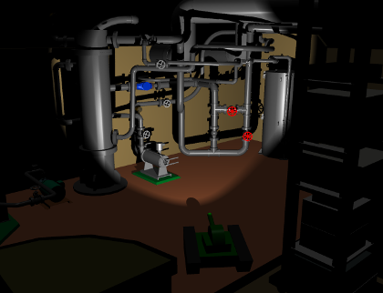

.. note:: Specifying the number for a different light in the Shadow 2 section of the Settings Dialog enables you to layer shadows from two light sources. For example, you could enable the world light to a given luminance and then set Light 0 for Shadow 2, creating a shadow with the ceiling light.

Switching cameras
-------------------------

Thus far, we have used the default camera in the scene view to view different parts of the scene and used the mouse to obtain a view of our choice. By contrast, you can also view the scene from the point of view of the camera installed on the robot. Let’s give it a try. As shown in :ref:`basics_sceneview_change_camera`, you can click the Rendering Camera Selection Combo from the :ref:`basics_sceneview_scenebar`, then select the field Camera-Tank. This will witch the view of the scene to the camera on the robot.

Below is an example of what it would look like to switch the view above to the camera’s point of view.

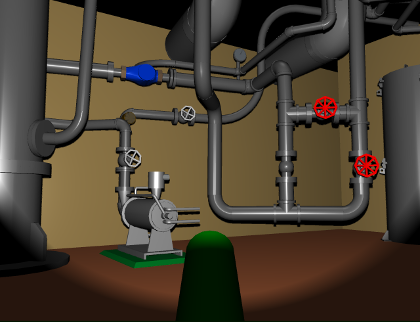

Using the joystick to control this view allows for a simulation quite similar to operating the robot itself. This can be used to practice operating the robot, among other applications.

Deploying in actual robots
--------------------------------------

When applying this RTC system to control an actual robot, basically speaking, it will suffice to have a component that corresponds to the robot I/O RTC. For the remaining RTCs, you can largely use the ones from the simulation as-is and simply swap in the robot I/O RTC components needed. This workflow allows you to develop and test a robot in the simulator while carrying over the control systems you developed mostly as-is into the actual robot; this is the ideal workflow for reflecting your changes in your robot. Compared to workflows that do not make use of a simulator, this reduces the costs and manpower associated with development and operation of robots.
