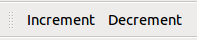
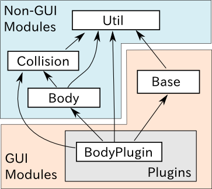

Description of the Sample1Plugin
================================

In this document, we will explain the implementation of **Sample1Plugin**, which is one of the sample plugins. This document is intended for anyone who has read the  :doc:`hello-world-sample` section, and it provides some additional explanations.

.. contents:: 目次
   :local:

Source code
-----------

.. highlight:: cpp

The source code of this sample is as follows: ::

 #include <cnoid/Plugin>
 #include <cnoid/ToolBar>
 #include <cnoid/ItemTreeView>
 #include <cnoid/BodyItem>
 
 using namespace cnoid;
 
 class Sample1Plugin : public Plugin
 {
 public:
 
     Sample1Plugin() : Plugin("Sample1")
     {
         require("Body");
     }
 
     virtual bool initialize()
     {
         auto bar = new ToolBar("Sample1");
         auto button1 = bar->addButton("Increment");
         button1->sigClicked().connect([&](){ onButtonClicked(0.04); });
         auto button2 = bar->addButton("Decrement");
         button2->sigClicked().connect([&](){ onButtonClicked(-0.04); });
         bar->setVisibleByDefault(true);
         addToolBar(bar);
         return true;
     }
 
 private:
 
     void onButtonClicked(double dq)
     {
         auto bodyItems = ItemTreeView::instance()->selectedItems<BodyItem>();
         for(auto& bodyItem : bodyItems){
             auto body = bodyItem->body();
             for(auto& joint : body->joints()){
                 joint->q() += dq;
             }
             bodyItem->notifyKinematicStateChange(true);
         }
     }
 };
 
 CNOID_IMPLEMENT_PLUGIN_ENTRY(Sample1Plugin)

All the files for this sample, including this source code, are stored in the Choreonoid source archive in a directory named sample/tutorial/Sample1Plugin. The name of the source code file is Sample1Plugin.cpp.

Plugin overview
---------------

First, an overview of the behavior of this plugin is described below.

When this plugin is built and Choreonoid is executed, a tool bar with two buttons is added as shown in the image below.

Clicking these buttons will change the pose of the robot model.

First, let’s load a random robot model and display it in Scene view. It’s probably good to start by loading a random  :ref:`basics_sample_project` .

After confirming the display of the robot model, keep the robot item selected on the Item view. Even when multiple robot models are loaded, you can specify which models are to be posed using this selection status. It’s okay to select multiple models at the same time. Note that when no model is selected, the pose of the robots will not change.

Now, let’s click the **Increment** button. Then, the pose of the robot will change slightly.  If you continue clicking the **Increment** button, the same change will occur and the pose of the robot will continue to change. Next, click the **Decrement** button. Then, the pose of the robot will return toward its original state. If you click it repeatedly, it will return to the original pose, and then the pose will continue changing.

When changing the pose using the Increment button, the angle of all the robot’s joints will increase by a certain degree, and the opposite happens with the Decrement button. This behavior is probably easier to understand if you display it in the :ref:`pose_editing_joint_slider_view` .

Changing the pose in itself may not have much meaning, but by looking at the implementation of this plugin, you can learn the basics of how to add a tool bar, retrieve a selected item, and a move a robot model. These will probably be the basic elements when performing some operation with the robot model.

Notification of Dependent Plugin
--------------------------------

This plugin handles the robot model. In this case, in the constructor of the plugin class, ::

 require("Body");

needs to be described.

This description conveys to the system that this plugin is dependent on the **Body plugin**, which is a plugin attached to the main Choreonoid. The Body plugin implements the basic functions related to the robot. In fact, in Choreonoid, even those kinds of basic functions are often implemented as plugins. Other plugins related to the robot are:

* PoseSeq plugin: implements the function that creates operations using key frames
* Balancer plugin: implements the function that corrects the movement of a bipedal robot to keep it balanced

This time, the Body plugin function is required in order to change the pose of the robot model, so this is stated clearly using the require function as above. Regarding the name to be provided to require, it is the main part of the plugin name (with the final Plugin part omitted).

By the way, there is dependency between the above-mentioned three plugins. Written in tree format, it is as follows:

* Body plugin
 * PoseSeq plugin
  * Balancer plugin

The PoseSeq plugin is dependent on the Body plugin, while the Balancer plugin is dependent on the PoseSeq plugin and the Body plugin. When this kind of dependency exists, only the most recent dependency plugin (here, the PoseSeq plugin) has to be specified with require.

Creating the toolbar
--------------------

This plugin creates a unique toolbar that has two buttons.

The class that corresponds to the toolbar is the ToolBar class, so first we include the header. ::

 #include <cnoid/ToolBar>

Then, we generate the toolbar instance. ::

 auto bar = new ToolBar("Sample1");

What is provided to the constructor of ToolBar is the name of this toolbar, which can be used to identify it when storing its status in the project file.

As ToolBar has an addButton function that generates or adds a button, by using ::

 auto button1 = bar->addButton("Increment");

a button with the caption Increment is generated. This function returns the added button as an object pointer of the ToolButton class. Here, that is stored in a variable called button1.

Association of functions called when clicking
---------------------------------------------

The following description is for the added button, and configures the function that is called when the button is clicked:  ::

 button1->sigClicked().connect([&](){ onButtonClicked(0.04); });

“sigClicked” is one of the signals that ToolButton is equipped with, and it notifies when the button is clicked. This is defined in the ToolButton class (by src/Base/Buttons.h) as ::

 SignalProxy<void()> sigClicked()

and you can see that it is a signal without arguments.

This time, what we want to associate with this is the function: ::

 void Sample1Plugin::onButtonClicked(double dq)

. Here, the increase/decrease in the joint angle is given as the argument dq. For this, if we have the lambda expression ::

 [&](){ onButtonClicked(0.04); }

it assigns a value of 0.04 to dq, but from the signal it appears as a function without arguments. This allowed us to describe the process of “call the onButtonClicked function with the argument 0.04 when the Increment button is clicked”.

Next, with the Decrement button, if we have ::

 auto button2 = bar->addButton("Decrement");
 button2->sigClicked().connect([&](){ onButtonClicked(-0.04); });

the button is added and associated with the function. Note that, unlike the Increment button, onButtonClicked is given a negative value of -0.04.

By setting onButtonClicked to take arguments of increasing or decreasing values and identifying it within a lambda function, it is possible to implement the behaviors of the two buttons with one function.

Supplemental: when using the argument of a signal
^^^^^^^^^^^^^^^^^^^^^^^^^^^^^^^^^^^^^^^^^^^^^^^^^

The ToolButton signal sigClicked was a signal without an argument, but ToolButton also has the signal ::

 SignalProxy<void(bool)> sigToggled()

. This is a signal used when the button is a toggle button, and it notifies of the change of the toggle state with a boolean value. Basically, it is assumed to be combined with a function in the following format: ::

 void function(bool)

.

It is not used in this sample, but when using this bool argument, use the lambda expression argument. For example, if the configuration is as follows: ::

 void onButtonToggled(bool on)

Let's say this function is specified and you want to pass the toggle state to this argument ON. In that case, you can use the description: ::

 button->sigToggled().connect([&](bool on){ onButtonToggled(on); });

.

Registering the toolbar
-----------------------

By using ::

 addToolBar(bar);

for the toolbar you have created, the toolbar will be registered in the Choreonoid system.

addToolBar is a member function of Plugin class (to be more precise, a member function of the fundamental class ExtensionManager), and it is necessary to register the toolbar with this function after creating it.

Note that using ::

 bar->setVisibleByDefault(true);

the toolbar will be displayed by default.

Although the user can set whether or not to display each toolbar, a newly added toolbar is not displayed by default. However, as we want to be able to try out the sample immediately without user settings, we also include this description.

.. note:: In this sample, we first created an instance of a raw ToolBar class, and we constructed an external toolbar for it using addButton. This is good enough for a simple toolbar, but if the contents of a toolbar are getting complicated, the usual thing to do is define a new class that inherits from the ToolBar class and implement the contents of the toolbar inside that class.

Description when a button is clicked
------------------------------------

The process when a button is clicked is described within the function: ::

 void onButtonClicked(double dq)

. The argument dq is the variation of the joint angle, and it was configured when it was connected with the button signal sigClicked.

The process within this function is explained below.

Getting the selected BodyItem
-----------------------------

First, we acquire a Body item that has been selected by the user in the Item Tree view as ::

 auto bodyItems = ItemTreeView::instance()->selectedItems<BodyItem>();

.

To do this, the instance of the Item Tree view is obtained first with ItemTreeView::Instance().  This is the same as when getting MessageView as explained for the HelloWorld sample.

Then the list (layout) of the items selected can be obtained by calling the member function selectedItems of ItemTreeView. This function is a template function with an item-type argument and is designed to return, from all the selected items, only the items that match the specified type. In this case, by specifying the BodyItem type, only Body items are to be obtained.

A list of the items is returned by a template class called ItemList. This is also designed so that the item type becomes the template argument and items of that type are stored. The selectedItems function returns an ItemList of the same type as its own template argument. So here, the result is returned in the following format: ::

 ItemList<BodyItem>

. This is in the BodyItems variable.

.. note:: Other items defined in the ItemTreeView class include “return a list of checked items” checkedItems, “check if an item is selected” isItemSelected, and “signal to notify that the selection status of an item has changed” sigSelectionChanged, and by using them, it is possible to flexibly retrieve the items to be processed.

When we have retrieved the list Body items, next we process each BodyItem on the list individually. Since the ItemList class is based on std::vector, it can be handled in the same way as std:vector. Here, using a C++11 range-based for statement, ::

 for(auto& bodyItem : bodyItems){
     ...
 }

the loop that performs the processing for each BodyItem is described.

Obtaining the Body object
-------------------------

Within the loop that performs the processing for each BodyItem, the Body class object is first obtained form the Body item with the following description: ::

 auto body = bodyItem->body();
 
.

The Body class implements the data structure and processing functions of the robot model, and this object can be considered as the body of the model. This class is defined in Choreonoid as a part called **Body library**. (In the Choreonoid source, this corresponds to src/Body.) On the other hand, the Body item is a wrapper to make it possible to treat the Body object as an item in the Choreonoid GUI, and within Choreonoid it is defined as a BodyItem class. A BodyItem holds the corresponding Body object, and this is returned by the body function.

As you can see, the reason why the robot model is divided into the Body class and the BodyItem class is that it is desirable to keep the data structure of the model and the actual processing functions separate from the GUI, so that they can be used in a generic way in various programs. The Body library that actually implements the Body class is a library that is independent of the GUI, and it can also be used for such things as the robot control program. On the other hand, parts that are dependent on the GUI are implemented by the Body plugin, and GUI parts such as items, toolbars, and views are covered there. In this way, the data handled on Choreonoid is often "classes independent of GUI", and they are often "wrapped as an item" and used. Of course, it is also possible to implement the body of the data in the items themselves without such a separation.

Supplementary: Modular structure of the main part of Choreonoid
^^^^^^^^^^^^^^^^^^^^^^^^^^^^^^^^^^^^^^^^^^^^^^^^^^^^^^^^^^^^^^^

We have explained the relationship between the Body library and Body plug-ins. There are some other similar parts in the main part of Choreonoid, and below is a summarized overview of those parts:

* Modules independent of the GUI:
 
 * Util library (src/Util): defines the classes and functions that are used by different parts
 
 * Collision library (src/Collision): defines the collision detection process among polygon (triangle) models

 * Body library (src/Body): defines the modelling of objects/joint objects and their kinematics and dynamics-related processes

 These modules can also be used from an external program that is not a Choreonoid plugin.

* Modules dependent on the GUI:

 * Base module (src/Base): defines the base part of the Choreonoid GUI

 * Body plug-in (src/BodyPlugin): defines the GUI of the model-related processes associated with the Body library

 * All other plugins

The dependency of these modules is as illustrated in the figure below:

Changes of joint angles
-----------------------

The angles of the robot models joints are changed using the following code: ::

 for(auto& joint : body->joints()){
     joint->q() += dq;
 }

body->joints() returns the list of joints stored by the Body object. A process is performed for each joint by rotating through the loop for these elements using range-based for. The elements here are objects of the Link class defined in the Body library. This corresponds to the robot’s links, and it also contains information on the joints from the parent link. The joint angle is defined by a variable named q and, using the function q, its value is changed by the quantity dq.

Notification of status change
-----------------------------

What we have done in the above code is simply to update the variables that store a joint angle. This is insufficient for the result to be seen in the entire model. In order to do that, finally we execute: ::

 bodyItem->notifyKinematicStateChange(true);

.

The notifyKinematicStateChange function used here informs the Choreonoid system that a kinematic change has been made to the model and reflects the change on the display on the GUI. This function is defined as follows: ::

 void notifyKinematicStateChange(bool requestFK = false, bool requestVelFK = false, bool requestAccFK = false);

Here, true is provided in the first argument requestFK.

In order for the value of the joint angle variable q t be reflected in the position and posture of all links, a forward kinematic calculation is required. You can declare the Body object as: ::

 body->calcForwardKinematics();

Or, by giving true in requestFK, this is done in notifyKinematicStateChange.  Also, if you also want to update the speed and acceleration values, give true to the arguments requestVelFK and requestAccFK respectively.

If you execute notifyKinematicsState without setting requestFK as true, you will see that, while the join angles displayed in the Joint Slider view will change, the pose of the robot displayed in the Scene view will not change.

.. note:: The reason why notifyKinematicsStateChange also executes calcForwardKinematics is not simply that there is no need to execute calcForwardKinematics. Choreonoid is designed taking into account that multiple objects work together and, to an extent, notifyKinematicStateChange is provided based on this principle. For example, in a robot model, you can have a case where one object handles the upper body and another handles the lower body, existing and operating independently of each other. And both may work at the same time. In this case, if each of them individually changes the joint angle, makes a kinematic calculation, and updates the GUI, the result will be a duplicated process. Instead, it is more effective to update the joint angles respectively first and then, when both have completed their processes, perform the kinematic calculation and GUI update all together. To do this, notifyKinematicStateChange is described so that it does not perform the kinematic calculation and GUI update whenever it is called, but instead posts that they are necessary as an event, and, after all the updates that are to be executed at the same time are completed, it performs the kinematic calculation and GUI update together only once.

When the notifyKinematicStateChange function is executed, the signKinematicStateChanged signal prepared by BodyItem class is issued eventually. Therefore, if you want any process to be executed when the kinematic state of the model has changed, connect the processing function to this signal. In fact, the display of the model’s state in the Joint Slider view, Scene view, etc. is realized by connecting to this signal. And so, all the relevant views are updated by just calling notifyKinematicStateChange.

This mechanism means that the side that updates the state of the model does not have to be concerned with how or where the updated results are displayed. With this mechanism, the side that updates the state of the model does not have to worry about how to reflect the updated result anywhere. This allows flexible function expansion. This is a framework that corresponds to the so-called Model-View-Controller (MVC), Document-View, and Publisher-Subscriber architectural patterns, and it is one of the common software design techniques.

Build method
------------

In the :doc:`hello-world-sample`  section, we introduced three  :ref:`hello-world-build` . In this sample also, we will introduce the description of the build files corresponding to these three methods.

.. highlight:: cmake

First, when :ref:`hello-world-build-together`  write the following code in CMakeLists.txt: ::

  set(target CnoidSample1Plugin)
  add_cnoid_plugin(${target} SHARED Sample1Plugin.cpp)
  target_link_libraries(${target} CnoidBodyPlugin)
  apply_common_setting_for_plugin(${target})

The description contents are almost the same as for the HelloWorld sample, but the details of target_link_libraries are a little different. This plugin is dependent on the Body plugin, so you should specify CnoidBodyPlugin instead of CnoidBase as the dependent library. Since it is a plugin, it is also dependent on CnoidBase, but you don’t need to explicitly describe it. This is because CnoidBodyPlugin is also dependent on CnoidBase, and CMake knows that due to this plugin’s dependency on CnoidBodyPlugin, it is also dependent on CnoidBase.

Next, when :ref:`hello-world-stand-alone-build`,  create a CMakeLists.txt file as follows: ::

  cmake_minimum_required(VERSION 3.1.0)
  project(Sample1Plugin)
  find_package(Choreonoid REQUIRED)
  add_definitions(${CHOREONOID_DEFINITIONS})
  include_directories(${CHOREONOID_INCLUDE_DIRS})
  link_directories(${CHOREONOID_LIBRARY_DIRS})
  set(target CnoidSample1Plugin)
  add_library(${target} SHARED Sample1Plugin.cpp)
  target_link_libraries(${target} ${CHOREONOID_BODY_PLUGIN_LIBRARIES})
  install(TARGETS ${target} LIBRARY DESTINATION ${CHOREONOID_PLUGIN_DIR})

The way in which this differs from the HelloWorld sample is that there is a dependency on the Body plugin. For this, you can set all the libraries necessary for dependency on the Body plugin by using the variable CHOREONOID_BODY_PLUGIN_LIBRARIES in target_link_libraries.

Finally, when  :ref:`hello-world-makefile-build` , create a Makefile as follows:

.. code-block:: makefile

 CXXFLAGS += -fPIC `pkg-config --cflags choreonoid-body-plugin`
 PLUGIN = libCnoidSample1Plugin.so
 
 $(PLUGIN): Sample1Plugin.o
 	g++ -shared  -o $(PLUGIN) Sample1Plugin.o `pkg-config --libs choreonoid-body-plugin`
 
 install: $(PLUGIN)
	install -s $(PLUGIN) `pkg-config --variable=plugindir choreonoid`
 clean:
	rm -f *.o *.so

A noticeable point here also is the link to the Body plugin libraries. For pkg-config, you can get the information on using the Body plugin by using the module name choreonoid-body-plugin.

Samples of these build files are stored in the Sample1Plugin directory (sample/tutorial/Sample1Plugin) in the Choreonoid source.