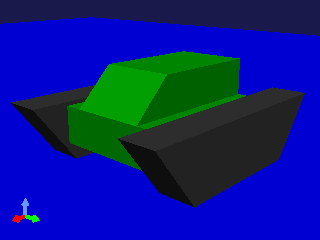
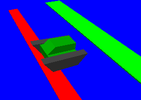

Simplified Simulation of Crawler
================================

.. sectionauthor:: Shin'ichiro Nakaoka <s.nakaoka@aist.go.jp>

.. contents:: 
   :local:

.. highlight:: cpp

What is Crawler
---------------

"Crawler" is a mechanism that is used to move a vehicle. It is also called "caterpillar", "endless track" or "tread". Crawlers are generally used for heavy machines and tanks and they are widely used for the transfer mechanism. Systems like belt conveyors are also a type of this mechanism.

Choreonoid is equipped with the function that makes simplified simulation of a crawler. The function does not reproduce an actual crawler but can simulate to some extent a movement on a comparably flat ground. How to use this function is described below:

Creation of Crawler Model
-------------------------

First, it is necessary to define the crawler mechanism in the model to be used. This can be done as follows:

* Model a crawler part as a single link.
* Specify "crawler" as the joint type of this link.
* Specify the rotation axis of the crawler to the joint axis parameter.

As a sample of the model including a crawler, the "Crawler" model is available. This sample is defined in the file "crawler.wrl" under "model/misc/" in the share directory and has the appearance as follows:

The black part of the model corresponds to the crawler and there are two crawlers on the right and left each.

The entire model consists of three links and forms the joint mechanisms as follows:

| + BODY (root link）
|   + CRAWLER_TRACK_L (left crawler)
|   + CRAWLER_TRACK_R (right crawler)

First, a root link called BODY is defined. This corresponds to the green part in the centre of the model. As a root link cannot be made a crawler, define the root link that becomes the base as above.

"CRAWLER_TRACK_L", which corresponds to th eleft crawler, is defined in the model file as follows: ::

 DEF CRAWLER_TRACK_L Joint {
   translation 0.0 0.15 0
   jointType "crawler"           
   jointAxis 0 1 0
   jointId 0
   children [
     DEF CRAWLER_TRACK_L_LINK Segment {
       ...
     }
   ]
 }

"crawler" is specified in "jointType" field, which specifies the joint type. It shows explicitly that this link is a crawler.

Specify the rotation axis of the crawler in "jointAxis" field. The rotation axis of a crawler is, assuming the internal wheels that drive the crawler, a vector that matches their axis of rotation. Here, "0 1 0" is specified to match the Y-axis.

The shape of the crawler is described in the Segment node. It is necessary to model this part so that the origin of the local coordinate is a point inside the crawler. Any point that is inside the crawler will do, but if you match it with one of the wheels, you may easily understand the mechanism as you may well model a general revolute joint.

The origin and the rotation axis defined here are modelling assuming that the crawler moves the longitudinal direction of the model.

"CRAWLER_TRCK_R", which corresponds to the right crawler is described in a similar way.

Supporting Simulator Items
--------------------------

It is necessary for the simulator item to be used to support simplified simulation of a crawler when the crawler is used.

For the time being,

* AISTSimulatorItem
* ODESimulatorItem
* BulletSimulatorItem

support this function.

Simplified Simulation Overview
------------------------------

Simulation of a crawler using this function is nothing but a simplified simulation. It is different from a real crawler in the following points:

* The surface of the crawler does not rotate; and
* The surface of the crawler does not transform.

The driving force by the crawler is realized by directly adding force between the surface of the crawler and the environment. This force is calculated from the binding condition that makes the relative velocity at each contact point become the target value. Be careful that this is quite different from the driving mechanism of a real crawler.

While a real crawler achieves high stability and running performance as its surface transforms depending on the environment, a simplified simulation does not transform at all. As a result, the stability and the running performance on a rough ground is much inferior to the real one.

The direction of the force to be added to each contact point shall be the direction of the vector product of the rotation axis of the crawler and the normal vector of the contact surface. When the crawler of the sample model makes contact with the environment as follows, the vectors are as follows:

.. image:: images/crawler-vectors.png

The rotation axis of the crawler is the vector that points the front side of the figure (the direction of Y axis). Given the normal vectors at the contact points with the environment being the blue arrows, the vector products of the rotation axis and the normal vectors will be the red arrows, and when a positive command value is specified, the driving force is generated to this direction. As a result, the entire crawler will move to the left side of the figure (to the direction of X axis) and cross over the steps, too.

How to Give Command Value
-------------------------

In a simplified simulation of a crawler, a command value to the crawler shall be given as the magnitude of the driving velocity (the relative velocity that should be realized at the contact points) of the crawler. The interface to do this is currently specified to share with the interface of the joint torque. That is to say, from the interface point of view, when a value is given to the joint torque, it will be handled as the velocity command value to the crawler.

For example, in the case of driving the crawler of the sample model with SimpleController, you can have the control loop process as follows: ::

 ioBody->joint("CRAWLER_TRACK_L")->u() = 1.0;
 ioBody->joint("CRAWLER_TRACK_R")->u() = 1.0;

By doing so, the right and the left crawlers are given the equal driving force and the entire model moves to the front at the velocity of 1.0 [m/s].

By giving different command values to the right and the left crawlers as follows, you can make the model turn. ::

 ioBody->joint("CRAWLER_TRACK_L")->u() =  1.0;
 ioBody->joint("CRAWLER_TRACK_R")->u() = -1.0;

In this case, the model turns to the right.

Simulation Sample
-----------------

We have a project "SampleCrawler.cnoid" as a sample to motion the sample crawler model. When we execute a simulation in this project, the crawler model crawls as illustrated in the figure while crossing over a bump on the floor.

The controller used is implemented in the SimpleController format. The source file is "src/sample/SimpleController/SampleCrawlerController.cpp", which you can refer to.

Also, with "SampleCrawlerJoystick.cnoid", you can operate the crawler model with a USB-connected joy stick (game pad). As for the first analogue stick of the joy stick, its up-down-right-left corresponds to forward-back-right-left movement of the crawler model.

If a joy stick is not connected, the use of a "virtual joy stick" as follows can realise the same operation as a joy stick.

.. image:: images/VirtualJoystickView.png

The first analogue stick of the joy stick is allocated on "E", "D", "S", and "F" keys on the keyboard and they correspond to the up, down, left and right on the stick respectively. When you start the simulation, click inside this view to enable the keyboard focus. Then, you can operate the crawler model by pressing these keys.

The source of this controller is "sample/SimpleController/CameraSampleController.cpp".

