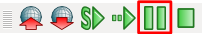

Execution of Simulation and Replay
==================================

.. sectionauthor:: Shin'ichiro Nakaoka <s.nakaoka@aist.go.jp>

.. contents::
   :local:

.. _simulation_start_simulation:

Start Simulation
----------------

To start a simulation, perform the following operations after :doc:`simulation-project` 

1. Select the target simulator item in the item tree view.
2. Press Start Simulation button.

The operation provided in 1 is not required if there is only one simulator item. In this case, there is only one simulator to be executed, so the operation to identify the simulator is not required.

On the other hand, it is also possible to include more than one simulator item. It is very convenient when preparing multiple simulator items and their parameters to execute different simulations and comparing the results. In that case, it is necessary to select the simulator items to identify the simulation to be executed.

.. note:: Please remember how to identify the target simulator as this operation is also valid for the pause and end operations, which are explained below. Anyway, you don't have to care this operation when there is only simulator item.

The operation provided in 2 is performed using the button on the simulation bar. Normally, start a simulation using "Start Simulation" button.

.. image:: ../basics/images/SimulationBar_StartButton.png

When you start a simulation using this button, the simulation starts from the position and the posture of the initial status registered in :ref:`simulation_setting_initial_status` .

You can also use "Resume Simulation" button as below to start a simulation.

In this case, unlike the case using Start button, the simulation starts from the current model positions instead of the initial status that is registered.

Pause Simulation
----------------

By pressing the following button, you can pause an ongoing simulation.

By pressing this button again or "Resume Simulation" button, explained above, the paused simulation can be resumed.

Stop Simulation
---------------

The simulation stops by pressing "Stop Simulation" button below:

.. image:: images/simbar-stop-button.png

In this case, unlike the case using Pause button, all the elements related to the simulation (including the controllers) are terminated (as much as possible). Therefore, you cannot resume from the status totally equal to that when it is terminated. (By pressing "Resume Simulation" button, you can start a simulation from the position and the posture when it is terminated, but it means that only the initial position and posture are maintained while the simulation is started again with all other elements initialized.

On the other hand, the resources that were used for the simulation are also released. So, it is also possible to resume the simulation as is initialized. Therefore, use Stop operation when you need not resume the simulation.

.. _simulation-time-range:

Configuration of Time Range
---------------------------

The timing to finish the simulation can be configured by setting "Time Range" property of the simulator item. Select one of the following items:

* **Unlimited**

 The finishing time is not specified. The simulation will continue until an explicit stop operation is performed. This setting is selected by default.

* **Active control period**

 The simulation will continue while it is controlled actively by the controller. The simulation is terminated when all the controllers complete their control.

* **Specified time**

 The simulation will continue for the time specified in "Time length" property.

* **Time bar range**

 The simulation will be conducted for the range of Time bar.

\* The time to be specified here is the time in the virtual world in the simulator.

When the time range is specified other than to "Unlimited", the simulation is automatically terminated at the corresponding timing. In this case, no explicit stop operation is required. Of course, it is also possible to terminate the simulation in the middle by an explicit stop operation.

When the time range is specified to "Unlimited", the simulation will continue until an explicit stop operation is executed.

.. _simulation-realtime-sync:

Synchronization with Real Time
------------------------------

Generally speaking, the time progress in a virtual world where a simulation is executed is different from that in the real world. The time progress in a virtual world depends on the calculation time of the simulation and can be faster or slower than the time progress in the real world.

Nevertheless, you may synchronize the time progress in the virtual world to that of the real world. It is easier in that way to capture the progress of the simulation. Also, it is more suitable when you want to interact between the simulation and the real world. For example, in case an operator in the real world operates a robot being simulated, the operator can get a near real experience of operating a real robot if the time progress is synchronized between the simulation and the real.

In Choreonoid, the operation to get the time in a virtual world and the real world synchronized is referred to as "Synchronization with Real Time". This can be enabled in "sync with realtime" property of a simulator item. It is set to true by default. Normally, it should be easier to execute a simulation with this configuration.

Please note, however, that this setting is valid only when the calculation time is faster than the real time. In case the calculation time is slower than the real time, the time progress of the simulation is not affected regardless of the configuration of the synchronization. For it is not possible to make a slow calculation time faster.

On the contrary, if the calculation time is faster than the real time, the time progress of the simulation can be made faster by disabling "sync with realtime" property. Try this setting when you want to shorten the time to spend for a simulation.

.. _simulation-result-recording:

Recording of Simulation Result
------------------------------

A simulation result can be stored as time-series data that can be used for replay and analysis of the result.

This function is configured using "recording" property of a simulator item. The value of this property can be selected from the following modes:

* **full**

 All the results from the start to the end of the simulation are recorded.

* **tail**

 The result for a certain period of time before the end of the simulation is recorded. The results in the part older than the above-mentioned period of time are discarded. The period is configured in the "time length" property.

* **off**

 No result is recorded. The simulation result can be checked only while the simulation is in execution.

The mode is set to "full" by default. Normally, the recording mode should be set to "full" as it is the best you can replay or analyze the result of a simulation for the entire period of the simulation.

However, sufficient memory space is required to record all simulation results. The more the simulation targets or the longer the simulation time, the higher the memory consumption. Should the memory used to record simulation results exceeds the free memory space, Choreonoid may go down in the middle of the simulation. So, you have to be careful.

To avoid such a situation, "tail" option is available. This mode suppresses the memory size to be used under a certain range by discarding older part of records when the time length specified is exceeded. By configuring the time length considering the amount of memory in the system, a long-time simulation will not result in a system down due to memory shortage. Therefore, this mode can be used in case:

* A long-time simulation is executed;
* There is not enough memory; or
* Not all the results for the entire period of time are required, but only the result of the immediate past should be retained for analysis in case of a problem.

.. note:: When a long-time simulation and the record of all its results are necessary, it is possible to output the result to a file from time to time using "world log file item". In that case, it is OK if there is enough space in the file system even if there is not enough memory.

When the record mode is set to "off", no result will be recorded. Even in this case, it is possible to check the progress of a simulation as the simulation result is reflected on the model from time to time. However, it will not be possible to replay or analyze the result later.

.. _simulation-device-state-recording:

Recording of Device States
--------------------------

The basic element to be recorded as a simulation result is the motion trajectory necessary to replay the physical motion of the model. In addition to this, the change of the device states can also be recorded. To do this, execute a simulation with the "device state output" property of a simulator item set to true. Thus, the state changes of the sensor and the operations like on/off of the devices can also be replayed. Note that this will cause the memory space required and the processing overhead will increase. So, switch this function on and off depending on the necessity.

.. _simulation-result-playback:

Replay of Simulation Result
---------------------------

If the recording of simulation results is enabled, it is also possible to replay them as animation. How to replay a simulation result is as follows:

1. Select the target simulator item in the item tree view.
2. Operate Time bar.

As for the operation of Time bar, if you press the "start animation" button, the animation can be displayed at a certain speed. By operating Time Slider, any given part can be replayed. See :doc:`../basics/timebar` for detail.

.. _simulation_playback_ongoing_simulation:

Display of Ongoing Simulation
-----------------------------

If the recording of simulation results is enabled, the animation of an ongoing simulation is also displayed by using the above-mentioned replay function as "replay of data being recorded". Note, however, that the result of an ongoing simulation and that of the completed simulation may be somewhat different in the behavior of replay. In concrete terms:

1. No additional operation is required in terms of replay when you start a simulation. You don't have to select a simulator item again nor to operate Time bar to start animation of the result view.

2. During a simulation, animation continues even if the simulator item is de-selected. This continues until another simulator item is selected or the operation to stop animation is executed.

3. By pressing "Start Simulation" button or "Resume Simulation" button on Simulation bar, you can resume replaying an ongoing simulation.

4. In case "sync with ongoing update" is turned on in the configuration of Time bar, the latest status is replayed while the simulation is ongoing.

Note, however, that the simulation per se continues even if the animation is stopped. By performing the operation provided in 4, it is possible to restore the view of the ongoing simulation. Please note that the configuration of the operation under 4 is involved in case of restoring the replay following the normal operation.

.. note:: If "sync with ongoing update" is turned off, the progress of the simulation in the simulator does not necessarily match the progress of the animation that displays the result. In that case, please note that, if you make an interactive operation to the ongoing simulation, the reaction may not be returned promptly. If "sync with ongoing update" is turned on, this problem does not happen. It is turned on by default.

.. _simulation-result-item-output:

Output Destination of Simulation Result
---------------------------------------

The motion trajectory of each model is output to the position of the child items of the corresponding body item with the name "Simulator item name - model name".

For example, in the project created in :doc:`simulation-project` , an item "AISTSimulator-box1" is output as follows under box1 model after the simulation is started. ::

 [ ] - World
 [/]   + box1
 [ ]     + AISTSimulator-box1
 [/]   + Floor
 [ ]   + AISTSimulator

.. images/simproject-item4.png

Here, as "Floor" model is a static model, no motion trajectory is output.

The type of the item to be output is BodyMotionItem, which was introduced in :ref:`basics_sequence_data` . BodyMotionItem is defined as a composite item and its sub-items are configured as follows:

| + AISTSimulator-box1
|   + Joint
|   + Cartesian

The joint angle trajectories are stored in the Joint item and the trajectories of the link positions are stored in the Cartesian item. The types of them are MutliValueSeqItem and MultiSE3SeqItem respectively.

Further, if the device status is recorded, the data is output to "Devices" as follows:

| + AISTSimulator-box1
|   + Joint
|   + Cartesian
|   + Devices

The type of Devices is a MultiDeviceStateSeq item.

The data output in this way is nothing but a project item having its specified type. Therefore, any valid operation to each of the Item type is also available for the simulation result. As a concrete example, the trajectory data owned by an item can be read again after saving or its trajectory can be visualized in the graph view.

Also, the motion trajectory can be replayed by selecting these items and operating Time bar. In that case, the trajectory of only the selected item can be replayed. If a simulation has multiple dynamic models, it is necessary to select the motion trajectory items of all the models to replay the entire simulation. In fact, however, you don't have to do that much. As was explained, the entire simulation becomes the repay target by selecting the corresponding simulator item.

