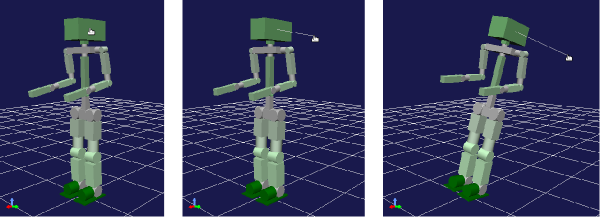

Interaction Function
========================

.. sectionauthor:: Shin'ichiro Nakaoka <s.nakaoka@aist.go.jp>

.. contents:: 
   :local:

.. highlight:: cpp

What is Interaction Function
--------------------------------

You may well operate a robot or a substance in a virtual world that are being simulated by applying force or moving. Choreonoid has the function that allows users to perform such operations interactively on the GUI. This function is called an "interactive function".

How to Operate
------------------

Interactive operations are performed on the scene view. In case:

* Simulation is ongoing;
* Scene view is in edit mode;

The following operations are enabled.

Pulling Operation
~~~~~~~~~~~~~~~~~~~~~

It is an operation to apply force to the model. By pressing the left button on the mouse and dragging the part to which you want to apply force, a pulling force is applied to the dragged direction. The magnitude of the force is proportional to the length of the drag. It looks as if the model were pulled with a virtual rubber string.

During this operation, a line that connects the point of action of the force with the drag end point is displayed. This line can be likened to a rubber string, which helps you understand how the force is applied.

This operation is illustrated in the following figure:

Here, the mouse cursor is placed on the head of the robot and then drag is started. In this example, it is dragged to the right and a line is shown to the drag end point. As a result, the robot is pulled to this direction and about to fall.

By combining this with the keyboard operation, the magnitude of the force can be changed. If you drag with a Shift key kept pressed, the magnitude of the force becomes ten times. Additionally, if you drag with Ctrl + Shift keys kept pressed, the magnitude of the force becomes a hundred times as much as the original force. If the model is not moved successfully by dragging, try the above operations.

Note that the magnitude of the base force is determined suitably from the mass of the model, but it can be too little or too much. Users cannot configure this part arbitrarily for the time being. We will improve that in the future.

Forced Movement and Holding Operations
~~~~~~~~~~~~~~~~~~~~~~~~~~~~~~~~~~~~~~~~~~

These operations are only valid to the root link of a model. If you right click the root link of the model that you want to move in the above state, the menu items:

* Move forcibly
* Hold forcible

appear (See the picture below)

.. image:: images/interaction-move1.png

If "Move forcibly" is selected, this item is checked and the forced movement mode is enabled. When you drag the root link in this state, you can move the model forcibly regardless of the physical laws. For example, you can move the robot floating above the floor as illustrated in the figure below:

.. image:: images/interaction-move2.png

If you click on the root link once, then the drag marker is also displayed. You may drag it, too. In that case, you can rotate the model.

When you finish dragging in this operation, the behavior will follow the physical laws again. If you were making the robot floating over the floor by dragging it and then release drag, the robot will fall onto the floor.

For "Hold forcibly", operations similar to those of "Move forcibly" are supported. However, the behavior when you finish dragging is different and the position of the root link is kept as it is dragged. To release the held state, you can release the forced holding mode by unchecking the menu item.

Synchronization between Simulation and Display
----------------------------------------------

As stated in the beginning, interaction operations are valid for ongoing simulation only. They cannot be applied when replaying the result of a completed simulation or verifying a choreographic motion. So, you need to know whether the behavior of the model currently displayed is due to the ongoing simulation or some other function.

Further, it is necessary that the simulation progress be synchronized with the display. As an interaction operation by user is performed to the display on the scene view and the content of the operation is fed back to the physical calculation in the simulator, a time lag will cause a bad operation. Normally, the simulation progress and the display are synchronized unless "sync with ongoing update”on Time Bar is disabled. See  :ref:`simulation_playback_ongoing_simulation` for detail.
