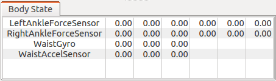
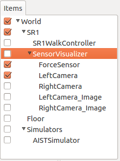
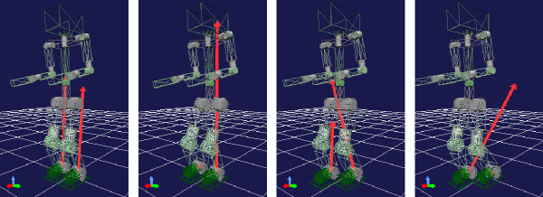
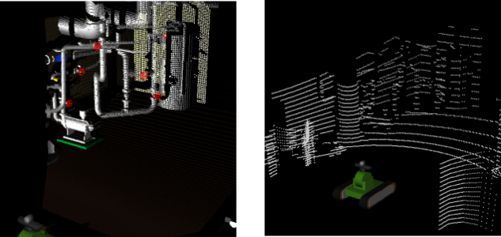
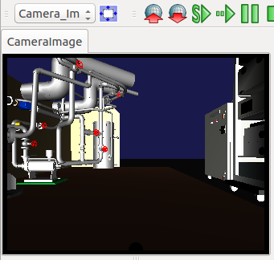

Displaying sensor states
==============================

.. sectionauthor:: 中岡 慎一郎 <s.nakaoka@aist.go.jp>

.. contents:: 目次
   :local:

.. highlight:: cpp

How to check sensor values
--------------------------------

If you want to verify the state of a robot, you may want to check the state values of the sensors mounted on it. Choreonoid provides the following functions for doing this.

* Body State View
* Sensor Visualizer Item

These functions work with the sensor information stored in the body model that has been loaded as a body item in Choreonoid.

To apply these functions to simulation results, you need to enable :ref:`simulation-device-state-recording` so that the state of the sensors during a simulation is output to the body model. This is an easy way to display the state of sensors without having to use the robot’s controllers or the like. To display cameras or range sensors, you need the :ref:`simulation-gl-vision-simulator`  function. To output these data to the body model as well, you need to enable :ref:`recording of vision data<simulation-gl-vision-simulator-property>` in Properties.

Body State View
--------------------

The “Body State View” is a view that displays sensor state values ​​as they are.

To display this view, first select “Body State” from “Show” - “Show View” in the main menu. This view is blank by default. When you select a body item from the item tree view, you will see a list of the sensor values for that body model.

For the SR1 sample model, for example, the sensor values are displayed like this.

In the initial state, all the values will be 0, as shown in the figure. However, the values will change when you start a simulation. When you play back recorded simulation results, the values will be displayed as they were at every point during the simulation.

For now, this view is only available for three types of sensors: force sensors, acceleration sensors, and rate gyro sensors.

Sensor Visualizer Item
----------------------------

“Sensor Visualizer Item” is a function that you can use to visualize the state of a sensor with 3DCG in Scene View. This function can let you get an intuitive grasp of the state of your robot.

To use the function, you must first generate this item. From “File,” select “New” and then “SensorVisualizer,” as shown below. Make it a child item of the body item that the item you generated applies to.

This will cause the sensors attached to the body model to be arranged as child items of the sensor visualizer. For now, you can use this function for force sensors, cameras of :ref:`simulation-gl-vision-simulator-sensor` , range cameras, and range sensors. The name of the sensor will be assigned to the name of the item. For range sensors, two items will be generated: one for images (“_Image” is attached to the sensor name) and one for distance images.

You can visualize the sensor data by checking the child item.

When visualizing a force sensor, the model’s current sensor values will appear as arrow markers in the Scene View. A force sensor is a six-axis force/torque sensor, but only the three-axis force sensor values will be visualized. They will appear as arrow markers that represent vectors that start at the position of each force sensor.

The image below is an example visualization of the values of force sensors mounted on both ankles of an SR1 walking sample.

The Scene View is set to :ref:`basics_sceneview_wireframe` to make the sensor visualization markers easy to see.

You can adjust the length of the markers with the “display ratio” property of the Sensor Visualizer Item. Adjust this value according to your needs to make the marker long enough that it is easy to see.

When visualizing a distance images camera or range sensor, the model’s current sensor values will appear as dots in the Scene View. Below are example visualizations for these sensors from the sample project TankVisionSwnsors.

You can display camera images in the Image View. You do not need to check an item.

From “View” in the main menu, select “Generate View” and then “Image” to generate the Image View. You can also add this to the toolbar by selecting “Image View Bar” from “Show” - “Show Toolbar.”

The cameras whose values can be visualized by the Sensor Visualizer function will be listed in the combo box of the Image View Bar. First, select Image View (click on the view screen to select Image View) and then select the camera from the combo box. Use the button next to the combo box to scale the image so that it fits the view.

You can create as many Image Views as you want. However, you have only one Image View Bar. Actions you perform in the Image View Bar will affect the selected Image View. Below is an example of a camera display with the Image View Bar in Image View.

