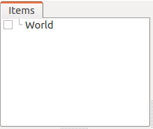
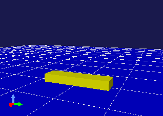
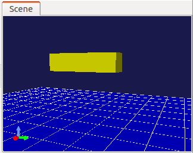
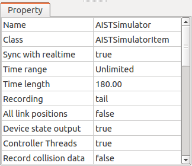

Creation of Simulation Project
==============================

.. sectionauthor:: Shin'ichiro Nakaoka <s.nakaoka@aist.go.jp>

.. contents:: 
   :local:

.. highlight:: cpp

Simulation Project
------------------

To make a simulation on Choreonoid, it is necessary to import and create the necessary project items and prepare the project for simulation. A project requires the following three types of project items at minimum:

* World item that represents the virtual world to be simulated;
* Body item of the robot or the environment object to be simulated; and
* Simulator item that executes the simulation.

"World item" is a project item that corresponds to a virtual world and "Body item" is an item that corresponds to the model (body model) of a robot or an environment object. See :doc:`../handling-models/index` or detail. The virtual world to be simulated is built by allocating all the target body items as child items of the world item. This operation is similar to the operation to build a virtual world described under :doc:`../handling-models/collision-detection` .

Next, create the simulator item. Select the desired simulator item from "File" under Main Menu and "New" to create it. Allocate it also as a child item of the world item. By allocating it so, this simulator item will be associated with the world item and the virtual world to be simulated will be decided.

In addition, configure the initial position of the robot or the environment object and the time resolution (time step) for the simulation. You can also modify the simulator settings by changing the property of a simulator item.

Below, the above-mentioned operations are described in concrete by creating a project actually:

Creation of World Item
----------------------

Call "File" under Main Menu - "New" - "World". Then the dialog of "Create new world item" is prompted. So, click "Create" button there. The name can be left as "World" but you may also assign any other name that can better identify the simulation target.

You can verify that the world item has been created by checking the item tree view.

Importing of Model
------------------

Next, import the model to be simulated as a body item. Here, let's import the box model and the floor model from :ref:`bodymodel_samplemodels` . Import "box1" model file and "floor" model file in the sample according to the operation instruction provided under :ref:`loading_model` .

When doing so, allocate box1 and floor items so that they become child items of the world item as illustrated in the figure below. You may import the model with the world item selected, or you may import the models anyway and can drag them to the world item. Unless this position relationship can be set correctly, the simulation will not succeed. So, please be careful. ::

 [ ] - World
 [/]   + box1
 [/]   + Floor

.. images/simproject-item2.png

The allocation in the item tree is as above. Check the two body items that have been imported and display them in the scene view. By checking them, they will be displayed as follows: Here, the yellow object is box1 model and the blue object is the floor model.

.. note:: The "floor" model imported as the floor model this time is a "static model". A static model is a model defined as an object that is static. It may be influenced by a collision with another object during the simulation but does not move per se. On the other hand, box1 model is defined as a dynamic model. Dynamic models move due to internal or external force that can occur during the simulation. Try to use static and dynamic models properly in creating a simulation project. The type of a model can be verified in the "Static model" property of a body item. By editing this profile, you can switch the type of the model.

.. note:: Note that the configuration of the "Collision detection" property to a world item and/or a body item does not influence on the simulation. In a simulation, it is basically necessary to perform a collision detection for all combinations of objects that may collide each other and it is not proper to configure whether or not to perform a collision detection for each model. If you do want to configure in that way, the method of configuration depends on a simulator item.
.. as so mentioned in  :ref:`handling-models-collision-detection-for-simulation` under :doc:`../handling-models/collision-detection` . 

.. _simulation_setting_initial_status:

Configuration of Initial Status
----------------------------------

The status regarding the position and the posture of the model immediately after it is imported is either the initial position described in the model file or the position where the origin of the model matches the origin of the global coordinate. It is OK if it is acceptable, but normally you need to reconfigure the initial status of the model.

In this example, box1 model is initially caved in the floor. Now, let's correct this initial setting to a position where box1 model is dropped from above the floor. Move box1 model with the mouse operation explained in :ref:`model_move` or using :ref:`model_body_link_view` to the position as shown in the figure.

An operation to make this position the initial status of the simulation is required. For Simulation Bar, which is one of Tool Bars, this operation is performed using "Simulation initial status setting button" shown in the following figure:

.. image:: images/simbar-set-button.png

First, select the item of the model the initial status of which you want to reconfigure in the item tree view. By pressing Initial Status Setting button while the item is selected, the current status of the model is registered as the initial status of the simulation. When the registration is successful, it is so displayed in the message view.

Note that it is also possible to configure the initial status of all the body models existing in the virtual world at once. In that case, edit the status of all the models in advance, and then select the world item. You can just click Initial Status Setting button in that state.

.. note::  Don't fail to register the initial status using Initial Status Setting button after editing the position or the posture of a model. If this operation is neglected, the simulation will start at the default status when the model is imported or at the initial status configured the previous time. In fact, there is a function that enables starting the simulation from the current status of a model (the status presented in the display) instead of the initial status configured via the above operation, but that function keeps changing as a result of execution or replay of a simulation. It is normal for a project to fix the initial status and that is why we employed this kind of method of configuration considering the convenience for such a purpose.

You can call the initial status currently configured by clicking the following button:

For this operation also, you can specify the target body model by selecting the body item or the world item.

.. note:: Since box1 model, used in this example, is a single link model, it was OK to configure the position and the posture of the entire model as the initial status. In case of a multi-link model having joints, however, the joint angles (or the joint displacement of prismatic joints) are also subject to configuration of the initial status. So, you should configure such configuration as appropriate. See :doc:`../handling-models/index` - :doc:`../handling-models/pose-editing` for how to edit a posture including joints.

.. _simulation_creation_and_configuration_of_simulator_item:

Creation and Configuration of Simulator Item
----------------------------------------------

Create a simulator item that executes a simulation.

Let's use "AIST Simulator", which is a standard simulator item of Choreonoid. Create it by selecting "File" under Main Menu - "New" - "AISTSimulator". Allocate it also as a child item of the world item as follows: ::

 [ ] - World
 [/]   + box1
 [/]   + Floor
 [ ]   + AISTSimulator

.. images/simproject-item3.png

You can configure the simulation via the property of the simulator item. When you select a simulator item, the following configuration items are displayed in the item property view:

In this example, we make a simulation with these properties configured to the default setting. (If, however, "Sync to actual time" is set to false, change it to "true".)

.. See :doc:`simulator-items` for the detail of the property.

.. note:: AIST Simulator item is specification so that "all collisions between different body objects are detected and any self-collisions in each body object are not detected". It is possible to improve the simulation speed by putting self-collisions out of scope. However, this specification is just temporary. Actually, some cases require a self-collision, so we intend to improve the system so that it can be be switched to such configuration.

.. _simulation-time-step:

Configuration of Time Resolution
-----------------------------------

In the simulation, the time is separated with a certain time resolution (time step) and one-time physical calculation calculates the state when the time has progressed for that part. By making this time resolution higher, the accuracy and the stability of the simulation can be improved, but the higher the time resolution, the longer the calculation time becomes. It is necessary to configure the proper time resolution considering the purpose of the simulation, the situation of the virtual world  and the characteristics of the simulator item.

This setting is configured using the configuration dialog of Time Bar. First, display the configuration dialog according to the description of :ref:`basics_timebar_config` .

Here, the value of "Internal frame rate" is used also as the time resolution of the simulation. As the value represents frame rate [frames/sec], if it is 100, the time step will be 10 [ms] and if it is 1000, the time step is 1 [ms].

This time, let's conduct the simulation by setting it to 1000 [fps] (time step = 1 [ms])

.. note:: As one of the reasons for an unsuccessful simulation is insufficient time resolution, try to set as granular resolution as possible for the first time when starting a new simulation project. 1000 [fps] should be enough in most cases.

Storing Project
------------------

Now, all the preparations to execute the simulation project this time are done. Normally, this status is stored in a project file. By doing so, you need not repeat the above operations and can resume the simulation next time you use Choreonoid and cope with a fault occurrence without difficulty. See :ref:`basics_project_save` for how to store the setting in the project file.

Execution of Simulation
---------------------------

You can execute a simulation by clicking the following button on the simulation bar:

.. image:: ../basics/images/SimulationBar_StartButton.png

For the simulation this time, it is OK if you can get the result that box1 model falls according to the gravity, strikes on the floor and stops there.

