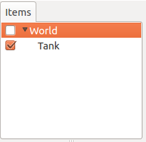
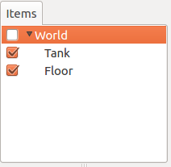
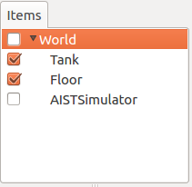
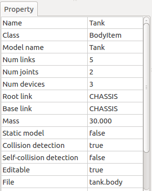
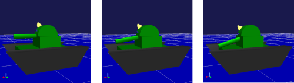

Step 1: Creating a simulation project
=============================================

Begin by importing the model we intended to run a simulation with into Choreonoid and creating a project. For details on this method, see the section on :doc:`../simulation-project` . In this section, we describe in detail the basic workflow.

.. contents:: 目次
   :local:
   :depth: 2

.. highlight:: C++

Launching Choreonoid
--------------------------

Begin by launching Choreonoid.

You can launch Choreonoid however you wish. For the purposes of this tutorial, we launch it from the command line. For brevity’s sake, we directly execute the executable files generated in the Choreonoid build directory at build time. In this case, you do not need to install by invoking “make install.”

For example, if you built your files immediately within the source directory, the source directory is itself the build directory. You would launch Choreonoid the following way: ::

 cd [source directory]
 bin/choreonoid

In this case, the model files accompanying Choreonoid and the controller files and other assets we will newly create in this tutorial reference those within the Choreonoid source directory. This ensures that everything stays cleanly in one directory.

.. note:: Naturally, you can also use files installed to /usr/local or another directory through the make install command. You are free to use those as necessary. In this case, execute “make install” when creating the controller; note that this installs against the controller file stored in the installation path.
.. note:: For basic Linux usage, see the section on :doc:`../../tips/howto-use-commands` .

Creating a world item
------------------------

Once Choreonoid launches, first create a world item. From the Main Menu, select File > New > World. You will see the Generate New World Item dialog appear. Click Generate. A new item named “World” will appear in the :ref:`basics_mainwindow_itemtreeview` as shown below.

.. image:: ../images/simproject-item1.png

The World item is intended to represent a single virtual world and must be generated if you intend to run a simulation.

Importing the Tank model
-----------------------------

First we import the Tank model to be used for this simulation. As the name suggests, the Tank model resembles a tank and has a twin-axis gun turret and left and right crawlers for movement. It is also equipped with a light (as a lightsource) and a camera.

First click on the World item we just created in the Item Tree View to select it. Doing so will ensure that subsequently imported items are sub-items of the World item.

From the Main Menu, select File, Import, then Body. This will generate a file selection dialog where you can select the model file. The Tank model is contained within the tank.body file found in the /share/model/tank/ directory of the Choreonoid install path. Now, place a checkmark in the box on the lower lefthand side of the dialog window that says, “Place a Check on the Item Tree View.”

If the model file is correctly imported, the Item Tree View should appear as below.

In Choreonoid, robots and environmental models are referred to as :doc:`../../handling-models/bodymodel` . They are managed in the Item Tree View as Body Items. The Body Item for the Tank model we have just imported is displayed as “Tank” on the Item Tree View.

The Tank item is displayed one tick to the right of the World item. This is critical to note, as it indicates that the Tank item is a sub-item of the World item. This positional relationship enables the Tank model to be recognized as belonging to the World item, a virtual space. If the World item is selected upon import of the Tank model, it should be positioned as above. If it is not, you can :ref:`basics_item_move` the item (drag the Tank model and drop it on top of the World item) to arrange it properly.

Also confirm that there is a checkmark on the left of the Tank item. If you enabled “Place a Check on the Item Tree View” in the earlier dialog, you should see a check on the above image. If there is no check, you can manually add a checkmark now.

Once the Tank item is checked, the model appears in the Scene View.

.. image:: images/tankscene.png

By :ref:`basics_sceneview_viewpoint` in the Scene View, you will make it easier to view the Tank model as you work. You can use the mouse wheel on the Scene View to move the perspective in and out and zoom the model in bigger. The above image shows what the screen will look like after having done that.

We have discussed in the :doc:`../../handling-models/modelfile/modelfile-newformat` how to create model files using the SimpleTank, a simplified Tank model, as an example. The Tank model here makes use of a model created in an external modeling tool using the SimpleTank form. For details, see the section on :doc:`../../handling-models/modelfile/tank-blender` .

.. note:: The Tank model makes use of a Collada format mesh file. To import it, you need the Assimp plugin. If the Assimp plugin has not been built, you will see a message on import reading, “The tank.dae file format is not supported by the Scene Loader.” Even if you place a check next to the model, it will not display.  In this case, :ref:`reinstall the package dependencies<build-ubuntu-install-packages>` to install the Assimp library, then use the :ref:`CMake build configuration<build-ubuntu-cmake>` to set **BUILD_ASSIMP_PLUGIN** to ON, then build again. If it still fails to render correctly, ensure that you are importing the simplified version of the Tank model, located at share/model/tank/simpletank.body.

.. note:: This tutorial was designed around the SimpleTank model; the below descriptions and figures are based around the SimpleTank. The basic content of the model is the same, so you can use either one. 
	  

Importing the ground model
----------------------------------

We have loaded the Tank model, but gravity causes the Tank to sink when running a simulation. First, import the ground model to serve as an environment to support the Tank.

As discussed previously, select the World item and, from the main menu, click File > Import > Body. Then import the floor.body file found within the /share/model/misc/ subdirectory within the Choreonoid install path. This will cause the Item Tree View to be as follows.

As with the tank item, 

* check whether this is a sub-item of the World Item
* and whether the Floor item has a check next to it.

.

If there is a check, the Scene View should also display a floor model (in blue) as below.

.. image:: images/tankfloorscene.png

This completes the basic configuration of the model.

While we are using the default values (at time of import) for each model (position/orientation), if you want to change the defaults, see the section on :ref:`simulation_setting_initial_status` .

.. note:: You are not required to display the floor model on the Scene View. The Floor model we are using is a simple flat surface with Z=0. Provided you have the default floor grid display on, that may be enough for you. In that case, you can remove the check on the Floor item to turn its display off. If the model item is a sub-item of the World item, the simulation deems it to exist, irrespective of whether it is physically displayed.

Creating a simulator item
------------------------------

To run a simulation, you must first create a :ref:`simulator Item<simulation_simulator_item>` .

We’ll be using a standard simulator item, the AIST simulator. From the main menu, select File, New, then AIST Simulator to generate the item.

Position the simulator item, as with model items, as a sub-item of the World item. This lets you explicitly define the world in which the simulator item’s simulation will take place. Therefore, when generating the above item, you should also ensure that the World item is selected. If the item you created properly appears in the Item Tree View as below, you have followed these steps correctly.

Setting properties
----------------------

Next, we set the item properties in order to properly run the simulation.

Begin by configuring the Tank item’s properties. Selecting the Tank item will cause the item properties list displayed on the :ref:`basics_mainwindow_item_property_view` to look like below.

The corresponding body item property for simulations in this case is self-collision detection. By default, this is set to false. Even if model links collide, they will not halt there and slip past each other. In this tutorial, given that we expect the tank body and gun barrel to intersect in the Tank model, we set this property to true to enable self-collision detection.

By double-clicking on the point where the self-collision detection property reads “false,” you can toggle the combo box between true and false. Here, select true.

To run a simulation, you must adjust the simulation item’s properties accordingly. The default settings are fine for now, but you will notice that this allows for :ref:`simulation-time-step` , :ref:`simulation-time-range` , :ref:`simulation-realtime-sync` , :ref:`simulation-result-recording` , :ref:`simulation-device-state-recording` , among other options.

.. _tank-tutorial-step1-save-project:

Saving a project
--------------------

The steps thus far will have allowed you to create a base for the simulation project. At this point, you should consider :ref:`saving your project<basics_project_save>` .

From the Main Menu, select File > Save Project As, and on the dialog that appears, select a directory and set a filename, then save. We have used step1.cnoid as the filename. Each time you complete a step in this tutorial, we recommend saving a new filename. Each time you change the project settings, it would also be good to remember to overwrite the file. This can conveniently be done using the Save Project button seen below.

.. figure:: ../../basics/images/FileBar_x2.png

.. note:: In the /sample/tutorial/Tank subdirectory of the Choreonoid source directory, you will find the files step1.cnoid through step6.cnoid. These contain project files saved at different steps of the tutorial.

Launching a simulation
----------------------------

For the time being, let’s try running the current simulation.

Click the Begin Simulation button shown on the Simulation Bar below to start the simulation.

.. image:: ../../basics/images/SimulationBar_StartButton.png

This causes the Tank model’s gun barrel to fall downwards, as shown in the figure below, and then stop after striking the tank body.

This is because there is no :ref:`simulation_controller` to control the Tank model gun turret joints. In this case, the joints are free, so the gravity moment causes the pitch axis to rotate.

You can directly confirm that the joints are set to free using the  :doc:`../interaction` . Toggle the Scene View to Edit mode and drag the mouse over the gun barrel to pull it. Dragging the gun barrel will allow you to easily move it around.

In this way, if there is no controller, there is no way to maintain the orientation of the model. As discussed in the section on :ref:`Case without Controller <controller-no-controller-case>` in the :doc:`../howto-use-controller` chapter, for humanoid robots, the effect is so pronounced that the robot fails forward.

You will inevitably need a controller to control the way in which the robot moves. In the next step, we will be creating one.

Stopping a simulation
---------------------------

Before proceeding to the next step, make sure you halt the simulation. Click the Simulation Halt Button shown below to end it.

.. image:: ../images/simbar-stop-button.png

Going forward, after a simulation, remember to end the routine and then build the next project.
