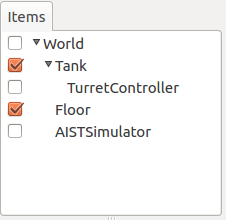
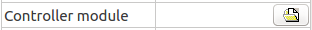

Step 2: Implementing a controller
=======================================

In Step 1, there was no controller, so we were unable to maintain the orientation of the gun barrel when simulating the Tank model. In Step 2, we will be learning how to implement controllers by creating the bare minimum controller needed to maintain the orientation of a model.

.. contents:: 目次
   :local:
   :depth: 2

.. highlight:: C++
   :linenothreshold: 5

Controller format
--------------------------

Generally speaking, there are many different ways in which controllers can be implemented. Typically, this is done by way of formats set by specific robot systems and simulators, or through generic middleware formats such as OpenRTM and ROS.

In this tutorial, we use Choreonoid’s proprietary SimpleController format. The SimpleController makes use of C++ and Choreonoid’s internal data structure to implement itself. Compared to OpenRTM or ROS, there is not much syntax to remember, and the code is comparatively simple.

Note that this is a format proprietary to Choreonoid and therefore is less ubiquitous or versatile than OpenRTM or ROS. Furthermore, it does not include the communications features that OpenRTM and ROS do. Choreonoid does have functionality to integrate with OpenRTM and ROS, so you can make use of that as needed. You will find details on OpenRTM in the section on  :doc:`../../openrtm/index` .

Implementing the “TurretController1” controller
------------------------------------------------------

The SimpleController format implements the controller using a C++ class. Here we’ll implement a simple TurretController1, the purpose of which is solely to maintain the pitch axis of the gun turret. The source code to the controller is seen below. ::

 #include <cnoid/SimpleController>
 
 using namespace cnoid;
 
 class TurretController1 : public SimpleController
 {
     Link* joint;
     double q_ref;
     double q_prev;
     double dt;
 
 public:
     virtual bool initialize(SimpleControllerIO* io) override
     {
         joint = io->body()->link("TURRET_P");
         joint->setActuationMode(Link::JOINT_TORQUE);
         io->enableIO(joint);
         q_ref = q_prev = joint->q();
 
         dt = io->timeStep();
 
         return true;
     }
 
     virtual bool control() override
     {
         // PD gains
         static const double P = 200.0;
         static const double D = 50.0;
 
         double q = joint->q(); // input
         double dq = (q - q_prev) / dt;
         double dq_ref = 0.0;
         joint->u() = P * (q_ref - q) + D * (dq_ref - dq); // output
         q_prev = q;
   
         return true;
     }
 };
 
 CNOID_IMPLEMENT_SIMPLE_CONTROLLER_FACTORY(TurretController1)

Below, we import this controller as a simulation project and then describe the steps up to running the simulation. Then, we discuss the details of how the controller is specifically implemented and break that down.

Creating a project directory
------------------------------

First, create a directory in which to save the output of the above, which you will be entering into a text file. You could create a directory named “tank” and then save the above source code to a file named TurretController1.cpp. Going forward, other files in the tutorial should be saved in this directory. We refer to this as the project directory.

The files we created in Step 1 when learning about :ref:`tank-tutorial-step1-save-project` can also be stored here to put everything in one place.

.. note:: If you are unsure of what text editor to use on Ubuntu, for the time being, try using the default text editor, “gedit.” From the Dash, type “gedit” and click the text editor icon that appears. You can also enter “gedit” directly on the command line.

.. note:: The source code files can be found under /sample/tutorial/Tank in the Choreonoid directory. If you don’t want to type everything in yourself, you can refer to this file. The other files referenced in this tutorial can also be found in this directory, so you can make use of them as needed.

.. _tank_tutorial_step2_compile:

Building the controller
-----------------------------

Broadly speaking, there are two ways of building (compiling) the source code written in C++.

1. Building alongside Choreonoid
2. Building separately from Choreonoid

If you are building Choreonoid from source, method 1 is easier. In this tutorial, we describe method 1.

For details on build methods, see the section on :doc:`../howto-build-controller` . When actually developing your own controller, you will probably use both methods depending on your intended objectives and the environment being used.

When using method 1, we have to make Choreonoid’s build system recognize the project directory we just created. There are also two ways of doing this.

A. Place the corresponding directory below the /ext directory in the Choreonoid source directory
B. Pass the path to the directory using ADDITIONAL_EXT_DIRECTORIES in the Choreonoid CMake file

If adopting method A, move the “tank” project directory we just created to be below /ext. You could also opt to create the project directory below /ext ahead of time. Either way is fine.

If using method B, specify the corresponding directory path using the above setting. If there are multiple directories in question, delimit them with a semicolon.

Unless you have reason to do so, we suggest using method A. In this case:

* Create the “tank” project directory below the “ext” directory in the Choreonoid source directory.
* Save the TurretController1 source code from the previous paragraph as a file named TurretController1.cpp in the “tank” directory.

.

CMakeLists.txt notation
----------------------------

Next, create CMakeLists.txt, a text file, in the project directory and notate the controller compile settings therein.

That being said, the details for this example are quite simple. All you have to do is add the single line below. ::

 add_cnoid_simple_controller(TankTutorial_TurretController1 TurretController1.cpp)

The add_cnoid_simple_controller function we have used here is a function already defined in the CMake file for Choreonoid. You simply need to add the name and source file of the controller you wish to generate to compile the controller.

We have prepended the prefix “TankTutorial” to the controller name. This is not required, but it is done to easily distinguish it from controllers you develop for other projects.

Controller compilation
---------------------------

You can now compile it. We are using the same build method as when we built Choreonoid proper. All you need to do is build Choreonoid again. There is a new CMakeLists.txt file now, so reissue CMake to ensure it detects it properly. For the device in Step 1, the current directory should be the Choreonoid source directory. If this is not the case, use: ::

 cd [path to Choreonoid source directory]

to navigate to the source directory.

If you are using the source directory as-is as a build directory, run ::

 cmake .

to run CMake again in the current working directory. If your build and source directories are separate, navigate to the build directory and pass the source directory as a parameter to cmake. For example, if you have created a build directory called “build” directly below the source directory, you would do the following: ::

 cd build
 cmake ..

.

Next, go to the build directory and issue this command: ::

 make

(For details on compiling, please refer to the Choreonoid build section of the :doc:`../../install/build-ubuntu`  documentation.)

If the A and B conditions described in the section on :ref:`tank_tutorial_step2_compile` are met, the above CMakeLists.txt will be output, and its content is executed.

If the compile process succeeds, you will find a file named:

* **TankTutorial_TurretController1.so**

under lib/choreonoid-x.x/simplecontroller (where x.x is the Choreonoid version number). 

This is the base file for the controller. As the extension indicates, this is a shared library file that defines the controller. Going forward, we describe the directory in which the controller was generated as the controller directory.

If you get a compile error, refer to the error message and adjust the source code and/or CMakeLists.txt.

.. _simulation-tank-tutorial-create-controller-item:

Controller item creation
------------------------------

Now we import the SimpleController that we created into Choreonoid as a SimpleController item.

First begin by generating the SimpleController item. From the Main Menu, select File, new, then SimpleController. The item can take any name. It is best to ensure consistency with the controller by naming it something like TurretController.

The resulting item will be positioned, as seen below, as a sub-item of the Tank item, which is what we intend to control with it.

This positioning indicates that the control target of the controller is the Tank. Achieving this can be done by first selecting the Tank item and then generating the controller item, or by dragging into position after generation.

.. _simulation-tank-tutorial-set-controller:

Setting the controller body
----------------------------------

Next, we set the controller we just created onto the SimpleController item.

This is done by way of the controller module property that the SimpleController item possesses. Begin by selecting TurretController on the Item Tree. The item’s properties list will appear on the Item Properties View. From there, look for the Controller Module property. Double-clicking on the property value field (by default, it will be empty) lets you input the name of the module file.

Using the file input dialog that appears is a fast and convenient way to do so. When giving input to the controller module, as shown in the figure below, there is an icon at the right which is used to enter a value.

Clicking this icon will display a file selection dialog. Ordinarily, this dialog points to the default directory used to store the SimpleController. You should find the TankTutorial_TurretController1.so that we just created. Select it.

With this, the controller is now set on the SimpleController item. Now we can imbue the controller with functionality.

Take a moment to save your work on the project thus far. Save the filename as step2.cnoid and save it into the project directory.

Launching a simulation
-------------------------------

Now that you have completed the above, try running the simulation. While the gun barrel fell due to gravity in Step 1, now it properly faces forward. This is because the TurretController1 controller is applying the requisite torque to the gun turret pitch axis to maintain the proper orientation.

If you have trouble, look at the Message View for logs. If there are issues with the controller settings or operation, the Message View will output debug messages upon starting the simulation.

Note that this controller does not control the yaw axis of the gun turret, so no force is applied there. As with Step 1, :doc:`../interaction` to drag the gun turret and see that the yaw axis is free-moving.

How this implementation works
---------------------------------

The TurretController1 controller we just created works as follows.

The SimpleController Class
~~~~~~~~~~~~~~~~~~~~~~~~~~~~~~~~~

The SimpleController is designed to inherit the SimpleController class defined in Choreonoid. Begin by writing ::

 #include <cnoid/SimpleController>

to include the header defined for this class. The header files provided by Choreonoid are stored in the “cnoid” subdirectory of the source directory, and you can specify this as a path from the cnoid directory. A file extension is not required.

All of the classes defined in Choreonoid belong to the “cnoid” namespace. Here, we use ::

 using namespace cnoid;

to abbreviate the namespace.

The controller class is defined by using: ::

 class TurretController1 : public SimpleController
 {
     ...
 };

You can see how the TurretController1 is defined to inherit the SimpleController attributes.

The SimpleController class defines several functions as virtual functions; overriding these functions in the succeeding item lets you implement controller-internal processing. Normally, the below two functions are overridden.

* **virtual bool initialize(SimpleControllerIO* io)**
* **virtual bool control()**

Implementing the initialize function
~~~~~~~~~~~~~~~~~~~~~~~~~~~~~~~~~~~~~~~~~
  
The initialize function is used to initialize the controller and is only issued once immediately before the simulation begins.

SimpleControllerIO is applied to this function as an argument. This class contains a variety of integrated functionality needed for controller I/O. For details, refer to the :ref:`simulator-simple-controller-io` referenced in the section on :doc:`../howto-implement-controller` . You will see that: ::

 joint = io->body()->link("TURRET_P");

is used to obtain a Link object to handle I/O for the gun turret pitch axis, and the joint variable is stored there.

Using io->body() lets you poll the Body object used for Tank model I/O, as well as the item named TURRET_P from the Link object owned by this object. This corresponds to the joint for the :ref:`gun turret pitch axis<modelfile_yaml_TURRET_P_description>`  discussed in the section on :doc:`creating the Tank model<../../handling-models/modelfile/modelfile-newformat>` .

Next, ::

 joint->setActuationMode(Link::JOINT_TORQUE);

applies the joint torque for the :ref:`simulation-implement-controller-actuation-mode` used for this joint. This allows for issuing joint torque as a command value.

Also, using ::

 io->enableIO(joint);

enables I/O for the joint. This code is used to enable the default input/output for the joint. The current ActuationMode is set to joint torque, so you can input a joint angle and output the torque. This enables you to execute PD control of joints.

Note: if you do not configure the above ActuationMode settings or enable input/output, you will be unable to control the given joint.  Other functions used to configure input and output are enableInput, which only controls input, and enableOutput, which only controls output.

.. note:: Other functions that have the same functionality in SimpleControllerIO are setLinkInput, setJointInput, setLinkOutput, and setJointOutput. These have been retained to keep compliance with older specifications and should not be used; going forward, please use the enableXXX function.

Other values required for PD control are: ::

 q_ref = q_prev = joint->q();
  
This lets you obtain the initial joint angle and substitute it with the q_ref and q_prev variables. q_ref is the variable for calculating target joint angle, while q_prev is the variable for calculating joint angular velocity. Also, using ::

 dt = io->timeStep();

lets you substitute a time step for the dt variable. This describes the internal time interval for each physics calculation of the simulation. At each step, the next control function is called.
  
Lastly, true is returned for the initialize function, telling the system that the initialization process succeeded.

Implementing the control function
~~~~~~~~~~~~~~~~~~~~~~~~~~~~~~~~~~~~~~~

The control function is used to indicate the actual control code and is executed on a loop in the simulation.

This only contains the PD control code for the gun turret pitch axis. ::

 static const double P = 200.0;
 static const double D = 50.0;

The above corresponds to values for P gain and D gain. The current joint angle is input into the below: ::

 double q = joint->q(); // input

And the current angular velocity is calculated with: ::
   
 double dq = (q - q_prev) / dt;

Next, ::

 double dq_ref = 0.0;
  
sets the target velocity to 0, and ::

 joint->u() = P * (q_ref - q) + D * (dq_ref - dq); // output

outputs the torque value calculated with PD control to the joint. Finally, ::
   
 q_prev = q;

is used to update q_prev for the next calculation.

In this way, the key takeaway is that input and output make use of Link object variables. joint->q() and joint->u() respectively correspond to joint angle and torque variables.

Lastly, the “true” value is returned to indicate that the process completed correctly. This continues the control loop.

Factory function definitions
~~~~~~~~~~~~~~~~~~~~~~~~~~~~~~~~~~

Once you define the SimpleController class, you must define the factory function, used to generate the object, per the prescribed method. This is needed so that the SimpleController item will read in the shared controller libraries at runtime and generate the controller object from there.

This is achieved by using a macro: ::

 CNOID_IMPLEMENT_SIMPLE_CONTROLLER_FACTORY(TurretController1)

Give it the controller class name as an argument, as above.
