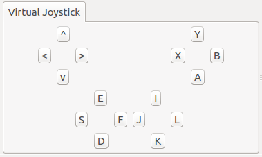
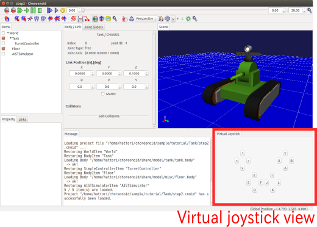
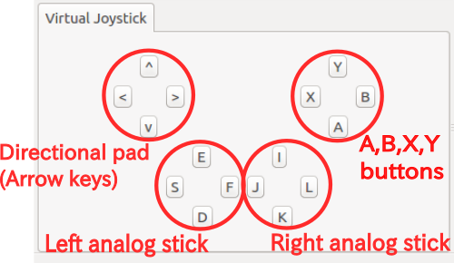

Step 3: Controlling the gun turret with a gamepad
=========================================================

In Step 2, we created a controller to perform the minimum control required to stabilize the model, and we learned how to implement and import that controller. In Step 3, we attempt to create a slightly more complex controller.

.. contents:: 目次
   :local:
   :depth: 2

.. highlight:: C++
   :linenothreshold: 7

.. _simulation-tank-tutorial-gamepad:

Gamepad setup
------------------

The controller we will be creating in this step is used to manipulate the gun turret of the Tank model using a gamepad (joystick). To do so, begin by obtaining a gamepad and connecting it to your computer.

Note that **you can still perform this even without an actual gamepad**. In this case, you can alternatively use the Virtual Joystick View. You can proceed to the next section on :ref:`tank-tutorial-virtual-joystick-view` . The below explanation presumes use of an actual gamepad.

This tutorial also presumes a gamepad with a layout like that seen below.

.. image:: images/f310.jpg

This product is the `Logicool F310 <http://gaming.logicool.co.jp/ja-jp/product/f310-gamepad>`_ ; other similar gamepads include the PlayStation 3 and 4 gamepads (DualShock 3 and 4) and the Xbox gamepad.

If using other gamepads, the axes and placement of buttons may not correspond and fail to operate properly. In that case, you will need to change the axes and button IDs indicated in the source code in order to remap the controller. We discuss how to do this in the final section of this step, which describes this :ref:`implementation in detail<simulation-tank-tutorial-step3-implementation>` .

A convenient tool to determine whether the gamepad is detected by the OS and whether the axes and button mappings are correct is the “jstest” command. If the gamepad does not function properly, check it using this command. On Ubuntu, execute the below from the command line ::

 sudo apt-get install joystick
  
to install the package. Use, e.g.,  ::
   
 jstest /dev/input/js0
  
to execute it.

The command argument indicates the device file for the gamepad. “js0” here corresponds to the first gamepad connected and assigned an ID of 0. Ordinarily, this would be the one used. If you want to use two or more gamepads, you would use devices js1 and js2. However, note that this requires changing the source code.

Connecting the gamepad and executing the command above will return information like the below to the console. ::

 Driver version is 2.1.0.
 Joystick (Logitech Gamepad F310) has 8 axes (X, Y, Z, Rx, Ry, Rz, Hat0X, Hat0Y)
 and 11 buttons (BtnX, BtnY, BtnTL, BtnTR, BtnTR2, BtnSelect, BtnThumbL, BtnThumbR, ?, ?, ?).
 Testing ... (interrupt to exit)
 Axes:  0:     0  1:     0  2:-32767  3:     0  4:     0  5:-32767  6:     0  7:     0 Buttons:  0:off  1:off  2:off  3:off  4:off  5:off  6:off  7:off  8:off  9:off 10:off

Manipulating the gamepad axes and buttons will change the output. This lets you confirm the connection status and the mapping of the axes and buttons. If you do not get this output or if the gamepad does not produce different output when manipulated, it might not be connected properly. Check your connection method and the gamepad status and try again.

.. note:: The Joystick class used below to handle input from joysticks contains functionality to calibrate the common position of axes and buttons (ID values) for each type of gamepad.This allows the same program to be used by the above gamepad. However, the ID values used within the program may not necessarily correspond to those output by jstest, so use caution.

.. _tank-tutorial-virtual-joystick-view:

Virtual joystick view setup
--------------------------------

If you do not have a gamepad, you can use the Virtual Joystick View. This is accessed by selecting View, Display Views, and Virtual Joystick from the Main Menu. The external appearance is as below.

This appears in the same area as the Message View usually situated on the bottom of the main window. This causes messages to be hidden,  :ref:`so you should change the view layout <basics_modify_view_layout>` in order to be able to use both the Message View and Virtual Joystick View at the same time. You could reconfigure the layout as below.

Once a gamepad is connected, its input takes precedence. If using the Virtual Joystick View, ensure that there is no gamepad connected at that time.

This completes the setup process.

Controller source code
----------------------------

The source code for the controller we will be creating is below. This code takes TurretContoller1, which we worked on in Step 2, and adds functionality to control the gun turret yaw axis and change command values via a gamepad. ::

 #include <cnoid/SimpleController>
 #include <cnoid/Joystick>
 
 using namespace cnoid;
 
 class TurretController2 : public SimpleController
 { 
     Link* joints[2];
     double q_ref[2];
     double q_prev[2];
     double dt;
     Joystick joystick;
 
 public:
     virtual bool initialize(SimpleControllerIO* io) override
     {
         joints[0] = io->body()->link("TURRET_Y");
         joints[1] = io->body()->link("TURRET_P");
 
         for(int i=0; i < 2; ++i){
             Link* joint = joints[i];
             joint->setActuationMode(Link::JOINT_TORQUE);
             io->enableIO(joint);
             q_ref[i] = q_prev[i] = joint->q();
         }
 
         dt = io->timeStep();
       
         return true;
     }
 
     virtual bool control() override
     {
         static const double P = 200.0;
         static const double D = 50.0;
         static const int axisID[] = { 2, 3 };
 
         joystick.readCurrentState();
 
         for(int i=0; i < 2; ++i){
             Link* joint = joints[i];
             double q = joint->q();
             double dq = (q - q_prev[i]) / dt;
             double dq_ref = 0.0;
 
             double pos = joystick.getPosition(axisID[i]);
             if(fabs(pos) > 0.25){
                 double deltaq = 0.002 * pos;
                 q_ref[i] += deltaq;
                 dq_ref = deltaq / dt;
             }
      
             joint->u() = P * (q_ref[i] - q) + D * (dq_ref - dq);
             q_prev[i] = q;
         }
 
         return true;
     }
 };
 
 CNOID_IMPLEMENT_SIMPLE_CONTROLLER_FACTORY(TurretController2)

Controller compilation
------------------------

Enter and save the source code above and recompile.

The process is the same as described in Step 2. Save the source code to a file named TurretController2.cpp in the project directory and add the below code to CMakeLists.txt. ::

 add_cnoid_simple_controller(TankTutorial_TurretController2 TurretController2.cpp)

Now, when you compile Choreonoid, the controller will also be compiled, and a file called TankTutorial_TurretController2so will be generated in the controller directory.

Swapping controllers
----------------------------

Now, let’s try using this controller as a controller for the Tank model.

You should still have the project you created in Step 2. All you have to do is change the controller settings. Carry out the :ref:`simulation-tank-tutorial-set-controller` described in Step 2 and ensure that you overwrite the TankTutorial_TurretController2.so file we created previously.

This completes the controller setup. Now, save this project as step3.cnoid.

Gun turret operation
-------------------------

Now, let’s run the simulation.

The gamepad should now be working to move the gun turret on the Tank model. Try moving it around. If you are using an F310, the right analog stick should let you move the gun turret. Try moving its axis. For other gamepads, you can experiment to see which axes correspond, etc. If things do not function as intended, try changing the axis settings in your source code. This will be explained in the next section.

If using the Virtual Joystick View, you can manipulate the view using the keyboard. The buttons onscreen correspond to the directional pad and analog stick axes of a gamepad, as well as the buttons. The correspondence is explained in the image below.

If you look at the F310 in the context of this image, you will see how the main axes of the analog sticks and buttons on the F310 correspond. Use the J and L buttons on the keyboard to control the yaw rotation of the gun turret and the I and K keys to control the pitch rotation.

One note is that the Virtual Joystick View will not work **unless the keyboard is in focus.**  Therefore, you must click the mouse in the view or otherwise regain focus. If you change the viewpoint of the Scene View while manipulating a model, the focus will shift to that new view. You must click the Virtual Joystick View again to regain focus.

Were you able to move the Tank model’s gun turret as intended? As you can see, you can achieve a range of functionality to manipulate the model depending on how you configure your gamepad. Taking input from external devices allows you to add more functionality to your controllers.

.. _simulation-tank-tutorial-step3-implementation:

How this implementation works
----------------------------------------

As with the TurretController1 we created in Step2, TurretController2 uses PD control to control the gun turret axis; that functionality is the same.

However, note that the two points below have been expanded and changed.

1. In addition to being able to control the TURRET_Y joint, which corresponds to the gun turret yaw axis, we can now control TURRET_P, which controls the pitch axis.
2. The target joint of PD control is not fixed at the model’s initial angle, but configured to adapt to input from the gamepad (joystick).

1 simply creates an array of the corresponding variables, with a for loop executing the same process for each.

2 uses the Joystick class provided by Choreonoid to obtain input from the joystick. Let us look at how to achieve this.

First, use ::

 #include <cnoid/Joystick>

to include a header which defines the Joystick class.

The Joystick class object is defined as a member variable of TurretController2: ::

 Joystick joystick;

The constructor makes use of a default item. In this case, the device file at /dev/input/js0 acts as the joystick input source. If this device file does not exist and there is a Virtual Joystick View, the former will be used as the input source.

To obtain the joystick state, first execute: ::

 joystick.readCurrentState();

This will import the current joystick state from the device file or Virtual Joystick View.

You can use ::

 joystick.getPosition(axis ID）

to poll the state of the axis (its inclination) as a value between -1.0 and +1.0. ::

 joystic.getButtonState(button ID)

is used to poll a boolean value on whether the button is pressed or not. The button will be used in the controller described in Step 5.

One note of caution is that 0 is set as the center point for the analog stick state, but the value may not always be 0 even if the stick is not pushed. Therefore, you must set a threshold to determine whether the stick is being pushed. To perform this, add the below process to the control function in the above source code: ::

 if(fabs(pos) > 0.25){
  
For support of the joystick axis, the following is used within the control function: ::

 static const int axisID[] = { 3, 4 };

3 and 4 above correspond respectively to IDs for the gun turret yaw axis and pitch axis. In the F310, these correspond to the right analog stick. For other gamepads, check the output of the jstest command to ensure that you are calling the right axis.

The actual part of the control function that corresponds to the target joint is: ::

 double pos = joystick.getPosition(axisID[i]);
 if(fabs(pos) > 0.25){
     double deltaq = 0.002 * pos;
     q_ref[i] += deltaq;
     dq_ref = deltaq / dt;
 }

Here, q_ref[i] is the variable for target joint angle, and dq_ref is the variable for the target joint angular velocity. Now you can use these target values to implement PD control, as done in part 1.
