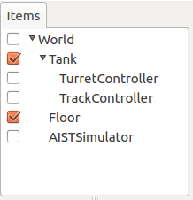
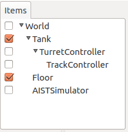
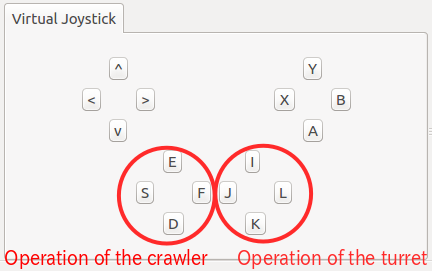

Step 4: Controlling the crawlers
=====================================

In Step 3, we learned how to control the gun turret. In this step, we will control the crawlers, which move the tank itself.

.. contents:: 目次
   :local:
   :depth: 2

.. highlight:: C++
   :linenothreshold: 7

Simplified Tank model crawler
-----------------------------------

The crawlers on the left and right of the model are modeled as “simplified crawlers.” (See the section on :ref:`modelfile_yaml_crawlers` ). This structure applies additional driving force between the crawler and its point of contact with the environment; the treads do not actually move around the wheels. This simplified design allows for a pseudo-crawler behavior. The treads do not deform as they go across terrain, though, so its running power is not like that of an actual crawler. For details, please see the section on  :doc:`../pseudo-continuous-track` .

The Tank model is modeled with two separately-named links for the respective left and right crawlers. The left side is “TRACK_L,” while the right side is “TRACK_R.” These links are configured as the “pseudoContinuousTrack” axis used by the simplified crawler. In this tutorial, we use the gamepad to control these.

Simplified crawler controller
-----------------------------------

The source code of the TrackController we will be building is below. ::

 #include <cnoid/SimpleController>
 #include <cnoid/Joystick>
 
 using namespace cnoid;
 
 class TrackController : public SimpleController
 {
     Link* trackL;
     Link* trackR;
     Joystick joystick;
 
 public:
     virtual bool initialize(SimpleControllerIO* io) override
     {
         trackL = io->body()->link("TRACK_L");
         trackR = io->body()->link("TRACK_R");
 
         trackL->setActuationMode(Link::JOINT_SURFACE_VELOCITY);
         trackR->setActuationMode(Link::JOINT_SURFACE_VELOCITY);

         io->enableOutput(trackL);
         io->enableOutput(trackR);
 
         return true;
     }
 
     virtual bool control() override
     {
         static const int axisID[] = { 0, 1 };
 
         joystick.readCurrentState();
 
         double pos[2];
         for(int i=0; i < 2; ++i){
             pos[i] = joystick.getPosition(axisID[i]);
             if(fabs(pos[i]) < 0.2){
                 pos[i] = 0.0;
             }
         }
 
         trackL->dq() = -2.0 * pos[1] + pos[0];
         trackR->dq() = -2.0 * pos[1] - pos[0];
 
         return true;
     }
 };
 
 CNOID_IMPLEMENT_SIMPLE_CONTROLLER_FACTORY(TrackController)

As before, save the above source code as a file named TrackController.cpp in the project directory and add the below to the CMakeLists.txt file in the same directory: ::

 add_cnoid_simple_controller(TankTutorial_TrackController TrackController.cpp)   

When finished, compile it.
 
Deploying the controller
---------------------------------

While the controller is implemented here as we did previously, this new controller does not control the gun turret, so just setting this controller alone will not allow you to manipulate the turret. What we will do is make use of the gun turret controllers we have used so far, while adding to this controller.

.. note:: Naturally, another approach would be to include code to control the gun turret directly in the source code. In that case, you would simply specify the integrated controller file for the controller module of the SimpleController item. This tutorial is designed to explain how each step is added in a sequential fashion, so we deliberately only add the new step to each controller as it appears. Furthermore, breaking out the controller functionality in this way also improves the reusability of the controllers you develop.

To add a controller, you need simply add the SimpleController item. Perform the same operations as you did in Step 2 to :ref:`simulation-tank-tutorial-create-controller-item` . It is best to give the name of the item generated one that corresponds to the controller, such as TrackController. For the properties of the controller module we generated, we assign the name of the controller file: TankTutorial_TankController.so.

Use caution here with respect to the placement of the additional controller items. As with the first controller item, one positioning would be as follows.

When arranging multiple controller items in parallel as sub-items of the model to be controlled, they each control the model as standalone controllers. Specifically, it functions as follows.

* The SimpleControllerIO format objects (I/O objects) are treated as respectively different objects. The Body object used for input/output and obtained from the IO object also differs.

* The control functions for each controller are executed in parallel. Strictly speaking, if the controller thread property of the simulator item is set to “true,” separate threads are assigned to each controller’s control function, and these are executed in parallel.

Meanwhile, the two controller items in this step are positioned as follows.

The second controller is positioned as a sub-item of the first controller. In this case, the two controllers act in an integrated fashion. Specifically, it functions as follows.

* IO objects passed to each controller are shared as the same object. Therefore, the Body objects used for input/output and obtained from each IO object are also shared.

* The control functions for each controller are executed in series. The run order is based on a depth-first search of the tree.

The controller we will be creating in this tutorial will function correctly in both cases, but, generally speaking, the latter (integrated format) is preferred. This allows for using fewer resources and easier integration between controllers. This tutorial makes use of the integrated format and, in this step, as shown in the second figure, the TrackController is positioned as a sub-item of the Turret Controller.

One of the benefits of the parallel format of the former is that it lets you invoke multiple controllers in parallel. Only this format lets you use controller items of different types together. There may be times where you want to use different controller types for different purposes.

Operating the controller
-----------------------------

Now, let’s run the simulation. Using the other (the left) analog stick of the gamepad, try moving the Tank model’s body. Pushing the stick forward causes the tank to move forward; pulling it backward causes the tank to move backward. Pushing it to the left or right causes the tank to rotate in that direction.

We have retained the TurretController in place, so you can continue controlling the gun turret.

When shown in the Virtual Joystick View, the components of the gamepad and its operations appear as below.

With this, all of the axes of the Tank model are now operational.

How this implementation works
------------------------------------

We will use this space to talk specifically about aspects of the TrackController that are unique to it.

First, use the initialize function: ::

 trackL = io->body()->link("TRACK_L");
 trackR = io->body()->link("TRACK_R");

to obtain the input and output links for the left and right crawlers. Next, ::

 trackL->setActuationMode(Link::JOINT_SURFACE_VELOCITY);
 trackR->setActuationMode(Link::JOINT_SURFACE_VELOCITY);

is used to specify JOINT_SURFACE_VELOCITY as the :ref:`simulation-implement-controller-actuation-mode`  for each link. As described in the section on :ref:`modelfile_yaml_crawlers` , we specified the actuation mode in the Tank model file, so this notation can be omitted. However, the model file may or may not specify this accordingly, so explicitly setting the ActuationMode is considered best.

Next, use ::

 io->enableOutput(trackL);
 io->enableOutput(trackR);
  
to enable output to each crawler link.

Where the ActuationMode is JOINT_SURFACE_VELOCITY, the command value outputted is not torque, but rather applies surface velocity to the crawler.  There is no particular need to set input here. Therefore, we use the enableOutput function, which only enables output. When using JOINT_SURFACE_VELOCITY, the link state variable “dq” is used to output the surface velocity.

Within the control function, you will find: ::

 static const int axisID[] = { 0, 1 };

This is used to set the axis ID for the gamepad used to operate the crawlers. Where using a gamepad other than those discussed in the section on :ref:`simulation-tank-tutorial-gamepad` , you may have to adjust the value for it to work correctly.

The output is set using the “dq” variable, which stores the joint velocity.  Within the control function, using: ::

 trackL->dq() = -2.0 * pos[1] + pos[0];
 trackR->dq() = -2.0 * pos[1] - pos[0];

determines the speed of each crawler based on the axis state and outputs the result. The stick front and back axes assign the same drive velocity to both crawlers, while the left and right axes of the stick assign opposing driving force to the crawlers. This enables you to tilt the stick forward and back to move in those directions and left and right to rotate in either direction.
