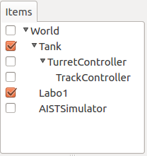
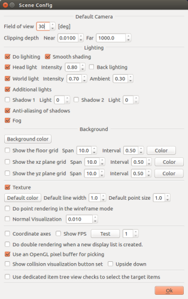
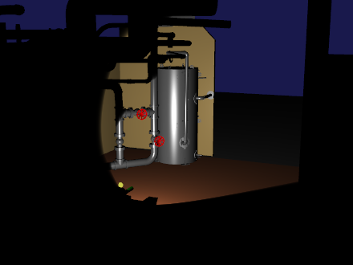
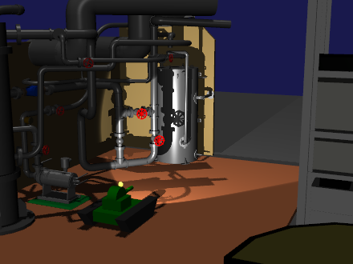
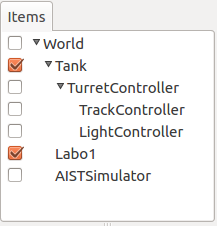

Step 5: Controlling the lights
====================================

The Tank model is equipped with a light (lightsource). In Step 5, we enabled controlling this light via the controller and learned how to control the device.

.. contents:: 
   :local:
   :depth: 2

.. highlight:: C++
   :linenothreshold: 7

Environment settings
----------------------------

Let’s configure the environment settings in order to make the effects of the light more clear.

Changing the scene renderer
~~~~~~~~~~~~~~~~~~~~~~~~~~~~~~~~~~~~~~
Internally, Choreonoid contains what is called a “scene renderer” that is used to render models as 3D graphics. The rendering performance in the Scene View will differ depending on whether this functionality has been implemented in your build.

The development version of Choreonoid actually contains a new scene renderer. This is implemented using GSLS, a shading language. Internally, it is referred to as the GLSL Scene Renderer. Using this renderer allows for more accurate rendering of illumination of objects from lightsources, as well as shadows cast by these objects. In other words, this allows you to draw a more realistic scene. This is useful in enhancing the effect of the light installed on the Tank model. Let’s try using this functionality.

The GLSL is currently in development; by default, it is set to not be used, but you can use the CNOID_USE_GLSL environment variable to enable it. Specifically, when launching Choreonoid, using ::

 CNOID_USE_GLSL=1 choreonoid

will apply this environment variable, causing the instance of Choreonoid to use the GLSL renderer. Or, you can issue the below command in advance: ::

 export CNOID_USE_GLSL=1

This will enable the environment variable setting thereafter.

One point to note is that the GLSL scene renderer requires that the OS’s OpenGL version be 3.3 or later. This is not a particularly new version, but it may not be supported on certain computer hardware and OS versions; if running on a virtual machine, it may stop functioning.

In Ubuntu, you can issue the glxinfo command to check what version of OpenGL you are running. This command is installed by invoking ::

 sudo apt-get install mesa-utils

Next, use ::

 glxinfo

to display information on the OpenGL configuration available for the environment. If you see a line reading:

 OpenGL version string: 4.5.0 NVIDIA 375.39

you know that OpenGL 4.5.0 is supported.

However, note that even if OpenGL 3.3 is supported, it may still not run properly. In particular, if you are using a GPU other than Nvidia or are running the tool on a virtual machine, it is likely to underperform. In this case, clear the above environment variable and try using the default scene renderer.

.. note:: There may be cases where the GLSL renderer underperforms, but setting the Qt version to 5 causes Choreonoid to perform properly. Qt is a GUI library; by default, version 4 is used. However, if you set the USE_QT5 flag to ON in the cmake settings, version 5 will be used.

Changing the environment model
~~~~~~~~~~~~~~~~~~~~~~~~~~~~~~~~~~

If we use the existing floor model as-is, the light will not stand out much. Therefore, we want to change the environment model. We will use the “Labo1” model, a sample included with Choreonoid. This model is based around a research plant, as shown below.

.. image:: images/labo1.png

This model is contained within the file Labo1.body in the model/Labo1 directory of the Choreonoid share directory. Add this to the projects you have created so far and import the model.

The position of this item on the Item Tree View when imported is, like the other items, a sub-item of the World item. If there is no check for this item, place a check next to it to display the model. The position of the model on the scene can be left as-is per the default. Now, delete the Floor item that we had imported for use on the ground. Right-clicking on the item will bring up a context menu, from which you can select Cut to delete the item. The above steps will present you with an Item Tree like the below.

If the parent-child relationship is the same, the item order does not matter. Therefore, it is fine is, for example, if Labo1 comes after AISTSimulator. If the order bothers you, you can drag the items to change the order to one you prefer.

Changing the scene settings
~~~~~~~~~~~~~~~~~~~~~~~~~~~~~~~~~~

Next, let’s change the configuration implicated in rendering the scene. To do so, first click the Settings Button on the Scene Bar below.

.. image:: images/scenebar-config.png

This will display a settings dialog like below. Here you can configure various settings implicated in rendering the scene.

First remove the checkmark next to “display floor gridlines.”

Next, let’s configure the lighting. Is the additional light turned on? If it is, the light on the Tank model should also be on.

Now, turn off the Headlight and World light. This will create a scene like below, where the Tank model’s light illuminates the dark view.

Now the illumination from the light can be fully seen. (When using the default renderer, the light illumination is more diffuse.)

If you make the scene this dark, some of it will become invisible and difficult to operate. Now, let’s try incorporating some lighting from the Headlight and World light that we previously disabled.

Begin by turning the lights on one by one from the settings dialogue. You should see the scene becoming brighter, as well as that the way each light illuminates the scene is different. The Headlight illuminates outward from line of sight, while the World light illuminates from the top of the scene and pointed down. Now, turn on both lights and tweak the intensity of each light in the settings dialog using the Illuminance field. With the default Illuminance, the scene is too bright and lacks in mood. Tweak this value as desired, setting it to a level that you find comfortable for working on the scene.

If you have also enabled the GLSL renderer, you will be able to display shadows. This can be configured by placing checkmarks next to Shadows 1 and Shadows 2 on the settings dialog. Each of the lights takes the number of the target light. 0 corresponds to the World light, while 1 and later correspond to lights installed on the model. Try enabling these and seeing how the appearance changes.

An example of a scene in which the Illuminance of the Headlight and World light has been toggled and shadows from the World light and Tank model light enabled can be seen below.

Now the ambiance is much more befitting the scene. Save your settings so far as a project file named step5.cnoid.

Light controllers
--------------------

The environment configuration has taken some time, but let us get into the main subject without further ado. We will be creating a controller used to operate the Tank model light and name it LightController. The source code to the controller is seen below. ::

 #include <cnoid/SimpleController>
 #include <cnoid/SpotLight>
 #include <cnoid/Joystick>
 
 using namespace cnoid;
 
 class LightController : public SimpleController
 {
     SpotLight* light;
     Joystick joystick;
     bool prevButtonState;
 
 public:
     virtual bool initialize(SimpleControllerIO* io)
     {
         light = io->body()->findDevice<SpotLight>("Light");
         prevButtonState = false;
         return true;
     }
 
     virtual bool control()
     {
         static const int buttonID[] = { 0, 2, 3 };
        
         joystick.readCurrentState();
 
         bool changed = false;
 
         bool currentState = joystick.getButtonState(buttonID[0]);
         if(currentState && !prevButtonState){
             light->on(!light->on());
             changed = true;
         }
         prevButtonState = currentState;
 
         if(joystick.getButtonState(buttonID[1])){
             light->setBeamWidth(std::max(0.1f, light->beamWidth() - 0.001f));
             changed = true;
         } else if(joystick.getButtonState(buttonID[2])){
             light->setBeamWidth(std::min(0.7854f, light->beamWidth() + 0.001f));
             changed = true;
         }
 
         if(changed){
             light->notifyStateChange();
         }
 
         return true;
     }
 };
 
 CNOID_IMPLEMENT_SIMPLE_CONTROLLER_FACTORY(LightController)

As before, save the above source code in the project directory as a file named LightController.cpp.

Add ::

 add_cnoid_simple_controller(TankTutorial_LightController LightController.cpp)

to CMakeLists.txt and compile.

Deploying the controller
------------------------------

As with the TrackController we employed in Step 4, you can also generate a Simple Controller item that works with the Light Controller and position this as a sub item of the TurretController. This will cause the Item Tree View to be as follows.

Using this positioning allows the control functions for TurretController, TrackController, and LightController to be called in sequence and function as one.

Controlling the light
--------------------------

Launch the simulation and confirm that the lights can be controlled.

The light is manipulated using the A, X, and Y buttons on the gamepad or virtual joystick (on a PlayStation gamepad, these correspond to the x, square, and triangle buttons).

The A button is used to toggle the light on and off.

The X and Y buttons are used to change the width of the light beam. Pushing the X button contracts the beam width, and pushing the Y button expands it.

You can continue manipulating the crawlers and gun turrets per the configuration we have made thus far. Try moving the Tank model while illuminating various parts of the Labo1 environment.

If “log device state,” a property of simulation items, is set to “true,” the operation of the light will be logged as simulation results and will show up when :ref:`playing back simulations<simulation-result-playback>` . By default, this property is set to true. After confirming that this functionality is working by moving the light around, stop the simulation and then relaunch it.

How this implementation works
---------------------------------

Choreonoid defines lights as a form of device. The key takeaway from this step involves learning how the controller outputs to devices.

First, use the initialize function: ::

 light = io->body()->findDevice<SpotLight>("Light");

This polls a device object called “Light” and of the SpotLight type from the Body object being used for I/O, then stores it in the light variable. This object can also be used for device I/O. For details on the Tank model Light definitions, refer to the section on :ref:`modelfile-tank-spotlight` in the section on :doc:`Tank model creation<../../handling-models/modelfile/modelfile-newformat>` .

Using the control function below: ::

 static const int buttonID[] = { 0, 2, 3 };

enables you to set the button IDs to control the light. These IDs ordinarily correspond to the A, X, and Y buttons. If the buttons do not respond correctly, try adjusting the above.

You can poll the state of button A using: ::

 bool currentState = joystick.getButtonState(buttonID[0]);

In this way, you can use the getButtonState function to poll the current button state. Next, use ::

 if(currentState && !prevButtonState){
     light->on(!light->on());
     changed = true;
 }

This engages the on function of the SpotLight device when the button is pushed, allowing you to toggle the light object on and off.

Simply changing the state of the input/output device object will not result in outputting its content. To do so, you must invoke the notifyStateChange function against the device object. This enables state changes to also be detected by the simulator and reflected in the simulation.

However, even when using this function to change multiple device parameters, it can simply be run once (by calling a single control function). For this reason, we first utilize “changed,” a boolean variable used to determine whether the state was changed. Then, the final section of code: ::

 if(changed){
     light->notifyStateChange();
 }

is used to run this process at once.

The same applies to the operations used to change the range of the light beam. To enlarge the light beam, use: ::

 if(joystick.getButtonState(buttonID[1])){
     light->setBeamWidth(std::max(0.1f, light->beamWidth() - 0.001f));
     changed = true;

This detects for the X button being pushed. If the button if pushed, the setBeamWidth function of SpotLight reduces the value for the beam angle.  The same sort of functionality applies to the Y button.

A more in-depth explanation of device handling is covered in the section on  :ref:`simulation-device` and thereafter within the section on :doc:`../howto-implement-controller` .
