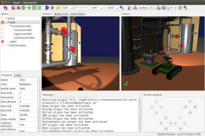
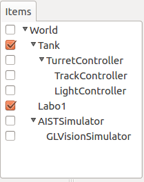
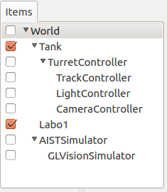

Step 6: Simulating and polling camera images
===================================================

The Tank model comes equipped with a camera. In Step 6, we will learn how to simulate this camera and poll camera images from the controller.

.. contents:: 
   :local:
   :depth: 2

.. highlight:: C++
   :linenothreshold: 7

The project we created in Step 5 contained a variety of visual elements. This step picks up that project in the state we last left it. First, save the project anew as Step6.cnoid before you begin.

Camera devices
----------------------

As with the light we used in Step 5, cameras are also defined as devices in Choreonoid. The camera installed on the Tank model is called “Camera.” This name is used to distinguish it from other devices. Access from the controller is the same as other devices, such as the light.

You can refer to the remarks on  :ref:`modelfile-tank-camera` in the section on :doc:`creating a Tank model <../../handling-models/modelfile/modelfile-newformat>` to see how the camera is actually defined.

Changing cameras in the Scene View
----------------------------------------------

The Scene View also allows for you to display the point of view of the camera onboard the robot model. Use this functionality to see what sort of images are obtained from the camera installed on the Tank model.

You can toggle the camera using the Camera Selection combo box on the Scene Bar below.

.. image:: images/scenebar-camera.png

Clicking here will display a list of the cameras defined by the system, as well as those contained in models displayed on the scene. The current project should display the below choices.

* Perspective - System
* Orthographic - System
* Camera - Tank

Perspective - System and Orthographic - System are the default cameras provided in the Scene View; they allow the user to change the viewpoint using the mouse. These cameras respectively render using perspective projection and orthographic projection. By default, perspective is selected.

“Camera - Tank” indicates that there is a camera named “Camera” installed on the Tank model. We want to see the scene from the perspective of this camera, so select it. While the outcome will vary based on the orientation of the Tank model and the render settings of the Scene View, you should see an image like the below on the Scene View.

.. image:: images/sceneview-tankcameraview.png

Launch the simulation and try operating the Tank model with the gamepad. You should see that the image now moves in sequence with the movement of the Tank and gun turret. This video is sourced from the camera onboard the Tank model.

Simulations will also let you simultaneously display a camera image like this one and an overhead view of the original Scene View. Choreonoid allows for doing this by adding and enabling the display of a Scene View. Let’s give it a try now.

From the Main Menu, select View, then Generate View, then Scene. This will bring up the Generate Scene View dialog. You can set a name for the View you intend to add, but if there is no particular need for a unique name, you can use the default. Clicking the Generate button will generate an additional Scene View and position it on top of the main window.

The location where a view is generated is determined in advance for each view type. The new Scene View will likely appear to overlap where the prior Scene View was. You can manipulate the tabs to toggle between the current and former view, but this prevents you from seeing them simultaneously. For simultaneous display, carry out the steps described in the section on :ref:`basics_view_move` and move the newly-added view to a different part of the main window.

Once you have succeeded in moving the view, toggle the camera to be used for rendering. The respective Scene View cameras can be toggled independently of each other. In this case, the scene bar control is applied to the Scene View last in focus. First click the mouse within or otherwise gain control of the previous Scene View to put it in focus, then select Perspective - System from the camera combo bar on the scene bar. Next, focus on the newly-added Scene View and select Camera - Tank from the camera selection combo box. You can now tweak the view positions and sizes to get the right fit. This lets you get a display like, for example, the one below.

We arrange the new Scene View on the left side and then display the Tank model’s camera image there. On the Scene View on the right side, we display an overhead view from the default camera.

Simulating camera images
----------------------------

We have learned how to use the Scene View to display camera images. However, this is limited to rendering in the GUI; this functionality is separate from the simulation functionality. You should have seen that this allows you to render camera images even without launching the simulation itself. To obtain camera images from the controller while running a simulation, you must run a camera image simulation as a device.

To do so, you must add a GL Vision Simulator Item to your project. From the Main Menu, click File > New > then GL Vision Simulator to generate an item. Position it as a sub-item of the simulator item. The item layout should be as below.

Running a simulation in this state will simulate camera images being taken within the simulator, letting you poll them from the controller.

For details on the GL Vision Simulator Item, see the section on  :doc:`../vision-simulation` .

Controller source code 
--------------------------

We have learned how to simulate camera images by incorporating the GL Vision Simulator item into our project. To check the output, you need a controller to poll images from the camera device. Here we create a controller designed to export images polled from the devices as files to the local system. The source code follows: ::

 #include <cnoid/SimpleController>
 #include <cnoid/Camera>
 #include <cnoid/Joystick>
 
 using namespace cnoid;
 
 class CameraController : public SimpleController
 {
     Camera* camera;
     Joystick joystick;
     bool prevButtonState;
     std::ostream* os;
     
 public:
     virtual bool initialize(SimpleControllerIO* io)
     {
         camera = io->body()->findDevice<Camera>("Camera");
         io->enableInput(camera);
         prevButtonState = false;
         os = &io->os();
         return true;
     }
 
     virtual bool control()
     {
         joystick.readCurrentState();
 
         bool currentState = joystick.getButtonState(1);
         if(currentState && !prevButtonState){
             const Image& image = camera->constImage();
             if(!image.empty()){
                 std::string filename = camera->name() + ".png";
                 camera->constImage().save(filename);
                 (*os) << "The image of " << camera->name()
                       << " has been saved to \"" << filename << "\"."
                       << std::endl;
             }
         }
         prevButtonState = currentState;
 
         return true;
     }
 };
 
 CNOID_IMPLEMENT_SIMPLE_CONTROLLER_FACTORY(CameraController)

As before, save the above source code in the project directory as a file named CameraController.cpp.

Add the below to CMakeLists.txt and compile: ::

 add_cnoid_simple_controller(TankTutorial_CameraController CameraController.cpp)

.

Deploying the controller
----------------------------

As before, you can use the SimpleController item to implement the controller you created in your project and position it as a sub-item of the TurretController. This will cause the Item Tree View to be as follows.

Polling and displaying camera images
------------------------------------------

Now, let’s go ahead and run a simulation.

Using the B button on a gamepad or in the virtual joystick view, you can control the camera. (On a PlayStation controller, this corresponds to the circle button.) Pressing this will save an image of the current camera view to a file. The Message View will display the following message: ::

 The image of Camera has been saved to "Camera.png".

The file export destination will be the current directory, and the file will be named Camera.png.

Try clicking the button and then opening the image file in your preferred image viewer. In Ubuntu, you can use the “eog” image viewer. It is opened by invoking the below on the command line: ::

 eog Camera.png

This lets you view the camera image you created.

eog includes functionality to auto-update the displayed image if the image file is updated. This lets you keep the file open in eog and see the results each time it is changed.

How this implementation works
---------------------------------

As with the light discussed in Step 5, using the below initialize function: ::

 camera = io->body()->findDevice<Camera>("Camera");

lets you poll the Device object for Camera and store this as a camera variable.

Also, using ::

 io->enableInput(camera);

enables input from the device. The above notation is required if you want to enable device input.

.. note:: For device output, as discussed in Step 5, you must invoke notifyStateChange() against the device. Therefore, there is no function like enableOutput() against the device.

The control function is used to check the state of the B button and, when it is pushed, save a file from the Camera device. In this process, the line below: ::

 const Image& image = camera->constImage();

polls the image data the Camera has. Provided this value is not empty, the below: ::

 camera->constImage().save(filename);

will save the image file as-is.

In the actual controller, image processing could be performed against the image data, or the image data obtained could be forwarded to another device remotely, among other potential applications.
