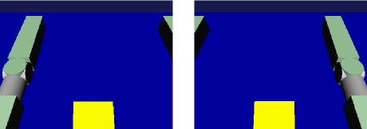

Simulation of Visual Sensor
===============================

.. sectionauthor:: 中岡 慎一郎 <s.nakaoka@aist.go.jp>

.. contents::
   :local:

.. highlight:: cpp

Visual Sensor
-----------------

The following device types are defined in Choreonoid for visual sensors:

* Camera
* RangeCamera
* RangeSensor

Camera is a device that corresponds to a video camera. It retrieves two-dimensional image data continuously at a constant frame rate.

RangeCamera is an extended camera and retrieves, in addition to two-dimensional image, the corresponding two-dimensional distance image. An example of this type of sensor is Kinect.

RangeSensor is a device assuming a three-dimensional measurement device using laser. Normally, it outputs one-dimensional distance data equivalent to one line measurement, but is capable of outputting two-dimensional distance image like RangeCamera.

These visual sensors are common sensors that are mounted in a robot and have a great demand for simulations. How to simulate these sensors in Choreonoid is explained below:

Addition of Visual Sensor
----------------------------

To use a visual sensor, the sensor that you want to use in the body model must be defined as a device.

In a model file in OpenHRP format, the sensor should be described according the specification of  :ref:`oepnrhp_modelfile_sensors` . The correspondence between the different sensors and the nodes in the model file is as follows:

.. list-table::
 :widths: 45,55
 :header-rows: 1

 * - Device type in body model
   - Node type in OpeHRP model file
 * - Camera
   - VisionSensor (with the type being COLOR")
 * - RangeCamra
   - VisionSensor (with the type being COLOR_DEPTH")
 * - RangeSensor
   - RangeSensor

.. _simulation-gl-vision-simulator:

GL Vision SImulator
----------------------

The simulation function of the visual sensor is normally implemented as a sub-simulator and used in communication with a simulator item. Actually, as a sub-simulator having this function, "GL vision simulator" is available as standard. It creates data of a visual sensor using the same rendering engine as the one used to render on the scene view. As the rendering engine is implemented using OpenGL, it has the name GL.

A sub-simulator functions by allocating it as a sib-item of a simulator item. As GL vision simulator can be created by "File" under Main Menu - "New" - "GL vision simulator", allocate it as a sub-item of the target simulator item.

By doing so, the simulation of the visual sensor can be performed to the virtual world that the simulator item is targeting. In concrete terms, the image of Camera device and the distance image data of RangeCamera and RangeSensor can be updated at the frame rate configured to the device.

Congofiration Items of GL Vision Simulator
------------------------------------------------

The basic configuration for simulation of a visual sensor is as described above, but the detailed part can be configured by the properties of GL vision simulator. The content of the different properties related to the configuration is as follows:

.. tabularcolumns:: |p{3.5cm}|p{11.5cm}|

.. list-table::
 :widths: 25,75
 :header-rows: 1

 * - Property
   - Meaning
 * - Target body
   - It specifies the body model that becomes the target of the visual sensor. More than one body models can be specified by delimiting with a comma. If nothing is specified, all the models become the target. This item should be configured only when limiting the body model of the simulation target. By limiting the target model, the simulation speed may improve.
 * - Target sensor
   - The visual sensor subject to simulation is specified by name. More than one visual sensor can be specified by delimiting with a comma. This item should be configured only when limiting the body model of the simulation target.
 * - Maximum frame rate
   - The frame rate specified here will be the maximum for all the sensors regardless of the specification value of the sensor. This item should be configured in case you want to improve the simulation speed by decreasing the frame rate.
 * - Maximum latency
   - The maximum value is set for the time (latency) from the time when the sensor starts measurement till the result can be output as data. For all the sensors, data can be output if this time is elapsed regardless of the specification of the sensor. Decreasing this value may make a simulation slower.
 * - Recording of Vision Data
   - It configures whether or not to include the data obtained by the visual sensor, such as camera image and distance data in :ref:`simulation-device-state-recording` in :ref:`simulation-result-recording` . The size of these data is generally big and recording them just for a short time consumes memory. So, they should usually not included.
 * - Use Thread
   - It configures whether or not to use a dedicated thread for simulation of the visual sensor. Using a dedicated thread can improve the simulation speed, so it should usually be set to true.
 * - Sensor Individual Thread
   - It configures whether or not to allocate a dedicated thread to each sensor when multiple visual sensors are simulated. This item becomes valid when "Use Thread" is set to true. It should usually be true, but setting it to false may improve the simulation speed depending on the number of the sensors and the video driver.
 * - Best Effort
   - A visual sensor is configured with a frame rate and data are updated at the interval of that frame rate. If Best Effort is set to true, data update may not be in time for the frame rate. The actual interval depends on the internal data creation process in the simulator. If it is set to false, on the contrary, data will be updated according to the frame rate configured. However, as it is necessary to wait for the completion of the data creation process even if it is not completed in time, the simulation speed can become slower. Therefore, if you prioritise improvement of the simulation speed over keeping of the frame rate, this item should be set to true.
 * - All Scene Objects
   - 	Objects that can be displayed as 3DCG are called "Scene objects". Items that are displayed in Item Tree View by checking are "Scene objects". This item configures whether or not to include scene objects other than body items in the virtual world seen by the visual sensor. An example of a scene object other than a body item is a scene item. It does not influence on the dynamic behaviour in the simulation but can be used as an appearance element of a virtual world.
 * - Range Sensor Accuracy Coefficient
   - The distance data of a range sensor is created using the depth buffer of OpenGL. This item configures the resolution of the depth buffer to the resolution of the distance sensor. The higher the value, the more accurate the distance data.
 * - Depth Error
   - It adds a certain offset to the distance data of the range sensor. Please refrain from using this item proactively as it is still in the experimental stage.
 * - Head Light
   - "Head light" is the light source that always beams the light to the visual line direction from the view point and this item configures whether or not to enable this light source in creating a camera image.
 * - Additional Light
   - "Additional light" is the light source that is included in a body model and this item configures whether or not to enable this light source in creating a camera image. It should be set to true if you want to make simulation of the light.

By default, simulation of a visual sensor works properly, so the above items may be configured depending on the necessity.

Utilisation of Sensor Information
-------------------------------------

Image data and distance data that are simulated are stored as data of the corresponding Device object internally in the simulator. By retrieving these data in a certain way, the sensor data can be utilised.

It is usually the controller of the robot that actually utilises the sensor information. For the controller, each controller item specifies the access method to the device. So, get the data for the visual sensor according to this method. This is similar to other sensors like a force sensor, a rate gyro and an acceleration sensor. Refer to the manual, etc. of each controller item for the actual access method.

Example of Utilisation of Visual Sensor
------------------------------------------

As an example of utilising a visual sensor, we introduce below a sample where the camera of the robot is accessed from the controller and its image data is output to a file.

Preparation of Robot Model
~~~~~~~~~~~~~~~~~~~~~~~~~~~~~~

Prepare a robot model that has a Camera device. Any robot model having a camera can be used, but let's use SR1 model in this sample.

In SR1 model, the visual sensor is defined as follows in its model file "SR1.wr1". ::

 DEF LeftCamera VisionSensor {
   translation       0.15 0.05 0.15
   rotation          0.4472 -0.4472 -0.7746 1.8235
   name              "LeftCamera"
   type              "COLOR"
   sensorId          0
   ...
 }
 
 DEF RightCamera VisionSensor {
   translation   0.15 -0.05 0.15
   rotation      0.4472 -0.4472 -0.7746 1.8235
   name          "RightCamera"
   type          "COLOR"
   sensorId      1
   ...
 }

The above defines that SR1 model has two RangeCamera-type devices, which are "LeftCamera" and "RightCamera". RangeCamera type can be handled as Camera type as it inherits Camera type.

Creation of Simulation Project
~~~~~~~~~~~~~~~~~~~~~~~~~~~~~~~~~~

Next, let's create a simulation project targeting this model. Anything will do, but let's use "SR1Liftup.cnoid", one of SR1 sample projects, as the base.

When the project is loaded, select "File" under Main Menu then "New" and "GL Vision Simulator" and create a GL vision simulator item. The default name is "GLVisionSimulator". Allocate it in Item Tree View as follows:

| + World
|   + SR1
|     + SR1LiftupController
|   + box2
|   + Floor
|   + AISTSimulator
|     + **GLVisionSimulator**

In this way, allocate the GL vision simulator item as a sub-item of the simulator item. By doing so, the visual sensor simulation function is enabled by the GL vision simulator. With this configuration, image data of the corresponding Device object will be updated for the two cameras of SR1 model: "LeftCamera" and "RightCamera".

Sample Controller
~~~~~~~~~~~~~~~~~~~~~~~

As a sample of the controller accessing the camera image, let's use "CameraSampleController". This controller lists the Camera devices that the robot has and then outputs their image data to a file every second.

.. note:: The source of this controller is "sample/SimpleController/CameraSampleController.cpp". If other samples of SimpleController are built, this sample must have been built, too.

Add this controller to the project. Create a "simple controller" item as in the examples of :ref:`simulation-create-controller-item` , :ref:`simulation-set-controller-to-controller-item` and allocate it as follows:

| + World
|   + SR1
|     + SR1LiftupController
|       + **CameraSampleController**
|   + box2
|   + Floor
|   + AISTSimulator
|     + GLVisionSimulator

The name of the controller item added is "CameraSampleController" in this example.

Note that this item is allocated as a sub-item of "SR1LiftupController". By doing so, two controllers can be motioned in combination. CameraSampleController is a sample specialised for the use of a camera. With this sample only, the robot would fall, so it is used in combination in this way. The part of SR1LiftupController can be replaced with any given controller that controls the body of the robot.

.. note:: It is the function unique to a simple controller item that makes motion the nested controller items in combination in this way. By adding a child or a grand child to the base controller item, it is possible to combine any given number of controllers. Internally, the control functions of those controllers are executed in the order of tree search (depth prioritised) and the inputs/outputs between them are consolidated, too.

.. note::  It is also possible to execute multiple controller items in combination by allocating them directly under a body item in parallel. This method supports the controller item type. However, be careful that inputs/outputs may not be consolidated well as they are performed by each controller independently.

Next, describe the property of the added controller item as CameraSampleController" and set the controller itself.

Execution of Simulation
~~~~~~~~~~~~~~~~~~~~~~~~~~~

Start simulation with the above setting: Then, the following message will be displayed first: ::

 Sensor type: RangeCamera, id: 0, name: LeftCamera
 Sensor type: RangeCamera, id: 1, name: RightCamera

It is a list of Camera devices that the target model has and the actual type, the device id and the name of each are listed.

Then, during the simulation the following information is displayed: ::

 The image of LeftCamera has been saved to "LeftCamera.png".
 The image of RightCamera has been saved to "RightCamera.png".

and the camera image of each is stored as a file. The storage destination is the current directory where Choreonoid is started up and the name is "sensor name.png" This information is updated every second in the latest image.

Display the stored image in an image viewer. The images to be stored are simulated camera images that correspond to the robot's right eye and the left eye. Examples of the images are shown below:

We can see that the camera images are successfully simulated and are retrieved by the controller.

.. note:: Some image viewers are equipped with the function that automatically detects a file update and updates the display. For example, "Eye of GNOME (eog)", which is the default image viewer of Ubuntu, has such a function, too. If such a viewer is used, you can check how the camera image is updated as the simulation goes on.

As the target sensor this time is RangeCamera, distance image data are generated in addition to the normal image data. The distance image data are also accessible just like the normal image data. So, you can try and modify the sample controller if that interests you.

Implemented Content of Sample Controller
---------------------------------------------

The source code of CameraSampleController is as follows: ::

 #include <cnoid/SimpleController>
 #include <cnoid/Camera>

 using namespace cnoid;

 class CameraSampleController : public SimpleController
 {
     DeviceList<Camera> cameras;
     double timeCounter;
     
 public:
     virtual bool initialize()
     {
         cameras << ioBody()->devices();

         for(size_t i=0; i < cameras.size(); ++i){
             Device* camera = cameras[i];
             os() << "Device type: " << camera->typeName()
                  << ", id: " << camera->id()
                  << ", name: " << camera->name() << std::endl;
         }
         
         timeCounter = 0.0;
         
         return true;
     }

     virtual bool control()
     {
         timeCounter += timeStep();
         if(timeCounter >= 1.0){
             for(size_t i=0; i < cameras.size(); ++i){
                 Camera* camera = cameras[i];
                 std::string filename = camera->name() + ".png";
                 camera->constImage().save(filename);
                 os() << "The image of " << camera->name() << " has been saved to \"" << filename << "\"." << std::endl;
             }
             timeCounter = 0.0;
         }
         return false;
     }
 };

 CNOID_IMPLEMENT_SIMPLE_CONTROLLER_FACTORY(CameraSampleController)

As for the use of Camera device: ::

 #include <cnoid/Camera>

Import the definition of Camera class by typing as above: ::

 DeviceList<Camera> cameras;

Type as follows: ::

 cameras << ioBody()->devices();

and all Camera devices that the robot model has are obtained. As RangeCamera type inherits Camera type, if the model has RangeCamera type, then it will also be obtained.

For Camera device obtained as above, its information is output in initialize() function to the message view and the image data of the camera is output by ::

 camera->constImage().save(filename);

in control() function to the file. In this sample, we don't edit the image data obtained, so constImage() function is used.

That's all about the part related to Camera device. As many of the other parts are common to  :doc:`howto-implement-controller`, please refer to the description there.

