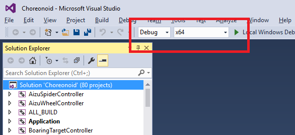
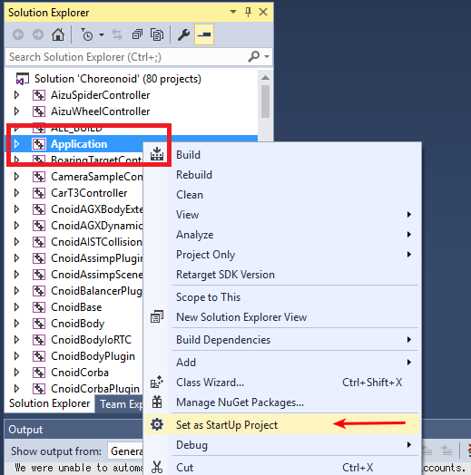
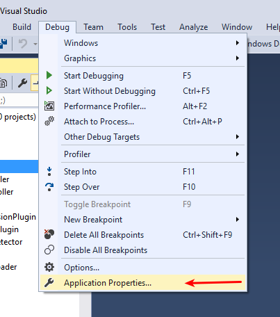
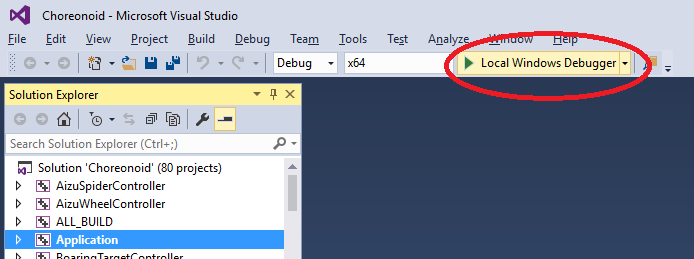
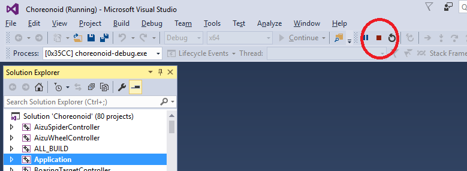
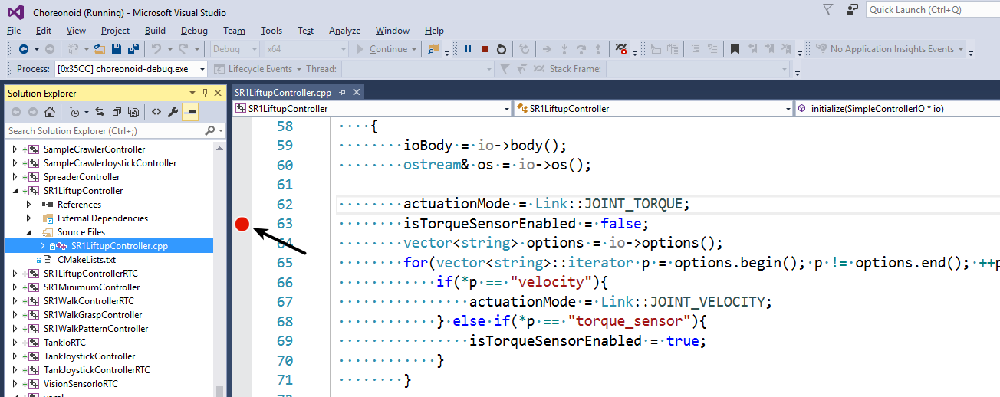
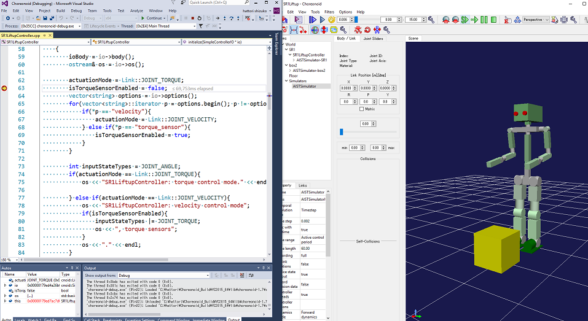

Debugging Choreonoid with Visual Studio
=======================================

We will explain how to debug the Choreonoid program using Visual Studio.

.. contents:: 
   :local:
   :depth: 1

Build for debugging
-------------------

Launch Visual Studio and load the Choreonoid solution file.

   
Set the fields outlined in red to **Debug** and **x64**. Build and install using the same operation as in the :ref:`build-windows-visualstudio` section.

Debugging settings
------------------

Display Solution Explorer and select **Application**. Right-click and select **Set as Startup Project** from the menu that appears.

Application will be displayed in bold.

From the menu, select **Debug** - **Application Properties...** to open the Properties page.

.. image:: images/VCdebug4.png
   :scale: 80

Select **Debugging** from Configuration Properties, click the Command column, then click the button that will be displayed on the right to show the menu as in the figure. Here, select **<Browse...>**.

A dialog box for file selection opens, so choose **choreonoid-debug.exe** located in the choreonoid installation location. Of course you can enter it directly into the blank field without using the file selection dialog box.

If you enter it in the command argument field, you can pass an argument to Choreonoid.

Click the OK button to finish.

Launching and quitting the debugger
-----------------------------------

Click the **Local Windows Debugger** circled in red in the figure.

   
Choreonoid will launch.

Click the square icon circled in the figure.

   
Choreonoid will quit. You can also quit using the Chorenoid menu.

Debugging a sample
------------------

Next, let’s try debugging a sample program.

In **Solution Explorer**, expand the **SR1LiftupController** project and double-click **SR1LiftupController.cpp**.

The program will be displayed as shown in the figure. To the left of the line where you want to set a breakpoint, click on the figure.

A red circle displays that a breakpoint has been set.

In this state, click **Local Windows Debugger** to launch Choreonoid.

When Choreonoid starts up, open the SR1Liftup.cnoid project and execute the simulation.

The program will stop at the line where the breakpoint was set earlier.

If the Visual Studio window is hidden under the Choreonoid window, bring it to the front.

By clicking the **F10 key**, you can execute programs one by one.

Or with the **F11 key**, you can jump into a function.

You can also view and set the details of variables when it is stopped at a breakpoint.

For more details, refer to Visual Studio help.
