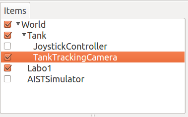
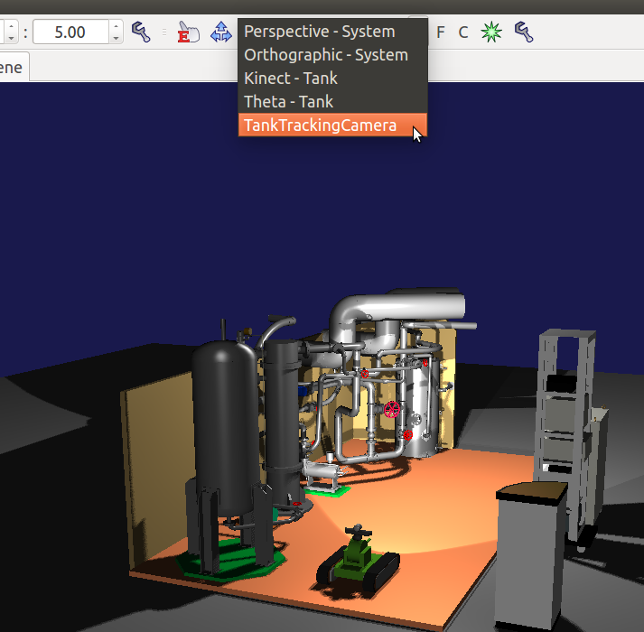
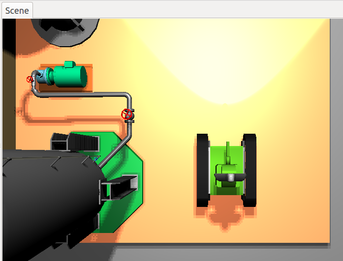
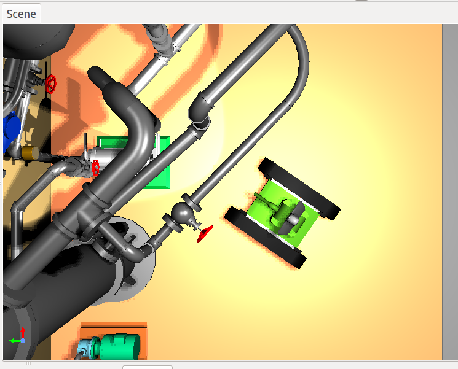
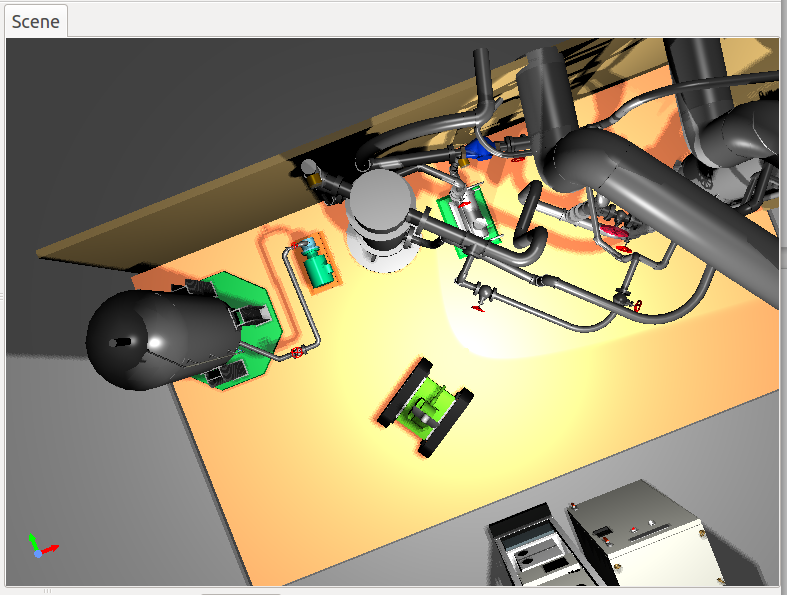

How to use the body tracking camera
===================================

The body tracking camera is a camera that moves together with the motion of the robot. When you select this camera for rendering the scene view during simulation, the camera moves according to the movement of the robot, so it will show you a display that follows the robot. Here, we will explain how to use this camera.

Creating a body tracking camera item
------------------------------------

From the menu, select **File** - **New** - **BodyTrackingCamera** to create BodyTrackingCameraItem and place BodyTrakingCameraItem as a small item of the BodyItem of the robot you want to follow. Name the item so that it can be distinguished from other cameras. Also, put a check mark next to the item.

Selecting a body tracking camera
--------------------------------

When you check an item, the camera with the name you attached earlier will be displayed in **Rendering camera selection combo** in the scene bar, so select it. For details on selecting the camera in the scene view, see the  :ref:`basics_sceneview_change_camera` section.

The camera in the scene view has probably been switched. Adjust the viewpoint using the mouse. For example, let's move the viewpoint directly above the robot as shown in the following figure. For details on how to adjust the viewpoint, please see the   :ref:`basics_sceneview_viewpoint`  section.

Launch the simulation. Even when the robot moves, it is displayed as if you are watching from directly above the robot.

If **Keep relative attitude** is set to **true** in the BodyTrackingCameraItem property, in addition to the relative position of the viewpoint with regard to the robot, it is also displayed so as to keep the posture constant.

Properties
----------

The properties unique to BodyTrackingCameraItem are as follows:

.. tabularcolumns:: |p{3.5cm}|p{11.5cm}|

.. list-table::
 :widths: 25,75
 :header-rows: 1

 * - Property
   - Detail
 * - Name
   - This is the name of the item. It is also used for the camera name.
 * - Keep relative attitude
   - When set to True, the relative posture of the robot and the camera is kept constant.
 * - Camera type
   - Select whether the camera type is Perspective or Orthographic.
 * - Near clip distance
   - Sets the rendering range. Objects closer than this value as seen from the viewpoint are not displayed.
 * - Far clip distance
   - Sets the rendering range. Objects further than this value as seen from the viewpoint are not displayed.
 * - field Of View
   - Sets the viewing angle of the Perspective camera.
