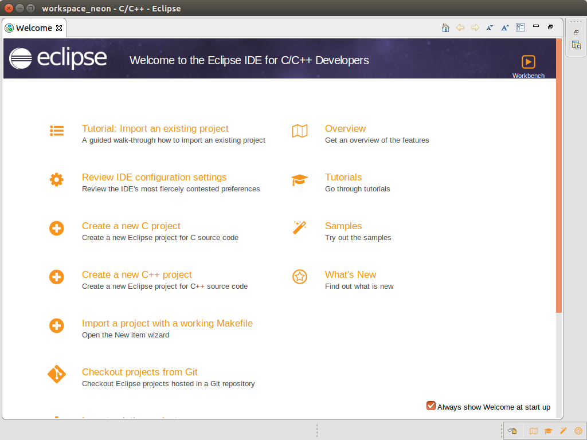
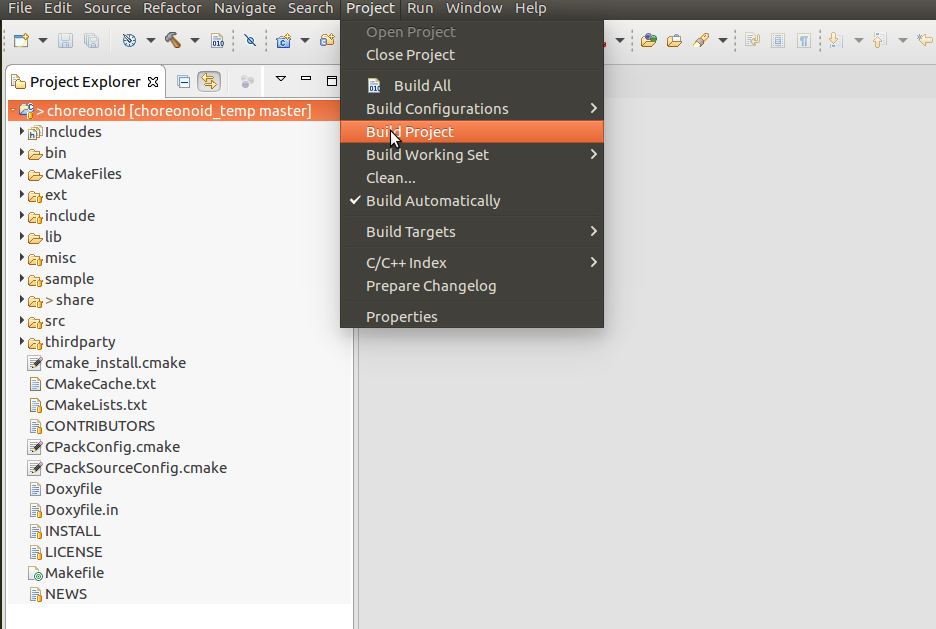

Debugging Choreonoid with Eclipse
===========================================

Here we describe how to use Eclipse to debug Choreonoid programs. There are various ways of creating Eclipse project files; herein, we describe how to use an existing Makefile. Note that there are many versions of Eclipse and it contains many features, so you are not required to use these instructions.

.. contents:: 
   :local:
   :depth: 1

Preparing
---------------

In order to create a Makefile for debugging purposes, execute the command below in the Choreonoid root directory. ::

 ccmake .

Change **CMAKE_BUILD_TYPE** to **Debug**, then **configure** and **generate**.

.. note:: when specifying the build directory described on the :doc:`installation page <../../install/build-ubuntu>`, Eclipse is unable to recognize the source files, so run these commands in the root directory.

If you have already run make in the root directory run: ::

 make clean
 
This will delete content built when in Release mode.

Installing Eclipse
---------------------------------

If you already have Eclipse installed, you can continue using it as-is.

In this section, we describe how to install Eclipse Neon on the 64-bit edition of Ubuntu. 

First, access the `Eclipse web site <https://www.eclipse.org/>`_ and, from the download page, click **Download** in the **Get Eclipse Neon** section, then download **eclipse-inst-linux64.tar.gz**. Open the file in a directory of your choice and run **eclipse-inst**.

.. image:: images/Installer.png
   :scale: 50

Select **Eclipse IDE for C/C++ Developers** to proceed to the next section.

Enter an install destination of your choice and start the installation process.

Then, simply follow the prompts the installer gives you.

When finished, launch **eclipse** from its install location. Specify a workspace. You can also use the default workspace.

You will see the menu pictured above. If this is your first time using the tool, the Tutorial and Samples will be of use to you.

Next, close the **Welcome** tag and proceed.

Remove the checkmark next to **Always Show…** to prevent this window from showing next time you launch the program.

Creating a project
----------------------

When you close the tag above, the C/C++ Perspective will open.

If it does not, open the menu and select **Window > Perspective > Open Perspective > C/C++**.

Then, select **File > New > MakeFile Project with Existing Code**.

.. image:: images/NewProject1.png
   :scale: 70

When the dialog opens, follow the image below to enter a Project Name and specify the Choreonoid root directory.

.. image:: images/NewProject2.png
   :scale: 70

A new project named **choreonoid** will be created in the **Project Explorer**. Select this project and then, from the menu, **Project > Build Project**.

A message will appear in the console and then conclude.

.. image:: images/Build2.png
   :scale: 80

If an error occurs when building, it will also be displayed here.

Launching a program
-----------------------------

First, launch Choreonoid without configuring any further settings.

Open the **bin** folder in **Project Explorer** to find **choreonoid** displayed with a bug icon.

Select this, right-click, and from the pop-up menu, select **Run As > Local C/C++ Application**.

.. image:: images/Run.png
   :scale: 70

Choreonoid will now run. Select a project and attempt to run a simulation.

The program is running in debug mode, so it will be very slow to respond. Once you confirm its functionality, close Choreonoid and return to the previous window.

As shown in the figure, clicking on the triangle to the right of the bug icon in the toolbar will confirm that choreonoid is saved as an entry.

You can now launch Choreonoid in the future by clicking on the bug icon.

.. image:: images/Debug.png
   :scale: 80

Debugging the sample program
----------------------------------

Next, we will debug a sample program.

From the **Project Explorer**, open the **sample > SimpleController** folder and double-click on **SR1LiftupController.cpp**.

.. image:: images/Source.png
   :scale: 70

As seen in the figure, the program code will be displayed. As shown in the figure, double-click on the line where you want to add a breakpoint.

The green circle indicates that a breakpoint has been set.

.. image:: images/BreakPoint.png

You can now click the bug icon in the toolbar and launch Choreonoid.

.. image:: images/Confirm.png
   :scale: 80
   
When a message like that seen in the figure appears, click Yes to open the debugging perspective.

After switching to the debugging perspective, the program will have halted at the first line. (Changing this behavior is described in a later section.)

To proceed, you can click the green triangle icon as shown in the figure, or press F8.

.. image:: images/Resume.png
   :scale: 70

When Choreonoid launches, the SR1Liftup.cnoid project will open and launch the simulation.

The program will stop at the breakpoint specified previously.

If the Eclipse window is hidden behind the Choreonoid window, bring it to the front.

You can click the icon shown in the figure or press **F6** to launch each program one line at a time.

.. image:: images/Step.png
   :scale: 70

Click the left and right icons or toggle between **F5** and **F7** to jump between functions and break out. You can conclude by clicking the red square icon.

You can check and configure the variables that apply when stopped at a breakpoint in the Variables section, as shown in the figure.

.. image:: images/Variables.png
   :scale: 70

.. note:: Note: If the controller thread for the AISTSimulator properties is set to true, Choreonoid may freeze when starting a simulation. If this occurs, switch the setting to false and debug the behavior.

Configuring the program to continue past the first line
-----------------------------------------------------------

Select **Window > Preferences** from the menu to open the settings screen.

From the list at the left, select **C/C++ > Debug > GDB** to switch screens, and then remove the checkmark from **Stop on startup at:**

**Apply** these changes to conclude.

