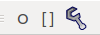
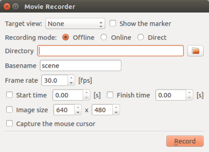
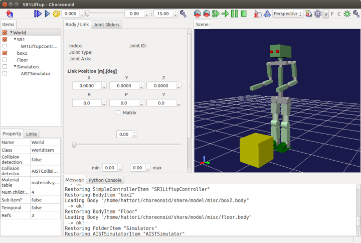
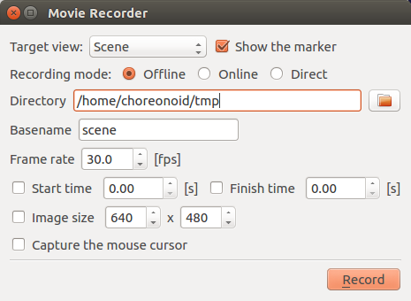
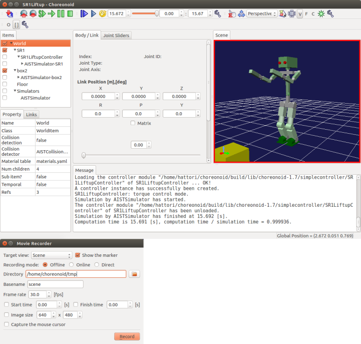
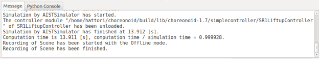
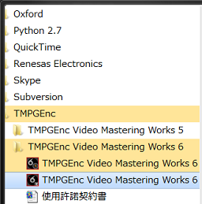
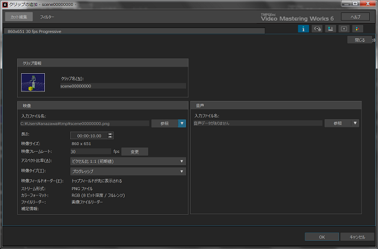

Creating videos from sequential image files
===============================================

Here we discuss how to create video files depicting control of the Choreonoid interface. While it is not possible to directly generate a video file of the Choreonoid window, you can export sequential still images and then use a video encoder to convert these into a video file. Below, we discuss how to use FFmpeg on Ubuntu and TMPGEnc on Windows to convert these files. We describe examples using FFmpeg and TMPGEnc, but you are free to use other conversion software of your choice. Note that TMPGEnc is commercial software that requires purchasing.

.. contents::
   :local:

Displaying the video recorder bar
--------------------------------------

From the Choreonoid menu, select View > Show Toolbar > Video Recorder Bar to display the video recorder bar as seen in the image.

Recording with the video recorder
-------------------------------------

Clicking the wrench icon on the Video Recorder Bar will spawn the Video Recorder window.

Fill in the fields below to enable recording.

.. list-table::
  :widths: 20, 80
  :header-rows: 1

  * - Item
    - Details
  * - Target view
    - Select the view to record.
  * - Display markers
    - Enables markers for the currently selected view.
  * - Recording modes
    - | Offline: after the simulation, clicking the Record button records the results of the simulation.
      | Online: clicking the Record button triggers a wait mode; when the simulation begins, recording begins. Once the simulation concludes, recording ends.
      | Direct: clicking the Record button immediately initiates recording. Clicking the Record button again stops recording. *You can also record if a simulation is not in progress.
  * - Directory
    - The directory in which to output sequential images.
  * - Base filename
    - The base filename to used for output. *Filenames are output in the format of basefilename + 8 digit sequential number + .png.
  * - Framerate
    - The number of frames per second. By default, this is set to 30fps.
  * - Start/stop time
    - Recording begins at the start time you set, and recording ends at the end time you set.
  * - Image size
    - Sets the image size. By default, 640x480.
  * - Capture mouse cursor
    - Captures the onscreen mouse cursor.

View recording
----------------

Launch Choreonoid and import the desired project. In this case, we will import SR1LiftUp.cnoid.

From the Choreonoid menu, select View > Show Toolbar > Video Recorder Bar to display the video recorder. Next, select the wrench icon on the video recorder bar to display the video recorder. We will set the record target as the Scene View. Set the target view to “Scene,” the recording mode to “Offline,” and the directory to a directory of your choice. Leave the other fields at their default.

Run a simulation to enable animation. Next, click the Record button on the Video Recorder window.

Once a message indicating that recording is complete appears in the Message window, the output of sequential images is complete.

Installing FFmpeg (Ubuntu Linux)
----------------------------------

Issue the below command to install FFmpeg. :: 

 sudo apt-get install ffmpeg

Converting sequential images to video (Ubuntu Linux)
------------------------------------------------------------

Navigate to the directory containing the sequential images and execute the following command. ::

 ffmpeg -r 30 -i scene%08d.png -r 30 movie.mp4

* Use -r <framerate> to change the framerate interval. If not value is set, it will inherit the values of the input file.

* Use -i <filename> to set the input file path.

Installing TMPGEnc (Windows)
-----------------------------------

Open Internet Explorer or another browser and navigate to the URL below.

`http://www.pegasys-inc.com/ja/ <http://www.pegasys-inc.com/ja/>`_
 
From Home, select Products, then Downloads. Then click download for the TMPGEnc Video Mastering Works6 product. Click Download next to the Product Version field, and then click the Agree button to commence the download. Once the download is complete, execute the .exe file to launch the installation process.

Converting sequential images to video (Windows)
-------------------------------------------------------

From the Start Menu, click TMPGEnc > TMPGEnc Video Mastering Works 6.

Once TMPGEnc Video Mastering Works6 launches, click Environment Settings.

.. image:: images/tmpgenc_activation.png

Select Folder Settings > Output File, and set your desired folder path. Conclude by clicking OK.

.. image:: images/tmpgenc_configuration.png

Next, click Start New Project: Normal Mode. Once the Add Wizard window appears, select Add from File.

.. image:: images/tmpgenc_addwizard.png

Select, from the folder containing the sequential images, one image with the smallest sequential number. Once the Add Clip window appears, click the arrow adjacent to the Reference button, accessed via Video > Input File Name.

When you see a list displayed, select Set Image File Reader to Load Sequential Images, and click the OK button.

.. image:: images/tmpgenc_cutediting_list.png

From Encode > Output File Name, change the filename to one of your choice, and click the Begin Export button to create the video.

.. image:: images/tmpgenc_output.png