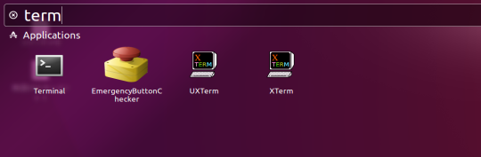
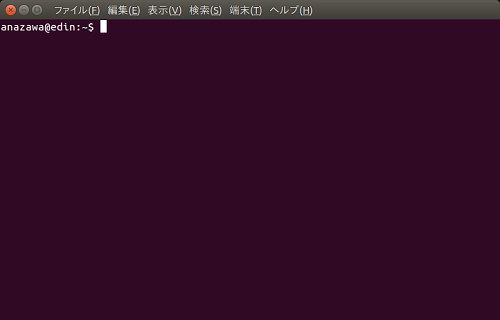
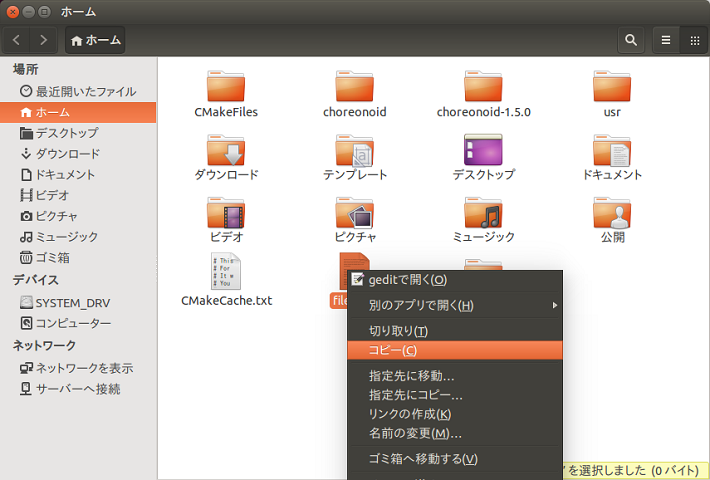
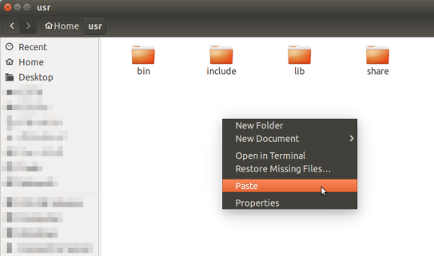
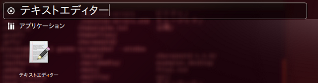
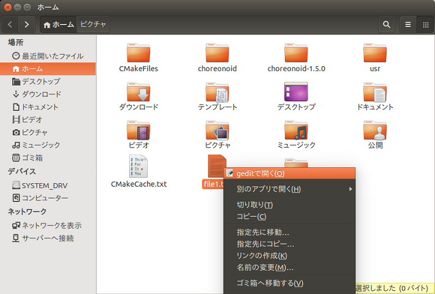

About the basic usage of Linux
==============================

Here we will explain how to launch the terminal and how to use the command line when using the standard Unity desktop environment with Ubuntu Linux 16.04.

.. contents::
   :local:
   
How to launch the terminal
--------------------------

Click **Search your computer** |search_computer| on the launcher displayed on the left of the home screen.

A search box and list of applications, etc. will be displayed, so enter “term” or “terminal” in the search box.

The input result “terminal” will be displayed, so when you click “terminal”, this will launch the “terminal”.

Basic command usage and how to launch Choreonoid
------------------------------------------------

This section explains how to use the minimum commands used in this manual and how to launch Choreonoid.

.. list-table::
  :widths: 20, 80
  :header-rows: 1

  * - Command
    - Details
  * - cd
    - | cd is an abbreviation of “change directory” and this command changes the current working directory.
      | You can move to the specified directory with **cd <directory name>**.　*Either the relative path or the absolute path can be specified for <directory name>.
      | Symbols can be included in <directory name>,  and each symbol has a meaning, as follows:
      | /                          … the root directory
      | .                          … the current directory
      | ..                         … the parent directory
      | ~/                         … the home directory
      | no directory specified   … home directory
  * - ls
    - | ls is an abbreviation of “list” and this command displays information on files and directories.
      | **ls [option]** displays file or directory information.　*Specifying the option is optional.
      | For example, if you type ls - l on the command line, it will also display the details of the file, such as file size, at the same time.
  * - pwd
    - pwd is an abbreviation of “print working directory” and this command checks the current directory location.
  * - mkdir
    - | mkdir is an abbreviation of “make directory” and it creates a directory.
      | You can create a directory using **mkdir [option] <creation directory name>**.
  * - cp
    - | cp is an abbreviation of “copy” and this command copies files or directories.
      | You can copy files and directories using **cp [option] <copy source file name/directory name> <copy destination file name/directory name>**.
      | However, when copying directories, you need to specify the -r option.
  * - mv
    - | mv is an abbreviation of “move”, which is a command to move or rename a file or directory.
      | You can move files and directories or change file names using **mv [option] <pre-change file name/directory name> <change file name/directory name>**.
      | To change a file name, you can change the file name from “file1” to “file2” by entering mv file1 file2 on the command line.
      | Also, when moving files, you can move “file2” to the “test” directory directly under the home directory by entering mv file2 ~/test.
  * - rm
    - | rm is an abbreviation of “remove” and this command deletes files or directories.
      | You can delete files or directories specified by **rm [option] Y <file name/directory name>**.
      | However, when deleting a directory, you need to specify the -r option.
      | You can also use wild cards for files or directories to be deleted. By entering rm *.txt on the command line, you can delete all the files in the current directory with the extension txt.
  * - gedit
    - | gedit is a command to launch the standard text editor.
      | gedit supports highlighting in multiple programming languages.
      | For example, we use YAML and C++ in this manual, but by default the highlight setting is turned off and it is hard to see. So, if you select **Display - Highlight Mode** in the gedit menu and select YAML or C++, highlighting becomes possible.
  * - choreonoid
    - | The choreonoid command is used to launch Choreonoid.
      | You can launch Choreonoid using **bin/choreonoid [project name(extension:cnoid)]**.　*Specifying the project name is optional.
      | As a precondition, when launching Choreonoid, you first need to move to the “Choreonoid” directory using the cd command.
      | For example, if the “Choreonoid” directory exists directly below the home directory, you can move to the “Choreonoid” directory by entering **cd ~/Choreonoid**.
      | Once you have moved to the “Choreonoid” directory, you can launch Choreonoid by entering **bin/choreonoid** on the command line.
      | Also, when specifying and starting a project, you can launch the target project by entering **bin/choreonoid share/project/SR1Liftup.cnoid** on the command line.
      | *Here we are launching a project named SR1Liftup, which is a sample.

How to use File Manager
-----------------------

This section explains how to copy files using File Manager and how to open files using a text editor.

.. |file_manager| image:: images/file_manager.png

.. |choreonoid_activation| image:: images/choreonoid_activation.png

- | Click the Files |file_manager| launcher displayed on the left of the home screen to launch File Manager.
- | Moving between directories can be done by clicking the directory mark |directory| to move to the target directory.
- | To copy a file or directory, select the file or directory you want to copy, right-click and select **Copy** from the menu that appears. Alternatively, you can select the file or directory you want to copy and copy it with the Ctrl+C keys.
  | |right_menu_copy|
- | To paste the copied file or directory, move to the directory where you want to paste it, right-click and select **Paste** from the menu that appears. Alternatively, you can move to the file or directory where you want to paste and paste it with the Ctrl+V keys.
  | |right_menu_paste|
- | To launch gedit, which is the standard text editor, enter “text editor” from “Search your computer” and click on the displayed text editor to launch it.
  | |gedit_activation|
- | To open a file with gedit, right-click on the file you want to open and select Open With gedit.
  | |gedit_open|
- | You can launch Choreonoid by double clicking on choreonoid under the choreonoid/bin/ directory.
  | |choreonoid_activation|
