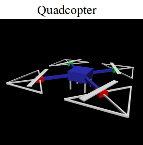
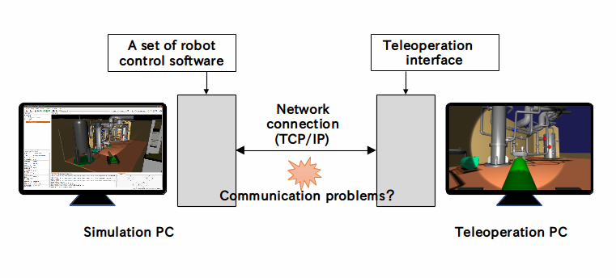

Competition overview
====================

Here we’ll introduce an overview of the WRS2018 robotics competition “Tunnel Disaster Response and Recovery Challenge”.

.. contents::
   :local:

Event information
-----------------

This competition is based on the assumption that a disaster or accident has occurred in a tunnel, and robots compete using their ability to perform the tasks required in such a situation. The competition consists of a total of six tasks, and the robots perform the tasks in the virtual environment simulated on a computer.

The details of the event were as follows.

* Date: October 17th (Wed) to 21st (Sun), 2018
* Venue: Tokyo Big Sight
* Participation format: applicants form teams and submit application documents. Participation is free of charge. Participation is possible once application documents have been approved.
* Number of participating teams: 8
* `Prize money: <http://worldrobotsummit.org/download/guideline/prize_money_for_the_wrc2018_en.pdf>`_ : 1st = 10 million yen; 2nd = 3 million yen; 3rd = 1 million yen
* Official website information page: http://worldrobotsummit.org/en/wrc2018/disaster/

.. note:: WRS competitions are scheduled to also be held in 2020. It is expected that the same simulation competition will be held as in the 2018 event, and applications will once again be accepted for participating teams. So, if you are interested, please consider taking his opportunity to take part.

.. _wrs2018_overview_rules:

Competition rules
-----------------

The rules of the competition are summarized in the document below.

* `Official English version <http://worldrobotsummit.org/download/rulebook-en/rulebook-Tunnel_Disaster_Response_and_Recovery_Challenge.pdf>`_ 
* `Japanese version for reference <http://worldrobotsummit.org/download/detailed-rules/detailed-rules-tunnel-disaster-response-and-recovery-challenge-ja.pdf>`_

.. _wrs2018_overview_simulator:

Simulator used
--------------

Information about the simulator used in this competition is summarized below.

* Simulator: software: Choreonoid
* Choreonoid version: uses the development version. The version actually used has the `wrs2018 tag attached <https://github.com/s-nakaoka/choreonoid/tree/wrs2018>`_ .
* OS: Ubuntu Linux 16.04 64-bit
* Uses the commercial physics engine AGX Dynamics

The development version of Choreonoid is available from the `Choreonoid repository on GitHub <https://github.com/s-nakaoka/choreonoid>`_ .

Uses the Ubuntu Linux OS. It is assumed to be the 16.04 64-bit version.

In this competition, the `AGX Dynamics <http://www.vmc-motion.com/14416057938792>`_  physics engine is used. AGX Dynamics is a commercial physics engine and its use requires a license, but licensing for taking part in this event is provided free of charge for registered participants. If you have a license, you can use it on Choreonoid via the :doc:`../agxdynamics/index` included with Choreonoid.

.. note:: Even if you do not participate in the event, you can try out the competition simulation by purchasing the `AGX Dynamics license for Choreonoid <http://www.vmc-motion.com/15135605209828>`_ sold by `VMC, Inc <http://www.vmc-motion.com/14400340495009>`_ . (You can of course also use it in simulations other than the competition.) Alternatively, even if you don’t have AGX Dynamics, you can try out elements of the competition by using the standard physics engine in Choreonoid. However, in that case, the robot and task simulations will not be fully functional and the simulation will be somewhat slower.

The simulation PC used at the competition venue is prepared by the event management. The specs of the PC are as follows.

* CPU: Intel Core i7 8700K (6 cores, 12 threads, processor base frequency 3.7GHz)
* Memory: 32GB
* GPU: NVIDIA GeForce GTX 1080 Ti

Participants must do any development and testing for taking part in the competition with their own PCs. It is ideal if the PC specs are the same as the above. But as long as they are equivalent to those shown below, there shouldn’t be any problems.

* CPU: Intel series, AMD Ryzen series, 4 or more cores, processor base frequency 3GHz or better
* GPU: NVIDIA GeForce/Quadro, Intel HD Graphics (built into the CPU)
* Memory: 8GB

Naturally, the simulation speed and frame rate will vary depending on the CPU, GPU and other specs. And even if the specs are lower than those above, the simulation will run slower but will not necessarily fail to work.

Note that GPUs made by AMD (Radeon, etc.) may not have a powerful enough driver for Linux, so you should avoid using them.

.. _wrs2018_overview_robots:

Supported robots
----------------

The following robot models have been prepared as the robots expected to be used in the competition.

.. image:: images/wrs-robots.png

The elements of each robot are shown below.

* WAREC-1

 A robot developed mainly at Waseda University for the `ImPACT Tough Robotics Challenge（TRC） <http://www.jst.go.jp/impact/en/program/07.html>`_ . This is a variety of leg-type robot, and it features four legs symmetrically constructed around the torso. With this construction, it can be used as a 4-leg type robot, or it can be used like a humanoid robot that stands on two of the legs and uses the remaining two legs like arms. As such, with ingenuity, it can adopt various forms in order to deal with various tasks.

* Double-Arm Robot (a dual-arm construction robot)

 A robot developed mainly by Osaka University for ImPACT-TRC. It is a construction robot equipped with two arms. The two arms and the end-effectors attached to them can be used to perform various operations. And, as a construction machine, it is capable of operations requiring a lot of power. Since it is equipped with tracks as its movement mechanism, it is also able to move over rough terrain. Furthermore, utilizing the two arms increases its ability to travel over irregular terrain or to work stably even when it has an unstable foothold.
 
* Aizu Spider

 A robot jointly developed by Aizu University and IZAK Co., Ltd. It is a crawler-type robot, and in addition to the main tracks, it has auxiliary tracks called flippers in the front and back. It is also equipped with a working arm. Robots of this type are increasingly being used for disaster response in recent years and have a lot of potential for investigative and operational work at disaster sites. This robot comes in three variations with regard to the arm: no arm, single arm, and double arm. Considering the tasks involved in WRS, the double-arm configuration is the most practical.

WAREC-1 and Double-Arm Robot are official WRS `platform robots  <http://worldrobotsummit.org/download/201707/WRS_Disaster_Robotics_Category_A_standard_robot_platform_for_for_Simulation_Challenge_of_Tunnel_Disaster_Response_and_Recovery_Challenge-doc_en.pdf>`_ . Regarding Aizu Spider, while it is not an official WRS robot, it was originally provided as a sample model of Choreonoid, so it can also be used in this event. Actual working versions of all of these robots have been developed and are in operation.

The multicopter (drone) can also be used in this competition. For the multicopter model, we have prepared a sample model of the quadrotor type developed by the Japan Atomic Energy Agency (JAEA).

Flight simulation of this kind of multicopter model can be performed using the :doc:`../multicopter/index` . In the competition, it is expected to be used in tandem with other robots to investigate the situation inside the tunnel and provide a bird's-eye view of the work done by the other robots.

Model files for the robot models above are bundled with Choreonoid and can be used as they are in this competition. These are referred to as the “standard robots” in this competition.

Note that you are allowed to participate using robot models other than the standard robots. You are allowed to modify the standard robots, to use other Choreonoid sample models, or to use your own original robot models. However, in that case, they are required to pass an inspection by the competition steering committee. The criteria for the inspection are based on whether it is a robot which exists in reality or whether it has a structure or specification that could potentially exist.

Task overview
-------------

In this competition, the setting is, “A disaster has occurred in a tunnel, debris is scattered everywhere ad fires have broken out due to collapse of the walls and vehicle accidents. Robots enter the tunnel, which is too dangerous for people to enter, and are used to investigate the situation inside the tunnel, rescue survivors, extinguish fires, etc.” With this as the setting, the competition is composed of six tasks T1 to T6 shown in the images below. The competition is divided up into the separate tasks.

.. image:: images/sixtaskimages.png

The overview of each task is as follows.

* T1: Traversing Obstacles

 This task involves moving inside a tunnel whose terrain is uneven due to scattered debris and to conduct an internal investigation. This tests the robot’s maneuverability. Also, visibility may be impaired due to smoke from fires, etc.

* T2: Vehicle Inspection

 This task involves investigating the vehicles that have been left inside the tunnel. Investigate whether there are victims left inside vehicles or whether there are any abnormalities. In the investigation, the abilities that are tested include operations such as opening the door of a vehicle, or visual recognition ability required to check the inside of a vehicle.

* T3: Vehicle Inspection Using Tools and Victim Extraction

 This task involves extracting the victims left in vehicles that have crashed. Use a hydraulic spreader to open vehicle doors that otherwise cannot be opened after a crash and extract victims from inside the vehicle. It is necessary to handle the victims carefully so as not to injure them. This test requires a higher level of operation capability than task T2.
 
* T4:  Securing a Route

 Remove obstacles scattered inside the tunnel and secure a route so that other vehicles and people can enter. Things such as the robot’s operation capability and action planning ability are tested.

* T5: Fire Extinguishing

 Extinguish fires that have broken out inside the tunnel using fire hydrants It is necessary to do a sequence of jobs: open the door to the fire hydrants, connect a nozzle for discharging water to the end of a hose, open a valve, extend the hose, turn on the water discharge lever, maneuver the hose tip so that the water is aimed at the fire. High-level operation capability is tested.

* T6: Shoring and Breaching

 Investigate inside a vehicle trapped under rubble from a collapsed wall. First, insert a tool to support the collapsed wall around the investigation site, and stabilize the wall so that it will not move inadvertently. This operation is called shoring. Next, use a drill to make a hole in the wall that has been shored up. This operation is called breaching. Once this is done, extend an arm through the hole to investigate inside the trapped vehicle. This task also tests high-level operation capability.

In the competition, the elements that can be scored are set for each task, and the score is increased as those elements are cleared. There is a defined time limit for each task, and the aim is to get as many points as possible within that time and to clear the task. If you clear the task, the time taken is also included in the score (the quicker you finish, the higher your score.) The final rankings of the competition will be determined based on the total score for all 6 tasks.

Note that when executing a task, you can use up to two robots and have them coordinate with each other. Making effective use of coordination between robots should make it easier to aim for a higher score.

Refer to the `rule book <http://worldrobotsummit.org/download/rulebook-en/rulebook-Tunnel_Disaster_Response_and_Recovery_Challenge.pdf>`_  for details about the tasks, scoring elements, etc.

.. _wrs2018_overview_operation:

Operating the robots
--------------------

Participants can prepare a set of robot control software to install and execute on the simulation PC. Control software is basically implemented as Choreonoid controller items. However, you can construct a control software system external to the controller items and connect this system with the controller items. In that case, you can use middleware such as ROS or OpenRTM. Either way, the simulation PC for operating the robot is equivalent to the control PC installed in an actual robot.

Only sensors mounted on the robot (camera, LiDAR sensor, force sensor, acceleration sensor, rate gyro, etc.) can be used to get information used to control the robot, such as its surroundings or current state. In other words, you control the robot in the same situation as you would the actual machine. Unlike with the actual machine, the simulator allows you to get things such as images from arbitrary viewpoints or the robot’s global coordinate values, but such information cannot be used for control.

It is allowed for the robot control software built on the simulation PC to run completely autonomously, as long as the robot can complete its operations. But because of the advanced tasks included in this competition, it is probably difficult for the robot’s operations to be done fully autonomously.

Therefore, it is also possible to prepare a separate operator’s PC and control the robot remotely from there. Participating teams should prepare and bring their own PCs for this purpose. The simulation PC and the PC for teleoperation should be networked and communicate by TCP/IP. Of course, you can use ROS or OpenRTM based on TCP/IP for this communication. If it is based on TCP/IP, you can use another communication system or your own proprietary communication system. However, note that the communication target on the simulation PC side only applies to the robot control system. It is prohibited to access the simulator directly from the teleoperation PC and get information that cannot originally be obtained by the robot.

The above structure can be represented graphically as shown below.

It is allowed to use multiple teleoperation PCs. However, the power capacity available for the operation PC is limited to 1500W, so your usage must stay within that range. Also, there is a fixed size of the table on which the operating PC is installed at the venue, so the devices have to fit in that space.

Also, there may be communication problems between the simulation PC and the teleoperation PC. Communication delays, packet loss, etc. This can also occur in an actual disaster scene. While communication problems are occurring, teleoperation may be hindered. When that happens, robots that are able to operate largely autonomously should be able to carry out their tasks efficiently. Whether or not communication problems occur, or how frequently they occur, in the actual competition will be adjusted by the competition management, taking into account the competition’s level of difficulty.

About competition simulation samples
------------------------------------

Samples are available for simulating this competition on Choreonoid. We will explain how to execute them and their details in the following section, so please try out these samples first. They will give you an idea of the competition’s outline and what preparations you need to make before participating. Then it is probably a good idea to modify the sample to suit your own robot model, control software, and teleoperation system.

